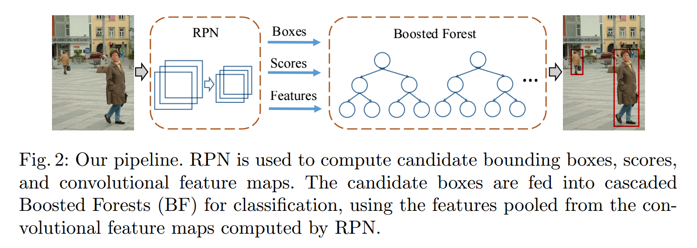
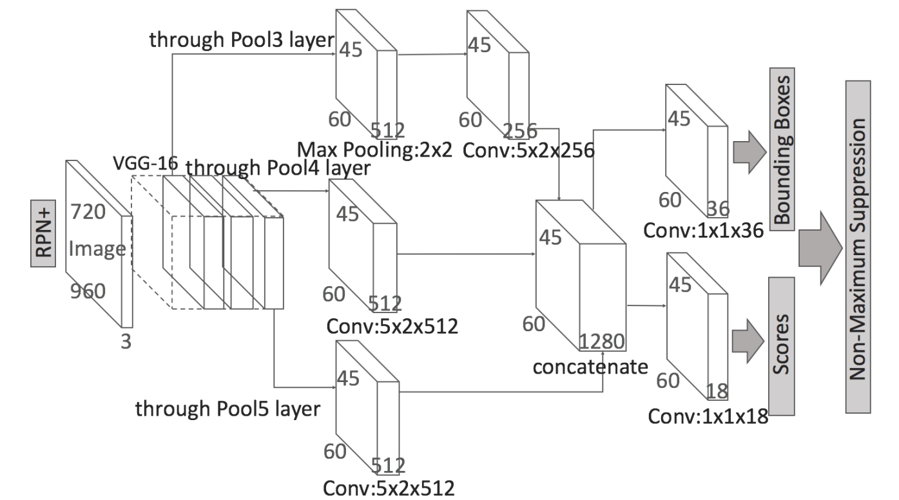

[TOC]

<!-- ref: https://lab.datafountain.cn/forum?id=139 
https://github.com/YunYang1994/TensorFlow2.0-Examples
https://www.cnblogs.com/wangxiaocvpr/p/5747095.html
http://arxiv.org/pdf/1607.07032v2.pdf
https://github.com/zhangliliang/RPN_BF/tree/RPN-pedestrian
-->

# 任务10：RPN应用

## 1.任务目标

<!-- 1. 
2. 
3. 
4.  -->

- 应用先前课程学习到的目标检测知识
- 使用RPN网络训练目标检测
<!-- - 动手实现一个人脸检测器 -->
- 动手实现一个多尺度人体目标检测


## 2.任务描述


本课程讲述如何在数据量足够的情况下，不依赖于任何预训练模型，从零训练实现目标检测。本教程以多尺度人物检测为案例，通过学习掌握在数据量充足的情况下实现目标检测train from scratch。

<!-- 首先我们对卡通人脸检验任务做了简要介绍，并介绍了GN和WS这两种时候从零开始训练的归一化算法。接下来再对数据进行预处理后使用mmdetection框架搭建了一个Faster R-CNN模型。然后我们测试了优化后的模型的检测能力，并将其可视化。最后对优化后的模型进行了简单的精简化处理。 -->


## 3.知识准备

### 3.1 RPN+
虽然深度物体检测方法 如： Fast/Faster RCNN 在general 的物体检测中，展现了强大的性能，但是对于人检测却不太成功。发现 RPN 在单独的行人检测器中表现良好，但是分类器却降低了该结果。我们猜想可能是如下两个原因导致的：
1. 对于处理小物体，feature maps 的分辨率较低；
2. 缺乏任何 bootstrapping strategy 来挖掘 hard negative examples。

基于这些观察，利用 RPN后 通过 boosted forests 在共享的，高分辨率的卷积特征映射（using an RPN followed by boosted forests on shared, high-resolution convolutional feature maps）。得到了相当的精度和较好的速度。

<div align=center>
    <!--  -->
    
</div>

- 采用类似Faster R-CNN的架构
- Feature Extraction：根据 RPN 产生的 proposals，采用 RoI pooling 来区域中提取固定长度的 feature。这些 feature 可以用来训练 BF。不像 Faster RCNN 需要将这些 features 送到 originally fully-connected （fc）layers，所以就限制了其维度，BF 分类器 对于特征的维度没有限制。
- Boosted Forest ：根据 RPN 产生的 region proposals，confidence scores，以及 features，所有的这些都用来产生级联的 Boosted Forest classifier。

升级版RPN网络结构。
<div align=center>
    <!--  -->
    
</div>

### 3.2 Group Normalization (GN)
当给定数据集的数据量充足时，可以在不使用任何预训练模型的情况下从零训练一个目标检测模型。其中存在的难点主要是：

训练的batch size小，导致Batch Normalization 效果不佳。 目标检测模型尤其是两阶段的检测模型相比图像分类模型更为复杂，往往训练时batch size很小，导致每个batch统计获得的样本的均值和标准差波动过大，导致BN收敛困难，模型发散。

针对BN严重依赖batch size的缺陷，首先我们引入Group Normalization (GN)。

BN是计算机视觉发展中很重要的组成部分，它可以使得非常深的神经网络能够收敛。但是由于BN对每个batch的样本求均值和标准差的特性，很受batch大小的影响，通过实验证明：BN需要一个足够大的batch size才能较好的发挥作用。小的batch size会导致均值标准差统计结果的不准确，从而降低模型的精度。例如在检测、分割等任务中，往往会在一个预训练模型的基础上冻结BN层进行训练，从而避免小的batch size带来负面影响。

而GN由于其不依赖batch size大小的特点，其表现很稳定。

下图中展示了BN,LN,IN,GN的不同结构：

<div align=center>
    <!--  -->
    
</div>

上图为四种归一化方法，其中N为batch size，C为通道，(H,W)表示feature map的宽高，蓝色像素代表一起进行归一化运算的区域。
通用的归一化公式为：
$$x_i = \frac{x_i - x_{mean}}{x_{std}}$$
不同的归一化方式的区别在于进行归一化计算均值和标准差取的元素不同：
 


- BN： 一个batch size中的样本
- IN： 单一一个样本
- LN： 一个通道上的样本
- GN： 同LN一样按照通道计算，但是是将同一通道划分为若干组来分别计算。
所以GN并不受batch size大小的影响，非常适合用于从零训练目标检测网络

### 3.3 Weight Standardization(WS)
WS借鉴了类似BN等在数据层面进行归一化的操作，将归一化操作从数据层面迁移到了模型层面，主要是对卷积层的参数进行归一化操作。

和数据归一化一样，WS对卷积层的权重求均值和标准差后对其进行归一化。 同样由于WS不受batch size大小的影响，非常适合于目标检测任务的从零训练，并且能够起到很好的模型正则化效果。


## 4. 任务实施
### 4.1 实施思路

1. 工具类函数定义
2. 数据预处理
3. 模型搭建
4. 模型训练
5. 测试


### 4.2 实施步骤
#### 步骤1：定义工具类函数
```python
grid_h = 45
grid_w = 60

# # original paper anchors
# wandhG = np.array([[100.0, 100.0], [300.0, 300.0], [500.0, 500.0],
                   # [200.0, 100.0], [370.0, 185.0], [440.0, 220.0],
                   # [100.0, 200.0], [185.0, 370.0], [220.0, 440.0]])

# k-means anchors (recommend)
wandhG = np.array([[ 74., 149.],
                   [ 34., 149.],
                   [ 86.,  74.],
                   [109., 132.],
                   [172., 183.],
                   [103., 229.],
                   [149.,  91.],
                   [ 51., 132.],
                   [ 57., 200.]], dtype=np.float32)

def compute_iou(boxes1, boxes2):
    """(xmin, ymin, xmax, ymax)
    boxes1 shape:  [-1, 4], boxes2 shape: [-1, 4]
    """
    left_up = np.maximum(boxes1[..., :2], boxes2[..., :2], )
    right_down = np.minimum(boxes1[..., 2:], boxes2[..., 2:])
    inter_wh = np.maximum(right_down - left_up, 0.0)
    inter_area = inter_wh[..., 0] * inter_wh[..., 1]

    boxes1_area = (boxes1[..., 2] - boxes1[..., 0]) * (boxes1[..., 3] - boxes1[..., 1])
    boxes2_area = (boxes2[..., 2] - boxes2[..., 0]) * (boxes2[..., 3] - boxes2[..., 1])

    union_area = boxes1_area + boxes2_area - inter_area
    ious = inter_area / union_area
    return ious

def plot_boxes_on_image(show_image_with_boxes, boxes, color=[0, 0, 255], thickness=2):
    for box in boxes:
        cv2.rectangle(show_image_with_boxes,
                pt1=(int(box[0]), int(box[1])),
                pt2=(int(box[2]), int(box[3])), color=color, thickness=thickness)
    show_image_with_boxes = cv2.cvtColor(show_image_with_boxes, cv2.COLOR_BGR2RGB)
    return show_image_with_boxes

def load_gt_boxes(path):
    """
    Don't care about what shit it is. whatever, this function
    returns many ground truth boxes with the shape of [-1, 4].

    xmin, ymin, xmax, ymax
    """
    bbs = open(path).readlines()[1:]
    roi = np.zeros([len(bbs), 4])
    for iter_, bb in zip(range(len(bbs)), bbs):
        bb = bb.replace('\n', '').split(' ')
        bbtype = bb[0]
        bba = np.array([float(bb[i]) for i in range(1, 5)])
        # occ = float(bb[5])
        # bbv = np.array([float(bb[i]) for i in range(6, 10)])
        ignore = int(bb[10])

        ignore = ignore or (bbtype != 'person')
        ignore = ignore or (bba[3] < 40)
        bba[2] += bba[0]
        bba[3] += bba[1]

        roi[iter_, :4] = bba
    return roi

def compute_regression(box1, box2):
    """
    box1: ground-truth boxes
    box2: anchor boxes
    """
    target_reg = np.zeros(shape=[4,])
    w1 = box1[2] - box1[0]
    h1 = box1[3] - box1[1]
    w2 = box2[2] - box2[0]
    h2 = box2[3] - box2[1]

    target_reg[0] = (box1[0] - box2[0]) / w2
    target_reg[1] = (box1[1] - box2[1]) / h2
    target_reg[2] = np.log(w1 / w2)
    target_reg[3] = np.log(h1 / h2)

    return target_reg

def decode_output(pred_bboxes, pred_scores, score_thresh=0.5):
    """
    pred_bboxes shape: [1, 45, 60, 9, 4]
    pred_scores shape: [1, 45, 60, 9, 2]
    """
    grid_x, grid_y = tf.range(60, dtype=tf.int32), tf.range(45, dtype=tf.int32)
    grid_x, grid_y = tf.meshgrid(grid_x, grid_y)
    grid_x, grid_y = tf.expand_dims(grid_x, -1), tf.expand_dims(grid_y, -1)
    grid_xy = tf.stack([grid_x, grid_y], axis=-1)
    center_xy = grid_xy * 16 + 8
    center_xy = tf.cast(center_xy, tf.float32)
    anchor_xymin = center_xy - 0.5 * wandhG

    xy_min = pred_bboxes[..., 0:2] * wandhG[:, 0:2] + anchor_xymin
    xy_max = tf.exp(pred_bboxes[..., 2:4]) * wandhG[:, 0:2] + xy_min

    pred_bboxes = tf.concat([xy_min, xy_max], axis=-1)
    pred_scores = pred_scores[..., 1]
    score_mask = pred_scores > score_thresh
    pred_bboxes = tf.reshape(pred_bboxes[score_mask], shape=[-1,4]).numpy()
    pred_scores = tf.reshape(pred_scores[score_mask], shape=[-1,]).numpy()
    return  pred_scores, pred_bboxes


def nms(pred_boxes, pred_score, iou_thresh):
    """
    pred_boxes shape: [-1, 4]
    pred_score shape: [-1,]
    """
    selected_boxes = []
    while len(pred_boxes) > 0:
        max_idx = np.argmax(pred_score)
        selected_box = pred_boxes[max_idx]
        selected_boxes.append(selected_box)
        pred_boxes = np.concatenate([pred_boxes[:max_idx], pred_boxes[max_idx+1:]])
        pred_score = np.concatenate([pred_score[:max_idx], pred_score[max_idx+1:]])
        ious = compute_iou(selected_box, pred_boxes)
        iou_mask = ious <= 0.1
        pred_boxes = pred_boxes[iou_mask]
        pred_score = pred_score[iou_mask]

    selected_boxes = np.array(selected_boxes)
    return selected_boxes


def encode_label(gt_boxes):
    target_scores = np.zeros(shape=[45, 60, 9, 2]) # 0: background, 1: foreground, ,
    target_bboxes = np.zeros(shape=[45, 60, 9, 4]) # t_x, t_y, t_w, t_h
    target_masks  = np.zeros(shape=[45, 60, 9]) # negative_samples: -1, positive_samples: 1
    for i in range(45): # y: height
        for j in range(60): # x: width
            for k in range(9):
                center_x = j * grid_width + grid_width * 0.5
                center_y = i * grid_height + grid_height * 0.5
                xmin = center_x - wandhG[k][0] * 0.5
                ymin = center_y - wandhG[k][1] * 0.5
                xmax = center_x + wandhG[k][0] * 0.5
                ymax = center_y + wandhG[k][1] * 0.5
                # print(xmin, ymin, xmax, ymax)
                # ignore cross-boundary anchors
                if (xmin > -5) & (ymin > -5) & (xmax < (image_width+5)) & (ymax < (image_height+5)):
                    anchor_boxes = np.array([xmin, ymin, xmax, ymax])
                    anchor_boxes = np.expand_dims(anchor_boxes, axis=0)
                    # compute iou between this anchor and all ground-truth boxes in image.
                    ious = compute_iou(anchor_boxes, gt_boxes)
                    positive_masks = ious >= pos_thresh
                    negative_masks = ious <= neg_thresh

                    if np.any(positive_masks):
                        target_scores[i, j, k, 1] = 1.
                        target_masks[i, j, k] = 1 # labeled as a positive sample
                        # find out which ground-truth box matches this anchor
                        max_iou_idx = np.argmax(ious)
                        selected_gt_boxes = gt_boxes[max_iou_idx]
                        target_bboxes[i, j, k] = compute_regression(selected_gt_boxes, anchor_boxes[0])

                    if np.all(negative_masks):
                        target_scores[i, j, k, 0] = 1.
                        target_masks[i, j, k] = -1 # labeled as a negative sample
    return target_scores, target_bboxes, target_masks


def process_image_label(image_path, label_path):
    raw_image = cv2.imread(image_path)
    gt_boxes = load_gt_boxes(label_path)
    target = encode_label(gt_boxes)
    return raw_image/255., target


def create_image_label_path_generator(synthetic_dataset_path):
    image_num = 8000
    image_label_paths = [(os.path.join(synthetic_dataset_path, "image/%d.jpg" %(idx+1)),
                          os.path.join(synthetic_dataset_path, "imageAno/%d.txt"%(idx+1))) for idx in range(image_num)]
    while True:
        random.shuffle(image_label_paths)
        for i in range(image_num):
            yield image_label_paths[i]

```

#### 步骤2：数据集预处理

```python
def DataGenerator(synthetic_dataset_path, batch_size):
    """
    generate image and mask at the same time
    """
    image_label_path_generator = create_image_label_path_generator(synthetic_dataset_path)
    while True:
        images = np.zeros(shape=[batch_size, image_height, image_width, 3], dtype=np.float)
        target_scores = np.zeros(shape=[batch_size, 45, 60, 9, 2], dtype=np.float)
        target_bboxes = np.zeros(shape=[batch_size, 45, 60, 9, 4], dtype=np.float)
        target_masks  = np.zeros(shape=[batch_size, 45, 60, 9], dtype=np.int)

        for i in range(batch_size):
            image_path, label_path = next(image_label_path_generator)
            image, target = process_image_label(image_path, label_path)
            images[i] = image
            target_scores[i] = target[0]
            target_bboxes[i] = target[1]
            target_masks[i]  = target[2]
        yield images, target_scores, target_bboxes, target_masks

synthetic_dataset_path="./synthetic_dataset"
TrainSet = DataGenerator(synthetic_dataset_path, batch_size)

```


#### 步骤3：模型构造

```python
import tensorflow as tf

class RPNplus(tf.keras.Model):
    # VGG_MEAN = [103.939, 116.779, 123.68]
    def __init__(self):
        super(RPNplus, self).__init__()
        # conv1
        self.conv1_1 = tf.keras.layers.Conv2D(64, 3, activation='relu', padding='same')
        self.conv1_2 = tf.keras.layers.Conv2D(64, 3, activation='relu', padding='same')
        self.pool1   = tf.keras.layers.MaxPooling2D(2, strides=2, padding='same')

        # conv2
        self.conv2_1 = tf.keras.layers.Conv2D(128, 3, activation='relu', padding='same')
        self.conv2_2 = tf.keras.layers.Conv2D(128, 3, activation='relu', padding='same')
        self.pool2   = tf.keras.layers.MaxPooling2D(2, strides=2, padding='same')

        # conv3
        self.conv3_1 = tf.keras.layers.Conv2D(256, 3, activation='relu', padding='same')
        self.conv3_2 = tf.keras.layers.Conv2D(256, 3, activation='relu', padding='same')
        self.conv3_3 = tf.keras.layers.Conv2D(256, 3, activation='relu', padding='same')
        self.pool3   = tf.keras.layers.MaxPooling2D(2, strides=2, padding='same')

        # conv4
        self.conv4_1 = tf.keras.layers.Conv2D(512, 3, activation='relu', padding='same')
        self.conv4_2 = tf.keras.layers.Conv2D(512, 3, activation='relu', padding='same')
        self.conv4_3 = tf.keras.layers.Conv2D(512, 3, activation='relu', padding='same')
        self.pool4   = tf.keras.layers.MaxPooling2D(2, strides=2, padding='same')

        # conv5
        self.conv5_1 = tf.keras.layers.Conv2D(512, 3, activation='relu', padding='same')
        self.conv5_2 = tf.keras.layers.Conv2D(512, 3, activation='relu', padding='same')
        self.conv5_3 = tf.keras.layers.Conv2D(512, 3, activation='relu', padding='same')
        self.pool5   = tf.keras.layers.MaxPooling2D(2, strides=2, padding='same')

        ## region_proposal_conv
        self.region_proposal_conv1 = tf.keras.layers.Conv2D(256, kernel_size=[5,2],
                                                            activation=tf.nn.relu,
                                                            padding='same', use_bias=False)
        self.region_proposal_conv2 = tf.keras.layers.Conv2D(512, kernel_size=[5,2],
                                                            activation=tf.nn.relu,
                                                            padding='same', use_bias=False)
        self.region_proposal_conv3 = tf.keras.layers.Conv2D(512, kernel_size=[5,2],
                                                            activation=tf.nn.relu,
                                                            padding='same', use_bias=False)
        ## Bounding Boxes Regression layer
        self.bboxes_conv = tf.keras.layers.Conv2D(36, kernel_size=[1,1],
                                                padding='same', use_bias=False)
        ## Output Scores layer
        self.scores_conv = tf.keras.layers.Conv2D(18, kernel_size=[1,1],
                                                padding='same', use_bias=False)


    def call(self, x, training=False):
        h = self.conv1_1(x)
        h = self.conv1_2(h)
        h = self.pool1(h)

        h = self.conv2_1(h)
        h = self.conv2_2(h)
        h = self.pool2(h)

        h = self.conv3_1(h)
        h = self.conv3_2(h)
        h = self.conv3_3(h)
        h = self.pool3(h)
        # Pooling to same size
        pool3_p = tf.nn.max_pool2d(h, ksize=[1, 2, 2, 1], strides=[1, 2, 2, 1],
                                   padding='SAME', name='pool3_proposal')
        pool3_p = self.region_proposal_conv1(pool3_p) # [1, 45, 60, 256]

        h = self.conv4_1(h)
        h = self.conv4_2(h)
        h = self.conv4_3(h)
        h = self.pool4(h)
        pool4_p = self.region_proposal_conv2(h) # [1, 45, 60, 512]

        h = self.conv5_1(h)
        h = self.conv5_2(h)
        h = self.conv5_3(h)
        pool5_p = self.region_proposal_conv2(h) # [1, 45, 60, 512]

        region_proposal = tf.concat([pool3_p, pool4_p, pool5_p], axis=-1) # [1, 45, 60, 1280]

        conv_cls_scores = self.scores_conv(region_proposal) # [1, 45, 60, 18]
        conv_cls_bboxes = self.bboxes_conv(region_proposal) # [1, 45, 60, 36]

        cls_scores = tf.reshape(conv_cls_scores, [-1, 45, 60, 9, 2])
        cls_bboxes = tf.reshape(conv_cls_bboxes, [-1, 45, 60, 9, 4])

        return cls_scores, cls_bboxes
```


#### 步骤4：模型训练

```python
def compute_loss(target_scores, target_bboxes, target_masks, pred_scores, pred_bboxes):
    """
    target_scores shape: [1, 45, 60, 9, 2],  pred_scores shape: [1, 45, 60, 9, 2]
    target_bboxes shape: [1, 45, 60, 9, 4],  pred_bboxes shape: [1, 45, 60, 9, 4]
    target_masks  shape: [1, 45, 60, 9]
    """
    score_loss = tf.nn.softmax_cross_entropy_with_logits(labels=target_scores, logits=pred_scores)
    foreground_background_mask = (np.abs(target_masks) == 1).astype(np.int)
    score_loss = tf.reduce_sum(score_loss * foreground_background_mask, axis=[1,2,3]) / np.sum(foreground_background_mask)
    score_loss = tf.reduce_mean(score_loss)

    boxes_loss = tf.abs(target_bboxes - pred_bboxes)
    boxes_loss = 0.5 * tf.pow(boxes_loss, 2) * tf.cast(boxes_loss<1, tf.float32) + (boxes_loss - 0.5) * tf.cast(boxes_loss >=1, tf.float32)
    boxes_loss = tf.reduce_sum(boxes_loss, axis=-1)
    foreground_mask = (target_masks > 0).astype(np.float32)
    boxes_loss = tf.reduce_sum(boxes_loss * foreground_mask, axis=[1,2,3]) / np.sum(foreground_mask)
    boxes_loss = tf.reduce_mean(boxes_loss)

    return score_loss, boxes_loss


model = RPNplus()
optimizer = tf.keras.optimizers.Adam(lr=1e-4)
writer = tf.summary.create_file_writer("./log")
global_steps = tf.Variable(0, trainable=False, dtype=tf.int64)

for epoch in range(EPOCHS):
    for step in range(STEPS):
        global_steps.assign_add(1)
        image_data, target_scores, target_bboxes, target_masks = next(TrainSet)
        with tf.GradientTape() as tape:
            pred_scores, pred_bboxes = model(image_data)
            score_loss, boxes_loss = compute_loss(target_scores, target_bboxes, target_masks, pred_scores, pred_bboxes)
            total_loss = score_loss + lambda_scale * boxes_loss
            gradients = tape.gradient(total_loss, model.trainable_variables)
            optimizer.apply_gradients(zip(gradients, model.trainable_variables))
            print("=> epoch %d  step %d  total_loss: %.6f  score_loss: %.6f  boxes_loss: %.6f" %(epoch+1, step+1,
                                                        total_loss.numpy(), score_loss.numpy(), boxes_loss.numpy()))
        # writing summary data
        with writer.as_default():
            tf.summary.scalar("total_loss", total_loss, step=global_steps)
            tf.summary.scalar("score_loss", score_loss, step=global_steps)
            tf.summary.scalar("boxes_loss", boxes_loss, step=global_steps)
        writer.flush()
    model.save_weights("RPN.h5")
```


#### 步骤5：模型测试

```python
import os
import cv2
import numpy as np
import tensorflow as tf
from PIL import Image
from rpn import RPNplus
from utils import decode_output, plot_boxes_on_image, nms

synthetic_dataset_path ="./synthetic_dataset"
prediction_result_path = "./prediction"
if not os.path.exists(prediction_result_path): os.mkdir(prediction_result_path)

model = RPNplus()
fake_data = np.ones(shape=[1, 720, 960, 3]).astype(np.float32)
model(fake_data) # initialize model to load weights
model.load_weights("./RPN.h5")

for idx in range(8000, 8200):
    image_path = os.path.join(synthetic_dataset_path, "image/%d.jpg" %(idx+1))
    raw_image = cv2.imread(image_path)
    image_data = np.expand_dims(raw_image / 255., 0)
    pred_scores, pred_bboxes = model(image_data)
    pred_scores = tf.nn.softmax(pred_scores, axis=-1)
    pred_scores, pred_bboxes = decode_output(pred_bboxes, pred_scores, 0.9)
    pred_bboxes = nms(pred_bboxes, pred_scores, 0.5)
    plot_boxes_on_image(raw_image, pred_bboxes)
    save_path = os.path.join(prediction_result_path, str(idx)+".jpg")
    print("=> saving prediction results into %s" %save_path)
    Image.fromarray(raw_image).save(save_path)
```


## 5.任务拓展
### 5.1 优化思路和方法
- 数据
  
    - 数据增强：水平翻转、对比度变换，随机裁剪等

- 模型
    - 加入多尺度训练
    - 加入 TTA
    - 使用 Soft NMS 替换 NMS


## 6. 任务实训
### 6.1 实训目的
1. 以下哪种归一化操作容易受 batch size 的影响？ 【分值：20】
   A.Group Normalization B.Batch Normalization C.Weight Standardization D.以上都是
2. 哪些方法可以加速案例中的推理过程？ 【分值：20】
   A.缩小backbone规模 B.缩小检测头的规模 C.减小batch size D.增加batch size E.减少图片的输入分辨率
3. GN算法将同一通道划分为若干组来分别计算均值和标准差。 【分值：20】
4. 从零训练中，由于模型参数均从一个指定的初始化状态开始更新，所以需要训练更多的步数 【分值：20】
5. WS相比于BN，将归一化的操作从数据层面转移到了哪一层面？ 【分值：20】
6. 从零开始训练网络时有哪些需要注意的关键参数？ 【分值：0】
