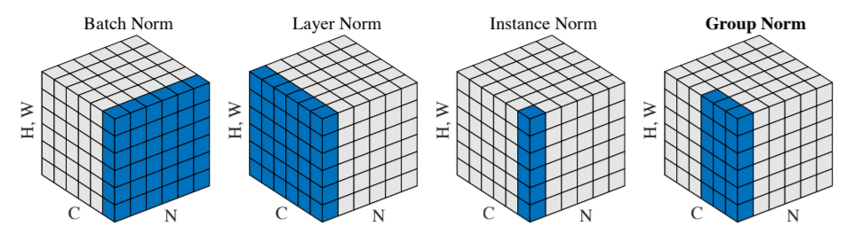

[TOC]

<!-- ref: https://lab.datafountain.cn/forum?id=139 -->

# 任务10：RPN应用

## 1.任务目标

<!-- 1. 
2. 
3. 
4.  -->

- 应用先前课程学习到的目标检测知识
- 了解从零训练目标检测
- 动手实现一个人脸检测器

## 2.任务描述

本课程讲述如何在数据量足够的情况下，不依赖于任何预训练模型，从零训练实现目标检测。本教程以卡通人物的脸检测为案例，通过学习掌握在数据量充足的情况下实现目标检测train from scratch。

首先我们对卡通人脸检验任务做了简要介绍，并介绍了GN和WS这两种时候从零开始训练的归一化算法。接下来再对数据进行预处理后使用mmdetection框架搭建了一个Faster R-CNN模型。然后我们测试了优化后的模型的检测能力，并将其可视化。最后对优化后的模型进行了简单的精简化处理。

## 3.知识准备

### 3.1 Group Normalization (GN)
当给定数据集的数据量充足时，可以在不使用任何预训练模型的情况下从零训练一个目标检测模型。其中存在的难点主要是：

训练的batch size小，导致Batch Normalization 效果不佳。 目标检测模型尤其是两阶段的检测模型相比图像分类模型更为复杂，往往训练时batch size很小，导致每个batch统计获得的样本的均值和标准差波动过大，导致BN收敛困难，模型发散。

针对BN严重依赖batch size的缺陷，首先我们引入Group Normalization (GN)。

BN是计算机视觉发展中很重要的组成部分，它可以使得非常深的神经网络能够收敛。但是由于BN对每个batch的样本求均值和标准差的特性，很受batch大小的影响，通过实验证明：BN需要一个足够大的batch size才能较好的发挥作用。小的batch size会导致均值标准差统计结果的不准确，从而降低模型的精度。例如在检测、分割等任务中，往往会在一个预训练模型的基础上冻结BN层进行训练，从而避免小的batch size带来负面影响。

而GN由于其不依赖batch size大小的特点，其表现很稳定。

下图中展示了BN,LN,IN,GN的不同结构：

    <!--  -->
    

上图为四种归一化方法，其中N为batch size，C为通道，(H,W)表示feature map的宽高，蓝色像素代表一起进行归一化运算的区域。
通用的归一化公式为：
$$x_i = \frac{x_i - x_{mean}}{x_{std}}$$
不同的归一化方式的区别在于进行归一化计算均值和标准差取的元素不同：
 

- BN： 一个batch size中的样本
- IN： 单一一个样本
- LN： 一个通道上的样本
- GN： 同LN一样按照通道计算，但是是将同一通道划分为若干组来分别计算。
所以GN并不受batch size大小的影响，非常适合用于从零训练目标检测网络

### 3.2 Weight Standardization(WS)
WS借鉴了类似BN等在数据层面进行归一化的操作，将归一化操作从数据层面迁移到了模型层面，主要是对卷积层的参数进行归一化操作。

和数据归一化一样，WS对卷积层的权重求均值和标准差后对其进行归一化。 同样由于WS不受batch size大小的影响，非常适合于目标检测任务的从零训练，并且能够起到很好的模型正则化效果。

## 4. 任务实施
### 4.1 实施思路

- 通过调用百度api的图像检测接口，实现对目标的检测以及边界框的绘制。

### 4.2 实施步骤
#### 步骤1：导入 urllib 库

#### 步骤2：请求认证 token

#### 步骤3：定义读取图片函数

#### 步骤4：调用远程 HTTP 服务器

#### 步骤5：程序入口

#### 步骤6：绘制边界框

## 5.任务拓展
### 5.1 优化思路和方法
#### 数据
  
    数据增强：水平翻转、对比度变换，随机裁剪等

#### 模型
- 加入多尺度训练
- 加入 TTA
- 使用 Soft NMS 替换 NMS

## 6. 任务实训
### 6.1 实训目的
1. 以下哪种归一化操作容易受 batch size 的影响？ 【分值：20】
   A.Group Normalization B.Batch Normalization C.Weight Standardization D.以上都是
2. 哪些方法可以加速案例中的推理过程？ 【分值：20】
   A.缩小backbone规模 B.缩小检测头的规模 C.减小batch size D.增加batch size E.减少图片的输入分辨率
3. GN算法将同一通道划分为若干组来分别计算均值和标准差。 【分值：20】
4. 从零训练中，由于模型参数均从一个指定的初始化状态开始更新，所以需要训练更多的步数 【分值：20】
5. WS相比于BN，将归一化的操作从数据层面转移到了哪一层面？ 【分值：20】
6. 从零开始训练网络时有哪些需要注意的关键参数？ 【分值：0】
