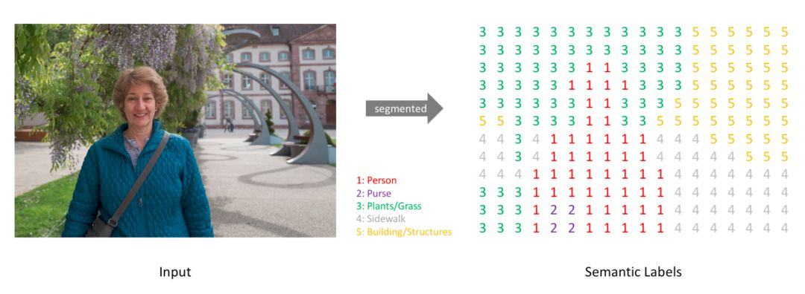

[TOC]

# 任务11：图像分割

## 1.任务目标

<!-- 1. 
2. 
3. 
4.  -->

- 学习图像分割的相关概念
- 了解如何进行图像分割
- 动手完成图像分割小程序

## 2.任务描述


- 总的而言，目前的分割任务主要有两种： 语义分割和实例分割。那语义分割和实例分割具体都是什么含义呢？二者又有什么区别和联系呢？语义分割是对图像中的每个像素都划分出对应的类别，即实现像素级别的分类； 而类的具体对象，即为实例，那么实例分割不但要进行像素级别的分类，还需在具体的类别基础上区别开不同的实例。比如说图像有多个人甲、乙、丙，那边他们的语义分割结果都是人，而实例分割结果却是不同的对象，具体如下图第二第三两幅小图所示： 


<div align=center>
    <!--  -->
    
</div>

语义分割是一种典型的计算机视觉问题，其是将一些图像作为输入并将它们转换为具有突出显示的感兴趣区域的掩模，即图像中的每个像素根据其所属的感兴趣对象被分配类别。如下图中左图所示，其语义是人骑自行车，语义分割的结果如右图所示，粉红色代表人，绿色代表自行车。


<div align=center>
    <!--  -->
    
</div>


## 3.知识准备


### 3.1目标检测、语义分割和实例分割

以语义分割和实例分割为代表的图像分割技术在各领域都有广泛的应用，例如在无人驾驶和医学影像分割等方面。应用示例如下图所示：

- 语义分割在无人驾驶中的应用
<div align=center>
    <!--  -->
    
</div>

<div align=center>
    <!--  -->
    
</div>

- 语义分割在OCT眼底视网膜图像分层识别中的应用


### 3.2语义分割（Semantic Segmentation）

#### 3.2.1语义分割的任务描述

- 不同于此前的图像分类和目标检测，在开始图像分割的学习和尝试之前，我们必须明确语义分割的任务描述，即搞清楚语义分割的输入输出都是什么。我们输入当然是一张原始的RGB图像或者单通道的灰度图，但是输出不再是简单的分类类别或者目标定位，而是带有各个像素类别标签的与输入同分辨率的分割图像。简单来说，我们的输入输出都是图像，而且是同样大小的图像。如下图所示：

<div align=center>
    <!--  -->
    
</div>


#### 3.2.2从输入到输出语义标签

- 类似于处理分类标签数据，对预测分类目标采用像素上的 one-hot 编码，即为每个分类类别创建一个输出的 channel 。如下图所示：

<div align=center>
    <!--  -->
    
</div>

#### 3.2.3语义标签的one-hot

- 下图是将分割图添加到原始图像上的效果验证。这里有个概念需要明确一下——mask，在图像处理中我们将其译为掩膜，如 mask-rcnn 中的 mask。mask 可以理解为我们将预测结果叠加到单个 channel 时得到的该分类所在区域。

<div align=center>
    <!--  -->
    
</div>


#### 3.2.3语义标签与输入图像的重叠

- 语义分割的任务就是输入图像经过深度学习算法处理得到带有语义标签的同样尺寸的输出图像。


#### 3.2.4 数据集和预训练模型
- 数据集:使用图像语义分割任务中常用的PASCAL VOC2012数据集，PASCAL VOC2012数据集可以从 http://host.robots.ox.ac.uk/pascal/VOC/voc2012/VOCtrainval_11-May-2012.tar 下载。此数据集总共有20类（背景为第21类），分别为人、鸟、猫、牛、狗、马、羊、飞机、自行车、船、公共汽车、汽车、摩托车、火车、瓶子、椅子、餐桌、盆栽、沙发、电视。
- 初始化模型:本教程使用的基础网络为ResNet101 V2。为加快模型训练和加速模型收敛，本文使用在ImageNet数据集上预训练的模型作为本文网络的初始化模型。初始化模型可以在 https://github.com/tensorflow/models/tree/master/research/slim#pre-trained-models 下载。本案例初始化模型存放在./datasets/pretrained_model文件中。


## 4. 任务实施
<!-- - 通过python实现上述算法，体会算法，反思改进的思路，然后通过利用深度学习的算法来尝试增强图像。 -->
本课程介绍如何利用tensorflow深度学习工具实现一个图像语义分割模型，通过加载数据、预处理数据、构建模型、训练模型、测试模型依次实现一个图像语义分割工具，在训练过程中通过可视化监督训练过程。
说明：因为语义分割数据量和模型均较大，本案例使用GPU版的tensorflow加速模型训练测试，故需提前安装显卡驱动、CUDA和cudnn。若机器无显卡也可使用cpu版的tensorflow。
### 4.1 实施思路

<!-- - 根据知识点中提及到的数学公式，将图像增强算法的函数复现，然后利用已有图片，进行图像增强。 -->
<div align=center>
    <!--  -->
    
</div>

### 4.2 实施步骤
#### 步骤1：
```
# 统一导入工具包
import warnings
warnings.filterwarnings('ignore')

import math
from os.path import join
import logging

import shutil
import os
dirs = r'./src'
if not os.path.exists(dirs):
    shutil.copytree(r'./datasets/src','./src')

from src.data_loader import *
from src.model_estimators import segmentation_model_fn
from src.model_encoders import *
from src.model_segmentation import *
import tensorflow as tf
import skimage.io as io
from skimage.util import img_as_ubyte
from tqdm import tqdm
from tensorflow.contrib import predictor
import matplotlib.pyplot as plt
```

```
#全局初始化配置参数。固定随机种子
#选择GPU设备
#os.environ['CUDA_VISIBLE_DEVICES'] = '0'
#将 TensorFlow 日志信息输出到屏幕
tf.logging.set_verbosity(logging.INFO)
logger = logging.getLogger('tensorflow')
logger.removeHandler(logger.handlers[-1])
logger.setLevel(logging.INFO)
#VOC分割数据不同类别所对应的颜色信息
VOC_colormap_label = [
    [[0, 0, 0], 'background'],  # 0
    [[128, 0, 0], 'aero plane'],  # 1
    [[0, 128, 0], 'bicycle'],  # 2
    [[128, 128, 0], 'bird'],  # 3
    [[0, 0, 128], 'boat'],  # 4
    [[128, 0, 128], 'bottle'],  # 5
    [[0, 128, 128], 'bus'],  # 6
    [[128, 128, 128], 'car'],  # 7
    [[64, 0, 0], 'cat'],  # 8
    [[192, 0, 0], 'chair'],  # 9
    [[64, 128, 0], 'cow'],  # 10
    [[192, 128, 0], 'dining-table'],  # 11
    [[64, 0, 128], 'dog'],  # 12
    [[192, 0, 128], 'horse'],  # 13
    [[64, 128, 128], 'motorbike'],  # 14
    [[192, 128, 128], 'person'],  # 15
    [[0, 64, 0], 'potted-plant'],  # 16
    [[128, 64, 0], 'sheep'],  # 17
    [[0, 192, 0], 'sofa'],  # 18
    [[128, 192, 0], 'train'],  # 19
    [[0, 64, 128], 'tv/monitor']  # 20
]
palette, VOC_label = zip(*VOC_colormap_label)
```


#### 步骤2：数据准备
##### 数据准备VOC原始数据中既包含语义分割数据也包含目标检测数据，数据中包含ImageSets、JPEGImages、SegmentationClass三个文件夹，我们需要将其整理成我们需要的格式，整体步骤如下：
1. 数据文件整理
2. 数据加载
3. 数据增强
4. 数据构造
- 数据文件整理建立文件夹datalist、images、labels、colormaps，其中datalist存放用于训练、评估和测试的txt数据集，与下载的VOC数据集中ImageSets\Segmentation文件夹下的内容相同。images存放所有的原始图像，与VOC数据集中JPEGImages文件夹下内容相同。colormaps存放标注的语义分割结果图，为RGB图像，与VOC数据集中SegmentationClass文件夹下内容相同。labels存放标注的语义分割结果图，为灰度图像，其可由colormap图像转化得到。

```
# 将图像语义分割结果图由RGB图像转为单通道灰度图像。
def colormap_2_label(palette, colormaps, ids):

    is_3_channel = not isinstance(palette[0], int)
    print(is_3_channel)
    labels = []
    if is_3_channel:
        pixel2label = dict(zip(map(tuple, palette), range(len(palette))))
    else:
        pixel2label = dict(zip(palette, range(len(palette))))

    for (each_colormap, each_id) in zip(colormaps, ids):
        logger.info(f'colormap to label: {each_id}')
        cur_label = np.zeros(each_colormap.shape[:2], dtype=np.int32)
        for i in range(each_colormap.shape[0]):
            for j in range(each_colormap.shape[1]):
                if (each_colormap[i,j] == [255,255,255]).all():
                    cur_label[i, j] =255
                else:
                    cur_label[i, j] = pixel2label[tuple(each_colormap[i, j])] if is_3_channel else pixel2label[
                        each_colormap[i, j]]
        labels.append(cur_label)

    return labels

#保存批图像
def save_images(output_dir, images, ids, ext='jpg'):
    if not os.path.exists(output_dir):
        logger.info(f'{output_dir} does not exist and is being created...')
        os.makedirs(output_dir)
    for each_id, each_image in tqdm(zip(ids, images)):
        logger.info(f'saving {each_id} to {output_dir}...')

        each_image = img_as_ubyte(each_image)
 
        io.imsave(join(output_dir, '.'.join([each_id, ext])), each_image)

#如果标签中不存在图像语义分割结果的灰度图，则由RGB图像生成灰度图；若存在灰度图，则跳过。
def data_prepare():
    label_home = './datasets/VOC2012/labels'
    if os.path.exists(label_home):
        print('labels already exist')
        return
    #根据数据集所在路径修改数据路径参数
    image_path = './datasets/VOC2012/colormaps'
    datalist_path = './datasets/VOC2012/datalist/train.txt'
    with open(datalist_path) as f:
        ids = f.read().split()
    colormaps = []
    for idx, each_id in enumerate(ids):
        colormaps.append(io.imread(join(image_path, each_id) + '.png' ))
        if idx % 500 ==0:
            print('Process %d images' %(idx))

    labels = colormap_2_label(palette, colormaps, ids)
    
    save_images(label_home, labels, ids, 'png')

data_prepare()
```

- 数据加载
定义数据集中图像、标签、训练集和评估集所在位置。
```
#根据数据集所在路径修改数据路径参数
data_home = './datasets/VOC2012'
image_home = join(data_home, 'images')
label_home = join(data_home, 'labels')
datalist_train_path = join(data_home, 'datalist', 'train.txt')
datalist_val_path = join(data_home, 'datalist', 'val.txt')
```

- 数据增强

对训练数据集进行扩充，这样可以防止模型过拟合以及增强模型鲁棒性。图像增强函数在data_loader.py文件中，其使用图像缩放、图像裁剪填充和左右翻转进行图像增强。
```
crop_size_height = 513
crop_size_width = 513
data_aug = lambda image, label: data_augment(image, label, crop_size_height, crop_size_width, ignore_label)
```

- 数据构造
本案例使用tensorflow中的Estimators API，其提供了训练模型、测试模型准确率和生成预测的方法。模型输入部分由tensorflow中的Dataset API组成，可以分为train_input_fn和eval_input_fn。前者的任务是接受参数，输出数据训练数据，后者的任务是接受参数，并输出验证数据和测试数据。读取图像函数为VOC_pattern_input_fn（）位于data_loader.py文件中，根据train.txt文件中图像的名字利用tf.read_file（）函数读取图像信息。
```
epochs = 1 #70
batch_size = 1 #8
train_input_fn = lambda: VOC_pattern_input_fn(
    image_home, label_home, datalist_train_path, 3, epochs, batch_size, data_aug=data_aug)

val_input_fn = lambda: VOC_pattern_input_fn(image_home, label_home, datalist_val_path, batch_size=1,
                                            is_training=False)
```

#### 步骤3：语义分割模型构建
通过tensorflow中的Estimators API构造模型，整体步骤如下：
1. 模型概述
2. Estimator配置
3. 定义模型结构
4. 实例化模型

##### 模型概述
本案例实现的是语义分割模型-DeeplabV3，论文文地址:https://arxiv.org/pdf/1706.05587.pdf 。论文主要解决语义分割方向的两个问题: 一是特征图的分辨率过低导致后续在恢复为原图分辨率时不够精确，二是对多尺度物体的检测表现不好。基于深度学习的语义分割模型首先需要使用深度卷积网络进行特征提取。在本案例中，编码端采用在ImageNet预训练好的101层的ResNet网络。下图中的左侧结构适用于较浅的ResNet网络，如果网络层数较多，靠近网络输出端的维度就会很大，仍使用下图左侧的结构计算量就会极大， 对较深的网络我们都使用下图右侧的bottleneck结构，可以减少计算和参数量。ResNet论文地址： https://arxiv.org/pdf/1512.03385.pdf 。在ResNet101网络上进行改进，只将图像下采样16倍，这样可以保留图像更多的空间信息。为避免下采样减少造成的感受野减少，本案例引入了空洞卷积来扩大感受野。

<div align=center>
    <!--  -->
    
</div>


空洞卷积的扩张率定义为两个相邻有效权值在水平或竖直方向上的距离。扩张率越大，卷积核越稀疏，感受野越大。下图(a)为原始的3×3 卷积核，下图(b)中红色圆点为扩张率等于2的空洞卷积，绿色区域为普通3×3卷积核与扩张率为2 的3×3空洞卷积核串联后的感受野。下图(c)中红色圆点为扩张率等于4的空洞卷积，绿色区域为普通3×3卷积核、扩张率为2的3×3 空洞卷积核与扩张率为4的3×3空洞卷积核三者叠加后的感受野。
为了检测多尺度物体，本案例在ResNet结构之后引入了空间金字塔池化结构，以多个不同比例的并行空洞卷积核抽取不同尺度的空间信息，再将特征融合。整体的 ASPP 结构就是下图中黄色框中的部分，也由 (a), (b) 两个部分组成。(a) 包含 1 个 1x1 的卷积和 3 个atrous rate 分别为 (6, 12, 18) 的 3x3 的空洞卷积；(b)将最终 feature map 引入全局池化模块。

<div align=center>
    <!--  -->
    
</div>

##### Estimator配置
建立模型执行环境的信息，包含GPU使用、模型保存个数和模型保存频率等。
```
config = tf.ConfigProto()
config.gpu_options.allow_growth = True
run_config = tf.estimator.RunConfig(session_config=config, save_summary_steps=10, save_checkpoints_steps=1000,
                                    keep_checkpoint_max=5)
```

##### 定义模型结构
定义语义分割模型的编码端和解码端结构。ResNet模型结构SlimResNet()函数在model_encoder.py文件中进行详细介绍。空间金字塔结构DeeplabV3()函数在model_segmentation.py文件中进行介绍。
```
#根据初始化模型所在路径修改模型路径参数，初始化模型是resnet网络在Imagenet数据集上训练得到的。
init_model_path = './datasets/pretrained_model/resnet_v2_101_2017_04_14/resnet_v2_101.ckpt'
# encoder_dict中包含了ResNet网络函数，并定义其参数。 
encoder_dict = {
    'ResNet101': lambda X_input, image_height, image_width, init_model_path, is_training : \
        SlimResNet(X_input, image_height, image_width,init_model_path, is_training)
}
# decoder_dict中包含了空间金字塔结构，并定义其参数。
decoder_dict = {
    'Deeplabv3': lambda encoder, num_class, is_training: Deeplabv3(encoder, num_class, is_training, False)}
```

##### 实例化模型
1. 预创建 Estimatorseg_model
为创建的模型结构，其用tf.estimator.Estimator()预创建Estimator。其中model_fn为模型函数,本案例使用的模型函数为segmentation_model_fn()在model_estimators.py中。此模型函数会给定输入和参数，会返回训练，验证或者预测等所需要的操作节点。此函数还会设置优化器、损失函数和评价指标。model_dir为训练好的模型的保存路径。params为传入model_fn的参数。

```
with open(datalist_train_path) as f:
    nr_train = len(f.readlines())
learning_rate = 0.007
end_learning_rate = 1e-6
max_steps = 1 #int(math.ceil(nr_train * epochs / batch_size)) #时间原因，训练次数较少，可完全放开
decay_step = max_steps
ignore_label = 255

#model_dir为训练模型保存路径，可根据需求进行修改
model_dir = './temp/models'
if not os.path.exists(model_dir):
    logger.info(f'{model_dir} does not exist and is being created...')
    os.makedirs(model_dir)
common_formater = logging.Formatter('%(asctime)s : %(levelname)s : %(message)s')
file_handler = logging.FileHandler(join(model_dir, 'log.log'))
file_handler.setFormatter(common_formater)
logger.addHandler(file_handler)
# 创建模型结构Deeplabv3，并定义模型的超参数。
seg_model = tf.estimator.Estimator(
    model_fn=segmentation_model_fn,
    model_dir=model_dir,
    config=run_config,
    params={
        'encoder': encoder_dict['ResNet101'],
        'image_height': crop_size_height,
        'image_width': crop_size_width,
        'decoder': decoder_dict['Deeplabv3'],
        'init_model_path': init_model_path,
        'num_classes': len(palette),
        'ignore_label': ignore_label,
        'learning_rate': learning_rate,
        'end_learning_rate': end_learning_rate,
        'momentum': 0.9,
        'lr_decay': 'poly',
        'power': 0.9,
        'decay_step': decay_step,
        'palette': palette,
        'batch_size': batch_size,
        'frozen': False,
        'weight_decay': 2e-4
    }
)
```
2. 自定义输出
将关注的参数进行可视化输出和配置train和eval参数。
```
train_hook = tf.train.LoggingTensorHook({
    'learning_rate': 'learning_rate',
    'loss': 'loss',
    'cross_entropy_loss': 'cross_entropy_loss',
    'acc': 'acc',
    'miou': 'miou',
    'f1': 'f1'
}, 500)

eval_hook = tf.train.LoggingTensorHook({
    'loss': 'loss',
    'cross_entropy_loss': 'cross_entropy_loss',
    'acc': 'acc',
    'miou': 'miou',
    'f1': 'f1',
}, 500)
train_spec = tf.estimator.TrainSpec(train_input_fn, max_steps, [train_hook])
eval_spec = tf.estimator.EvalSpec(val_input_fn, hooks=[eval_hook],throttle_secs=1000)
```

#### 步骤4：训练模型评估
利用Estimators API中的tf.estimator.train_and_evaluate()进行模型训练和评估
```
# 训练时间很长
tf.estimator.train_and_evaluate(seg_model, train_spec, eval_spec)
```


#### 步骤5：可视化模型训练评估过程
1. 获取训练评估参数
训练评估过程中参数值保存在event.out.tfevents文件中。从event.out.tfevents文件中获取各参数值。
```
import matplotlib.pyplot as plt
# 文件名需要修改,注意修改路径1603855244
train_summarys = tf.train.summary_iterator('./temp/models/events.out.tfevents.1603855023.jupyter-52688494e39911eaae8d126e236a927d')#文件名需要修改
# eval_summarys = tf.train.summary_iterator('./temp/models/eval/events.out.tfevents.1594811718.DESKTOP-RBRSMA0')

train_loss = []
steps = []
lr = []
eval_loss = []
eval_steps = []
eval_miou = []
for e in train_summarys:
    if len(e.summary.value)>1:
        steps.append(e.step)
        # v，即value，代表这个batch的某个已记录的观测值，loss等
        for v in e.summary.value:
            if v.tag == 'loss_1':
                train_loss.append(v.simple_value)
            if v.tag == 'lr':
                lr.append(v.simple_value)

# for e in eval_summarys:
#     if len(e.summary.value)>1:
#         eval_steps.append(e.step)
#         for v in e.summary.value:
#             if v.tag == 'loss':
#                 eval_loss.append(v.simple_value)
#             if v.tag == 'mean_iou':
#                 eval_miou.append(v.simple_value)
```

2. 学习率变化过程
```
plt.figure()
plt.plot(steps,lr)
plt.xlabel('Steps')
plt.ylabel('Learning rate')
plt.show()
```

3. 训练评估Loss变化过程
绘制训练和评估过程中Loss的变化曲线，这里我们把训练集和验证集画在同一个图上
```
plt.figure()
plt.plot(steps,train_loss,label='train_loss')
plt.plot(eval_steps,eval_loss,label='val_loss')
plt.xlabel('Steps')
plt.ylabel('Loss')
plt.legend()
plt.show()
```

4. 评估评价指标变化过程
绘制评估过程中评价指标的变化曲线，本实例选取的综合性评价指标为mean_iou(平均交并比，mean intersection over union)
```
plt.figure()
plt.plot(eval_steps,eval_miou)
plt.xlabel('Steps')
plt.ylabel('Val Mean_IOU')
plt.show()
```

#### 步骤6：模型预测
1. 导出模型
利用estimator的export_savedmodel导出SavedModel模型，只需要指明模型的输入和输出，然后导出即可。
```
def serving_input_receiver_fn():
    img_str = tf.placeholder(
            tf.string,
            name='image',
            shape=[None,])
    def _func(img):
        img = tf.image.decode_image(img, channels=3)
        img_reshape = tf.reshape(img, [tf.shape(img)[0], tf.shape(img)[1], tf.shape(img)[2]])
        return tf.cond(tf.equal(tf.shape(img_reshape)[2], 3), lambda: img_reshape, lambda: tf.image.grayscale_to_rgb(img_reshape))
    images = tf.map_fn(lambda image: _func(image), img_str, dtype=tf.float32)
    images.set_shape(shape=(None,None,None,3))
    features = images
    return tf.estimator.export.TensorServingInputReceiver(features, receiver_tensors={'input': features})

output_dir = os.path.join(model_dir, "saved_model")
if not os.path.exists(output_dir):
    os.makedirs(output_dir)
seg_model.export_savedmodel(output_dir, serving_input_receiver_fn)
```

```
#将二值化分割图转化为彩色图
def label_2_colormap(palette, labels, ignore_label=255):
    is_3_channel = isinstance(palette[0], list)
    colormaps = []
    for idx, each_label in enumerate(labels):
        logger.info('label to colormap {} / {}'.format(idx + 1, len(labels)))
        
        this_colormap = np.zeros((each_label.shape[0], each_label.shape[1], 3)) if is_3_channel else np.zeros(
            each_label.shape)
        for i in range(each_label.shape[0]):
            for j in range(each_label.shape[1]):
                if each_label[i, j] == ignore_label:
                    this_colormap[i, j] = [255, 255, 255] if is_3_channel else 255
                else:
                    
                    this_colormap[i, j] = palette[each_label[i, j]]

        colormaps.append(this_colormap.astype('uint8'))
    return colormaps


def save_images(output_dir, images, ids, ext='jpg'):
    if not os.path.exists(output_dir):
        logger.info(f'{output_dir} does not exist and is being created...')
        os.makedirs(output_dir)
    for each_id, each_image in tqdm(zip(ids, images)):
        
        each_image = img_as_ubyte(each_image)
        
        io.imsave(join(output_dir, '.'.join([each_id, ext])), each_image)
```

2. 加载模型
```
inference_dir = './temp/results'
if not os.path.exists(inference_dir):
    os.makedirs(inference_dir)

# 注意修改路径 1603855244
predict_fn = predictor.from_saved_model(
    './temp/models/saved_model/1603855244',
    signature_def_key='serving_default')
sess = tf.Session()
def predict(image_path):
    with sess.as_default():
        sample_path = image_path
        sample = tf.image.decode_png(tf.read_file(tf.constant(sample_path)), channels=3)
        pred_dict = predict_fn(
            {'input': [sample.eval()]})
        labels = []
        ids = []
        labels.append(np.squeeze(pred_dict['y_pred']))
        id = sample_path.split('/')[-1]
        id = id.split('.')[0]
        ids.append(id)
        save_images(join(inference_dir, 'labels'), labels, ids, 'png')
        colormaps = label_2_colormap(palette, labels)
        save_images(join(inference_dir, 'colormaps'), colormaps, ids, 'png')
        image = sample.eval()
        plt.figure()
        plt.subplot(1,2,1)
        plt.imshow(image)
        plt.subplot(1, 2, 2)
        plt.imshow(colormaps[0])
```

3. 加载测试数据
```
image_list = './datasets/demo'
image_names = ['2007_000033.jpg', '2007_000042.jpg', '2007_000123.jpg', '2007_000129.jpg', '2007_000175.jpg']
``` 

4. 预测结果
```
logger.info('Start to predict...')
for image_name in image_names:
    image_path = image_list+'/'+image_name
    predict(image_path)
plt.show()
```

## 5.任务拓展
### 5.1 优化思路和方法

#### 数据
- 数据增强：加入亮度和对比度增强、色调增强、颜色抖动等

#### 模型
- 使用反卷积操作代替线性插值操作来恢复特征图尺寸
- 加入FPN结构，利用多尺度信息


## 6. 任务实训
1. 案例中使用了哪种综合性评价指标来量化模型的表现？ 【分值：20】
A.mAP B.AUC C.mean IoU D.ROC
2. DeepLabV3的空间金字塔池化结构中用到了哪些尺寸的卷积核？ 【分值：20】
A.1x1 B.2x2 C.3x3 D.5x5 E.7x7

3. 空洞卷积的扩张率越大，卷积核越稀疏，感受野越大。 【分值：20】
4. DeepLabV3中空洞卷积的扩张率是人为设置并被所有卷积层共享的 【分值：20】
5. 为了检测多尺度物体，DeepLabV3在ResNet结构之后引入了什么结构？ 【分值：20】
6. DeeplabV3模型的提出主要是为了解决语义分割任务中的什么问题？ 【分值：0】

