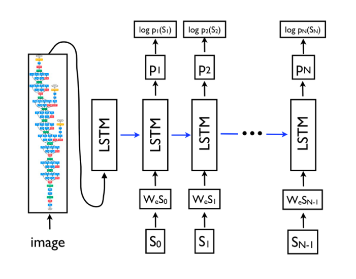
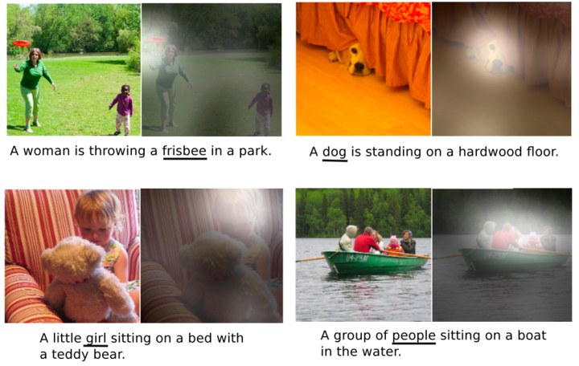
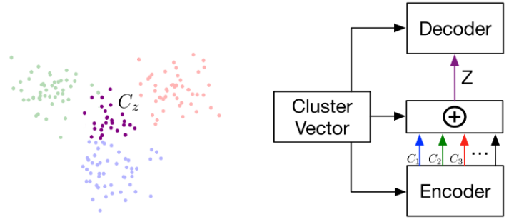
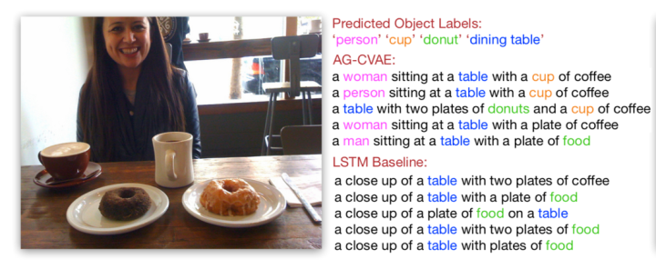
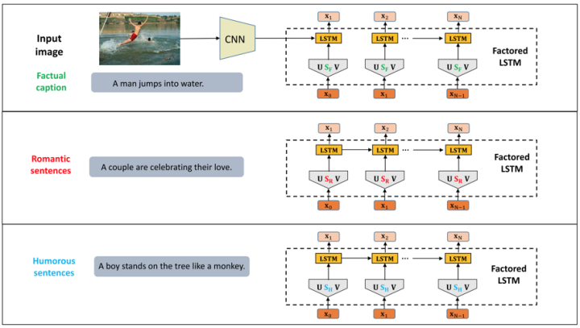
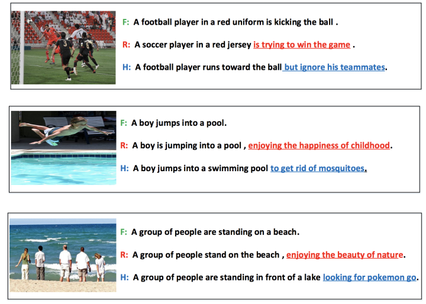
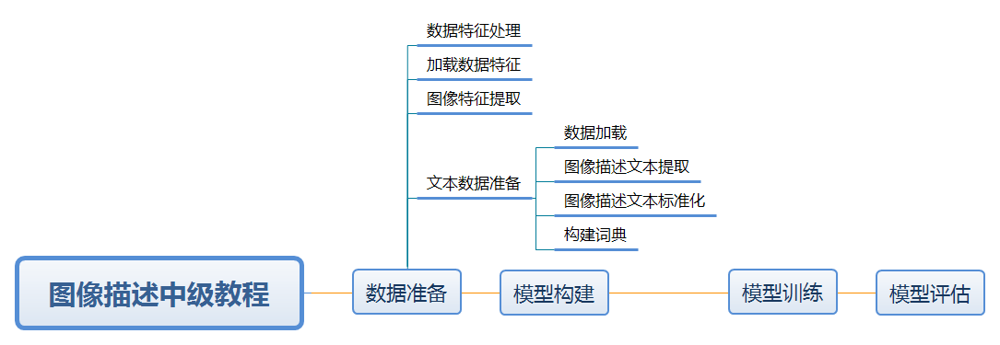

[TOC]

<!-- dataset: https://www.kesci.com/home/dataset/5e95d027e7ec38002d034d0a
ref: https://lab.datafountain.cn/forum?id=109
 -->

# 任务6：去雾算法

## 1.任务目标

<!-- 1. 
2. 
3. 
4.  -->

- 学习图像描述的相关概念
- 了解如何生成多样化的图片描述
- 动手实现对基于VGG与LSTM实现图像对应的描述文本生成的小程序

<div align=center>
    <!--  -->
    
</div>


## 2.任务描述


近年来，关于图像描述（Image Caption）的研究热度逐高，例如，2018年底，Instagram宣布推出AI图片描述功能，用户点击图片时，系统自动对该图片进行描述，用于帮助视觉障碍用户也可以轻松使用这款应用。

<div align=center>
    <!--  -->
    
</div>

其实，图像描述（Image Caption）本质上是图像信息到文本信息的翻译，通俗来讲，就是“看图说话”。就像刚认字的小朋友，看到简单的图画编故事，例如：大象在喝水。现如今，人工智能技术逐渐成熟，也可以实现根据图像给出对应描述的自然语言语句。

“看图说话”对人类而言很容易，但是对于机器却非常具有挑战性，它不仅需要利用模型去理解图片的内容并且还需要用自然语言去表达它们之间的关系。除此之外，模型还需要能够抓住图像的语义信息，并且生成人类可读的句子。

此外，还存在一个困扰性难题，由于模型的结构过于简单，导致机器生成的句子风格往往过于单一。所以，本文将基于传统的Image Caption实现方式，介绍如何利用深度生成模型来生成多样化图片描述。

本课程将帮助你利用深度学习的方法为照片等图像自动生成文字描述，图像描述是结合计算机视觉与自然语言处理的综合任务，输入一幅图像， 输出一段描述该图像的文字，这一任务要求模型可以识别图片中的物体、理解物体间的关系，并用一句自然语言表达出来。


## 3.知识准备


### 3.1传统的Image Caption实现方式

- 当前大部分图片描述生成的模型都是基于传统Encoder-Decoder架构。在最原始的RNN结构中，输入序列和输出序列必须是严格等长的。但在机器翻译等任务中，源语言句子的长度和目标语言句子的长度往往不同，因此需要将原始序列映射为一个不同长度的序列。Encoder-Decoder架构就是用于解决长度不一致的映射问题。

<div align=center>
    <!--  -->
    
</div>

- 在Image Caption输入的图像代替了机器翻译中输入的单词序列，图像是一系列的像素值，需要从使用图像特征提取。常用的CNN从图像中提取出相应的视觉特征，然后使用Decoder将该特征解码成输出序列，如上图所示，特征提取采用的是CNN，Decoder部分，将RNN换成了性能更好的LSTM，输入还是word embedding，每步的输出是单词表中所有单词的概率。

- 将输入序列编码成语义特征再解码,会因为存在长度限制，使得对于长句的翻译精度降低，为此一种Attention机制被提出，利用CNN的空间特性，给图片的不同位置都提取一个特征，有了含位置信息的特征，Decoder解码可以在位置特征中自由选择，不再使用统一的语义特征，大大提高了Encoder-Decoder的模型性能。

- 下图展示了一些例子，每个句子都是模型自动生成的，在图片中用白色高亮标注了生成下划线单词时模型关注的区域：

<div align=center>
    <!--  -->
    
</div>

- 基于Encoder-Decoder架构的Image Caption可以达到较高的正确率，但是描述语句的表述单调、风格单一，对图片的描述往往不够丰富形象。当然，这对我们人类而言也有一定难度，不能指望于不完美的视觉特征的机器方法能够像小说家一样“写”出精准又动人的话语。只是，如果能够让机器实现更加多样化的描述，那一定会非常的有意义。


### 3.2多样化Image Caption的尝试

- 随着近年来，无监督学习成为了研究热点，VAE（Variational Auto-Encoder，变分自编码器）和 GAN（Generative Adversarial Networks，生成性对抗网络） 等模型，受到越来越多的关注。使用生成式模型能够帮助模型更好的把握生成模型的不确定性，应用于Image Caption 可以生成更高质量的图片描述。

- 于是，开始有研究者基于对VAE和 GAN模型的研究，提出多种能够多样化Image Caption的实现方式。

#### 3.2.1CVAE

- 首先是采用CVAE条件变分自动编码器，标准CVAE具有固定的高斯先验产率描述，可变性太小，所以可以定义一个新的加性高斯（AG）先验，线性组合组件均值。

<div align=center>
    <!--  -->
    
</div>

- 实现过程，通过cluster vector控制图片描述的生成，cluster vector与图片中的对象对应，通过目标检测得到，训练时由 ground truth直接生成。图片的隐藏空间遵循混合高斯先验，受cluster vector控制。由此给定不同的cluster vector能够得到不同的图片描述。

- 测试结果如下图所示，与LSTM基线相比，AG-CVAE模型输出的描述更加多样化，更加准确。


<div align=center>
    <!--  -->
    
</div>


#### 3.2.2引入style

- 使用factorized LSTM，显示引入对风格的训练。数据集中对一张图片有不同风格的描述，比如浪漫、幽默的风格描述和事实描述，训练时首先训练全部参数。训练风格时，固定factorized参数以外的参数，仅训练S参数。通过替换S矩阵决定生成图片描述的风格。

<div align=center>
    <!--  -->
    
</div>

- 测试结果如下图所示，机器在进行浪漫、幽默风格的表述时，相较事实描述，语句表达形式更加丰富，语义也更加具有吸引力。


<div align=center>
    <!--  -->
    
</div>


- 以上两种方式让机器进行更加多样化的描述成为可能，但是目前风格化的数据相对难以获取，我们更常用的是非风格化的数据集，比如常见的Flickr30k，MSCOCO。所以，如何利用现有的图片数据资源，让Image caption更加的随机多变，或许会成为接下来的研究方向。

- 图像描述（Image Caption）作为人工智能技术边界探索的主流问题之一，通过对多样性、风格化的尝试与探索，可以帮助我们更好的展望未来。

- 比如说用户在拍了一张照片后，利用Image Caption技术系统可以为其匹配合适的文字，方便以后检索或省去用户手动配字，也可以帮助视觉障碍者去理解图像内容。此外，延伸至视频领域，Video Caption自动生成字幕，极大节省人力成本。

- 甚至或许，未来Image Caption不仅仅实现“看图说话”，而可以像诗人一样“作诗”。毕竟ACM MM 2018的最佳论文《Beyond Narrative Description: Generating Poetry from Images by Multi-Adversarial Training》，就是AI机器面向于一张图像所做的诗歌：

- The sun is shining ---------- 阳光漫步

- The wind moves ---------- 和风轻抚

- Naked trees ---------- 光裸的树

- You dance ---------- 你在跳舞


### 3.3 数据集
数据集:使用图像描述任务中常用的Flickr8k图像标注数据集，数据集中包含8,000张图像，每张图像都与五个不同的标题配对，这些标题提供了对图片中物体和事件的内容描述。数据集可以从这里下载，下载后解压到datasets目录下。


## 4. 任务实施

本课程旨在介绍如何利用深度学习工具keras实现一个图像描述模型，通过加载数据、预处理数据、构建模型、训练模型、测试用例依次实现一个图像描述工具，在训练过程中通过可视化监督训练过程。
说明：目前本文档仅作为示例，为了加快训练速度模型较为简单，词向量维度较低，设置的Epoch数也较少，因此导致模型性能较低。

### 4.1 实施思路

<div align=center>
    <!--  -->
    
</div>

### 4.2 实施步骤
#### 步骤1：
```
# 使用pip命令安装指定版本工具包
# !pip install tensorflow==1.14.0 keras==2.2.5 tqdm==4.47.0 numpy==1.16.0 matplotlib==3.2.2 nltk==3.5 pillow==7.2.0
```

```
#统一导入工具包
import os
import tqdm
from keras.applications.vgg16 import VGG16
import numpy as np 
from numpy import array, argmax, random, take
from pickle import dump
from pickle import load
import string
import tensorflow as tf
from keras.applications.imagenet_utils import preprocess_input	
from keras.models import Model
from keras.preprocessing.image import load_img
from keras.preprocessing.image import img_to_array
from keras.preprocessing.text import Tokenizer
from keras.preprocessing.sequence import pad_sequences
from keras.utils import to_categorical

from keras.utils import plot_model
from keras.layers import Input
from keras.layers import Dense
from keras.layers import LSTM
from keras.layers import Embedding
from keras.layers import Dropout
from keras.layers.merge import add
from keras.callbacks import ModelCheckpoint
from keras.losses import categorical_crossentropy
import matplotlib.pyplot as plt
import keras
%matplotlib inline
from nltk.translate.bleu_score import corpus_bleu
import PIL

debug = True
```
为了大家能快速地体验本教程，在此设置debug变量。当debug = True时，我们会减少数据量与训练轮次，确保您在更快的时间内体验整个流程。当debug = False时，按照原始版本运行，可能需要更长的运行时间，但也会得到更理想的效果。

默认设置debug = True。

#### 步骤2 数据准备：

图像描述任务中需要对文本、图像两种模态的数据进行处理。首先我们需要读取数据，并对它们进行简单的处理以便于后续使用，我们将分为文本和图像两个部分分别进行处理。

data文件夹中存储着Flickr8k图像描述数据集，Flickr8k_Dataset文件夹中是用于图像描述的图像，Flickr8k_text文件夹中的Flickr8k.token.txt存储着图像名及图像描述文本，以如下文本为例。

1000268201_693b08cb0e.jpg#0 A child in a pink dress is climbing up a set of stairs in an entry way .

##### 文本数据准备
1. 数据加载
2. 图像描述文本提取
3. 图像描述文本标准化
4. 构建词典

1 数据加载
定义read_text方法读取文件中的图像描述文本内容，接收参数为文件路径，为接下来的处理做好准备。紧接着定义to_lines方法先按行分割，再将每一行文本按\t分割，分别得到图像名以及图像描述文本，并将数据分别保存到imageNames与imageCaption两个列表中。

同时我们创建不带后缀的图像ID列表，为后续使用做准备。

需要注意的是，Flick8k_text/Flickr8k.token.txt 中共有8092*5=40460条描述，但是Flickr8k_Datasets 中只有8091张图片，原因在于Flickr8k.token.txt 的line 6731 处有问题

2258277193_586949ec62.jpg.1#0 people waiting for the subway

2258277193_586949ec62.jpg.1#1 Some people looking out windows in a large building .

2258277193_586949ec62.jpg.1#2 Three people are waiting on a train platform .

2258277193_586949ec62.jpg.1#3 Three people standing at a station .

2258277193_586949ec62.jpg.1#4 two woman and one man standing near train tracks .

所以我们可以事先将Flickr8k.token.txt中的这五行删除，以便后续处理。

```
def read_text(filename):
    file = open(filename, mode='rt', encoding='utf-8')
    text = file.read()
    file.close()
    return text

def to_lines(text):
    sents = text.strip().split('\n')
    sents = [i.split('\t') for i in sents]
    return sents

data_1 = read_text("datasets/Flickr8k_text/Flickr8k.token.txt")
data_2 = to_lines(data_1)
data = np.array(data_2)
print(type(data))
print(len(data))
```

```
# 取每一行的第0个数据，即图像名
imageNames_1 = data[:, 0]
# 只保留到后缀名，去掉#+数字
imageNames_2 = []
for i in imageNames_1:
    i = i[:-2]
    imageNames_2.append(i)
# 去重
imageNames = np.unique(imageNames_2)
print(len(imageNames))
# 取每一行的第1个数据，即图像描述文本
imageCaption = data[:, 1]
print(len(imageCaption))
#建立图片ID的列表
imageIds=list()
for i in imageNames_1:
    i=i[:-6]
    imageIds.append(i)
```

2 图像描述文本提取
我们可以看到，从文件中读取到的图像描述文本中每一行都包含了图像名以及相应的一个或多个图像描述文本，我们希望以结构化的方式存储这些信息，以图像名作为key，图像描述文本作为value，建立字典。
```
def load_descriptions(text):
    mapping = dict()
    for line in text.split('\n'):
        tokens = line.split()
        # 当某行分割后只有1个元素时继续循环
        if len(line) < 2:
            continue
        # 分词后将第一个作为图像的id，其后作为图像描述文本 
        image_id, image_desc = tokens[0], tokens[1:]
        # 将图像名中的文件类型名去掉    
        image_id = image_id.split('.')[0]
        # 将图像描述文本转换回字符串        
        image_desc = ' '.join(image_desc)
        if image_id not in mapping:
            mapping[image_id] = list()
        mapping[image_id].append(image_desc)
    return mapping

filename = 'datasets/Flickr8k_text/Flickr8k.token.txt'
text = read_text(filename)
descriptions = load_descriptions(text)
print('Loaded: %d' %len(descriptions))
```

3 图像描述文本标准化
对于即将使用的图像描述文本，我们需要进行文本预处理，去除标点符号、数字，统一为小写字母等标准化操作。接着我们将经过处理的图像描述文本存储为新的文件。

TIPS: 文本预处理是自然语言处理中的关键操作，此步骤所涉及的主要文本预处理手段包括：分词、清洗等。 1. 分词：在英文句子中，可直接根据词之间的空格进行分词操作。 2. 清洗：我们所获取的数据中很多时候会包含一些无用的标签、特殊符号以及停用词等，清洗便是将这些冗余信息从数据中去除。

```
# 文本清洗，去除标点符号、数字等
def clean_descriptions(descriptions):
    # maketrans和translate配合去除标点符号    
    table = str.maketrans('', '', string.punctuation)
    for key, desc_list in descriptions.items():
        for i in range(len(desc_list)):
            desc = desc_list[i]
            # 分词            
            desc = desc.split()
            # 转换为小写字母        
            desc = [word.lower() for word in desc]
            # 去除标点符号
            desc = [w.translate(table) for w in desc]
            # 去除"a"、"s"等
            desc = [word for word in desc if len(word) > 1]
            # 去除数字，只保留字母
            desc = [word for word in desc if word.isalpha()]
            # 作为字符串存储 
            desc_list[i] = ' '.join(desc)

# 存储处理好的图像描述文本为新的文件
def save_descriptions(descriptions, filename):
    lines = list()
    for key, desc_list in descriptions.items():
        for desc in desc_list:
            lines.append(key + ' ' + desc)
    data = '\n'.join(lines)
    file = open(filename, 'w')
    file.write(data)
    file.close()
            
clean_descriptions(descriptions)
save_descriptions(descriptions, 'temp/CleanDescriptions.txt')
```

4 构建词典
将图像描述文本中出现的所有词不重复地加入词典中。

```
# 构建词典
def build_vocab(descriptions):
    all_desc = set()
    for key in descriptions.keys():
        # 将所有词不重复地更新到词典中      
        [all_desc.update(d.split()) for d in descriptions[key]]
    return all_desc

vocab = build_vocab(descriptions)
print('Vocabulary Size: %d' % len(vocab))
```


##### 图像特征提取
这里我们直接使用预训练的VGG16网络模型来提取图像特征，由于顶层一般是用于预测分类的全连接层，所以这里要拿掉网络的顶层。遍历之前创建的imageNames列表读取数据集中的每一幅图像，读取过程中对图像文件进行一系列预处理操作，并使用VGG16模型对它们进行编码，最后将编码得到的向量保存在Features.pkl文件中。

其中字典encoded_images以去掉文件类型后缀的图像名作为key，以编码向量作为value。
```
def load_encoding_model():
    # 利用预训练的VGG16网络提取图像特征   
    model = VGG16(weights='imagenet', include_top=True, input_shape = (224, 224, 3))
    # 将输出设为倒数第二层的输出，拿掉模型顶层
    model = Model(inputs=model.inputs, outputs=model.layers[-2].output)
    print(model.summary())
    return model

def load_local_encoding_model():
    # 若是下载VGG模型过程过于耗时，此处也可直接载入models文件中已经下载好的模型
    model=keras.models.load_model('datasets/models/VGG16.h5')
    # 将输出设为倒数第二层的输出，拿掉模型顶层
    model = Model(inputs=model.inputs, outputs=model.layers[-1].output)
    print(model.summary())
    return model

def load_image(path):
    # 加载图像文件
    img = load_img(path, target_size=(224,224))
    # 将图像文件转换为数组 
    x = img_to_array(img)
    # 扩充数组维度
    x = x.reshape((1, x.shape[0], x.shape[1], x.shape[2]))
    # keras自带的归一化函数，预处理加快图像的处理速度
    x = preprocess_input(x)
    return np.asarray(x)

def get_encoding(model, img):
    # 加载图像
    image = load_image('./datasets/Flickr8k_Dataset/'+str(img))
    # 对图像信息编码    
    pred = model.predict(image)
    # 将预测向量摊平
    pred = np.reshape(pred, pred.shape[1])
    return pred
```

```
# 因为下载VGG参数较慢，这里我们直接读取本地给出的VGG16模型
# encoding_model = load_encoding_model()
encoding_model = load_local_encoding_model()

encoded_images = dict()
```

```
# for ima in tqdm.tqdm(imageNames[:sample_len]):
#     encoded_images[ima[:-4]] = get_encoding(encoding_model, ima)
# 编码图像特征过程较慢，若想快速体验可跳过此步直接从'datasets/Features.pkl'读取图像特征。
if not debug:    
    for ima in tqdm.tqdm(imageNames):
        encoded_images[ima[:-4]] = get_encoding(encoding_model, ima)
```

```
# 将图像特征保存至文件Features.pkl
if not debug:    
    dump(encoded_images, open('temp/Features.pkl', 'wb'))
```

##### 加载数据特征
分别从之前保存好的图像描述文本文件CleanDescriptions.txt与图像特征文件Features.pkl中加载数据特征。

模型生成图像文字描述时每次产生一个单词，将先前生成好的单词当作新的输入来预测下一个单词，直到遇到序列终止符号才停止，因此我们在这里设置两个符号来标记序列生成过程开始与结束。

此处使用的是字符串startseq与endseq来表示序列生成开始与结束。
```
def load_clean_descriptions(filename, dataset):
    doc = read_text(filename)
    descriptions = dict()
    for line in doc.split('\n'):
        # 将每一行按空格分割
        tokens = line.split()
        # 把图像名与图像描述文本分离开来
        image_id, image_desc = tokens[0], tokens[1:]
        # 训练集、测试集使用不同的数据
        if image_id in dataset:
            if image_id not in descriptions:
                descriptions[image_id] = list()
            # 包装图像描述
            desc = 'startseq ' + ' '.join(image_desc) + ' endseq'
            descriptions[image_id].append(desc)
    return descriptions

def load_photo_features(filename, dataset):
    # 直接读取所有图像
    all_features = load(open(filename, 'rb'))
    # 选择划分数据集对应的图像特征
    features = {k: all_features[k] for k in dataset}
    return features
```

在这里我们要对数据集中的数据进行划分，前35000条作为训练集数据，其余作为测试集数据，利用上面定义的函数分别读取训练集、测试集对应的图像描述文本以及图像特征。

```
# 若想要快速体验，直接从我们所提供的Features.pkl中读取图像特征，并缩小所读取的数据量为原来的十分之一。
if debug:
    train=imageIds[:3500]
    # 训练集图像描述文本
    train_descriptions = load_clean_descriptions('temp/CleanDescriptions.txt', train)
    print('Descriptions: train=%d' % len(train_descriptions))
    # 训练集图像特征
    train_features = load_photo_features('datasets/Features.pkl', train)
    print('Photos: train=%d' % len(train_features))

    test=imageIds[3500:4500]
    # 测试集图像描述文本
    test_descriptions = load_clean_descriptions('temp/CleanDescriptions.txt', test)
    print('Descriptions: test=%d' % len(test_descriptions))
    # 测试集图像特征
    test_features = load_photo_features('datasets/Features.pkl', test)
    print('Photos: test=%d' % len(test_features))
else:
    train=imageIds[:35000]
    # 训练集图像描述文本
    train_descriptions = load_clean_descriptions('temp/CleanDescriptions.txt', train)
    print('Descriptions: train=%d' % len(train_descriptions))
    # 训练集图像特征
    train_features = load_photo_features('temp/Features.pkl', train)
    print('Photos: train=%d' % len(train_features))

    test=imageIds[35000:]
    # 测试集图像描述文本
    test_descriptions = load_clean_descriptions('temp/CleanDescriptions.txt', test)
    print('Descriptions: test=%d' % len(test_descriptions))
    # 测试集图像特征
    test_features = load_photo_features('temp/Features.pkl', test)
    print('Photos: test=%d' % len(test_features))
```

##### 数据特征处理
经VGG或ResNet模型处理的图像特征向量可以被模型直接使用，然而图像文字描述是不可以直接使用的，我们需要将文字描述编码成数字形式，利用词典将单词映射成唯一的整型数值。

这里我们使用Keras提供的Tokenizer类完成这一过程，我们创建Tokenizer并利用Tokenizer将文本转换为词序列，同时计算图像描述文本的最大长度作为序列的最大长度。
```
# 将按图像ID划分的二维图像描述列表转换为一个整体的描述列表
def to_lines(descriptions):
    all_desc = list()
    for key in descriptions.keys():
        [all_desc.append(d) for d in descriptions[key]]
    return all_desc
 
# 利用图像描述文本列表来生成tokenizer
def create_tokenizer(descriptions):
    lines = to_lines(descriptions)
    tokenizer = Tokenizer()
    tokenizer.fit_on_texts(lines)
    return tokenizer

# 计算图像描述文本的最大长度
def max_length(descriptions):
    lines = to_lines(descriptions)
    return max(len(d.split()) for d in lines)
    
# 准备tokenizer
tokenizer = create_tokenizer(train_descriptions)
vocab_size = 8763
print('Vocabulary Size: %d' % vocab_size)
# 计算图像描述文本的最大长度作为序列的最大长度
max_length = max_length(train_descriptions)
print('Description Length: %d' % max_length)
```

我们将描述文本中的句子拆分成单词形式，模型通过单词与图像特征向量生成下一个单词，然后我们将新生成的单词与原输入单词、图像特征再次输入模型中，循环直到序列终止。

在训练模型时，我们也需要以这样的方式将数据提供给模型。

以文本"four children are having pillow fight"为例，会被拆分为7个输入-输出对。


| X1（图像）|	X2（文字序列）|	y（下一个单词）|
| ------ |	---- |--  |
| photo	| startseq,	|four|
| photo	| startseq, four,	|children|
| photo	| startseq, four, children,	|are|
| photo	| startseq, four, children, are,	|having|
| photo	| startseq, four, children, are, having,	|pillow|
| photo	| startseq, four, children, are, having, pillow,	|fight|
| photo	| startseq, four, children, are, having, pillow, fight	|endseq|
我们通过如下函数实现创建序列这一过程。

```
# 创建序列，包含图像、输入单词序列、输出单词。
def create_sequences(tokenizer, max_length, desc_list, photo):
    X1, X2, y = list(), list(), list()
    # 遍历图像的每一个描述
    for desc in desc_list:
        # 编码序列，将某一描述文本转换为词序列        
        seq = tokenizer.texts_to_sequences([desc])[0]
        # 将一个序列划分成多个X,y对
        for i in range(1, len(seq)):
            # 第i个单词为输出，划分成输入序列和输出序列
            in_seq, out_seq = seq[:i], seq[i]
            # 填充输入序列到最大长度
            in_seq = pad_sequences([in_seq], maxlen=max_length)[0]
            # 编码输出序列         
            out_seq = to_categorical([out_seq], num_classes=vocab_size)[0]
            # 分别存入列表中
            X1.append(photo)  
            X2.append(in_seq)
            y.append(out_seq)
    return array(X1), array(X2), array(y)

```


#### 步骤3 模型构建：
定义图像描述模型与数据生成器，模型主要分为三个部分：

图像特征提取器，用VGG16模型提取图像特征，将VGG16模型的最后一层拿掉，用输出的图像特征作为图像描述模型的图像输入，这一图像处理部分已经在前面完成。输出为一个4096维的向量，用Dense层处理后生成256维特征表示。

文本序列处理器，用Embedding层映射文字为词向量，再利用LSTM网络处理文本序列，生成最后维度为256的序列特征向量。

序列解码器，将图像特征与文本特征相加融合后，经Dense层处理后预测下一个单词。
我们按照模型的结构实现模型，使用图像描述模型将预测描述的下一个词，其定义如下。

model.compile为模型设置损失函数、优化器等，此处我们使用Adam作为优化器，使用交叉熵作为损失函数。

```
# 定义图像描述模型
# vocab_size表示词典容量，max_length表示序列最大长度
def define_model(vocab_size, max_length):
    # 特征提取
    inputs1 = Input(shape=(4096,))
    fe1 = Dropout(0.5)(inputs1)
    fe2 = Dense(256, activation='relu')(fe1)
    # 输入序列
    inputs2 = Input(shape=(max_length,))
    # 词嵌入层将文本序列转换为词向量   
    se1 = Embedding(vocab_size, 256, mask_zero=True)(inputs2)
    se2 = Dropout(0.5)(se1)
    # 使用LSTM网络编码    
    se3 = LSTM(256)(se2)
    # 解码器
    # 将两部分处理后的输入求和  
    decoder1 = add([fe2, se3])
    decoder2 = Dense(256, activation='relu')(decoder1)
    # 将全连接层的结果进行softmax，映射到词典中每个词的概率    
    outputs = Dense(vocab_size, activation='softmax')(decoder2)
    model = Model(inputs=[inputs1, inputs2], outputs=outputs)
    # 编译模型
    model.compile(loss='categorical_crossentropy', optimizer='adam')
    # 输出模型结构并保存模型结构图
    print(model.summary())
#     plot_model(model, to_file='model.png', show_shapes=True)
    return model
```
为了讨论词向量维度对模型性能的影响，我们构建另一个模型，其中Embedding层我们设置词向量维度为128，观察分析词向量维度为128维与256维两种情况下模型的性能表现。

```
# 定义图像描述模型
# vocab_size表示词典容量，max_length表示序列最大长度
def define_model_128(vocab_size, max_length):
    # 特征提取
    inputs1 = Input(shape=(4096,))
    fe1 = Dropout(0.5)(inputs1)
    fe2 = Dense(128, activation='relu')(fe1)
    # 输入序列
    inputs2 = Input(shape=(max_length,))
    # 词嵌入层将文本序列转换为词向量   
    se1 = Embedding(vocab_size, 128, mask_zero=True)(inputs2)
    se2 = Dropout(0.5)(se1)
    # 使用LSTM网络编码    
    se3 = LSTM(128)(se2)
    # 解码器
    # 将两部分处理后的输入求和  
    decoder1 = add([fe2, se3])
    decoder2 = Dense(128, activation='relu')(decoder1)
    # 将全连接层的结果进行softmax，映射到词典中每个词的概率    
    outputs = Dense(vocab_size, activation='softmax')(decoder2)
    model = Model(inputs=[inputs1, inputs2], outputs=outputs)
    # 编译模型
    model.compile(loss='categorical_crossentropy', optimizer='adam')
    # 输出模型结构并保存模型结构图
    print(model.summary())
#     plot_model(model, to_file='model.png', show_shapes=True)
    return model
```

创建数据生成器data_generator，为模型训练过程生成所需要的数据，数据来源于训练集，通过create_sequences函数我们可以将训练集中的数据转换为适用于模型训练的序列。 其中，

- texts_to_sequences对序列进行编码，将图像描述文本转换为词序列。
- to_categorical对输出序列进行编码，将原有向量转换为独热编码的形式。
- yield用于在生成器中返回数据

```
# 数据生成器，用于model.fit_generator()
def data_generator(descriptions, photos, tokenizer, max_length):
    # 不断生成数据，循环停止由model.fit_generator()控制
    while 1:
        for key, desc_list in descriptions.items():
            # 获得图像特征
            photo = photos[key]
            # 创建序列
            # 一幅图像对应5个描述，故此处desc_list中有五个元素           
            in_img, in_seq, out_word = create_sequences(tokenizer, max_length, desc_list, photo)
            yield [[in_img, in_seq], out_word]
```

```
# 测试数据生成器
generator = data_generator(train_descriptions, train_features, tokenizer, max_length)
inputs, outputs = next(generator)
# 第一维度的数=一幅图像五个语句输入输出对数之和
print(inputs[0].shape)
print(inputs[1].shape)
print(outputs.shape)

val_generator=data_generator(test_descriptions, test_features, tokenizer, max_length)
inputs, outputs = next(val_generator)
print(inputs[0].shape)
print(inputs[1].shape)
print(outputs.shape)
```

#### 步骤4 模型训练：

构建模型完毕后，我们使用训练集训练我们的模型。

为了避免模型过拟合，我们使用验证集监测模型性能表现，每一轮迭代结束时，如果模型的性能有所提升，我们就保存当前最优模型。这里使用Keras提供的ModelCheckpoint类实现模型性能监测回调。

使用fit函数调用generator生成器函数，每次生成一个作为训练数据，重复直到期望的epoch数量。

什么是epoch？

当一个完整的数据集通过了神经网络一次并且返回了一次，这个过程称为一次epoch。我们使用的是有限的数据集，并且我们使用一个迭代过程即梯度下降来优化学习过程，因此更新一次或者说使用一个epoch往往是不够的。

```
# 定义检查点
filepath = 'temp/model-ep{epoch:03d}-loss{loss:.3f}-val_loss{val_loss:.3f}.h5'
checkpoint = ModelCheckpoint(filepath, monitor='val_loss', verbose=1, save_best_only=True, mode='min')

# 定义模型
model = define_model(vocab_size, max_length)
# 计算每一个epoch要进行多少步
steps = len(train_descriptions)
# 创建数据生成器
generator = data_generator(train_descriptions, train_features, tokenizer, max_length)
val_generator=data_generator(test_descriptions, test_features, tokenizer, max_length)
if debug:
    history = model.fit(generator, epochs=2, steps_per_epoch=steps, verbose=1,callbacks=[checkpoint],validation_data=val_generator,validation_steps=1)
else:
    history = model.fit(generator, epochs=5, steps_per_epoch=steps, verbose=1,callbacks=[checkpoint],validation_data=val_generator,validation_steps=1)
```

```
# 定义检查点
filepath = 'temp/128_model-ep{epoch:03d}-loss{loss:.3f}-val_loss{val_loss:.3f}.h5'
checkpoint = ModelCheckpoint(filepath, monitor='val_loss', verbose=1, save_best_only=True, mode='min')

# 定义模型
model_128 = define_model_128(vocab_size, max_length)
# 计算每一个epoch要进行多少步
steps = len(train_descriptions)
# 创建数据生成器
generator = data_generator(train_descriptions, train_features, tokenizer, max_length)
val_generator=data_generator(test_descriptions, test_features, tokenizer, max_length)
if debug:
    history_128 = model_128.fit(generator, epochs=2, steps_per_epoch=steps, verbose=1,callbacks=[checkpoint],validation_data=val_generator,validation_steps=1)
else:
    history_128 = model_128.fit(generator, epochs=5, steps_per_epoch=steps, verbose=1,callbacks=[checkpoint],validation_data=val_generator,validation_steps=1)
```

在fit()函数返回的history中保存着训练过程中的进度，我们此处可视化绘制训练过程中损失的变化曲线。

两条颜色的线条分别代表着训练集上的损失以及在用于验证的测试集上的损失。

我们分别绘制model与128_model的损失变化曲线。

可以看到两个模型的损失变化曲线趋势极为相似，原模型（词向量维度为256）在训练集上的损失下降得更快。


```
# 展示在训练集上的损失
plt.plot(history.history['loss'])
# 展示在测试集上的损失
plt.plot(history.history['val_loss'])
# 设置标题
plt.title("model loss")
# 设置纵坐标名称
plt.ylabel("loss")
# 设置横坐标名称
plt.xlabel("epoch")
plt.legend(['train','validation'],loc="upper left")
plt.show()
```

```
# 展示在训练集上的损失
plt.plot(history_128.history['loss'])
# 展示在测试集上的损失
plt.plot(history_128.history['val_loss'])
# 设置标题
plt.title("model_128 loss")
# 设置纵坐标名称
plt.ylabel("loss")
# 设置横坐标名称
plt.xlabel("epoch")
plt.legend(['train','validation'],loc="upper left")
plt.show()
```

#### 步骤5 模型评估：

本模型以BLEU作为评价标准，其全称为Bilingual Evaluation Understudy，意思是双语评估替补。用于评估模型生成的句子(candidate)和实际句子(reference)的差异的指标.它的取值范围在0.0到1.0之间, 如果两个句子完美匹配(perfect match), 那么BLEU是1.0, 反之, 如果两个句子完美不匹配(perfect mismatch), 那么BLEU为0.0。

我们实现generate_desc函数为图像生成描述文本，每一次预测一个单词，直到预测到了句子末尾。
接着我们设计evaluate_model函数对我们的模型进行评估，实际答案由数据集给出，预测答案通过generate_desc函数生成，利用nltk提供的corpus_bleu函数计算BLEU分数。
BLEU如何计算？

BLEU的计算公式为$BLEU = BP\times exp(\sum_1^N{W_nlogP_n})$

其中$P_n$表示N-gram精确率，此处由于N-gram精确率会随着阶数升高而递减，所以采用平均加权形式，$W_n=1/N$，N的上限为4，即最多只统计4-gram的精确率。

BP即长度惩罚因子(Brevity Penalty)，N-gram精确率会随着句子长度变短而变好，因此为了避免结果只包含答案中的一部分，引入惩罚因子。

当参考答案的有效长度小于预测结果的长度时$BP = 1$，否则$BP = e^{1 - l_s/l_c}$


```
# 将整数映射到单词
def word_for_id(integer, tokenizer):
    for word, index in tokenizer.word_index.items():
        if index == integer:
            return word
    return None

def generate_desc(model, tokenizer, photo, max_length):
    # seed the generation process
    in_text = 'startseq'
    # 遍历序列的每个单词
    for i in range(max_length):
        # 编码输入序列
        sequence = tokenizer.texts_to_sequences([in_text])[0]
        # 填充输入序列
        sequence = pad_sequences([sequence], maxlen=max_length)
        # 预测下一个单词
        yhat = model.predict([photo.reshape(1,4096),sequence], verbose=0)
        # 转换概率为整数
        yhat = argmax(yhat)
        # 将整数映射为单词
        word = word_for_id(yhat, tokenizer)
        # 无法映射到单词则停止循环
        if word is None:
            break
        # 加上预测的单词作为下一次循环的输入，以生成下一个单词
        in_text += ' ' + word
        # 当预测到了句子末尾则停止
        if word == 'endseq':
            break
    return in_text

# 评估模型性能
actual, predicted = list(), list()
def evaluate_model(model, descriptions, photos, tokenizer, max_length):
    # 遍历集合
    for key, desc_list in descriptions.items():
        # 生成描述
        yhat = generate_desc(model, tokenizer, photos[key], max_length)
        # 获取参考答案        
        references = [d.split() for d in desc_list]
        # 存储实际答案和预测答案
        actual.append(references)
        predicted.append(yhat.split())
    # 计算BLEU
    print('BLEU-1: %f' % corpus_bleu(actual, predicted, weights=(1.0, 0, 0, 0)))
```

我们载入刚刚训练好的最优模型，并以BLEU的评价标准使用测试集对模型进行评估。

```
# # 载入模型 更改为相应的模型名称
# modelP=keras.models.load_model('temp/model-ep002-loss4.758-val_loss3.540.h5')
# 模型评估
evaluate_model(model, test_descriptions, test_features, tokenizer, max_length)
```

```
# # 载入模型 更改为相应的模型名称
# modelP_128=keras.models.load_model('temp/128_model-ep002-loss4.915-val_loss4.184.h5')
# 模型评估
evaluate_model(model_128, test_descriptions, test_features, tokenizer, max_length)
```

对比两种模型的表现结果来看，词向量维度为128时，BLEU的值要更接近于1，所以模型性能更好。

在我们日常设置词向量的维度时，通常来自于平时经验的总结以及不断地实验，我们可以观察到词向量维度对模型性能的影响，在确定词向量维度的时候先采用一个经验值，再通过不断地两倍扩大或缩小进行实验，从而得到一个相对较好的值。往后也可以尝试使用词向量模型Word2vec代替Embedding层。

注意此处是为了加快训练速度，故选用较小的词向量维度进行实验。


#### 步骤6 模型预测：
以图片195084264_72fb347b0f为例,为这张图片生成描述文本，将开头结尾的序列标志删除后打印出来。
```
a=generate_desc(model, tokenizer, test_features['195084264_72fb347b0f'], max_length)
print(a)

b=a[9:]
c=b[:-6]
descrip=c
print(descrip)
```


最后，我们通过PIL打开图片，并在图片左上方显示我们的模型生成的图像描述文本，效果如下。

```
from PIL import Image
from PIL import ImageFont
from PIL import ImageDraw

base = Image.open("datasets/Flickr8k_Dataset/195084264_72fb347b0f.jpg")
fnt = ImageFont.load_default()

img = ImageDraw.Draw(base)
img.text((0, 0),descrip,(255,255,255),font=fnt)
img=ImageDraw.Draw(base)
base.save("submit/sample.png", "PNG")

plt.imshow(base) # 显示图片
plt.axis('off') # 不显示坐标轴
plt.show()
```


## 5.任务拓展
### 5.1 加入注意力机制改进模型

- 参考论文一：Show and Tell: A Neural Image Caption Generator（将 图像描述 视为 机器翻译 的任务）
  
    本篇论文受机器翻译模型的启发，设计了一种适用于图像描述任务的encode-decode框架，不同于机器翻译模型的编码与解码，图像描述模型的编码对象是图像，因此在编码部分将RNN换成更适用于图像的CNN。

- 参考论文二：Show, Attend and Tell: Neural Image Caption Generation with Visual Attention（图像描述模型引入自顶向下的空间注意力模型）
  
    由于encode-decode模型将CNN编码的最后一层信息直接作为编码向量（通常保持不变，还是一维的），然后将图像编码向量输入给RNN进行解码。但是这种方式生成的图像编码，在语言生成过程中解码的时候容易丢失或者忽略一些重要的视觉信息，因此生成的句子质量不是太好，或者容易忽视图像中的一些目标。本文首次首次将注意力机制引入到图像描述模型中，图像编码部分不再使用CNN的顶层表示，而是提取来自CNN的底层向量表示（之前是一维的，现在是立体的网格）。然后在解码的过程中借助于注意力机制计算在每个网格上的注意力分布，然后在每一个单词生成的时候都会有意识的注意到图像的网格视觉区域。


- 参考论文三：Knowing When to Look: Adaptive Attention via A Visual Sentinel for Image Captioning（会自适应的自顶项下的空间注意力）
  
    上面的方法，在生成的句子单词中，有些时候并不是每一个时间步（单词）都应该注意图像的一个视觉区域，比如在生成单词 ‘a’ 'the' ‘of’的时候， 这些单词不是一个视觉概念，因此是不必要注意的。而之前的方法没有这个感知能力，因此这篇论文提出来一种适应的注意力模型方法。知道什么时候该引起模型注意。


- 参考论文四：Bottom-Up and Top-Down Attention for Image Captioning and Visual Question Answering （引进了自底向上的注意力）
  
    之前的方法在注意力分布，提取注意力区域的过程中都是基于整个全局的视觉特征图，并且特征图的每个块的大小都是一样大的。这种方式有一个弊端就是，无法权衡在为每一个特征视觉图上的位置，在提取注意力分布权重的时候，无法均衡在特征图上的位置的“粗”与“细”，因此会忽视一些很显著的目标区域（一个目标整体，或者目标概念区域）。

    我们人类看东西的时候，在注意一个物体的时候，有一种方式是有意识的有目的的 自上而下 的 慢慢的聚集式的注意方式，也有来自于一种无意识的无预期的被某些显著的颜色或者视觉特征等的视觉刺激引起的视觉注意。之前的注意力方法（如论文二、三，）都是自上而下的。因此会忽视来自于显著的一些概念区域。


## 6. 任务实训
1. 使用预训练的VGG16网络模型来做什么处理（）？ 【分值：25】
   A.词嵌入 B.构造词向量 C.提取图像特征 D.池化操作
2. 图像描述生成技术是一个（）与（）交叉研究领域的研究领域？ 【分值：25】
   A.神经网络 B.CV C.NLP D.机器学习 E.强化学习
3. 从文件中读取到的图像描述文本中每一行都包含了图像名以及相应的一个或多个图像描述文本，我们可以结构化的方式存储这些信息，以图像名作为key，图像描述文本作为value，建立字典。 【分值：25】
4. VGG模型生成图像文字描述时每次产生一个单词，将先前生成好的单词当作新的输入来预测下一个单词，直遇到序列终止符号才停止，因此我们可以设置两个符号来标记序列生成过程 与 。 【分值：25】
5. 图像描述模型通过加入注意力机制改进有哪些具体的实现思路？ 【分值：0】
6. 定义图像描述模型与数据生成器，模型主要分为三个部分？ 【分值：0】


