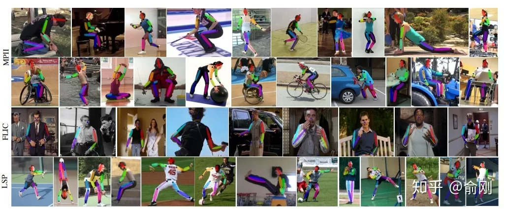
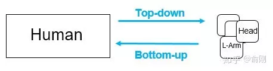
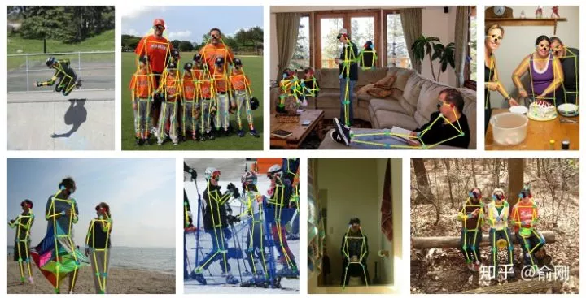
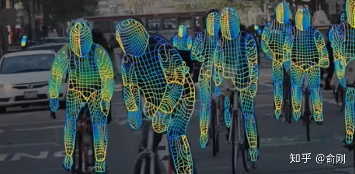

[TOC]
# 任务13：姿态估计应用
## 1.任务目标
<!-- 1. 
2. 
3. 
4.  -->
- 学习理解姿态估计的概念和理论
- 了解姿态估计领域常用数据集
<!-- - 掌握人体姿态估计领域的衡量标准以及损失函数 -->
- 动手实现一个运用姿态估计算法的应用小程序

## 2.任务描述
<!-- - 从自然实况入手，一步步从计算机视觉的角度去理解如何做人体姿态的估计
- 以二维的人体姿态估计为切入点,讲解围绕二维人体姿态估计的相关衡量标准以及损失函数
- 动手实践一个人体姿态估计算法,观察预测结果 -->

人体姿态估计是计算机视觉中一个很基础的问题，从名字的角度来看，可以理解为对“人体”的姿态（关键点，比如头，左手，右脚等）的位置估计，一般我们可以这个问题再具体细分成4个任务：

- 单人姿态估计 (Single-Person Skeleton Estimation)
- 多人姿态估计 (Multi-person Pose Estimation)
- 人体姿态跟踪 (Video Pose Tracking)
- 3D人体姿态估计 (3D Skeleton Estimation)


## 3.知识准备

### 3.1 单人姿态估计
-  输入是一个crop出来的行人，然后在行人区域位置内找出需要的关键点，比如头部，左手，右膝等。常见的数据集有MPII, LSP, FLIC, LIP。其中MPII是2014年引进的，目前可以认为是单人姿态估计中最常用的benchmark， 使用的是PCKh的指标（可以认为预测的关键点与GT标注的关键点经过head size normalize后的距离）。但是经过这几年的算法提升，整体结果目前已经非常高了（最高的已经有93.9%了）。下面是单人姿态估计的结果图（图片来源于CPM的paper)

<div align=center>
    <!--  -->
    
</div>

### 3.2 多人姿态估计
-  单人姿态估计算法往往会被用来做多人姿态估计。多人姿态估计的输入是一张整图，可能包含多个行人，目的是需要把图片中所有行人的关键点都能正确的做出估计。针对这个问题，一般有两种做法，分别是top-down以及bottom-up的方法。对于top-down的方法，往往先找到图片中所有行人，然后对每个行人做姿态估计，寻找每个人的关键点。单人姿态估计往往可以被直接用于这个场景。对于bottom-up，思路正好相反，先是找图片中所有parts （关键点），比如所有头部，左手，膝盖等。然后把这些parts（关键点）组装成一个个行人。

<div align=center>
    <!--  -->
    
</div>

- 对于测试集来讲，主要有COCO, 最近有新出一个数据集CrowdPose。下面是CPN算法在COCO上面的结果：
<div align=center>
    <!--  -->
    
</div>

### 3.3 人体姿态跟踪
-  如果把姿态估计往视频中扩展的话，就有了人体姿态跟踪的任务。主要是针对视频场景中的每一个行人，进行人体以及每个关键点的跟踪。这个问题本身其实难度是很大的。相比行人跟踪来讲，人体关键点在视频中的temporal motion可能比较大，比如一个行走的行人，手跟脚会不停的摆动，所以跟踪难度会比跟踪人体框大。目前主要有的数据集是PoseTrack。


### 3.4 3D 人体姿态估计
-  同时，如果把人体姿态往3D方面进行扩展，输入RGB图像，输出3D的人体关键点的话，就是3D 人体姿态估计。这个有一个经典的数据集Human3.6M。最近，除了输出3D的关键点外，有一些工作开始研究3D的shape，比如数据集DensePose。长线来讲，这个是非常有价值的研究方向。3D人体姿态估计的结果图（来自算法a simple baseline)如下：

<div align=center>
    <!--  -->
    
</div>

- Densepose算法的结果输出：

<div align=center>
    <!--  -->
    
</div>

### 3.5 相关数据集
#### Benchmark
<!-- 还可以给每个数据集加点简单的描述 -->
- 单人估计: [MPII](http://human-pose.mpi-inf.mpg.de/), [FLIC](https://bensapp.github.io/flic-dataset.html), [LSP](http://sam.johnson.io/research/lsp.html), [LIP](http://sysu-hcp.net/lip/)

- 多人关键点预测: [COCO](http://cocodataset.org/#keypoints-2019), [CrowdPose](http://cocodataset.org/#keypoints-2019)

- 视频：[PoseTrack](https://posetrack.net/)

- 三维人体：[Human3.6M](http://vision.imar.ro/human3.6m/description.php), [DensePose](http://densepose.org/)


<!-- ### 评估指标
- 基于对象关键点相似度（OKS）的mAP：
- $$\frac{\sum}{2}$$
- AP(average precision)
- AP Across Scales
- AR(average recall)
- AR Across Scales -->

<!-- ### 损失函数

### 自下而上和自上而下的检测思想
#### 自下而上
- Mask R-CNN, CPN, MSPN
- 高性能（良好的本地化能力），高召回率

#### 自上而下
- Openpose, Associative Embeding
- 简洁的框架，可能更快 -->

### 3.6 挑战
- 模棱两可的外观
- 拥挤人群，遮挡现象
- 实时估计的速度

<!-- ### 3.7 相关算法
#### OpenPose
- 在2016年COCO比赛中，当时的第一名就是OpenPose。CMU团队基于CPM为组件，先找到图片中的每个joint的位置，然后提出Part Affinity Field （PAF)来做人体的组装。
- PAF的基本原理是在两个相邻关键点之间，建立一个有向场，比如左手腕，左手肘。我们把CPM找到的所有的左手腕以及左手肘拿出来建立一个二分图，边权就是基于PAF的场来计算的。然后进行匹配，匹配成功就认为是同一个人的关节。依次类别，对所有相邻点做此匹配操作，最后就得到每个人的所有关键点。
- 在当时来讲，这个工作效果是非常惊艳的，特别是视频的结果图，具体可以参考Openpose的Github官网。在COCO的benchmark test-dev上面的AP结果大概是61.8。 -->

### 3.7 应用

讲了这么多的人体姿态估计，我们说一下人体姿态估计有什么用，这里的人体姿态估计是一个广义的人体姿态估计，包含2D/3D等。

- 首先的一个应用是人体的动作行为估计，要理解行人，人体的姿态估计其实是一个非常重要的中间层信息。目前有蛮多基于人体姿态估计直接做action recogntion的工作，比如把关键点当成graph的节点，然后是使用graph convolution network来整合各种信息做动作分类。

- 第二类应用是偏娱乐类的，比如人体交互，美体等。比如可以通过3d姿态估计来虚拟出一个动画人物来做交互，使用真实人体来控制虚拟人物。另外比如前一段时间比较火热的瘦腰，美腿等操作背后都可能依赖于人体姿态估计算法。

- 第三类应用是可以做为其他算法的辅助环节，比如Person ReID可以基于人体姿态估计来做alignment，姿态估计可以用来辅助行人检测，杀掉检测的FP之类的。

<!-- ### 3.5  -->
#### 基于DenseNet的自动驾驶手势检测系统
为了保证自动驾驶手势检测系统的高精确度，使其能够最大化地保障用户的出行安全，我们需要使用到在计算机视觉领域中具有较高精度的卷积神经网络模型。

DenseNet是2017年提出的一款深度学习模型。它通过密集连接和特征重用的手段来对图像数据特征进行学习。与目前比较流行的ResNet相比，DenseNet能够在参数和计算成本更少的情况下得到更优的性能。
<div align=center>
    
</div>

鉴于国内数据集普遍采用的是人体姿态识别模型，因此本课题将以由Ralf Leistad, Sander Hellesø, Sverre Broen and William Svea-Lochert在Kaggle发布的数据WRSS为分析对象，采用DenseNet建立模型来进行学习。


#### DenseNet简介

DenseNet又称为密集连接卷积网络，是一种卷积神经网络模型。

DenseNet的思路与ResNet一致，都是通过在不同的层之间建立短路连接，来帮助模型在训练过程中梯度的反向传播过程。但不同于ResNet的是，DenseNet提出了一种新的密集连接机制，即通过短路连接所有的层，每个层都的输入都是由其上游所有层的输出在通道维度的连接。
<div align=center>

</div>

**DenseNet的优点**：通过对不同层特征图的学习实现特征重用，因而能提高效率；有效解决了网络退化带来的问题；抛弃昂贵的全连接层，参数少。

**DenseNet的缺点**：连接复杂，训练网络时可能耗费很多资源。

#### DenseNet网络结构

以下将会介绍DenseNet中的基本配置。

DenseNet的结构主要由DenseBlock和Transition组成。

在DenseBlock中，各个层的特征图大小一致，使得其能够在通道维度上进行连接。在DenseBlock中的非线性组合函数$H$采用的是 **批量归一化(BN)+线性整流(ReLU)+卷积(Conv 3x3)** 操作，同时输出通道数均为$k$。
<div align=center>
    
</div>

为了减少训练时的计算量，一般我们会拓展非线性组合函数$H$，在其中增加卷积核大小为$1*1$的卷积核，构成**BN+ReLU+Conv 1x1 +BN+ReLU+Conv 3x3**的结构，称为DenseNet-B。

Transition主要的作用是分隔开两个DenseBlock，同时降低特征图的大小。通常的结构为**Conv 1x1 + AveragePooling**。Transition的输出通道数为$θn$，其中$n$为上一DenseBlock的输出通道数，$θ$称为压缩系数，$θ\in(0,1]$，当压缩系数小于1时的网络结构称为DenseNet-C，对于使用了DenseNet-B和DenseNet-C手段的结构，我们称为DenseNet-BC。


在网络的最后采用了全局平均池化策略，这个方法将特征图中所有的像素点求平均作为输出数值，能够有效地代替全连接层，同时也能够起到降采样的效果。

#### 数据分析

WRSS数据集是由Ralf Leistad, Sander Hellesø, Sverre Broen 和 William Svea-Lochert制作，其中包括了6类交通手势共215张绿幕照片
<div align=center>
    
</div>

显然，直接使用该数据集会带来比较严重的过拟合情况，因此有必要对数据集进行数据增强，引入背景图来扩充数据集。


## 4 项目实施

- 我们已经初步了解了自动驾驶手势检测的重要性以及DenseNet的基本原理与结构。以下将会以WRSS数据集为分析对象，建立DenseNet来对该数据集进行学习。

- 作为拓展内容，将使用百度API进行人体姿态估计的进一步尝试。

### 4.1 实施思路
任务将分为两个部分：数据预处理、模型的搭建与训练，其中在模型的搭建与训练环节分为Tensorflow1.14和Tensorflow2.0版本，两者的实施方式有比较大的不同之处。

**对于数据预处理的步骤为**：
 1. 导入实验所需库
 2. 读取绿幕素材与背景素材路径
 3. 将路径转换为图片张量并打乱
 4. 进行图像融合
 5. 生成数据集
 6. 切割数据集，生成训练集与测试集
 7. 保存训练集与测试集

**对于模型的搭建与训练的步骤为**:
 1. 导入实验所需库
 2. 读取数据集路径与标签
 3. 处理测试集与验证集
 4. 数据预处理
 5. 模型搭建
 6. 训练网络
 7. 训练可视化

**对于百度API接口实现人体姿态估计的步骤为**:
 1. 导入 urllib 库
 2. 请求认证token
 3. 定义读取图片函数
 4. 调用远程 HTTP 服务器
 5. 程序入口
 6. 绘制人体关键点

### 4.2 数据预处理实施步骤
以下方法在Tensorflow2.0与Tensorflow1.14都能正常使用

#### 步骤1：导入实验所需库

本次实验所需的库为：

```python{.line-numbers}
import tensorflow as tf
import matplotlib.pyplot as plt
import numpy as np
import random as ra
from IPython import display
import os
```

#### 步骤2：读取绿幕素材与背景素材路径

本任务采用的是WRSS数据集，其中包括了6类共215张的绿幕手势素材，同时也使用了来自于Hippopx中的13张不同环境的街道背景素材。


首先的是导入绿幕素材，这215张图片按照类别划分到6个文件夹之中，因此我们需要在读取图像路径数据的同时将其所在的文件夹保存为标签信息。
```python{.line-numbers}
#设置读取文件
path = './data/dataset_green/'

#建立路径列表和标签列表用于储存
allPaths,allLabels = [],[]
for root,folder,files in os.walk(path):
    allPaths += [root +'/'+ file for file in files]
    allLabels += [root.split('/')[-1]] * len(files)
        
#读取前10张图片的路径和标签信息
for i in range(10):
    print(allLabels[i],allPaths[i])
```

    backward ./data/dataset_green/backward/backward.jpg
    backward ./data/dataset_green/backward/backward10.jpg
    backward ./data/dataset_green/backward/backward11.jpg
    backward ./data/dataset_green/backward/backward12.jpg
    backward ./data/dataset_green/backward/backward13.jpg
    backward ./data/dataset_green/backward/backward14.jpg
    backward ./data/dataset_green/backward/backward15.jpg
    backward ./data/dataset_green/backward/backward16.jpg
    backward ./data/dataset_green/backward/backward17.jpg
    backward ./data/dataset_green/backward/backward18.jpg

随后，按照这种方式读取背景素材路径
```python{.line-numbers}
#设置读取文件
bgPath = './data/dataset_background/'

for root,folder,files in os.walk(bgPath):
    #直接整合目录下所有的图片路径
    allBgPaths = [bgPath + file for file in files]
    
allBgPaths
```

    ['./data/dataset_background/background.jpg',
    './data/dataset_background/background10.jpg',
    './data/dataset_background/background11.jpg',
    './data/dataset_background/background12.jpg',
    './data/dataset_background/background13.jpg',
    './data/dataset_background/background2.jpg',
    './data/dataset_background/background3.jpg',
    './data/dataset_background/background4.jpg',
    './data/dataset_background/background5.jpg',
    './data/dataset_background/background6.jpg',
    './data/dataset_background/background7.jpg',
    './data/dataset_background/background8.jpg',
    './data/dataset_background/background9.jpg']

#### 步骤3：将路径转换为图片张量并打乱
仅仅有图像的路径是无法进行处理的，因此我们需要使用到Tensorflow中的image库来将路径转化为图像，同时为了查看转换效果，我们需要将列表同步打乱来观察。


首先我们需要定义一个用于读取图片的函数，这个函数的作用是将图片从路径转换为一个224x224大小的张量，并且进行了归一化处理。
```python{.line-numbers}
def readImage(path):
    """将图片转换为张量，并进行归一化"""
    img = tf.io.read_file(path)
    img = tf.io.decode_image(img,channels=3)
    img = tf.image.resize(img,(224,224))
    img = tf.image.convert_image_dtype(img,tf.float32)/255.0
    
    return img
```

有了如上函数后，我们便可以开始转换图片，对于标签值，我们通过python的集合功能来将其转换为索引。

```python{.line-numbers}
%%time
#用于记录处理时间

#将重复的标签去掉，从而得到一个只有六位的标签列表
indexToLabel = list(set(allLabels))

#对数据进行处理
allImgs = [readImage(path) for path in allPaths]
allBgs = [readImage(path) for path in allBgPaths]
allLabels = [indexToLabel.index(i) for i in allLabels]

print(len(allImgs),len(allBgs))
```

    215 13
    Wall time: 7.18 s

随后，定义随机打乱函数，以方便后续的使用
```python{.line-numbers}
def shuffle(imgs,labels):
    """同步打乱两个数组"""
    
    #设定初始种子
    seed = ra.randint(0,100)
    #读取种子
    ra.seed(seed)
    ra.shuffle(imgs)
    ra.seed(seed)
    ra.shuffle(labels)

    return imgs,labels
```

最后，抽取前16张图片检查处理效果
```python{.line-numbers}
#同步打乱两个数组
allImgs,allLabels = shuffle(allImgs,allLabels)

#创建画布
plt.figure(figsize=(9,9))
for i in range(16):
    plt.subplot(4,4,1+i)
    plt.imshow(allImgs[i])
    plt.title(indexToLabel[allLabels[i]])
    plt.axis('off')
plt.show()
```
<div align=center>
    <!--  -->
    
</div>


值得注意的是，这个数据集源自于国外，因此与中国交通管理手势存在一定的区别。

#### 步骤4：进行图像融合

对于绿幕素材，我们可以通过检测绿色RGB边缘的范围来找出图中所有的绿色背景像素点，随后我们可以将背景素材上对应的像素点替换到绿幕素材中，完成两张图片的融合。

首先我们构造一个函数，这个函数的作用是将图片张量与背景张量进行融合，并返回合成图片的张量。

```python{.line-numbers}
GREEN_RGB = 30/255.0 #绿色RGB边缘

def addBackground(img,background):
    """为图片增加背景"""
    img = np.array(img)
    background = np.array(background)
    for i in range(img.shape[0]):
        for j in range(img.shape[1]):
            #检测到为绿色像素时
            if img[i,j,1]-img[i,j,0] > GREEN_RGB and img[i,j,1]-img[i,j,2] > GREEN_RGB: 
                img[i,j] = background[i,j]
    return img
```
使用简单的测试来查看合成效果，这里使用了列表中的第一张照片和第一张背景素材
```python{.line-numbers}
plt.imshow(addBackground(allImgs[0],allBgs[0]))
plt.show()
```
<div align=center>
     
</div>

#### 步骤5：生成数据集

完成了上述步骤后，我们便可以生成正式训练使用的数据集，首先先将必备的功能整合到函数之中。

```python{.line-numbers}
def dataProcessing(imgs,labels,bgs):
    """处理图像，扩充数据集"""

    #临时列表用于储存
    tempImgs,tempLabels = [],[]

    #每个背景素材都会被使用
    for i in range(len(bgs)):

        #清空屏幕显示
        display.clear_output(wait=True)
        #显示进度条
        print(str(i+1)+ '/'+ str(len(bgs)))
    
        for j in range(len(imgs)):
            temp = addBackground(imgs[j],bgs[i])
            tempImgs.append(temp)
            tempLabels.append(labels[j])
            #更新进度条
            print('.',end='')
            
            
    print('')       
    return tempImgs,tempLabels
```
随后通过使用该函数来构造数据集

```python{.line-numbers}
%%time
allImgs,allLabels = dataProcessing(allImgs,allLabels,allBgs)
print(len(allImgs))
```

    13/13
    .......................................................................................................................................................................................................................
    2795
    Wall time: 8min 39s

#### 步骤6：切割数据集，生成训练集与测试集

我们得到了一个完整的数据集，接下来我们便需要将其进行分割得到训练集与数据集，这样能够减少后续训练中的工作量。

首先我们同样需要定义一个切割函数来提高代码可读性
```python{.line-numbers}
def split(x,value=0.7):
    """返回切割数值"""
    return int(len(x) * value)
```

随后便可以开始对数据集进行切割，这里采用的是7:3的比例划分，也可以选择一个自己喜欢的比例来划分数据集与验证集。

```python{.line-numbers}
#首先打乱数组，防止模型陷入严重的过拟合
allImgs,allLabels = shuffle(allImgs,allLabels)

trainImgs,trainLabels = allImgs[:split(allImgs)],allLabels[:split(allLabels)]
testImgs,testLabels = allImgs[split(allImgs):],allLabels[split(allLabels):]
```

#### 步骤7：保存训练集与测试集

为了能够使得训练集与验证集能够长期使用，因此按照WRSS数据集的方式来保存上述数据。测试集的路径如下：

<div align=center>

</div>

```python{.line-numbers}
#储存预训练完成的图片目录
dataPath = './data/data/'  

def writeImg(fileName,image):
    """将图片写入到文件中"""   
    img = tf.cast(image*255.0, dtype=tf.uint8)
    #将图片整合为png图
    img = tf.image.encode_png(img)
    # 保存
    with tf.io.gfile.GFile(fileName, 'wb') as file:
        file.write(img.numpy())
```

定义完函数后，便可对数据集与测试集进行保存

```python{.lind-numbers}
#保存训练集
for i in range(len(trainLabels)):
    path = dataPath + 'train/' + indexToLabel[trainLabels[i]] + '/' + str(i) + '.jpg'
    writeImg(path,trainImgs[i])

#保存测试集
for i in range(len(testLabels)):
    path = dataPath + 'test/' + indexToLabel[testLabels[i]] + '/' + str(i) + '.jpg'
    writeImg(path,testImgs[i])
```

### 4.3 搭建与训练实施步骤
以下部分内容能够在Tensorflow2.0环境中实现。
#### 步骤1：导入实验所需库
本部分所需的库为：

```python{.line-numbers}
import tensorflow as tf
from tensorflow.keras import Model,layers
import matplotlib.pyplot as plt
import numpy as np
import random as ra
from IPython import display
import os
```

#### 步骤2：读取数据集路径与标签
在这里读取的是由数据预处理阶段得到的数据集，如果没有进行过上述实验，可能会无法正常运行以下步骤。

```python{.line-numbers}
#读取文件路径
path = './data/data/'

#构建四个空白列表用于存放训练集与测试集
trainPaths,trainLabels,testPaths,testLabels = [],[],[],[]
for root,folder,files in os.walk(path):
    #判断该文件是否为训练集
    if 'train' in root:
        trainPaths += [root +'/'+ file for file in files]
        trainLabels += [root.split('\\')[-1]] * len(files)
    else:
        testPaths += [root +'/'+ file for file in files]
        testLabels += [root.split('\\')[-1]] * len(files)
         
for i in range(10):
    print(trainLabels[i],trainPaths[i])
```

    backward ./data/data/train\backward/1003.jpg
    backward ./data/data/train\backward/1004.jpg
    backward ./data/data/train\backward/1010.jpg
    backward ./data/data/train\backward/1013.jpg
    backward ./data/data/train\backward/1015.jpg
    backward ./data/data/train\backward/1021.jpg
    backward ./data/data/train\backward/1025.jpg
    backward ./data/data/train\backward/1029.jpg
    backward ./data/data/train\backward/1030.jpg
    backward ./data/data/train\backward/1040.jpg

#### 步骤3：处理测试集与验证集

这个部分将会把数据集与测试集整合为适合于Tensorflow使用的Dataset类型。

首先我们需要将字符串标签转换为索引标签类型
```python{.line-numbers}
indexToLabel = list(set(trainLabels))

trainLabels = [indexToLabel.index(i) for i in trainLabels]
testLabels = [indexToLabel.index(i) for i in testLabels]
indexToLabel
```
    ['still', 'left', 'stop', 'backward', 'right', 'forward']

随后，我们需要对有序的训练集与测试集进行同步打乱

```python {.line-numbers}
def shuffle(imgs,labels):
    """同步打乱两个数组"""
    
    #设定初始种子
    seed = ra.randint(0,100)
    ra.seed(seed)
    ra.shuffle(imgs)
    ra.seed(seed)
    ra.shuffle(labels)

    return imgs,labels
```

```python{.line-numbers}
#进行同步打乱，注意的是数据集和验证集之间的打乱并不是同步的
trainPaths,trainLabels = shuffle(trainPaths,trainLabels)
testPaths,testLabels = shuffle(testPaths,testLabels)
```

打乱完数据后，抽取前16张进行查看
```python{.line-numbers}
def readImage(path):
    """将图片转换为张量"""
    img = tf.io.read_file(path)
    img = tf.io.decode_image(img,channels=3)
    img = tf.image.resize(img,(224,224))
    img = tf.image.convert_image_dtype(img,tf.float32)/255.0
    
    return img
```
```python{.line-numbers}
#构建画布
plt.figure(figsize=(9,9))
for i in range(16):
    plt.subplot(4,4,1+i)
    plt.imshow([readImage(path) for path in trainPaths[:16]][i])
    plt.title(indexToLabel[trainLabels[i]])
    plt.axis('off')
plt.show()
```
<div align=center>

</div>

在这里能够看出数据集并没有错误的情况。

```python{.line-numbers}
trainDatas = tf.data.Dataset.from_tensor_slices((trainPaths,trainLabels))
testDatas = tf.data.Dataset.from_tensor_slices((testPaths,testLabels))
```

#### 步骤4：数据预处理
整合为Dataset类型后，便可以将数据进一步地处理，整合为能够被模型使用的最终的训练集和测试集

首先先定义预处理函数
```python{.line-numbers}
def preProcessing(path,label):
    """将图片转换为张量"""
    img = tf.io.read_file(path)
    img = tf.io.decode_image(img,channels=3)
    img = tf.image.convert_image_dtype(img,tf.float32)/255.0
    img = tf.reshape(img,(224,224,3))
    return img,label
```

随后，便可以直接对Dataset类进行遍历、打乱和归一化，得到最终适合模型直接用于训练的数据集。
```python{.line-numbers}
#遍历预处理数据集
trainDatas = trainDatas.map(preProcessing)
testDatas = testDatas.map(preProcessing)

#将数据集打乱并分批处理
BATCH = 32  #定义了每个批次的大小
SHUFFLE = 1024   #定义了打乱程度的大小
trainDatas = trainDatas.shuffle(SHUFFLE).batch(BATCH)
testDatas = testDatas.shuffle(SHUFFLE).batch(BATCH)
```

#### 步骤5：模型搭建
在这里使用的是Tensorflow 2.0中的keras库来搭建网络，为了方便后续调用，在此将模型打包成类。在这里的DenseNet为DenseNet-BC结构，$k=32$，$θ=0.5$。

```python{.line-numbers}
class DenseNet():
    """DenseNet"""
    
    def __init__(self,inputShape=(224,224,3)):
        """初始化网络结构"""
        self.inputShape = inputShape
        self.k = 32
        self.classNum = len(indexToLabel)
        self.model = self._build()
        
        
    def _DenseBlock(self,input,k):
        """构造一个DenseConv模块"""
        x = layers.BatchNormalization()(input)
        x = layers.ReLU()(x)
        x = layers.Conv2D(k,(1,1),padding='same')(x)
        
        x = layers.BatchNormalization()(x)
        x = layers.ReLU()(x)
        x = layers.Conv2D(k,(3,3),padding='same')(x)
        
        return x
    def __call__(self):
        """使用网络"""
        return self.model
    
    def _build(self):
        """构造网络"""
        k = self.k
        input = layers.Input(shape=self.inputShape)
        x = layers.Conv2D(k,(7,7),strides=(2,2),activation='relu')(input)
        x = layers.MaxPool2D()(x)
        
        temp = [x]
        for _ in range(6):
            temp.append(self._DenseBlock(x,k))
            x = layers.Concatenate()([layer for layer in temp])
              
        k = int(k/2)
        x = layers.Conv2D(k,(1,1),activation='relu')(x)
        x = layers.AveragePooling2D()(x) 
        
        temp = [x]
        for _ in range(12):
            temp.append(self._DenseBlock(x,k))
            x = layers.Concatenate()([layer for layer in temp])
        
        k = int(k/2)
        x = layers.Conv2D(k,(1,1),activation='relu')(x)
        x = layers.AveragePooling2D()(x) 
          
        temp = [x]
        for _ in range(24):
            temp.append(self._DenseBlock(x,k))
            x = layers.Concatenate()([layer for layer in temp])
        
        k = int(k/2)
        x = layers.Conv2D(k,(1,1),activation='relu')(x)
        x = layers.AveragePooling2D()(x) 
          
        temp = [x]
        for _ in range(16):
            temp.append(self._DenseBlock(x,k))
            x = layers.Concatenate()([layer for layer in temp])      

        x = layers.GlobalAveragePooling2D()(x)
        x = layers.Dense(self.classNum,activation='softmax')(x)
        
        return Model(inputs = input,outputs = x)
        
```
使用Netron进行可视化显示，得到的模型结构为
<div align=center>
    
</div>

随后，我们便可以很轻松地构建一个DenseNet模型。

```python{.line-numbers}
model = DenseNet()
```

#### 步骤6：训练网络

对于DenseNet模型，我们使用的是Adam方法进行迭代优化，同时以 **稀疏交叉熵** (Sparse Categorical Crossentropy)作为损失函数。

当完成上面步骤之后，便可以使用fit()方法来进行训练
```python{.line-numbers}
model().compile(optimizer='adam',
                loss=tf.keras.losses.sparse_categorical_crossentropy,
                metrics=['acc'])
history = model().fit(trainDatas,
                validation_data=testDatas,
                epochs=30)
```
    Train for 62 steps, validate for 27 steps
    Epoch 1/30
    62/62 [==============================] - 29s 461ms/step - loss: 1.7086 - acc: 0.3057 - val_loss: 1.7796 - val_acc: 0.3039
    Epoch 2/30
    62/62 [==============================] - 10s 162ms/step - loss: 1.1849 - acc: 0.5133 - val_loss: 2.6400 - val_acc: 0.3039
    ···
    Epoch 29/30
    62/62 [==============================] - 10s 160ms/step - loss: 0.0342 - acc: 0.9877 - val_loss: 0.0812 - val_acc: 0.9869
    Epoch 30/30
    62/62 [==============================] - 10s 159ms/step - loss: 0.0104 - acc: 0.9990 - val_loss: 0.0072 - val_acc: 0.9988

可以看出模型训练后得到了非常高的正确率，但更我们仍需要通过过程可视化来观察网络的真实训练情况。

#### 步骤7：训练可视化
为了进一步地探究模型的训练过程，在此使用matplotlib进行过程可视化

```python{.line-numbers}
#设置画布大小
plt.figure(figsize=(16,5))

#将训练准确率与测试准确率进行可视化
plt.subplot(1,2,1)
plt.plot(history.history['acc'],label='train')
plt.plot(history.history['val_acc'],label='test')
plt.legend(loc='best')
plt.title('Accuracy')

#将训练Loss与测试Loss进行可视化
plt.subplot(1,2,2)
plt.plot(history.history['loss'],label='train')
plt.plot(history.history['val_loss'],label='test')
plt.legend(loc='best')
plt.title('Loss')

plt.show()
```
<div align=center>

</div>


能够看出模型能够正常学习到训练集的特征，而在测试集中的效果在前期出现了较为明显的波动，而在后期性能大幅提高，与我们经验相似。

同时注意的是，因为数据集数目过少的缘故，因此网络中可能会有过拟合的情况，因此不宜训练网络过久。

### 搭建与训练实施步骤(v1.14)
以下步骤使用于Tensorflow1.14版本，同时使用了Keras深度学习库作为辅助。

#### 步骤1：导入实验所需库
本部分所需的库为：

```python{.line-numbers}
import tensorflow as tf
from tensorflow.keras import Model,layers
import matplotlib.pyplot as plt
import numpy as np
import random as ra
from IPython import display
import os
```

#### 步骤2：读取数据集路径与标签
在这里读取的是由数据预处理阶段得到的数据集，如果没有进行过上述实验，可能会无法正常运行以下步骤。

```python{.line-numbers}
#读取文件路径
path = './data/data/'

#构建四个空白列表用于存放训练集与测试集
trainPaths,trainLabels,testPaths,testLabels = [],[],[],[]
for root,folder,files in os.walk(path):
    #判断该文件是否为训练集
    if 'train' in root:
        trainPaths += [root +'/'+ file for file in files]
        trainLabels += [root.split('\\')[-1]] * len(files)
    else:
        testPaths += [root +'/'+ file for file in files]
        testLabels += [root.split('\\')[-1]] * len(files)
         
for i in range(10):
    print(trainLabels[i],trainPaths[i])
```

    backward ./data/data/train\backward/1003.jpg
    backward ./data/data/train\backward/1004.jpg
    backward ./data/data/train\backward/1010.jpg
    backward ./data/data/train\backward/1013.jpg
    backward ./data/data/train\backward/1015.jpg
    backward ./data/data/train\backward/1021.jpg
    backward ./data/data/train\backward/1025.jpg
    backward ./data/data/train\backward/1029.jpg
    backward ./data/data/train\backward/1030.jpg
    backward ./data/data/train\backward/1040.jpg
    
#### 步骤3： 处理测试集与验证集
在Keras中相比起于Tensorflow的Dataset类，使用Numpy将数据集转化为Array类是更合适的。

首先我们需要将标签转化为对应的索引值，同时将训练集和测试集进行打乱
```python{.line-numbers}
#构建索引-标签列表
indexToLabel = list(set(trainLabels))

#将字符串列表转换为索引列表
trainLabels = [indexToLabel.index(i) for i in trainLabels]
testLabels = [indexToLabel.index(i) for i in testLabels]
indexToLabel
```
    ['forward', 'backward', 'stop', 'left', 'still', 'right']

和数据预处理一样构造同步打乱函数，对数据集进行打乱

```python{.line-numbers}
def shuffle(imgs,labels):
    """同步打乱两个数组"""
    
    #设定初始种子
    seed = ra.randint(0,100)
    ra.seed(seed)
    ra.shuffle(imgs)
    ra.seed(seed)
    ra.shuffle(labels)

    return imgs,labels

#对训练集和测试集分别进行同步打乱
trainPaths,trainLabels = shuffle(trainPaths,trainLabels)
testPaths,testLabels = shuffle(testPaths,testLabels)
```


#### 步骤4：数据预处理
要使得数据集能够被训练，我们需要将标签值展开为one-hot向量，同时将数据集转换为Array类。

为此，我们构造了适用于tensorflow1.14的预处理函数
```python{.line-numbers}
def preProcessing(path):
    """将图片转换为Array张量"""
    img = tf.io.read_file(path)
    img = tf.io.decode_image(img,channels=3)
    img = tf.image.convert_image_dtype(img,tf.float32)/255.0
    img = tf.reshape(img,(224,224,3))

    #将tensor类转换为array类
    img = np.array(img)

    return img
```
该函数与tensorflow2.0相比，仅多了一行。随后，我们对训练集进行遍历处理

```python{.line-numbers}
#将两个数据集进行预处理
trainImgs = [preProcessing(path) for path in trainPaths]
testImgs = [preProcessing(path) for path in testPaths]

#将数据集整合为Array类
trainDatas = np.array(trainImgs)
testDatas = np.array(testImgs)

#显示训练集的形状
trainDatas.shape
```
    (1956, 224, 224, 3)

#### 步骤5：模型搭建
在此使用Keras来构建网络，除了激活层改为 **Activation('relu')** 外，别的与Tensorflow2.0相同。在这里的DenseNet为DenseNet-BC结构，$k=32$，$θ=0.5$。

这里

```python{.line-numbers}
class DenseNet():
    """DenseNet"""
    
    def __init__(self,inputShape=(224,224,3)):
        """初始化网络结构"""
        self.inputShape = inputShape
        self.k = 32
        self.classNum = len(indexToLabel)
        self.model = self._build()
        
        
    def _DenseBlock(self,input,k):
        """构造一个DenseConv模块"""
        x = layers.BatchNormalization()(input)
        x = layers.Activation('relu')(x)
        x = layers.Conv2D(k,(1,1),padding='same')(x)
        
        x = layers.BatchNormalization()(x)
        x = layers.Activation('relu')(x)
        x = layers.Conv2D(k,(3,3),padding='same')(x)
        
        return x
    def __call__(self):
        """使用网络"""
        return self.model
    
    def _build(self):
        """构造网络"""
        k = self.k
        input = layers.Input(shape=self.inputShape)
        x = layers.Conv2D(k,(7,7),strides=(2,2),activation='relu')(input)
        x = layers.MaxPool2D()(x)
        
        temp = [x]
        for _ in range(6):
            temp.append(self._DenseBlock(x,k))
            x = layers.Concatenate()([layer for layer in temp])
              
        k = int(k/2)
        x = layers.Conv2D(k,(1,1),activation='relu')(x)
        x = layers.AveragePooling2D()(x) 
        
        temp = [x]
        for _ in range(12):
            temp.append(self._DenseBlock(x,k))
            x = layers.Concatenate()([layer for layer in temp])
        
        k = int(k/2)
        x = layers.Conv2D(k,(1,1),activation='relu')(x)
        x = layers.AveragePooling2D()(x) 
          
        temp = [x]
        for _ in range(24):
            temp.append(self._DenseBlock(x,k))
            x = layers.Concatenate()([layer for layer in temp])
        
        k = int(k/2)
        x = layers.Conv2D(k,(1,1),activation='relu')(x)
        x = layers.AveragePooling2D()(x) 
          
        temp = [x]
        for _ in range(16):
            temp.append(self._DenseBlock(x,k))
            x = layers.Concatenate()([layer for layer in temp])      
            
        x = layers.GlobalAveragePooling2D()(x)
        x = layers.Dense(self.classNum,activation='softmax')(x)
        
        return Model(inputs = input,outputs = x)
```

#### 步骤6：训练网络
在这里使用Adam进行训练，注意到输入的标签为独热张量，因此我们使用 **交叉熵损失**(Categorical Crossentropy) 来作为损失函数，这点与Tensorflow2.0实现中有所不同。

```python{.line-numbers}
model().compile(optimizer='adam',loss=tf.keras.losses.categorical_crossentropy,metrics=['acc'])
```

对应地，fit()方法中的参数也有所变换，因为模型并没有事先分批，因此我们需要在fit()方法中加入**batch_size**参数使训练集和测试集分批训练
```python{.line-numbers}
BATCH = 32
history = model().fit(trainDatas,trainLabels,epochs=25,validation_data=(testDatas,testLabels),
            batch_size=BATCH)
```
    Train on 1956 samples, validate on 839 samples
    Epoch 1/30
    1956/1956 [==============================] - 39s 20ms/step - loss: 1.7210 - acc: 0.3160 - val_loss: 1.7508 - val_acc: 0.3039
    Epoch 2/30
    1956/1956 [==============================] - 16s 8ms/step - loss: 1.4218 - acc: 0.4340 - val_loss: 1.9267 - val_acc: 0.1490
    ···
    Epoch 29/30
    1956/1956 [==============================] - 16s 8ms/step - loss: 0.0189 - acc: 0.9954 - val_loss: 0.0378 - val_acc: 0.9881
    Epoch 30/30
    1956/1956 [==============================] - 16s 8ms/step - loss: 0.0178 - acc: 0.9944 - val_loss: 0.0915 - val_acc: 0.9631

使用Array类作为数据集的效率没有Dataset类高，因此训练的平均时间也有所增加，但是在最终的训练结果上也得到了比较高的准确率。

#### 步骤7：训练可视化
由于我们使用的是Keras进行网络的搭建与训练，因此该部分与Tensorflow2.0实现一模一样

```python{.line-numbers}
#设置画布大小
plt.figure(figsize=(16,5))

#将训练准确率与测试准确率进行可视化
plt.subplot(1,2,1)
plt.plot(history.history['acc'],label='train')
plt.plot(history.history['val_acc'],label='test')
plt.legend(loc='best')
plt.title('Accuracy')

#将训练Loss与测试Loss进行可视化
plt.subplot(1,2,2)
plt.plot(history.history['loss'],label='train')
plt.plot(history.history['val_loss'],label='test')
plt.legend(loc='best')
plt.title('Loss')

plt.show()
```
<div align=center>

</div>

能够看出模型在训练集中正常训练，而在验证集中波动较大，但最终收敛，得到了较高的性能，与Tensorflow2.0中的情况相类似。


### 4.4 百度API接口实现人体姿态估计
#### 步骤1：导入 urllib 库

```
%matplotlib inline
import cv2
import numpy as np

from matplotlib import pyplot as plt

import sys
import json
import base64

import ssl
## make it work in both python2 both python3
IS_PY3 = sys.version_info.major == 3
if IS_PY3:
    from urllib.request import urlopen
    from urllib.request import Request
    from urllib.error import URLError
    from urllib.parse import urlencode
    from urllib.parse import quote_plus
else:
    import urllib2
    from urllib import quote_plus
    from urllib2 import urlopen
    from urllib2 import Request
    from urllib2 import URLError
    from urllib import urlencode
```

#### 步骤2：请求认证token

```
## 跳过 HTTPS 身份验证
ssl._create_default_https_context = ssl._create_unverified_context
API_KEY = '你的API_KEY'
SECRET_KEY = '你的SECRET_KEY'
POSE_DETECT = "https://aip.baidubce.com/rest/2.0/image-classify/v1/body_analysis"
""" 开始 TOKEN """
TOKEN_URL = 'https://aip.baidubce.com/oauth/2.0/token'

""" 请求认证 token
"""
def fetch_token():
    params = {'grant_type': 'client_credentials',
        'client_id': API_KEY,
        'client_secret': SECRET_KEY}
    post_data = urlencode(params)
    if (IS_PY3):
        post_data = post_data.encode('utf-8')
    req = Request(TOKEN_URL, post_data)
    try:
        f = urlopen(req, timeout=5)
        result_str = f.read()
    except URLError as err:
        print(err)
    if (IS_PY3):
        result_str = result_str.decode()
    result = json.loads(result_str)
    if ('access_token' in result.keys() and 'scope' in result.keys()):
        if not 'brain_all_scope' in result['scope'].split(' '):
            print ('please ensure has check the ability')
            exit()
        return result['access_token']
    else:
        print ('please overwrite the correct API_KEY and SECRET_KEY')
        exit()


```


#### 步骤3：定义读取图片函数

```
""" 读取图片函数
"""

def read_file(image_path):
    f = None
    try:
        f = open(image_path, 'rb') #用二进制打开图片
        return f.read()
    except:
        print('read image file fail')
        return None
    finally:
        if f:
            f.close()

```

#### 步骤4：调用远程 HTTP 服务器
```
"""
call remote http server
"""
def request(url, data):
    req = Request(url, data.encode('utf-8'))
    has_error = False
    try:
        f = urlopen(req)
        result_str = f.read()
        if (IS_PY3):
            result_str = result_str.decode()
        return result_str
    except URLError as err:
        print(err)

```

#### 步骤5：程序入口

```
if __name__ == '__main__':
    ## get access token
    token = fetch_token()
    ## concat url
    url = POSE_DETECT + "?access_token=" + token
    
    file_content = read_file('./img1.jpg')
    response = request(url, urlencode(
    {
        'image': base64.b64encode(file_content),
        'image_type': 'BASE64',
    }))
    data = json.loads(response)
```

#### 步骤6：绘制人体关键点

```
sourceImg = cv2.imread('img1.jpg')
srcImage_new = cv2.cvtColor(sourceImg, cv2.COLOR_BGR2RGB)
plt.imshow(srcImage_new)

poseTrack = data['person_info'][0]['body_parts']
for i in poseTrack:
    plt.scatter(poseTrack[i]['x'],poseTrack[i]['y'],s=20,color='red',alpha=0.8)

plt.show()
```

## 5.任务拓展
### 5.1 实时的人体姿态估计是如何实现的？

- 现在我们看到大多数的实时人体姿态估计算法，都是基于单帧的人体姿态估计算法去实现的。这意味着，我们将视频分割成好多帧，然后对每一帧的图像做一次人体姿态估计，然后显示出来。


<!-- ### 5.2 三维人体姿态估计的概述？

- 在给定图像或视频的情况下估计人体3D姿势最近受到了科学界的极大关注。这种趋势的主要原因是不断增加的新应用范围（例如，人机交互，游戏，运动性能分析），这些应用是由当前的技术进步驱动的。尽管最近的方法已经处理了若干挑战并且已经报告了显着的结果，但是3D姿态估计仍然是一个很大程度上未解决的问题，因为现实生活中的应用带来了一些挑战，现有方法没有完全解决 例如，估计室外环境中多人的3D姿势仍然是一个很大程度上未解决的问题。在本文中，我们回顾了RGB图像或图像序列的3D人体姿态估计的最新进展。我们基于输入（例如，单个图像或视频，单眼或多视图）提出方法的分类，并且在每种情况下，我们根据其关键特征对方法进行分类。为了概述当前的能力，我们对专门为此任务创建的综合数据集进行了广泛的实验评估，并将其基本事实公之于众，以供研究之用。最后，我们对通过审阅文献和实验结果所获得的见解进行了深入的讨论。确定了未来的方向和挑战。为了概述当前的能力，我们对专门为此任务创建的综合数据集进行了广泛的实验评估，并将其基本事实公之于众，以供研究之用。最后，我们对通过审阅文献和实验结果所获得的见解进行了深入的讨论。确定了未来的方向和挑战。为了概述当前的能力，我们对专门为此任务创建的综合数据集进行了广泛的实验评估，并将其基本事实公之于众，以供研究之用。最后，我们对通过审阅文献和实验结果所获得的见解进行了深入的讨论。确定了未来的方向和挑战。 -->


## 6. 任务实训
### 6.1 实训习题
1. 以下哪项不是DenseNet的特点？

    A. 特征重用

    B. 参数少

    C. 训练资源少

    D. 避免网络退化

2. 对于DenseNet，可以分为哪两个部分?

    ①.DenseBlock
    
    ②.Inception
    
    ③.Transition
    
    ④.ResBlock

    A.①② B.①③ C.③④ D.①④

3. DenseNet-B结构的特点是？

    A. 增加了层数输出通道数目

    B. 减少了层数输出通道数目

    C. 增加了计算量，提高了性能

    D. 减少了计算量，提高了性能


> 参考答案：
>
> 1.C
>
> 2.B
>
> 3.D