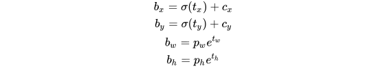
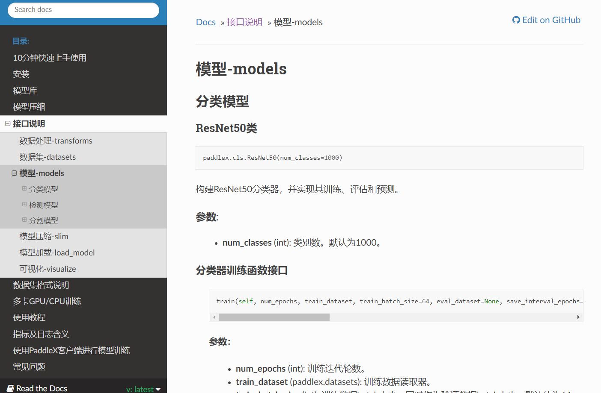
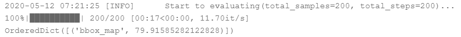

[TOC]
<!-- ref: https://aistudio.baidu.com/aistudio/projectdetail/464339
https://lab.datafountain.cn/forum?id=89
https://github.com/Sharpiless/paddlex-vehicle-detection-with-YOLOv3 -->
# 任务14：车辆检测

## 1.任务目标

- 了解车辆检测的基础知识，学会使用PaddleX目标检测模块训练自己的数据集。
- 学习使用Paddlex提高开发效率
- 使用PaddleX进行基于YOLOv3的车辆检测和车道线分割项目开发。

## 2.任务描述

该项目使用**PaddleX**提供的YOLOv3模型，在车辆检测数据集进行训练；并使用开源车道检测算法，实现了无人驾驶部分的视觉感知——车辆检测和车道线分割。


## 3.知识准备


<!-- ### 3.1车牌


- 车牌识别技术的现状
- 从上世纪90年代开始，车牌识别系统随着计算机性能的不断发展也在不断改进和优化，而现有的车牌识别研究成果主要集中在国外，国内的车牌具有汉字字符、颜色丰富、格式多样等复杂情况，加上起步比较晚，落后于国外，不过也有一定成果。
- As等人对图像中的车牌位置进行直方图统计，通过阈值以及模板匹配的方法，对提取的车牌图像来确定其对应的车牌字符并给出识别结果；Le等人提出来了一种基于彩色图像的神经网络车牌识别方法。英国Alphatec公司的图像部研制名为ARGUS的车牌自动识别系统，其可处理黑白或彩色图像，而其车牌识别时约为100毫秒，同时识别时车速可达每小时100里；新加坡有Optasi公司研制的VLPRS、香港有亚洲视觉公司的VECON系统以及加拿大、意大利、德国、日本等发达国家也都有适用本国的车牌识别系统。
- 而国内也有许多研究人取得了优秀的研究成果，这其中包括武汉大学的喻晓等人提出的基于颜色和纹理特征的机动车号牌定位算法；Lee等人提出了基于边缘信息和ANN的车牌提取方法；Shi等人提出的使用基于Radon变换的车牌识别方法；中国科学院自动化所的刘智勇等人的研究中，其车牌定位准确99.4%，切分准确率为92.5%；北京航空航天大学的胡爱明等利用模板匹配技术发了一种应用于收费站的车牌识别系统，其识别正确率能达到97%以上。此外，华南理工大学的骆雪超、刘桂雄等人提出了一种基于车牌特征值的二值化方法；清华大学的冯文毅等利用一种光电混合系统进行车牌识别，系统能够通过硬件来完成车牌识别的全过程；黄志斌等人将基于串行分类器的字符识别应用于车牌识别系统中，对车牌识别系统中的分类器进行了详细的研究。
- 国内的车牌识别系统基本上针对的是某一类车牌在特定场景下的识别，对于多类车牌的分析仍无法实现鲁棒性的实用，而且车牌的颜色随着场景变化和背景等复杂环境因素，对识别结果存在较大影响。


### 3.2车型

- 目前国内关于车型识别研究的主要有基于小波变换的车型识别[11]，秦等人提出的基于人工神经网络的方法[12]，基于SVM的三维车型识别方法[13]等几种方法；而目前国外关于车型识别研究的主要方向则有Collins等[14]开发的经过训练的神经网络来识别运动目标是车辆还是非车辆物体的系统，Tan等人[15]提出的一种有关车辆形态大小(小型汽车、中型轿车、大型卡车等)的检测方法，Ferryman等人[16]提出的建立可变形的三维模板用于识别各种车辆，威斯康辛大学的Bin等人为了达到定位并跟踪多个车辆的目的，通过研究车辆运行中的动态参数，提出了的基于视觉的检测算法。
- 上述国内外方法的优缺点如下：对于简单和低维车型特征的提取有比较明显的效果，对车型识别的研究和实现起到了突出作用，但对高维和复杂环境没有很好的处理和利用，只能从车辆图像从中提取到长、宽、高等简单信息，得到关于体积、大小等初级车型的识别和分类。


### 3.3车标记

- 目前对于车标的识别方面，普遍的做法是先对车标进行定位，然后进行识别。车标定位方面，主要分为直接定位或由粗到精定位两大类，其中主流的方法是由粗到精的定位，其主要利用一些先验信息辅助车标粗定位的实现[17]，如利用车牌与车标的相对位置关系，或利用车辆前视图的对称性等，其又主要包含四类定位技术：一种是先通过车牌的先验信息粗定位后基于对称性的车标定位[18; 19]，一种是基于能量特征的车标定位[20-22]，一种是基于Adaboost的车标定位[23]，还有一种是基于先验知识、模版匹配和边缘检测的由粗到精的车标定位方法[24]。
- 而车标识别包含车标特征提取、分类器构建两部分，识别效果常由采集图像中特征提取的有效性、充分性，分类识别的可靠性等决定，易受复杂背景环境如光照条件变化、车标模糊等的干扰，因而是车辆识别系统中的难点之一，也是本课题的研究重点。目前国内外成熟的车标识别技术主要有如下几种：一种是基于模板匹配的车标识别方法[25; 26]，一种是基于不变矩的车标识别方法[27]，一种是基于边缘直方图的车标识别方法[28]，一种是基于神经网络的车标识别方法[29; 30]。


### 3.3车颜色

- 目前，车身颜色识别作为智能交通的一个重要方向，当前在方向进行研究的成果还比较缺乏，产品上也没有特别出色的表现。而目前人们对车辆颜色的识别主要有两种途径：对车辆整体颜色进行识别，或者提取车辆感兴趣区域的颜色特征进行识别，其所涉及到的一些理论主要有K最邻近法、人工神经网络和支持向量机。
- Michelle在非均匀的RGB颜色空间中将车身颜色细化成15种颜色，采用K近邻算法进行颜色识别。但RGB颜色模型并不是人眼直观的颜色描述方法，仅仅通过欧式距离并不能准确地区分它们在色度上的差异；Wu等人首先通过目标分割获取车辆前景图像，然后进行联通区域分析删除车轮、反光镜等干扰区域得到车辆颜色明显的区域。在分类阶段，采用基于支持向量机的两层分类器成功将颜色分为黑、白、银、红、黄、绿、蓝等7种类型，但是对黑、银、绿3种颜色的分类正确率较低；李等人[20; 31]研究了多种颜色空间，采用识别效果最好的HIS颜色空间和标准色差公式，针对外界噪声和光照等因素的影响，对图像在HSI空间中进行色彩归一化处理。杨等人[32]将车身颜色分为9种，研究彩色图像去舞算法和颜色直方图特征，采用支持向量机算法进行颜色识别，但采用分类器的算法，制作样本比较繁琐，且识别的类别有局限。Fang等人[33]通过在HIS的3个通道中提取车颜色每个像素的微观特征值，定义了7种颜色的阈值范围与相互关系，最后借助BP神经网络将颜色分为7类。 -->

### 3.1 背景
随着我国汽车数量的快速增加，到目前为止已经突破1.72亿辆，而如此庞大的汽车数量势必带来一系列的道路交通安全问题。同时，随着交通卡口监控数据的不断增长，仅仅采集传统信息，例如车流量、车牌号码，已经不足以满足交通卡口的监控需求。而对车辆信息进行全方位、多维特征的信息采集，才可以快速对交通预警和交通疑似犯罪做出及时响应，才能够更高效地防控和维持社会稳定。

目前，汽车交通卡口系统对于车辆的识别和监控，一般采用传统的识别算法，结合通用电子图像处理手段，其对于在白天光照良好、可见度高的情形下能实现较好识别效果，能识别出车辆的车牌以及车型和颜色；但对于复杂环境条件下，如夜间复杂逆光高亮光、车辆与背景相似以及虚影、车辆视角不佳、恶劣雨雪天气等条件下的识别不能达到很好的识别效果，使得汽车卡口的监控识别带来一定影响。

目标检测是一种典型的计算机视觉问题，其关注的是图像中特定的物体目标，要求同时获得这一目标的类别信息和位置信息，即目标检测需要从背景中分离出感兴趣的目标，并确定这一目标的描述（类别和位置），因此检测模型的输出是一个列表，列表的每一项使用一个数组给出检出目标的类别和位置。

### 3.2 YOLO V3
yolo作为经典的目标检测算法之一，由于其推理速度快和无需专利授权即可商用的特点被广泛使用。

本次课程目的是让大家对yolo算法进行理解，并且实际使用yolo代码上通过训练一个车辆检测模型。最终掌握如何使用yolo算法解决车辆检测问题。为了适应最新的需求，我们这里从yolov3开始介绍算法细节来掌握yolo的基本内核。

backbone部分由Yolov2时期的Darknet-19进化至Darknet-53，加深了网络层数，引入了Resnet中的跨层加和操作。
<div align=center>
    
</div>

整个网络的计算流程：
<div align=center>
    
</div>

这里我们以$256 \times 256$的输入尺度说明

Yolov3借鉴了特征金字塔思想，类似于FPN小尺寸特征图用于检测大尺寸物体，而大尺寸特征图检测小尺寸物体
特征图的输出维度为 $\it{N} \times \it{N} \times (4+1+80) \times 4$ ， $\it{N} \times \it{N}$ 为输出特征图的尺度，默认一共有3个Anchor，每个anchor回归4个维度的坐标值 $t_x, t_y, t_w, t_h$​ ，1个维度的预测框置信度（表示这个框是前景还是背景），80维物体类别数（COCO数据集有80类）。所以最后用于检测的三个特征图的输出维度分别为 $8 \times 8 \times 256$, $16 \times 16 \times 256$ 和 $16 \times 16 \times 256$
Yolov3总共输出3个特征图，第一个特征图下采样32倍，第二个特征图下采样16倍，第三个下采样8倍。输入图像经过Darknet-53（无全连接层），再经过Yoloblock生成的特征图输入两个地方。第一个地方为经过33卷积层、11卷积之后生成特征图一，第二个地方为经过1*1卷积层加上采样层，与Darnet-53网络的中间层输出结果进行拼接，产生特征图二。同样的循环之后产生特征图三。 这个操作也类似FPN中融合不同尺度特征图的思路。

#### yolov3 中的坐标编码和解码(4+1+80 的具体解释)

yolov3沿用yolov2中采用anchor为基准来回归boxes的思路，首先通过k-means对数据集中的标签框进行聚类，得到类别中心点的9个框，作为先验框。在COCO数据集中（原始图片全部resize为416 × 416），九个框分别是 (10×13)，(16×30)，(33×23)，(30×61)，(62×45)，(59× 119)， (116 × 90)， (156 × 198)，(373 × 326) ，顺序为w × h

- 标注框基于anchor解码 （网络最后对每个anchor会预测与boxes坐标相关的4个维度$t_x, t_y, t_w, t_h$）

<div align=center>
    
</div>

如下图所示， $\sigma(t_x)$ 和 $\sigma(t_y)$ 是基于矩形框中心点左上角格点坐标的偏移量， $\sigma$ 是激活函数，论文中作者使用sigmoid。 $p_w$​ 和 $p_h$​ 是anchor的宽、高，通过上述公式，计算出实际预测框的宽高 $b_w$​ 和 $b_h$​ 。

<div align=center>
    
</div>

- 置信度解码 （网络最后对每个anchor会预测一个维度的置信度0-1之间）
置信度在输出85维中占固定一位，由sigmoid函数解码即可，解码之后数值区间在[0，1]之间，1表示前景，0表示背景

- 类别解码 三个特征图一共可以解码出 8 × 8 × 3 + 16 × 16 × 3 + 32 × 32 × 3 = 4032 个相对anchor的box以及相应的类别、置信度,然后通过阈值过滤和nms后处理得到最终结果。

#### 训练时正负样本的定义预测框一共分为三种情况：

正样本（positive）：
任取一个ground truth，与4032个anchor全部计算IOU，IOU最大的预测框，即为正例。并且一个anchor只能分配给一个ground truth。例如第一个ground truth已经匹配了一个正例anchor，那么下一个ground truth，就在余下的4031个anchor中，寻找IOU最大的anchor作为正例。ground truth的先后顺序可忽略。正例需要计算置信度loss、检测框loss、类别loss。预测框为对应的ground truth box标签基于其匹配的anchor进行编码后的结果（tx,ty,tw,tht_x, t_y, t_w, t_htx​,ty​,tw​,th​）；类别标签对应类别为1，其余为0（80维度，属于哪一类哪个维度就是1，其余是0）；置信度标签为1。
负样本（negative）：
正样本除外（与ground truth计算后IOU最大的anchor，但是IOU小于阈值，仍为正样本），与全部ground truth的IOU都小于阈值（0.5），则为负样本。负样本只有置信度产生loss，置信度标签为0。
忽略样本（ignore）
忽略样例：除正样本外，与任意一个ground truth的IOU大于阈值（论文中使用0.5），则为忽略样例。忽略样例不产生任何loss。

#### Loss
yolov3 的单个head的loss为：
<div align=center>
    
</div>

三个head的loss和为：
<div align=center>
    
</div>

其中$\lambda$为权重常数，控制检测框Loss、obj置信度Loss、noobj置信度Loss之间的比例，通常负例的个数是正例的几十倍以上，可以通过权重超参控制检测效果。
$\mathbf{1}_{ij}^{obj}$ 在正样本时正例则输出1，否则为0

$\mathbf{1}_{ij}^{noobj}$ 在负样本呢则输出1，否则为0
忽略样例都输出0
x、y、w、h使用MSE作为损失函数，也可以使用smooth L1 loss作为损失函数。smooth L1可以使训练更加平滑。置信度、类别标签由于是0，1二分类，所以使用交叉熵作为损失函数。


### 3.3 PaddleX工具简介：

<div align=center>
    
</div>

**PaddleX简介**：PaddleX是飞桨全流程开发工具，集飞桨核心框架、模型库、工具及组件等深度学习开发所需全部能力于一身，打通深度学习开发全流程，并提供简明易懂的Python API，方便用户根据实际生产需求进行直接调用或二次开发，为开发者提供飞桨全流程开发的最佳实践。目前，该工具代码已开源于GitHub，同时可访问PaddleX在线使用文档，快速查阅读使用教程和API文档说明。

**PaddleX代码GitHub链接**：https://github.com/PaddlePaddle/PaddleX/tree/develop

**PaddleX文档链接**：https://paddlex.readthedocs.io/zh_CN/latest/index.html

**PaddleX官网链接**：https://www.paddlepaddle.org.cn/paddle/paddlex

<div align=center>
    
</div>


## 4. 任务实施


### 4.1 实施思路

1. 安装PaddleX；
2. 设置工作环境；
3. 数据集简介；
4. 生成训练所需文件；
5. 设置图像数据预处理和数据增强模块；
6. 定义数据迭代器；
7. 定义YOLOv3模型并开始训练；
8. 评估模型性能；
9. 加载模型并用于测试；
10. 车道线分割模块；

### 4.2 实施步骤
#### 步骤1 环境配置：


##### 安装PaddleX库：

> pip install paddlex -i https://mirror.baidu.com/pypi/simple


```python
!pip install paddlex -i https://mirror.baidu.com/pypi/simple
```

##### 设置工作路径，并使用0号GPU卡


```python

import matplotlib
matplotlib.use('Agg') 
import os
os.environ['CUDA_VISIBLE_DEVICES'] = '0'
import paddlex as pdx

os.chdir('/home/aistudio/work/')
```

##### 数据集：

**数据集简介：**

数据集使用 voc2012 数据集，是一个具有挑战性的真实多目标检测和多目标跟踪基准。


#### 步骤2 数据集准备：

##### 生成所需文件：

这里的PaddleX同时支持VOC和COCO两种格式的数据；

需要的文件有：

1. labels.txt：保存目标类别的文件，不包括背景类；

<div align=center>
    
</div>

2. train_list.txt和val_list.txt：保存训练/测试所需的图片和标注文件的相对路径；

<!--  -->


```python
!unzip /home/aistudio/data/data34332/VOC2012.zip -d ./

imgs = os.listdir('./VOC2012/JPEGImages')
print('total:', len(imgs))

with open('./VOC2012/train_list.txt', 'w') as f:
    for im in imgs[:-200]:
        info = 'JPEGImages/'+im+' '
        info += 'Annotations/'+im[:-4]+'.xml\n'
        f.write(info)

with open('./VOC2012/val_list.txt', 'w') as f:
    for im in imgs[-200:]:
        info = 'JPEGImages/'+im+' '
        info += 'Annotations/'+im[:-4]+'.xml\n'
        f.write(info)
```

    total: 6000


##### 设置图像数据预处理和数据增强模块：

具体参数见：

[https://paddlex.readthedocs.io/zh_CN/latest/apis/transforms/det_transforms.html](https://paddlex.readthedocs.io/zh_CN/latest/apis/transforms/det_transforms.html)


```python

from paddlex.det import transforms
train_transforms = transforms.Compose([
    transforms.MixupImage(mixup_epoch=250),
    transforms.RandomDistort(),
    transforms.RandomExpand(),
    transforms.RandomCrop(),
    transforms.Resize(target_size=608, interp='RANDOM'),
    transforms.RandomHorizontalFlip(),
    transforms.Normalize(),
])

eval_transforms = transforms.Compose([
    transforms.Resize(target_size=608, interp='CUBIC'),
    transforms.Normalize(),
])
```

##### 定义数据迭代器：

参数

* **data_dir (str)**: 数据集所在的目录路径。

* **file_list (str)**: 描述数据集图片文件和对应标注文件的文件路径（文本内每行路径为相对data_dir的相对路径）。

* **label_list (str)**: 描述数据集包含的类别信息文件路径。

* **transforms (paddlex.det.transforms)**: 数据集中每个样本的预处理/增强算子，详见paddlex.det.transforms。

* **num_workers (int|str)**：数据集中样本在预处理过程中的线程或进程数。默认为’auto’。当设为’auto’时，根据系统的实际CPU核数设置num_workers: 如果CPU核数的一半大于8，则num_workers为8，否则为CPU核数的一半。

* **buffer_size (int)**: 数据集中样本在预处理过程中队列的缓存长度，以样本数为单位。默认为100。

* **parallel_method (str)**: 数据集中样本在预处理过程中并行处理的方式，支持’thread’线程和’process’进程两种方式。默认为’thread’（Windows和Mac下会强制使用thread，该参数无效）。

* **shuffle (bool)**: 是否需要对数据集中样本打乱顺序。默认为False。


```python
base = './VOC2012/'

train_dataset = pdx.datasets.VOCDetection(
    data_dir=base,
    file_list=base+'train_list.txt',
    label_list='labels.txt',
    transforms=train_transforms,
    shuffle=True)
eval_dataset = pdx.datasets.VOCDetection(
    data_dir=base,
    file_list=base+'val_list.txt',
    label_list='labels.txt',
    transforms=eval_transforms)
```

    2020-05-12 00:11:34 [INFO]	Starting to read file list from dataset...
    2020-05-12 00:11:35 [INFO]	5800 samples in file ./VOC2012/train_list.txt
    creating index...
    index created!
    2020-05-12 00:11:35 [INFO]	Starting to read file list from dataset...
    2020-05-12 00:11:35 [INFO]	200 samples in file ./VOC2012/val_list.txt
    creating index...
    index created!


#### 步骤3：

##### 定义YOLOv3模型并开始训练：

YOLOv3参数说明：

* **num_classes (int)**: 类别数。默认为80。
* **backbone (str)**: YOLOv3的backbone网络，取值范围为[‘DarkNet53’, ‘ResNet34’, ‘MobileNetV1’, ‘MobileNetV3_large’]。默认为’MobileNetV1’。
* **anchors (list|tuple)**: anchor框的宽度和高度，为None时表示使用默认值 [[10, 13], [16, 30], [33, 23], [30, 61], [62, 45], [59, 119], [116, 90], [156, 198], [373, 326]]。
* **anchor_masks (list|tuple)**: 在计算YOLOv3损失时，使用anchor的mask索引，为None时表示使用默认值 [[6, 7, 8], [3, 4, 5], [0, 1, 2]]。
* **ignore_threshold (float)**: 在计算YOLOv3损失时，IoU大于ignore_threshold的预测框的置信度被忽略。默认为0.7。
* **nms_score_threshold (float)**: 检测框的置信度得分阈值，置信度得分低于阈值的框应该被忽略。默认为0.01。
* **nms_topk (int)**: 进行NMS时，根据置信度保留的最大检测框数。默认为1000。
* **nms_keep_topk (int)**: 进行NMS后，每个图像要保留的总检测框数。默认为100。
* **nms_iou_threshold (float)**: 进行NMS时，用于剔除检测框IOU的阈值。默认为0.45。
* **label_smooth (bool)**: 是否使用label smooth。默认值为False。
* **train_random_shapes (list|tuple)**: 训练时从列表中随机选择图像大小。默认值为[320, 352, 384, 416, 448, 480, 512, 544, 576, 608]。

##### 通过K-means获取anchors大小：


```python
## 使用ET模块解析xml标注文件

import xml.etree.ElementTree as ET
import numpy as np

tar_size = 608

def load_one_info(name):

    filename = os.path.join(base, 'Annotations', name)

    tree = ET.parse(filename)
    size = tree.find('size')
    width = float(size.find('width').text)
    height = float(size.find('height').text)
    ratio = min(tar_size / width, tar_size / height)

    Objects = tree.findall('object')
    objs_num = len(Objects)
    Boxes = np.zeros((objs_num, 4), dtype=np.float32)
    True_classes = np.zeros((objs_num), dtype=np.float32)
    
    result = []
    for i, obj in enumerate(Objects):

        bbox = obj.find('bndbox')

        x_min = float(bbox.find('xmin').text) - 1
        y_min = float(bbox.find('ymin').text) - 1
        x_max = float(bbox.find('xmax').text) - 1
        y_max = float(bbox.find('ymax').text) - 1

        w = ratio * (x_max - x_min)
        h = ratio * (y_max - y_min)
        result.append([w, h])

    return result
```


```python
def iou(box, clusters):

    x = np.minimum(clusters[:, 0], box[0])
    y = np.minimum(clusters[:, 1], box[1])
    if np.count_nonzero(x == 0) > 0 or np.count_nonzero(y == 0) > 0:
        return 0
        raise ValueError("Box has no area")

    intersection = x * y
    box_area = box[0] * box[1]
    cluster_area = clusters[:, 0] * clusters[:, 1]

    iou_ = np.true_divide(intersection, box_area +
                          cluster_area - intersection + 1e-10)
    # iou_ = intersection / (box_area + cluster_area - intersection + 1e-10)

    return iou_


def avg_iou(boxes, clusters):

    return np.mean([np.max(iou(boxes[i], clusters)) for i in range(boxes.shape[0])])


def translate_boxes(boxes):

    new_boxes = boxes.copy()
    for row in range(new_boxes.shape[0]):
        new_boxes[row][2] = np.abs(new_boxes[row][2] - new_boxes[row][0])
        new_boxes[row][3] = np.abs(new_boxes[row][3] - new_boxes[row][1])
    return np.delete(new_boxes, [0, 1], axis=1)


def kmeans(boxes, k, dist=np.median):

    rows = boxes.shape[0]

    distances = np.empty((rows, k))
    last_clusters = np.zeros((rows,))

    np.random.seed()

    # the Forgy method will fail if the whole array contains the same rows
    clusters = boxes[np.random.choice(rows, k, replace=False)]

    while True:
        for row in range(rows):
            distances[row] = 1 - iou(boxes[row], clusters)

        nearest_clusters = np.argmin(distances, axis=1)

        if (last_clusters == nearest_clusters).all():
            break

        for cluster in range(k):
            clusters[cluster] = dist(
                boxes[nearest_clusters == cluster], axis=0)

        last_clusters = nearest_clusters

    return clusters


def get_kmeans(anno, cluster_num=9):

    anchors = kmeans(anno, cluster_num)
    ave_iou = avg_iou(anno, anchors)

    anchors = anchors.astype('int').tolist()

    anchors = sorted(anchors, key=lambda x: x[0] * x[1])

    return anchors, ave_iou
```

##### 计算合适的anchor大小：


```python
result = []
for name in os.listdir(os.path.join(base, 'Annotations')):  
    result.extend(load_one_info(name))

result = np.array(result)
anchors, ave_iou = get_kmeans(result, 9)

anchor_string = ''
anchor_sizes = []
for anchor in anchors:
    anchor_string += '{},{}, '.format(anchor[0], anchor[1])
    anchor_sizes.append([anchor[0], anchor[1]])
anchor_string = anchor_string[:-2]

print('anchors are:')
print(anchor_string)
print('the average iou is:')
print(ave_iou)

```

    anchors are:
    13,11, 17,15, 23,17, 29,23, 41,29, 68,33, 51,46, 93,57, 135,95
    the average iou is:
    0.7711987971699223


##### 开始训练：


```python
num_classes = len(train_dataset.labels)
print('class num:', num_classes)
model = pdx.det.YOLOv3(num_classes=num_classes, backbone='DarkNet53', anchors=anchor_sizes)
model.train(
    num_epochs=50,
    train_dataset=train_dataset,
    train_batch_size=4,
    eval_dataset=eval_dataset,
    learning_rate=0.00025,
    lr_decay_epochs=[20, 40],
    save_interval_epochs=2,
    log_interval_steps=100,
    save_dir='./yolov3_darknet53',
    # pretrain_weights='./yolov3_darknet53/best_model',
    pretrain_weights='IMAGENET',
    use_vdl=True)


```


#### 步骤4 评估模型：

<!-- # 8. 评估模型： -->

使用 evaluate 方法进行模型评估；

最终mAP为0.79左右；

<div align=center>
    
</div>


```python
model.evaluate(eval_dataset, batch_size=1, epoch_id=None, metric=None, return_details=False)
```

    2020-05-12 07:21:25 [INFO]	Start to evaluating(total_samples=200, total_steps=200)...

    100%|██████████| 200/200 [00:17<00:00, 11.70it/s]

    OrderedDict([('bbox_map', 79.91585282122828)])


#### 步骤5 加载模型用于测试：

<!-- # 9.  -->

<div align=center>
    
</div>

```python
import cv2
import time
import matplotlib.pyplot as plt
%matplotlib inline

image_name = './test6.jpg'
start = time.time()
result = model.predict(image_name, eval_transforms)
# pdx.det.visualize(image_name, result, threshold=0.5, save_dir='./output/')
print('infer time:{:.6f}s'.format(time.time()-start))
print('detected num:', len(result))

im = cv2.imread(image_name)
font = cv2.FONT_HERSHEY_SIMPLEX
threshold = 0.5

for value in result:
    xmin, ymin, w, h = np.array(value['bbox']).astype(np.int)
    cls = value['category']
    score = value['score']
    if score < threshold:
        continue
    cv2.rectangle(im, (xmin, ymin), (xmin+w, ymin+h), (0, 255, 0), 4)
    cv2.putText(im, '{:s} {:.3f}'.format(cls, score),
                    (xmin, ymin), font, 0.5, (255, 0, 0), thickness=2)

cv2.imwrite('result.jpg', im)
plt.figure(figsize=(15,12))
plt.imshow(im[:, :, [2,1,0]])
plt.show()
```

    infer time:0.091151s
    detected num: 5


#### 步骤6 定义车道线检测模型：

<!-- # 10.  -->

这里使用了开源的项目：

[https://github.com/Sharpiless/advanced_lane_detection](https://github.com/Sharpiless/advanced_lane_detection)

该车道检测算法流程为：

* 给定一组棋盘图像（在camera_cal文件夹内），计算相机校准矩阵和失真系数。

<div align=center>
    
</div>


* 根据校准矩阵和失真系数对原始图像应用失真校正。

* 使用颜色变换，渐变等创建阈值二进制图像。
<div align=center>
    
</div>


* 应用透视变换以校正二进制图像（“鸟瞰”）。

<div align=center>
    
</div>


* 检测图像中车道像素并拟合，以找到车道边界。

<div align=center>
    
</div>


* 将检测到的车道边界矫正到原始图像。

<div align=center>
    
</div>

```python
import pickle, glob, os
import matplotlib.image as mpimg
import tools


from moviepy.editor import VideoFileClip
from IPython.display import HTML
```


```python
class GlobalObjects:

    def __init__(self):
        self.__set_folders()
        self.__set_hyper_parameters()
        self.__set_perspective()
        self.__set_kernels()
        self.__set_mask_regions()

    def __set_folders(self):
        # Use one slash for paths.
        self.camera_cal_folder = 'camera_cal/'
        self.test_images = glob.glob('test_images/*.jpg')
        self.output_image_path = 'output_images/test_'
        self.output_movie_path = 'output_movies/done_'


    def __set_hyper_parameters(self):
        self.img_size   = (1280, 720) # (x,y) values for img size (cv2 uses this)
        self.img_shape  = (self.img_size[1], self.img_size[0]) # (y,x) As numpy spits out
        return

    def __set_kernels(self):
        """Kernels used for image processing"""
        self.clahe = cv2.createCLAHE(clipLimit=2.0, tileGridSize=(8,8))


    def __set_perspective(self):
        """The src points draw a persepective trapezoid, the dst points draw
        them as a square.  M transforms x,y from trapezoid to square for
        a birds-eye view.  M_inv does the inverse.
        """

        src = np.float32([[(.42 * self.img_shape[1],.65 * self.img_shape[0] ),
                           (.58 * self.img_shape[1], .65 * self.img_shape[0]),
                           (0 * self.img_shape[1],self.img_shape[0]),
                           (1 * self.img_shape[1], self.img_shape[0])]])

        dst = np.float32([[0,0],
                          [self.img_shape[1],0],
                          [0,self.img_shape[0]],
                          [self.img_shape[1],self.img_shape[0]]])

        self.M = cv2.getPerspectiveTransform(src, dst)
        self.M_inv = cv2.getPerspectiveTransform(dst, src)

    def __set_mask_regions(self):
        """These are verticies used for clipping the image.
        """
        self.bottom_clip = np.int32(np.int32([[[60,0], [1179,0], [1179,650], [60,650]]]))
        self.roi_clip =  np.int32(np.int32([[[640, 425], [1179,550], [979,719],
                              [299,719], [100, 550], [640, 425]]]))
```


```python
class LaneFinder(object):
    """
    The mighty LaneFinder takes in a video from the front camera of a self driving car
    and produces a new video with the traffic lanes highlighted and statistics about where
    the car is relative to the center of the lane shown.
    """    
    
    def __init__(self):

        self.g             = GlobalObjects()        
        self.thresholder   = tools.ImageThresholder()
        self.distCorrector = tools.DistortionCorrector(self.g.camera_cal_folder)
        self.histFitter    = tools.HistogramLineFitter()
        self.laneDrawer    = tools.LaneDrawer()
        self.leftLane      = tools.Line()
        self.rightLane     = tools.Line()

        return

    def __image_pipeline(self, img):
        """The pipeline for processing images. Globals g are added to functions that need
        access to global variables.
        """
        resized     = self.__resize_image(img)
        undistorted = self.__correct_distortion(resized)
        warped      = self.__warp_image_to_biv(undistorted)
        thresholded = self.__threshold_image(warped)
        lines       = self.__get_lane_lines(thresholded)
        result      = self.__draw_lane_lines(undistorted, thresholded, include_stats=False)

        return result


    def __draw_lane_lines(self, undistorted, thresholded, include_stats):

        lines = {'left_line': self.leftLane,
                 'right_line': self.rightLane }

        return self.laneDrawer.draw_lanes(undistorted,
                                          thresholded,
                                          lines,
                                          self.g.M_inv,
                                          include_stats)

    def __get_lane_lines(self, img):

        self.leftLane    = self.histFitter.get_line(img, self.leftLane, 'left')
        self.rightLane   = self.histFitter.get_line(img, self.rightLane, 'right')

        return True

    def __mask_region(self, img, vertices):
        """
        Masks a region specified by clockwise vertices.
        """

        mask = np.zeros_like(img)   
        if len(img.shape) > 2:
            channel_count = img.shape[2]  # i.e. 3 or 4 depending on your image
            ignore_mask_color = (255,) * channel_count
        else:
            ignore_mask_color = 255
        cv2.fillConvexPoly(mask, vertices, ignore_mask_color)
        masked_image = cv2.bitwise_and(img, mask)
        return masked_image 

    def __resize_image(self, img):
        """
        Image is resized to the selected size for the project.
        """
        return cv2.resize(img, self.g.img_size, 
                          interpolation = cv2.INTER_CUBIC)

    def __correct_distortion(self, img):
        return self.distCorrector.undistort(img)

    def __threshold_image(self, img):
        return self.thresholder.get_thresholded_image(img)

    def __warp_image_to_biv(self, img):
        return cv2.warpPerspective(img, self.g.M, self.g.img_size)


    def test_one_image(self, pt):
        image = (mpimg.imread(pt))
        return self.__image_pipeline(image)

```

##### 最终效果：


```python
obj = LaneFinder()
result = obj.test_one_image('./result.jpg')
print(type(result), result.shape)

plt.figure(figsize=(15,12))
plt.imshow(result)
plt.show()
```

    Loading saved calibration file...
    <class 'numpy.ndarray'> (720, 1280, 3)


## 5.任务拓展
### 5.1 优化思路和方法
- 数据
    - 加入其他的数据增强方法：左右翻转、上下翻转、对比度变换等


- 模型
    - 调整候选框的产生数量
    - 调整正负样本比例
    - 调整 IOU 的阈值
    - 采用 Soft NMS 取代 普通的 NMS
    - 根据飞机外形特征，调整生成 anchor 的长宽比


## 6. 任务实训
1. 下列哪个是YOLOv4模型中的 Backbone？ 【分值：20】
   A. SSP
   B. PAN
   C. CSPDarknet53
   D. YOLOv3
2. YOLOv3算法在训练时样本中的预测框可分为哪几类？ 【分值：20】
   A. 正样本
   B. 负样本
   C. 不确定样本
   D. 忽略样本
   E. 未知样本
3. YOLOv3借鉴了特征金字塔思想，类似于FPN小尺寸特征图用于检测大尺寸物体，而大尺寸特征图检测小尺寸物体。 【分值：20】
4. 每个预测框的置信度用于区分其属于前景还是背景。 【分值：20】
5. YOLOv3中采用了哪种算法对数据集中的标签框进行聚类？ 【分值：20】
6. 请简述 YOLOv4 中提出的 mosaic 增强法。 【分值：0】


