[TOC]

# 任务15：图像风格迁移
<!-- 基于能量分割的多模态风格迁移 -->
## 1.任务目标

- 学习理解图像风格迁移的概念和理论
- 了解图像风格迁移领域常用数据集
- 掌握图像风格迁移领域的衡量标准以及损失函数
- 学会使用相关的图像风格迁移算法

<!-- - https://blog.csdn.net/aaronjny/article/details/79681080
- https://jingyan.baidu.com/article/e52e36157529f840c70c5149.html
- http://qsy.fengniao.com/533/5337515.html
- https://apps.apple.com/cn/app/prisma-photo-editor/id1122649984?l=en -->

## 2.任务描述

### 2.1 纹理合成

纹理合成与特征重构是神经风格迁移的重要组成部分。

纹理合成是一个计算机图形学的经典问题，即通过给定的纹理输入图块来构建出具有相同纹理的自定义大小图像。

<div align=center>
    <!--  -->
    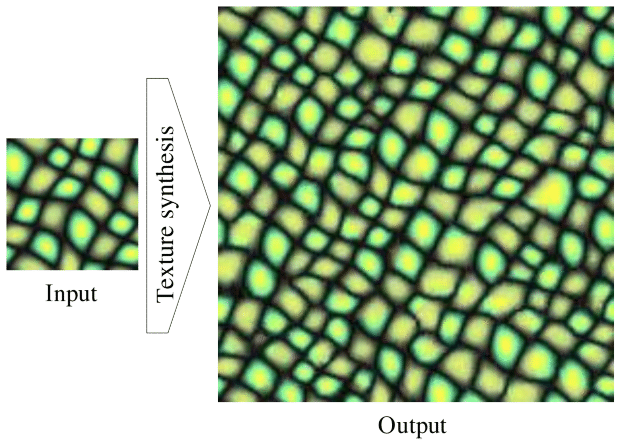
</div>

传统的方法只能够对简单的纹理进行合成，对于一些复杂程度较高的纹理（如石头堆，草丛等）的合成结果往往不如人意。2015年Gatys提出了利用卷积神经网络的特征来进行纹理合成，进而将这个经典的问题转化为一个梯度上升的过程。

<div align=center>
    <!--  -->
    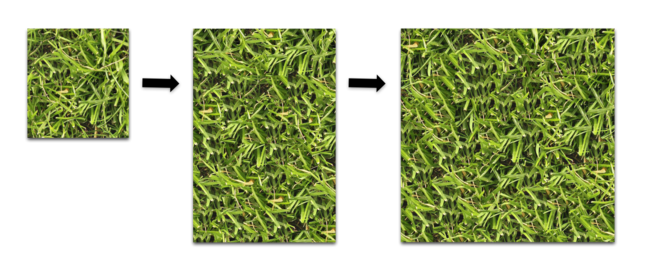
</div>


### 2.2 特征反演

特征反演是一种对卷积神经网络内部进行可视化的手段，其主要思想为对输入图像提取卷积神经网络某一层的特征值，然后根据该特征值来重构输入图像。

<div align=center>
    <!--  -->
    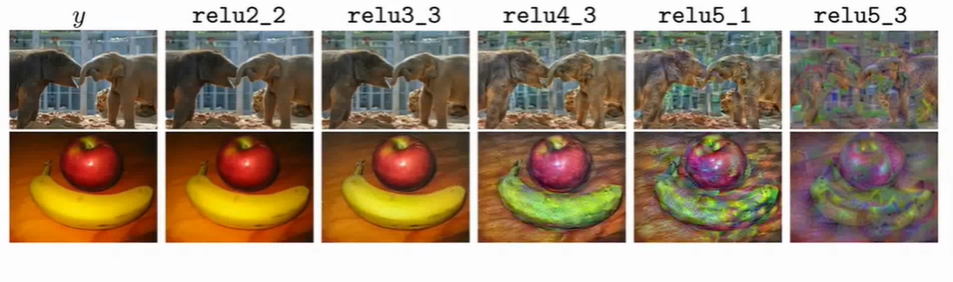
</div>

在图中能够看出，深层的卷积层只会记录下图像的一般空间结构而丢弃了低层次的细节。

### 2.3 神经风格迁移

神经风格迁移是将一幅图片的内容和另一幅艺术图片的风格结合，生成一张艺术化的图片的过程。 输入是一张内容图和一张风格图，输出是风格化的结果。

<div align=center>
    <!--  -->
    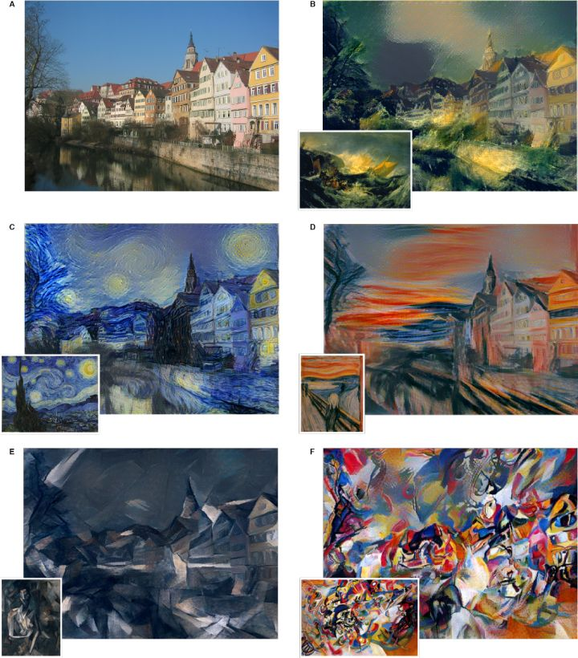
</div>

更本质上看，神经风格迁移便是将纹理合成与特征反演相结合的一种算法。内容图通过卷积神经网络记录下图像的一般空间结构，并以此作为纹理合成的初始输入图像进行训练，使其能够得到风格图的风格结果。

## 3.知识准备

本任务算法基于 CVPR2019-Multimodal Style Transfer via Graph Cuts。为了更好地实施任务，我们首先要掌握以下几点内容。

### 3.1 K-means聚类


KMeans算法通过尝试将样本分成n个方差相等的组，最小化一个被称为惯性或簇内平方和的准则来对数据进行聚类。这种算法需要指定聚类的数量。它可以很好地扩展到大量的样本，并已被用于许多不同领域的大量应用领域。

k-means算法将一组N个样本X划分为K个不相干的聚类，每个聚类由聚类中样本的平均值$\mu_{j}$描述。这些平均值通常被称为群集的 "中心点"；注意，它们一般不是来自X的点，尽管它们生活在同一个空间。

K-means算法的目的是选择能使惯性最小化的中心点，或者说是集群内的平方和标准。

$$\sum_{i=0}^{n} \min _{\mu j \in C}\left(\left\|x_{i}-\mu_{j}\right\|^{2}\right)$$

其中惯性可以被认为是对集群内部一致性程度的衡量。

- K-means的缺点有:

  - 惯性做出的假设是集群是凸的和各向同性的，但事实并非总是如此。因此它对拉长的集群或形状不规则的表层反应较差。
  - 惯性不是一个归一化的度量：在非常高维的空间中，欧氏距离往往会变得膨胀（这是所谓的 "维度诅咒 "）。在k-means聚类之前运行主成分分析（PCA）等降维算法可以缓解这个问题，加快计算速度。

<div align=center>
    <!--  -->
    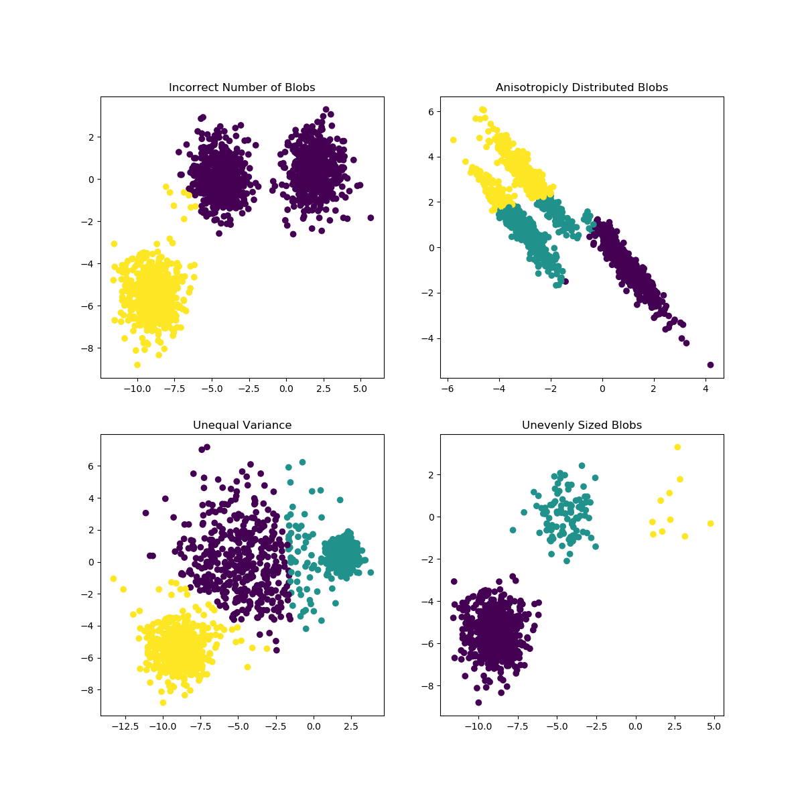
</div>

### 3.2 特征可视化手段

#### 3.2.1 PCA
PCA用于将一个多变量数据集分解为一组连续的正交分量，这些分量能够解释最大的方差。

在scikit-learn中，PCA被实现为一个变换器对象，在其拟合方法中学习n个分量，并可用于新数据，将其投射到这些分量上。

#### 3.2.2  t-SNE
t-SNE(TSNE)将数据点的亲和力转换为概率。原始空间中的亲和力用高斯联合概率表示，嵌入空间中的亲和力用学生的t分布表示。

与现有技术相比，t-SNE的优势有:

- 在一张地图上揭示多种尺度的结构。

- 揭示位于多个、不同的表层或簇中的数据。

- 减少中心点挤在一起的倾向。

### 3.3 基于VGG19的特征提取方法
VGG19是Google DeepMind发表在ICLR 2015上的论文《VERY DEEP CONVOLUTIONAL NETWORK SFOR LARGE-SCALE IMAGE RECOGNITION》中提出的一种DCNN结构。

众所周知，CNN在图片处理上表现良好，VGG19提出后，也被用在图像处理上。我这里要用到的VGG19模型就是在imagenet数据集上预训练的模型。

一般认为，深度卷积神经网络的训练是对数据集特征的一步步抽取的过程，从简单的特征，到复杂的特征。

训练好的模型学习到的是对图像特征的抽取方法，所以在imagenet数据集上训练好的模型理论上来说，也可以直接用于抽取其他图像的特征，这也是迁移学习的基础。自然，这样的效果往往没有在新数据上重新训练的效果好，但能够节省大量的训练时间，在特定情况下非常有用。

相信在先前的学习中同学们也对VGG的相关网络结构有一定的了解，这里我也不多加陈述了。

### 3.4 图像的风格表示
近年来，关于图像风格提取的方法有较多，其中较为先进的有基于Adaptive Instance Normalization（Adain）论文中均值和方差的方法，基于格拉姆矩阵（gram matrix）的方法以及基于多模态的风格提取方法（Multimodal style representation，MST）。

Adain该论文在CIN的基础上做了一个改进，提出自适应Instance Normalization层。在该归一化层中，能够实现根据风格图像调整缩放和平移参数，不在需要像CIN在训练过程中保存风格特征的均值和方差，而是在将风格图像经过神经网络后计算出均值和方差。

Gram matrix是如何能够定义图像风格的呢，当采用譬如VGG16或者VGG19这类的网络进行对图像进行特征提取后，提取得到的特征图里面每个像素值相当于是原图像对应的特性大小，而Gram矩阵的计算方式是矩阵的内积运算，通过运算后，原来特征图中较大的数字也会变得更大，从这个角度理解，每张图像的风格信息都会相应的扩大或缩小，使得风格更加突出，也就相当于提取到了图片的风格。

MST论文作者认为gram matrix或mean/var全局单模态的统计表示是单调而且较微弱的，它们并不足够充分地对一张特征图丰富和多模态的特征表示。对于一张图像，它立项的风格特征空间表示应该是空间多维分布的特征模式。以下，我们将结合可视化，将图片进行降维并通过t-SNE聚类可视化。

在下面公式中，单张图像的特征将采用多模态的方法进行表示，将其分割划分到多个子集中实现在高维空间中的模态聚类，并在高维度的特征空间中用譬如是K均值聚类的方法对相应的特征点进行分割：

$$F_{s}=F_{s}^{l_{1}} \cup F_{s}^{l_{2}} \cdots \cup F_{s}^{l_{k}} \cup \cdots F_{s}^{l_{K}}$$

特征 被分解成多个子特征，每个特征都有自己的特征标签 。从图3.6中可以看出，特征空间被降维到三维空间，在这特定的三维空间中，邻近的点是能够拥有相同视觉特征的。先前单一模式的特征，能够通过这种方式分解到多个子空间中，得到这些子空间的特征，也能够进一步将其按照图匹配的方法进行进一步的风格提取或是迁移的工作。

<div align=center>
    <!--  -->
    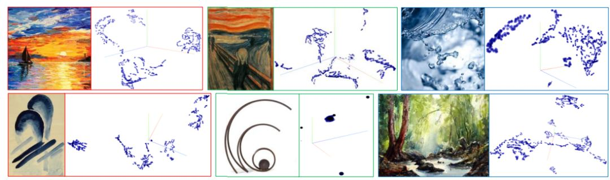
</div>


## 4. 任务实施（降维可视化可选，传统算法实现，训练代码实现，测试代码实现）
基于任务描述与知识准备的内容，我们已经掌握了本课程所需的大部分前置知识，现在让我们回归本课程的多模态风格迁移，利用wikiart的开源数据集实现我们自己的风格迁移算法。

<div align=center>
    <!--  -->
    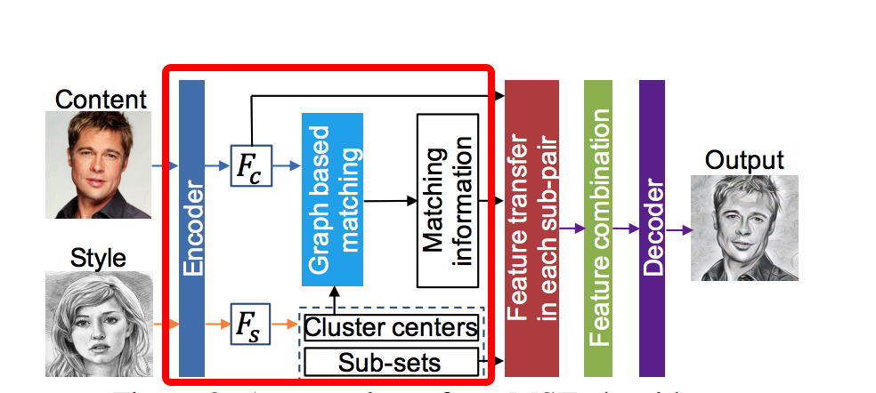
</div>


值得注意的是，红框这里是预训练好的vgg网络，对于整个模型而言，真正需要训练的是Decoder。

### 4.1 实施思路

1. 数据集准备
2. PreprocessDataset类构建
3. 网络的decoder构建
4. 网络的encoder构建
5. 风格转换器构建
6. 训练模型类构建
7. 网络训练

### 4.2 实施步骤
#### 步骤1：

- 对于风格图像的数据集，我们采用的是Kaggle中的Art Images数据集，其中包含了四种风格的大量艺术图像。
- 对于目标图片的数据集，我们可以采用coco开源数据集。

#### 步骤2：

首先我们将对数据集进行处理，并将目标图像和风格图像匹配打包，以便后续处理。

``` python
import os
import glob
import numpy as np
from tqdm import tqdm
import torch
from torch.utils.data import Dataset
from torchvision import transforms
from skimage import io, transform
from PIL import Image
import cv2


#随机裁剪+转换为张量
trans = transforms.Compose([transforms.RandomCrop(96),
                            transforms.ToTensor()])

#数据预处理类
class PreprocessDataset(Dataset):
    def __init__(self, content_dir, style_dir, transforms=trans):
        """初始化"""

        #获得路径数组并进行打乱
        content_images = glob.glob((content_dir + '/*'))
        np.random.shuffle(content_images)
        style_images = glob.glob(style_dir + '/*')
        np.random.shuffle(style_images)       
        
        # style_images = glob.glob(style_dir_resized + '/*')
        
        #将目标图像和风格图像一一匹配打包
        self.images_pairs = list(zip(content_images, style_images))
        self.transforms = transforms

    #定义为静态方法
    @staticmethod
    def _resize(source_dir, target_dir):
        """修改图像大小"""
        print(f'Start resizing {source_dir} ')
        for i in tqdm(os.listdir(source_dir)):
            filename = os.path.basename(i)
            try:
                image = io.imread(os.path.join(source_dir, i))
                
                #判断图像形状，记录图像进行等比例缩放后的大小
                if len(image.shape) == 3 and image.shape[-1] == 3:
                    H, W, _ = image.shape
                    if H < W:
                        ratio = W / H
                        H = 512
                        W = int(ratio * H)
                    else:
                        ratio = H / W
                        W = 512
                        H = int(ratio * W)
                    
                    #改变图像的尺寸并保存照片
                    image = transform.resize(image, (H, W), mode='reflect', anti_aliasing=True)
                    io.imsave(os.path.join(target_dir, filename), image)
            #出错时跳过
            except:
                continue

    def __len__(self):
        """返回图像对的数目"""
        return len(self.images_pairs)

    def __getitem__(self, index):
        """返回指定索引图像对"""
        content_image, style_image = self.images_pairs[index]

        #打开图片并转换为RGB格式
        content_image = Image.open(content_image)
        content_image = content_image.convert('RGB')
        style_image = Image.open(style_image)
        style_image = style_image.convert('RGB')
        
        #如果定义了图像转换配置则进行处理
        if self.transforms:
            content_image = self.transforms(content_image)
            style_image = self.transforms(style_image)
        return content_image, style_image


```

#### 步骤3：

Decoder是本任务算法中唯一需要进行训练的部分，为了减少误差，我们按照Encoder的结构（即VGG）来构造Decoder。

值得注意的是，我们在Decoder中使用了边界反射插值处理，相比于零填充处理，这样能够使得模型能够更容易训练。

``` python
import copy
import torch
import torch.nn as nn
import torch.nn.functional as F


class Interpolate(nn.Module):
    """插值处理"""
    def __init__(self, scale_factor=2):
        """初始化，scale_factor为比例系数"""
        super().__init__()
        self.scale_factor = scale_factor

    def forward(self, x):
        """在forward阶段时该层的处理方式"""
        x = F.interpolate(x, scale_factor=self.scale_factor)
        return x

#构建Decoder
vgg_decoder_relu5_1 = nn.Sequential(
    #使用输入边界的反射来填充输入tensor
    nn.ReflectionPad2d((1, 1, 1, 1)),
    nn.Conv2d(512, 512, 3),
    nn.ReLU(),
    Interpolate(2),
    nn.ReflectionPad2d((1, 1, 1, 1)),
    nn.Conv2d(512, 512, 3),
    nn.ReLU(),
    nn.ReflectionPad2d((1, 1, 1, 1)),
    nn.Conv2d(512, 512, 3),
    nn.ReLU(),
    nn.ReflectionPad2d((1, 1, 1, 1)),
    nn.Conv2d(512, 512, 3),
    nn.ReLU(),
    nn.ReflectionPad2d((1, 1, 1, 1)),
    nn.Conv2d(512, 256, 3),
    nn.ReLU(),
    Interpolate(2),
    nn.ReflectionPad2d((1, 1, 1, 1)),
    nn.Conv2d(256, 256, 3),
    nn.ReLU(),
    nn.ReflectionPad2d((1, 1, 1, 1)),
    nn.Conv2d(256, 256, 3),
    nn.ReLU(),
    nn.ReflectionPad2d((1, 1, 1, 1)),
    nn.Conv2d(256, 256, 3),
    nn.ReLU(),
    nn.ReflectionPad2d((1, 1, 1, 1)),
    nn.Conv2d(256, 128, 3),
    nn.ReLU(),
    Interpolate(2),
    nn.ReflectionPad2d((1, 1, 1, 1)),
    nn.Conv2d(128, 128, 3),
    nn.ReLU(),
    nn.ReflectionPad2d((1, 1, 1, 1)),
    nn.Conv2d(128, 64, 3),
    nn.ReLU(),
    Interpolate(2),
    nn.ReflectionPad2d((1, 1, 1, 1)),
    nn.Conv2d(64, 64, 3),
    nn.ReLU(),
    nn.ReflectionPad2d((1, 1, 1, 1)),
    nn.Conv2d(64, 3, 3)
    )


class Decoder(nn.Module):
    """解码器"""
    def __init__(self, level, pretrained_path=None):
        """初始化"""
        super().__init__()
        
        #根据不同的level来截取神经网络
        if level == 1:
            self.net = nn.Sequential(*copy.deepcopy(list(vgg_decoder_relu5_1.children())[-2:]))
        elif level == 2:
            self.net = nn.Sequential(*copy.deepcopy(list(vgg_decoder_relu5_1.children())[-9:]))
        elif level == 3:
            self.net = nn.Sequential(*copy.deepcopy(list(vgg_decoder_relu5_1.children())[-16:]))
        elif level == 4:
            self.net = nn.Sequential(*copy.deepcopy(list(vgg_decoder_relu5_1.children())[-29:]))
        elif level == 5:
            self.net = nn.Sequential(*copy.deepcopy(list(vgg_decoder_relu5_1.children())))
        else:
            raise ValueError('level should be between 1~5')
            
        #如果有路径，则加载模型
        if pretrained_path is not None:
            self.net.load_state_dict(torch.load(pretrained_path, map_location=lambda storage, loc: storage))

    def forward(self, x):
        """定义forward方式"""
        return self.net(x)
```

#### 步骤4：

为了后续更方便构建Encoder，我们首先先定义一个无顶层的VGG网络，同时将其封装成类以方便后续调用。

``` python
import torch
import torch.nn as nn

#定义一个无顶层VGG网络
normalised_vgg_relu5_1 = nn.Sequential(
        nn.Conv2d(3, 3, 1),
        nn.ReflectionPad2d((1, 1, 1, 1)),
        nn.Conv2d(3, 64, 3),
        nn.ReLU(),
        nn.ReflectionPad2d((1, 1, 1, 1)),
        nn.Conv2d(64, 64, 3),
        nn.ReLU(),
        nn.MaxPool2d(2, ceil_mode=True),
        nn.ReflectionPad2d((1, 1, 1, 1)),
        nn.Conv2d(64, 128, 3),
        nn.ReLU(),
        nn.ReflectionPad2d((1, 1, 1, 1)),
        nn.Conv2d(128, 128, 3),
        nn.ReLU(),
        nn.MaxPool2d(2, ceil_mode=True),
        nn.ReflectionPad2d((1, 1, 1, 1)),
        nn.Conv2d(128, 256, 3),
        nn.ReLU(),
        nn.ReflectionPad2d((1, 1, 1, 1)),
        nn.Conv2d(256, 256, 3),
        nn.ReLU(),
        nn.ReflectionPad2d((1, 1, 1, 1)),
        nn.Conv2d(256, 256, 3),
        nn.ReLU(),
        nn.ReflectionPad2d((1, 1, 1, 1)),
        nn.Conv2d(256, 256, 3),
        nn.ReLU(),
        nn.MaxPool2d(2, ceil_mode=True),
        nn.ReflectionPad2d((1, 1, 1, 1)),
        nn.Conv2d(256, 512, 3),
        nn.ReLU(),
        nn.ReflectionPad2d((1, 1, 1, 1)),
        nn.Conv2d(512, 512, 3),
        nn.ReLU(),
        nn.ReflectionPad2d((1, 1, 1, 1)),
        nn.Conv2d(512, 512, 3),
        nn.ReLU(),
        nn.ReflectionPad2d((1, 1, 1, 1)),
        nn.Conv2d(512, 512, 3),
        nn.ReLU(),
        nn.MaxPool2d(2, ceil_mode=True),
        nn.ReflectionPad2d((1, 1, 1, 1)),
        nn.Conv2d(512, 512, 3),
        nn.ReLU()
        )


class NormalisedVGG(nn.Module):
        """
        VGG reluX_1(X = 1, 2, 3, 4, 5) can be obtained by slicing the follow vgg5_1 model.

        Sequential(
        (0): Conv2d(3, 3, kernel_size=(1, 1), stride=(1, 1))
        (1): ReflectionPad2d((1, 1, 1, 1))
        (2): Conv2d(3, 64, kernel_size=(3, 3), stride=(1, 1))
        (3): ReLU() # relu1_1
        (4): ReflectionPad2d((1, 1, 1, 1))
        (5): Conv2d(64, 64, kernel_size=(3, 3), stride=(1, 1))
        (6): ReLU()
        (7): MaxPool2d(kernel_size=2, stride=2, padding=0, dilation=1, ceil_mode=True)
        (8): ReflectionPad2d((1, 1, 1, 1))
        (9): Conv2d(64, 128, kernel_size=(3, 3), stride=(1, 1))
        (10): ReLU() # relu2_1
        (11): ReflectionPad2d((1, 1, 1, 1))
        (12): Conv2d(128, 128, kernel_size=(3, 3), stride=(1, 1))
        (13): ReLU()
        (14): MaxPool2d(kernel_size=2, stride=2, padding=0, dilation=1, ceil_mode=True)
        (15): ReflectionPad2d((1, 1, 1, 1))
        (16): Conv2d(128, 256, kernel_size=(3, 3), stride=(1, 1))
        (17): ReLU() # relu3_1
        (18): ReflectionPad2d((1, 1, 1, 1))
        (19): Conv2d(256, 256, kernel_size=(3, 3), stride=(1, 1))
        (20): ReLU()
        (21): ReflectionPad2d((1, 1, 1, 1))
        (22): Conv2d(256, 256, kernel_size=(3, 3), stride=(1, 1))
        (23): ReLU()
        (24): ReflectionPad2d((1, 1, 1, 1))
        (25): Conv2d(256, 256, kernel_size=(3, 3), stride=(1, 1))
        (26): ReLU()
        (27): MaxPool2d(kernel_size=2, stride=2, padding=0, dilation=1, ceil_mode=True)
        (28): ReflectionPad2d((1, 1, 1, 1))
        (29): Conv2d(256, 512, kernel_size=(3, 3), stride=(1, 1))
        (30): ReLU()# relu4_1
        (31): ReflectionPad2d((1, 1, 1, 1))
        (32): Conv2d(512, 512, kernel_size=(3, 3), stride=(1, 1))
        (33): ReLU()
        (34): ReflectionPad2d((1, 1, 1, 1))
        (35): Conv2d(512, 512, kernel_size=(3, 3), stride=(1, 1))
        (36): ReLU()
        (37): ReflectionPad2d((1, 1, 1, 1))
        (38): Conv2d(512, 512, kernel_size=(3, 3), stride=(1, 1))
        (39): ReLU()
        (40): MaxPool2d(kernel_size=2, stride=2, padding=0, dilation=1, ceil_mode=True)
        (41): ReflectionPad2d((1, 1, 1, 1))
        (42): Conv2d(512, 512, kernel_size=(3, 3), stride=(1, 1))
        (43): ReLU() # relu5_1
        )
        """
        def __init__(self, pretrained_path='vgg_normalised_conv5_1.pth'):
            """初始化网络"""
            super().__init__()
            self.net = normalised_vgg_relu5_1
            
            #如果有网络保存的路径，则加载已训练的网络
            if pretrained_path is not None:
                self.net.load_state_dict(torch.load(pretrained_path, map_location=lambda storage, loc: storage))

        def forward(self, x, target, output_last_feature=False):
            """forward过程"""
            
            #根据不同的target将VGG不同的层数作为输出层
            if target == 'relu1_1':
                return self.net[:4](x)
            elif target == 'relu2_1':
                return self.net[:11](x)
            elif target == 'relu3_1':
                return self.net[:18](x)
            elif target == 'relu4_1':
                return self.net[:31](x)
            elif target == 'relu5_1':
                return self.net(x)
            else:
                raise ValueError(f'target should be in ["relu1_1", "relu2_1", "relu3_1", "relu4_1", "relu5_1"] but not {target}')


```

#### 步骤5：

这一步主要是定义了MST算法的一些张量运算操作，并同样将其封装成类以便后续调用。

```python
import torch
import numpy as np
from maxflow.fastmin import aexpansion_grid
from sklearn.cluster import KMeans


def data_term(content_feature, cluster_centers):
    """计算风格和目标的consine距离"""
    
    #将目标的特征维度换位
    c = content_feature.permute(1, 2, 0)
    #矩阵乘法
    d = torch.matmul(c, cluster_centers)
    
    #求张量范数
    c_norm = torch.norm(c, dim=2, keepdim=True)
    s_norm = torch.norm(cluster_centers, dim=0, keepdim=True)
    norm = torch.matmul(c_norm, s_norm)
    d = 1 - d.div(norm)
    return d


def pairwise_term(cluster_centers, lam):
    """计算不同位置的惩罚项"""
    _, k = cluster_centers.shape
    
    #得到一个除了对角线为0外其他位置为1的二维张量
    v = torch.ones((k, k)) - torch.eye(k)
    v = lam * v.to(cluster_centers.device)
    return v


def labeled_whiten_and_color(f_c, f_s, alpha, label):
    """计算单个转移特征"""
    try:
        c, h, w = f_c.shape
        cf = (f_c * label).reshape(c, -1)
        c_mean = torch.mean(cf, 1).reshape(c, 1, 1) * label

        cf = cf.reshape(c, h, w) - c_mean
        cf = cf.reshape(c, -1)
        c_cov = torch.mm(cf, cf.t()).div(torch.sum(label).item() / c - 1)
        c_u, c_e, c_v = torch.svd(c_cov)

        k_c = c
        c_d = c_e[:k_c].pow(-0.5)

        w_step1 = torch.mm(c_v[:, :k_c], torch.diag(c_d))
        w_step2 = torch.mm(w_step1, (c_v[:, :k_c].t()))
        whitened = torch.mm(w_step2, cf)

        sf = f_s.t()
        c, k = sf.shape
        s_mean = torch.mean(sf, 1, keepdim=True)
        sf = sf - s_mean
        s_cov = torch.mm(sf, sf.t()).div(k - 1)
        s_u, s_e, s_v = torch.svd(s_cov)

        k_s = c
        s_d = s_e[:k_s].pow(0.5)

        c_step1 = torch.mm(s_v[:, :k_s], torch.diag(s_d))
        c_step2 = torch.mm(c_step1, s_v[:, :k_s].t())
        colored = torch.mm(c_step2, whitened).reshape(c, h, w)
        s_mean = s_mean.reshape(c, 1, 1) * label
        colored = colored + s_mean
        colored_feature = alpha * colored + (1 - alpha) * (f_c * label)
    except:
        colored_feature = f_c * label

    return colored_feature


class MultimodalStyleTransfer:
    """MST算法"""
    
    def __init__(self, n_cluster, alpha, device='cpu', lam=0.1, max_cycles=None):
        """初始化"""
        self.k = n_cluster #聚类的数目
        self.k_means_estimator = KMeans(n_cluster) 
        
        #如果alpha是int或float类型，构建聚类列表，否则直接引用alpha列表或返回报错
        if (type(alpha) is int or type(alpha) is float) and 0 <= alpha <= 1:
            self.alpha = [alpha] * n_cluster 
        elif type(alpha) is list and len(alpha) == n_cluster:
            self.alpha = alpha
        else:
            raise ValueError('Error for alpha')

        self.device = device
        self.lam = lam
        self.max_cycles = max_cycles

    def style_feature_clustering(self, style_feature):
        """对风格特征进行聚类"""
        
        C, _, _ = style_feature.shape
        s = style_feature.reshape(C, -1).transpose(0, 1)
        
        #对图像进行KMeans处理
        self.k_means_estimator.fit(s.to('cpu'))
        labels = torch.Tensor(self.k_means_estimator.labels_).to(self.device)
        
        #得到聚类质心的位置
        cluster_centers = torch.Tensor(self.k_means_estimator.cluster_centers_).to(self.device).transpose(0, 1)
        
        #使用device设备计算获得聚类列表
        s = s.to(self.device)
        clusters = [s[labels == i] for i in range(self.k)]

        return cluster_centers, clusters

    def graph_based_style_matching(self, content_feature, style_feature):
        """基于图像进行的特征匹配"""
        
        #获得风格图像的聚类列表和质心
        cluster_centers, s_clusters = self.style_feature_clustering(style_feature)

        D = data_term(content_feature, cluster_centers).to('cpu').numpy().astype(np.double)
        V = pairwise_term(cluster_centers, lam=self.lam).to('cpu').numpy().astype(np.double)
        
        #进行迭代计算，得到最优结果后返回
        labels = torch.Tensor(aexpansion_grid(D, V, max_cycles=self.max_cycles)).to(self.device)
        return labels, s_clusters

    def transfer(self, content_feature, style_feature):
        """得到转移特征"""
        
        #计算出全局最小化的E(f)
        labels, s_clusters = self.graph_based_style_matching(content_feature, style_feature)
        
        
        f_cs = torch.zeros_like(content_feature)
        for f_s, a, k in zip(s_clusters, self.alpha, range(self.k)):
            label = (labels == k).unsqueeze(dim=0).expand_as(content_feature)
            if (label > 0).any():
                label = label.to(torch.float)
                f_cs += labeled_whiten_and_color(content_feature, f_s, a, label)

        return f_cs  #该返回值用于Decoder重构图像
```

#### 步骤6：

在前面内容准备好的基础上，我们可以开始正式定义MST整体模型，其代码如下。

```python
import os
import torch
import torch.nn as nn
import torch.nn.functional as F

#-------------------------------download_file_from_google_drive-----------------------------
import requests
import shutil
import random
import os
import cv2

CHUNK_SIZE = 32768
URL = 'https://docs.google.com/uc?export=download'

def download_file_from_google_drive(id, destination):
    """下载数据集"""
    print(f'# Downloading {destination}', end=' => ')
    session = requests.Session()

    response = session.get(URL, params={'id': id}, stream=True)
    token = get_confirm_token(response)

    if token:
        params = {'id': id, 'confirm': token}
        response = session.get(URL, params=params, stream=True)

    save_response_content(response, destination)
    print('Saved')

def get_confirm_token(response):
    """确认响应并返回value"""
    for key, value in response.cookies.items():
        if key.startswith('download_warning'):
            return value

    return None

def save_response_content(response, destination):
    """保存回服内容"""
    with open(destination, 'wb') as f:
        for chunk in response.iter_content(CHUNK_SIZE):
            if chunk:
                f.write(chunk)
#-------------------------------download_file_from_google_drive-----------------------------


def calc_mean_std(features):
    """计算平均和标准差"""
    batch_size, c = features.size()[:2]
    features_mean = features.reshape(batch_size, c, -1).mean(dim=2).reshape(batch_size, c, 1, 1)
    features_std = features.reshape(batch_size, c, -1).std(dim=2).reshape(batch_size, c, 1, 1)
    return features_mean, features_std


class VGGEncoder(nn.Module):
    """构建Encoder"""
    def __init__(self, pretrained_path=None):
        super().__init__()
        
        #下载VGG并提取其中四个模块
        vgg = NormalisedVGG(pretrained_path=pretrained_path).net
        self.block1 = vgg[: 4]
        self.block2 = vgg[4: 11]
        self.block3 = vgg[11: 18]
        self.block4 = vgg[18: 31]
        
        #固定参数
        for p in self.parameters():
            p.requires_grad = False

    def forward(self, images, output_last_feature=True):
        """设置forward过程"""
        
        h1 = self.block1(images)
        h2 = self.block2(h1)
        h3 = self.block3(h2)
        h4 = self.block4(h3)
        
        #根据设定输出网络不同部分结果
        if output_last_feature:
            return h4
        else:
            return h1, h2, h3, h4


class Model(nn.Module):
    """MST总体模型"""
    
    def __init__(self,
                 n_cluster=3,
                 alpha=1,
                 device='cpu',
                 lam=0.1,
                 pre_train=False,
                 max_cycles=None):
        """初始化"""
        super().__init__()
        self.n_cluster = n_cluster
        self.alpha = alpha
        self.device = device
        self.lam = lam
        self.max_cycles = max_cycles
        
        #如果先前有进行过训练，则直接加载，否则初始化Encoder与Decoder
        if pre_train:
            if not os.path.exists('vgg_normalised_conv5_1.pth'):
                download_file_from_google_drive('1IAOFF5rDkVei035228Qp35hcTnliyMol',
                                                'vgg_normalised_conv5_1.pth')
            if not os.path.exists('decoder_relu4_1.pth'):
                download_file_from_google_drive('1kkoyNwRup9y5GT1mPbsZ_7WPQO9qB7ZZ',
                                                'decoder_relu4_1.pth')
            self.vgg_encoder = VGGEncoder('vgg_normalised_conv5_1.pth')
            self.decoder = Decoder(4, 'decoder_relu4_1.pth')
        else:
            self.vgg_encoder = VGGEncoder()
            self.decoder = Decoder(4)
        
        #初始化MST算法
        self.multimodal_style_feature_transfer = MultimodalStyleTransfer(n_cluster,
                                                                         alpha,
                                                                         device,
                                                                         lam,
                                                                         max_cycles)

    def generate(self,
                 content_images,
                 style_images,
                 n_cluster=None,
                 alpha=None,
                 device=None,
                 lam=None,
                 max_cycles=None):
        
        #如果没有输入参数，则使用类内部自带参数
        n_cluster = self.n_cluster if n_cluster is None else n_cluster
        alpha = self.alpha if alpha is None else alpha
        device = self.device if device is None else device
        lam = self.lam if lam is None else lam
        max_cycles = self.max_cycles if max_cycles is None else max_cycles
        
        multimodal_style_feature_transfer = MultimodalStyleTransfer(n_cluster,
                                                                    alpha,
                                                                    device,
                                                                    lam,
                                                                    max_cycles)
        
        #通过encoder得到风格和目标图像的特征
        content_features = self.vgg_encoder(content_images, output_last_feature=True)
        style_features = self.vgg_encoder(style_images, output_last_feature=True)
        
        
        #计算转移特征并进行拼接
        cs = []
        for c, s in zip(content_features, style_features):
            cs.append(multimodal_style_feature_transfer.transfer(c, s).unsqueeze(dim=0))
        cs = torch.cat(cs, dim=0)
        
        #用Decoder得到最终输出图像
        out = self.decoder(cs)
        return out

    @staticmethod
    def calc_content_loss(out_features, content_features):
        """计算目标图像损失"""
        return F.mse_loss(out_features, content_features)

    @staticmethod
    def calc_style_loss(out_middle_features, style_middle_features):
        """计算风格图像损失"""
        loss = 0
        
        #分别计算模型输出图像和风格图像的均方差，并求和返回
        for c, s in zip(out_middle_features, style_middle_features):
            c_mean, c_std = calc_mean_std(c)
            s_mean, s_std = calc_mean_std(s)
            loss += F.mse_loss(c_mean, s_mean) + F.mse_loss(c_std, s_std)
        return loss

    def forward(self, content_images, style_images, gamma=1):
        """forward过程"""
        
        #将两张原始图片进行编码
        content_features = self.vgg_encoder(content_images, output_last_feature=True)
        style_features = self.vgg_encoder(style_images, output_last_feature=True)
        
        #得到转移特征
        cs = []
        for c, s in zip(content_features, style_features):
            cs.append(self.multimodal_style_feature_transfer.transfer(c, s).unsqueeze(dim=0))
        cs = torch.cat(cs, dim=0)
        
        #对特征进行解码
        out = self.decoder(cs)
        
        #得到输出特征，输出中间层特征与风格中间层特征
        output_features = self.vgg_encoder(out, output_last_feature=True)
        output_middle_features = self.vgg_encoder(out, output_last_feature=False)
        style_middle_features = self.vgg_encoder(style_images, output_last_feature=False)
        
        #计算损失值
        loss_c = self.calc_content_loss(output_features, content_features)
        loss_s = self.calc_style_loss(output_middle_features, style_middle_features)
        loss = loss_c + gamma * loss_s
        # print('loss: ', loss_c.item(), gamma*loss_s.item())
        return loss

```

#### 步骤7：

在构建完总体模型后，我们便可以构建最后的程序主体部分，为了能够方便使用者选择参数，我们使用了 argparse 来制作命令行窗口。

```python
import warnings
warnings.simplefilter("ignore", UserWarning)
import os
import copy
import argparse
import matplotlib as mpl
mpl.use('Agg')
import matplotlib.pyplot as plt
from tqdm import tqdm
import torch
from torch.optim import Adam
from torch.utils.data import DataLoader
from torchvision.utils import save_image


def main():
    """主函数部分"""
    
    # 创建保存路径
    if not os.path.exists(save_dir):
        os.mkdir(save_dir)

    loss_dir = f'{save_dir}/loss'
    model_state_dir = f'{save_dir}/model_state'
    image_dir = f'{save_dir}/image'

    if not os.path.exists(loss_dir):
        os.mkdir(loss_dir)
        os.mkdir(model_state_dir)
        os.mkdir(image_dir)

    # 判断能否使用GPU进行加速，否则使用CPU
    if torch.cuda.is_available():
        device = torch.device(f'cuda')
        print(f'# CUDA available: {torch.cuda.get_device_name(0)}')
    else:
        print ("cpu")
        device = 'cpu'

    print(f'# Minibatch-size: {batch_size}')
    print(f'# epoch: {epoch}')
    print('')

    # 准备数据集并进行预处理
    train_dataset = PreprocessDataset(train_content_dir, train_style_dir)
    iters = len(train_dataset)
    print(f'Length of train image pairs: {iters}')

    train_loader = DataLoader(train_dataset, batch_size=batch_size, shuffle=True)

    # 构建模型和优化器
    model = Model(n_cluster=n_cluster,
                  alpha=alpha,
                  device=device,
                  lam=lam,
                  pre_train=True,
                  max_cycles=max_cycles).to(device)
    
    # 使用Adam优化
    optimizer = Adam(model.parameters(), lr=learning_rate)

    prev_model = copy.deepcopy(model)
    prev_optimizer = copy.deepcopy(optimizer)

    # 开始训练
    loss_list = []
    for e in range(1, epoch + 1):
        print(f'Start {e} epoch')
        for i, (content, style) in tqdm(enumerate(train_loader, 1)):
            
            content = content.to(device)
            style = style.to(device)
            loss = model(content, style, gamma)
            
            # 如果损失值数值异常，则不进行处理，否则记录上一次学习结果
            if torch.isnan(loss):
                model = prev_model
                optimizer = torch.optim.Adam(model.parameters())
                optimizer.load_state_dict(prev_optimizer.state_dict())
            else:
                prev_model = copy.deepcopy(model)
                prev_optimizer = copy.deepcopy(optimizer)
                
                
                # 将梯度置零
                optimizer.zero_grad()
                #计算出梯度
                loss.backward()
                #更新参数
                optimizer.step()

                loss_list.append(loss.item())

                print(f'[{e}/total {epoch} epoch],[{i} /'
                      f'total {round(iters/batch_size)} iteration]: {loss.item()}')
                
                
                #每一定次数保存一次模型
                if i % snapshot_interval == 0:
                    torch.save(model.state_dict(), f'{model_state_dir}/{e}_epoch_{i}_iteration.pth')
                    
        #训练完成，保存模型
        torch.save(model.state_dict(), f'{model_state_dir}/{e}_epoch.pth')
        
    #进行数据可视化
    plt.plot(range(len(loss_list)), loss_list)
    plt.xlabel('iteration')
    plt.ylabel('loss')
    plt.title('train loss')
    plt.savefig(f'{loss_dir}/train_loss.png')
    with open(f'{loss_dir}/loss_log.txt', 'w') as f:
        for l in loss_list:
            f.write(f'{l}\n')
    print(f'Loss saved in {loss_dir}')


save_dir = './save'
batch_size = 16
epoch = 10
train_content_dir = '../data/content'
train_style_dir = '../data/style'
n_cluster = 3
alpha = 0.5
lam = 0.1
max_cycles = 100
learning_rate = 0.001
gamma = 0.5
snapshot_interval = 2

main()
```
至此，我们便可以开始使用该网络模型。

    # Minibatch-size: 128
    # epoch: 5

    Length of train image pairs: 300
    # Downloading vgg_normalised_conv5_1.pth => Saved
    # Downloading decoder_relu4_1.pth => 

    Length of train image pairs: 156
    0it [00:00, ?it/s]
    Start 1 epoch
    1it [00:10, 10.22s/it]
    [1/total 10 epoch],[1 /total 10 iteration]: 3.8839211463928223
    2it [00:17,  9.20s/it]
    [1/total 10 epoch],[2 /total 10 iteration]: 42203.46484375
    3it [00:23,  8.50s/it]
    [1/total 10 epoch],[3 /total 10 iteration]: 24.864784240722656
    ···
    8it [00:57,  7.07s/it]
    [10/total 10 epoch],[8 /total 10 iteration]: 4.857395172119141
    9it [01:02,  6.49s/it]
    [10/total 10 epoch],[9 /total 10 iteration]: 6.110038757324219
    10it [01:07,  6.73s/it]
    [10/total 10 epoch],[10 /total 10 iteration]: 5.973624229431152
    Loss saved in ./save/loss


## 5.知识拓展
### 5.1 最大流算法
最大流本来是网络流方面的算法，后来在计算机视觉中也得到广泛的应用，如图割。图割在本文任务算法中起到了重要的一步，因此我们有必要为此展开讲解。

理解一个算法首先要从起源开始，然后再去泛化问题、建立模型，最后才是解决思路。本文是以一个新手的角度去理解算法。

首先从最简单的开始，先看一幅图：
<div align=center>
    <!--  -->
    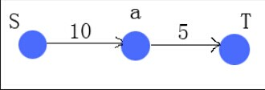
</div>

有3个节点$S$,$a$,$T$，边$[S,a]$的容量是10，边$[a,T]$的容量是5，假设从$S$处要传送数据到$T$，问最大传送数据量是多少？
应该是$$min(10,5)=5$$如果超出5，$[a,T]$边容不下，因此传不过去，此时的最大流量就是5，$[a,T]$边就是该图的一条最大流。该图可以想象成从$S$到$T$通水，需要修建水管，$a$是中间站点，$S$到$a$修建的水管可以容纳下10单位的水量，$a$到$T$可容下5单位的水量。

现在有个人不想让$S$到$T$通水了，那么他得要切割水管，那么应该切割哪条水管呢？

假设切割水管付出的代价和水管容量成正比。显然，他需要切割$a$到$T$的水管，而不会切割$S$到$a$的水管，此时的割是最小割，容量是5，最大流是5，所以最大流=最小割。

当然这个例子太简单，不能说明普遍问题。

来个稍微复杂的例子：
<div align=center>
    <!--  -->
    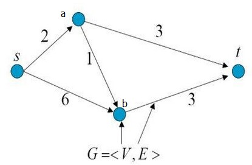
</div>

从$S$到$T$，中间经过$a,b$两节点，问此时的最大流是多少？

首先找一条从$S$到$T$的路径$[S,a,t]$，该路径的最大流量是$$min(2,3)=2$$因为$[S,a]$上面的容量已经被用了，所以路径$[S,a,b,t]$就行不通了，割去$[S,a]$后图变成了以下形式：

<div align=center>
    <!--  -->
    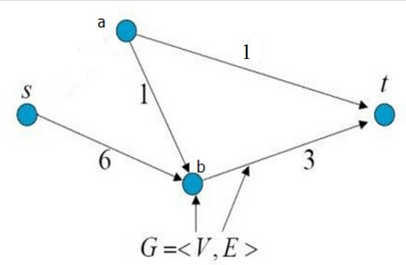
</div>

该图叫做残留网络或者叫残留图，此时再找从$S$到$t$的路径$[S,b,t]$，路径的最大流量是$$min(3,6)=3$$割去$[b,t]$后，图如下：

<div align=center>
    <!--  -->
    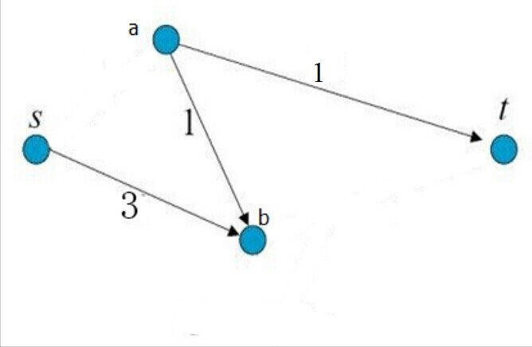
</div>

此时就不存在从$S$到$t$的可行路径了，则结束最大流的查找。此时的最大流是$2+3=5$，被割的边容量和是$2+3=5$，即最大流=最小割

两个例子我们已经能理解最大流和最小割大体的含义了，也发现最大流的确和最小割是相等的。只从这两个小例子就证明最大流和最小割相等是绝对不严格的，严格的数学证明可google相关资料。回头思考下，最大流到底是什么？

如果以送货为例，在可行的情况下，从一个节点到另一个节点所能送达的最大货量即为最大流。

打个比方，假设从S处开始放弹珠，让其自动滚到t处，箭头方向为下坡路，在不考虑时间和空间(即把弹珠想象成质点)的情况下，路径中能容纳的最大弹珠量即为最大流量，最小割就是把容纳的弹珠量和容量相同的边都割去，得到的割即为最小割，显然最大流=最小割，因为最大流量完全由路径和容量决定。割去这些边之后，弹珠是没法从$S$滚落到$t$的。

<!-- 论文ref: https://static.aminer.org/pdf/PDF/000/292/851/demonstration_of_segmentation_with_interactive_graph_cuts.pdf -->
<!-- 原文链接：https://blog.csdn.net/chinacoy/article/details/45040897 -->


