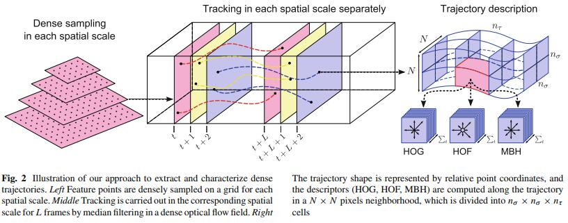
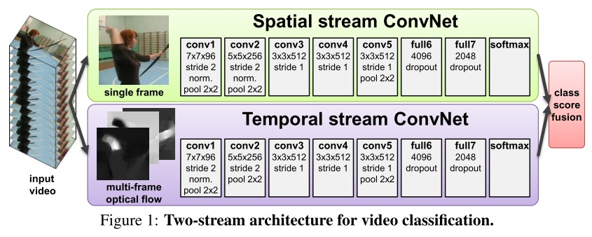
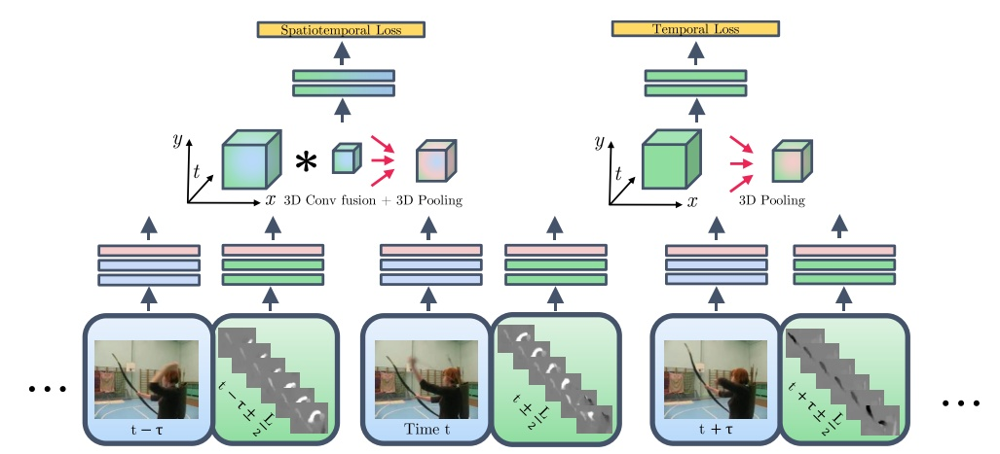
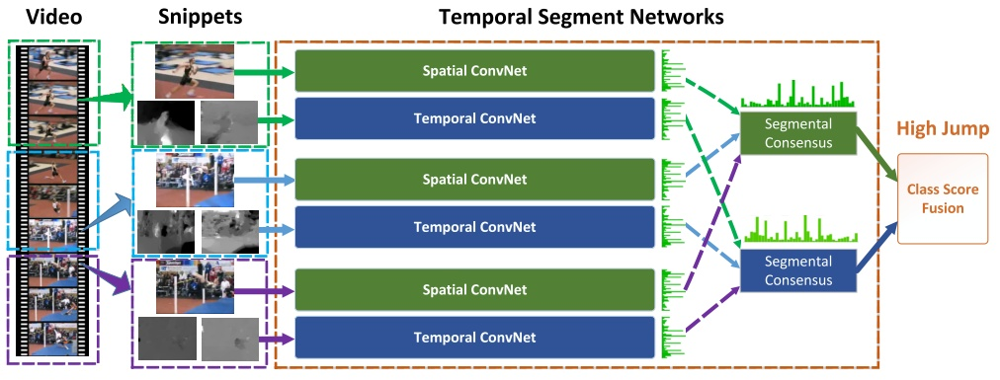
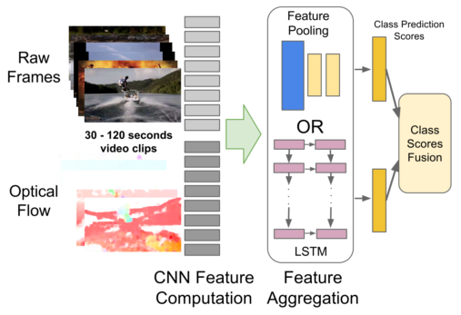
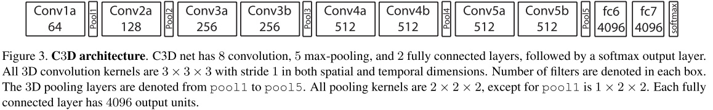
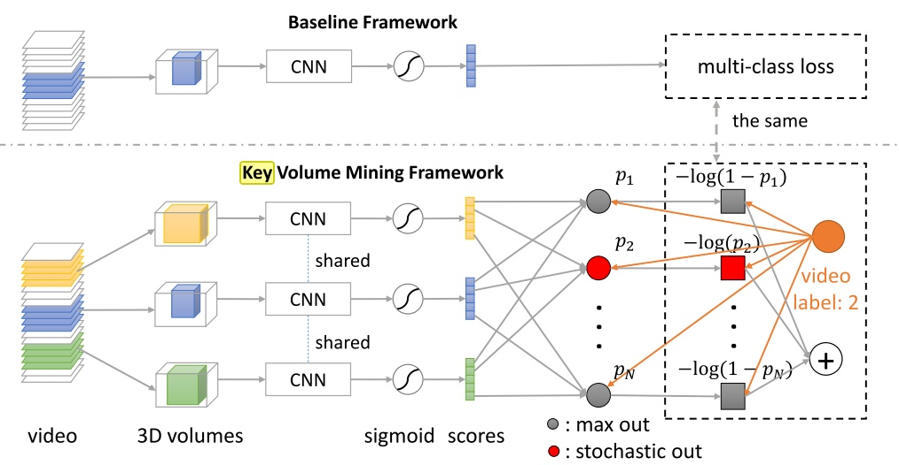
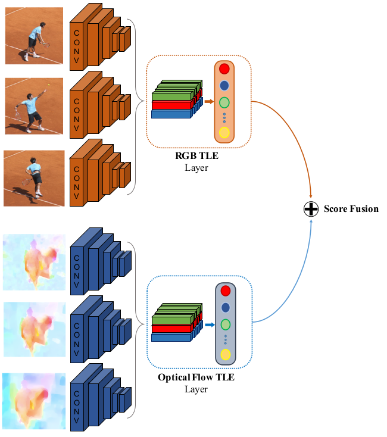
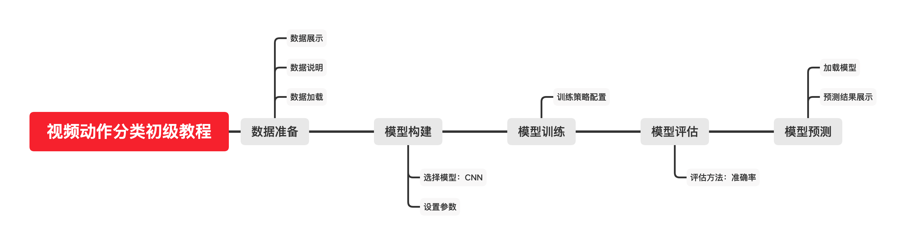

[TOC]
<!-- ref:
https://zhuanlan.zhihu.com/p/26460437 
https://lab.datafountain.cn/forum?id=127
https://lab.datafountain.cn/forum?id=123
-->


# 任务16：视频行为理解

## 1.任务目标


1. 理解视频行为理解理论
2. 了解视频行为理解任务相关进展
3. 动手实现一个视频行为理解的小程序


## 2.任务描述

- 对视频数据的处理是计算机视觉领域非常重要的一部分内容。视频主要是由大量的视频帧图像所构成。相比于单一的图像，视频中多出了时间维度的信息，物体在先后帧中出现的顺序和状态等信息都非常关键。同时视频数据的数据量更大，而且相邻帧间差距较小，使得数据冗余度较高。所以在视频任务中，如何处理好时序信息、如何高效提取特征都是至关重要的问题。

- 随着深度学习技术的发展，以及计算能力的进步（GPU等），现在基于视频的研究领域越来越受到重视。视频与图片最大的不同在于视频还包含了时序上的信息，此外需要的计算量通常也大很多。

- 主要介绍Action Recognition（行为识别）这个方向。这个方向的主要目标是判断一段视频中人的行为的类别，所以也可以叫做Human Action Recognition。虽然这个问题是针对视频中人的动作，但基于这个问题发展出来的算法，大都不特定针对人，也可以用于其他类型视频的分类。本课程通过实例来介绍和实现一个简单的视频动作分类方法。本教程通过加载和预处理数据、构造和提取特征、训练分类器得到一个可以应用的视频动作分类工具。

<div align=center>
    <!--  -->
    
</div>


## 3.知识准备


### 3.1任务特点及分析


#### 目的

- 给一个视频片段进行分类，类别通常是各类人的动作。

#### 特点

- 简化了问题，一般使用的数据库都先将动作分割好了，一个视频片断中包含一段明确的动作，时间较短（几秒钟）且有唯一确定的label。所以也可以看作是输入为视频，输出为动作标签的多分类问题。此外，动作识别数据库中的动作一般都比较明确，周围的干扰也相对较少（不那么real-world）。有点像图像分析中的Image Classification任务。

#### 难点/关键点

- 强有力的特征：即如何在视频中提取出能更好的描述视频判断的特征。特征越强，模型的效果通常较好。
- 特征的编码（encode）/融合（fusion）：这一部分包括两个方面，第一个方面是非时序的，在使用多种特征的时候如何编码/融合这些特征以获得更好的效果；另外一个方面是时序上的，由于视频很重要的一个特性就是其时序信息，一些动作看单帧的图像是无法判断的，只能通过时序上的变化判断，所以需要将时序上的特征进行编码或者融合，获得对于视频整体的描述。
- 算法速度：虽然在发论文刷数据库的时候算法的速度并不是第一位的。但高效的算法更有可能应用到实际场景中去。


### 3.2常用数据集

<!-- 行为识别的数据库比较多，这里主要介绍两个最常用的数据库，也是近年这个方向的论文必做的数据库。

- UCF101:来源为YouTube视频，共计101类动作，13320段视频。共有5个大类的动作：1)人-物交互；2)肢体运动；3)人-人交互；4)弹奏乐器；5)运动。数据库主页为：Center for Research in Computer Vision at the University of Central Florida。文章的题图为UCF各类视频的示意图。
- HMDB51:来源为YouTube视频，共计51类动作，约7000段视频。数据库主页为：HMDB: a large human motion database

在Actioin Recognition中，实际上还有一类骨架数据库，比如MSR Action 3D，HDM05，SBU Kinect Interaction Dataset等。这些数据库已经提取了每帧视频中人的骨架信息，基于骨架信息判断运动类型。不做详细介绍。 -->

当前常用的视频数据集数量非常多，可以先通过数据规模来分类：

#### 较小的比如：
- HMDB51: 51个类别和6,766个视频片段。
- UCF101：101个动作类别，13,320个视频片段。
#### 更大的比如
- Sports-1M: 487种动作类别，1,100,000个视频片段。
- FCVID：239种动作类别，91,223个视频片段。
#### 还有特别大的：
- ActivityNet：200个动作类别，648小时。
- Youtube-8M：4716 种动作类别，8,000,000个视频片段。
- Kinectics：600种动作类别，500,000个视频片段。

以上列出的仅为视频领域非常经典的数据。近年来随着方法的改进和硬件的升级数据集的规模变得越来越大。而在对视频初步处理之后数据所占的空间会更加巨大，以UCF101数据举例，解压后的原数据将近10G，对RGB数据进行提取、变换等数据操作后原数据就将近20G，再对视频进行光流提取，光流信息会大于20G。所以最终要应用到训练中的数据很可能在50G左右，这个数据量对于硬件的要求还是非常高的。

视频数据还分为剪辑视频和未剪辑视频。经过剪辑的视频往往时长较短，包含主体明确且唯一，目标动作占据非常主要的部分，并且视频时长和动作时长基本一致。这样的视频数据分类较为容易，例如UCF101的全部数据都是经过剪辑的。而未剪辑的视频数据中动作出现的时间和位置都不确定，具有更大的分类难度。

在近年来模型和方法的不断发展中，视频任务和数据粒度也在从粗转到细。比如早期的分类任务仅仅需要分出一个类别，并且类和类之间关联性很小。这也就导致了很多数据和方法并不是对动作本身分类，而是对特定物体、特定场景、特定光线甚至特定角度等进行分类。而随着任务和数据的不断细化，分类粒度越来越小。比如要对具体动作的不同阶段进行分类。这就要求模型具有真正的区分主体和背景、动作的各个部分的能力。

受限与硬件环境，为了能够专注于模型和方法本身，本次教程我们使用的数据集是精简版的UCF101数据集。该数据在UCF101数据的基础上选择了十个动作类别的数据，在每个视频数据中提取了三帧内容并将其压缩至低分辨率。从而将整个数据规模控制到一个较小的范围，便于在各种设备上进行学习和实验。

下载后解压到data目录下。可以看到数据大约按照6:2:2的比例划分训练集、验证集、测试集，训练集、验证集、训练集的数据条数如下表所示。

|  数据集  | 训练集  | 验证集   | 测试集 | 训练集  |
|  ----  | ----  |  ----  | ----  |----  |
|  数据量  | 7770  | 2230   | 3270 | 13270  |


### 3.3研究进展

#### （一）传统方法

- iDT（improved dense trajectories)特征："Action recognition with improved trajectories"

- iDT方法（13年）是深度学习进入该领域前效果最好，稳定性最好，可靠性最高的方法，不过算法速度很慢。这个方法是该实验室之前工作（Dense Trajectories and Motion Boundary Descriptors for Action Recognition）的改进。此前写的笔记见行为识别笔记：improved dense trajectories算法（iDT算法），算法代码分析见：行为识别笔记：iDT算法用法与代码解析 。
- 基本思路：DT算法的基本思路为利用光流场来获得视频序列中的一些轨迹，再沿着轨迹提取HOF，HOG，MBH，trajectory4种特征，其中HOF基于灰度图计算，另外几个均基于dense optical flow（密集光流）计算。最后利用FV（Fisher Vector）方法对特征进行编码，再基于编码结果训练SVM分类器。而iDT改进的地方在于它利用前后两帧视频之间的光流以及SURF关键点进行匹配，从而消除/减弱相机运动带来的影响，改进后的光流图像被成为warp optical flow

<div align=center>
    <!--  -->
    
</div>


- “Action Recognition with Stacked Fisher Vectors"

- 基于iDT方法的改进效果最好的应该是这篇文章。使用了两层的fv编码，笔记见行为识别笔记：Stacked Fisher Vector基本原理


#### （二）深度学习方法

由于这个方向这几年的论文实在太多，所以这部分挑选了一些近年比较有代表性的论文进行简要介绍。更多的论文可以上谷歌学术通过搜索Action Recognition找到。

##### （1）Two Stream Network及衍生方法


“Two-Stream Convolutional Networks for Action Recognition in Videos”（2014NIPS）

- Two Stream方法最初在这篇文章中被提出，基本原理为对视频序列中每两帧计算密集光流，得到密集光流的序列（即temporal信息）。然后对于视频图像（spatial）和密集光流（temporal）分别训练CNN模型，两个分支的网络分别对动作的类别进行判断，最后直接对两个网络的class score进行fusion（包括直接平均和svm两种方法），得到最终的分类结果。注意，对与两个分支使用了相同的2D CNN网络结构，其网络结构见下图。
- 实验效果：UCF101-88.0%，HMDB51-59.4%

<div align=center>
    <!--  -->
    
</div>

”Convolutional Two-Stream Network Fusion for Video Action Recognition“（2016CVPR）

- 这篇论文的主要工作为在two stream network的基础上，利用CNN网络进行了spatial以及temporal的融合，从而进一步提高了效果。此外，该文章还将基础的spatial和temporal网络都换成了VGG-16 network。
- 实验效果：UCF101-92.5%，HMDB51-65.4%


<div align=center>
    <!--  -->
    
</div>

”Temporal Segment Networks: Towards Good Practices for Deep Action Recognition”

- 这篇文章是港中文Limin Wang大神的工作，他在这方面做了很多很棒的工作，可以followt他的主页：Limin Wang 。
- 这篇文章提出的TSN网络也算是spaital+temporal fusion，结构图见下图。这篇文章对如何进一步提高two stream方法进行了详尽的讨论，主要包括几个方面（完整内容请看原文）：

1. 输入数据的类型：除去two stream原本的RGB image和 optical flow field这两种输入外，这篇文章中还尝试了RGB difference及 warped optical flow field两种输入。最终结果是 RGB+optical flow+warped optical flow的组合效果最好。

2. 网络结构：尝试了GoogLeNet,VGGNet-16及BN-Inception三种网络结构，其中BN-Inception的效果最好。

3. 训练策略：包括 跨模态预训练，正则化，数据增强等。

- 实验效果：UCF101-94.2%，HMDB51-69.4%

<div align=center>
    <!--  -->
    
</div>

“Beyond Short Snippets: Deep Networks for Video Classification Joe"

- 这篇文章主要是用LSTM来做two-stream network的temporal融合。效果一般
- 实验效果：UCF101-88.6%

<div align=center>
    <!--  -->
    
</div>


##### （2）C3D Network

"Learning spatiotemporal features with 3d convolutional networks"

- C3D是facebook的一个工作，采用3D卷积和3D Pooling构建了网络。论文笔记见：行为识别笔记：C3D network-用于视频特征提取的3维卷积网络 。通过3D卷积，C3D可以直接处理视频（或者说是视频帧的volume）
- 实验效果：UCF101-85.2% 可以看出其在UCF101上的效果距离two stream方法还有不小差距。我认为这主要是网络结构造成的，C3D中的网络结构为自己设计的简单结构，如下图所示。
- 速度：C3D的最大优势在于其速度，在文章中其速度为314fps。而实际上这是基于两年前的显卡了。用Nvidia 1080显卡可以达到600fps以上。所以C3D的效率是要远远高于其他方法的，个人认为这使得C3D有着很好的应用前景。


<div align=center>
    <!--  -->
    
</div>


作者在其项目主页：C3D: Generic Features for Video Analysis 放出了新版本的Res-C3D网络的caffe模型，但论文还没放出，估计是ICCV2017的投稿文章。新版本的模型大小是之前的一半，速度比C3D快了很多，效果也比之前提高了几个百分点（UCF上）。非常期待看到这个论文，等放出后也会好好写博客讨论一下的。


##### （3）其他方法

“A Key Volume Mining Deep Framework for Action Recognition”

- 本文主要做的是key volume的自动识别。通常都是将一整段动作视频进行学习，而事实上这段视频中有一些帧与动作的关系并不大。因此进行关键帧的学习，再在关键帧上进行CNN模型的建立有助于提高模型效果。本文达到了93%的正确率吗，为目前最高。
- 实验效果：UCF101-93.1%，HMDB51-63.3%


<div align=center>
    <!--  -->
    
</div>


”Deep Temporal Linear Encoding Networks”

- 本文主要提出了“Temporal Linear Encoding Layer” 时序线性编码层，主要对视频中不同位置的特征进行融合编码。至于特征提取则可以使用各种方法，文中实验了two stream以及C3D两种网络来提取特征。
- 实验效果：UCF101-95.6%，HMDB51-71.1% （特征用two stream提取）。应该是目前为止看到效果最好的方法了（CVPR2017里可能会有更好效果的方法）

<div align=center>
    <!--  -->
    
</div>

可以看出，这几年action recognition领域发展的非常快，有各种各样的方法被提出。但要注意，action recognition一般是对预先分割过的短视频进行分类，而真实环境中的视频一般都是没有预先切分过的，而且会包含大量无关信息。所以我认为这个领域的研究很像对Image Classification的研究，比较基础，可以为相关领域的研究提供有力的工具。下一篇文章将讨论视频中的动作定位问题（Temporal Action Detection）。


## 4. 任务实施
- 本教程包括以下内容：从原始的数据文件中加载数据、对数据进行预处理、神经网络的搭建、训练分类器、结果展示。该模型使用经典的卷积+激活+池化结构的堆叠，逐步提取特征值，并在最后使用全连接层进行分类。
### 4.1 实施思路

<!-- - 根据知识点中提及到的数学公式，将图像增强算法的函数复现，然后利用已有图片，进行图像增强。 -->
<div align=center>
    <!--  -->
    
</div>

### 4.2 实施步骤
#### 步骤1：
视频的分类任务首先要对原数据进行信息抽取。动作信息包括空间信息和时间信息。空间信息主要就是视频中的每一帧包含的内容。而时间信息是指随着时间变化，各个动作运动的状态和位置的变化情况。
无论在图像还是视频任务中，巻积神经网络都能够表现出非常好的效果，是一种有效的特征提取工具，并且能够被广泛扩展到诸多不同的任务中去。本次教程中将主要使用巻积神经网络作为视频的信息抽取器。整个网络在CNN的基础上最终完成分类功能。
本次教程主要希望大家能够熟悉视频任务的工作流程，熟悉pytorch工具的基本用法，建立简单的CNN模型来完成对视频的分类任务。主要使用单帧图像来判别内容。

```
#导入所需的库
import torch
import torch.nn as nn
import torch.optim as optim
from torch.autograd import Variable
from torch.utils.data import DataLoader,sampler,Dataset
import torchvision.datasets as dset
import torchvision.transforms as T
import timeit
from PIL import Image
import os
import numpy as np
import scipy.io
import torchvision.models.inception as inception
```

#### 步骤2：
数据加载和Dataset类构造

```
label_mat=scipy.io.loadmat('./datasets/q3_2_data.mat')
label_train=label_mat['trLb']
print('train len：',len(label_train))
label_val=label_mat['valLb']
print('val len: ',len(label_val))
```

Dataset类

Dataset类被定义在torch.utils.data.Dataset处，使用这个类的方法非常简单。我们只需要新构建一个Dataset类的子类，然后override该子类中的__len__和__getitem__方法：
__len__：返回当前dataset的大小。
__getitem__：返回一批数据。
__len__方法的主要作用就是给出当前数据的数量信息。而在我们最终使用时，我们首先会告诉Dataloader类要求加载一批数据，然后Dataloader类就会找到其中数据的__getitem__方法，该方法会返回一批数据来供我们使用。
```
class ActionDataset(Dataset):
    """Action dataset."""

    def __init__(self,  root_dir, labels=[], transform=None):
        """
        Args:
            root_dir (string): 整个数据的路径。
            labels(list): 图片的标签。
            transform (callable, optional): 想要对数据进行的处理函数。
        """
        self.root_dir = root_dir
        self.transform = transform
        self.length=len(os.listdir(self.root_dir))
        self.labels=labels

    def __len__(self):      # 该方法只需返回数据的数量。
        return self.length*3    # 因为每个视频片段都包含3帧。

    def __getitem__(self, idx):     # 该方法需要返回一个数据。
        
        folder=idx//3+1
        imidx=idx%3+1
        folder=format(folder,'05d')
        imgname=str(imidx)+'.jpg'
        img_path = os.path.join(self.root_dir,folder,imgname)
        image = Image.open(img_path)

        if len(self.labels)!=0:
            Label=self.labels[idx//3][0]-1
        if self.transform:      # 如果要先对数据进行预处理，则经过transform函数。
            image = self.transform(image)
        if len(self.labels)!=0:
            sample={'image':image,'img_path':img_path,'Label':Label}
        else:
            sample={'image':image,'img_path':img_path}
        return sample
```
对子类简单的修改就完成了对数据的封装。现在我们可以通过一个循环测试一下：
```
image_dataset=ActionDataset(root_dir='./datasets/trainClips/', labels=label_train,transform=T.ToTensor())
# torchvision.transforms中定义了非常多对图像的预处理方法，这里使用的ToTensor方法为将0～255的RGB值映射到0～1的Tensor类型。
for i in range(3):
    sample=image_dataset[i]
    print(sample['image'].shape)
    print(sample['Label'])
    print(sample['img_path'])
```

Dataloader类
虽然在封装了Dataset类之后我们能够完成对数据的记载，但是在实际训练过程中我们还需要更多的步骤：

- 一次加载batch size大小的数据。
- 打乱数据的顺序。
- 多线程加载数据。

而这些需求已经全部被DataLoader类所实现：
```
image_dataloader = DataLoader(image_dataset, batch_size=4,
                        shuffle=True, num_workers=4)

for i,sample in enumerate(image_dataloader):
    sample['image']=sample['image']
    print(i,sample['image'].shape,sample['img_path'],sample['Label'])
    if i>5: 
        break
```

我们发现每一次调用都能够自动返回batch size的数据，并且数据被完全打乱。同时还实现了多线程加载，加载速度提升了很多。
所以我们使用将训练集、验证集和测试集全部封装起来：

```
image_dataset_train=ActionDataset(root_dir='./datasets/trainClips/',labels=label_train,transform=T.ToTensor())

image_dataloader_train = DataLoader(image_dataset_train, batch_size=32,
                        shuffle=True, num_workers=4)
image_dataset_val=ActionDataset(root_dir='./datasets/valClips/',labels=label_val,transform=T.ToTensor())

image_dataloader_val = DataLoader(image_dataset_val, batch_size=32,
                        shuffle=False, num_workers=4)
image_dataset_test=ActionDataset(root_dir='./datasets/testClips/',labels=[],transform=T.ToTensor())

image_dataloader_test = DataLoader(image_dataset_test, batch_size=32,
                        shuffle=False, num_workers=4)


dtype = torch.FloatTensor # 这是pytorch所支持的cpu数据类型中的浮点数类型。

print_every = 100   # 这个参数用于控制loss的打印频率，因为我们需要在训练过程中不断的对loss进行检测。

def reset(m):   # 这是模型参数的初始化
    if hasattr(m, 'reset_parameters'):
        m.reset_parameters()
```

#### 步骤3：数据解释和处理
在之前的步骤中我们也看到了最终要使用的数据tensor的形状，其中包含四个维度：

N：batch size大小。
C：每帧图像的通道数。
H：每帧图像的高。
W：每帧图像的宽。

这就是神经网络的输入形状。我们注意到输入过程中的每一个像素点和原图像都是一一对应的，唯一不同的就是我们将原来较大的RGB值缩放到一个小于1的浮点数，这是模型所需要的。
而在经过多个卷积层的提取之后，我们需要使用全连接层来完成最终的分类判断。此时的tensor的各个维度已经变得和原来截然不同，并且已经没有了一一对应的特点。换句话说，最终的输出的各个维度究竟代表了什么信息只有神经网络自己知道。所以tensor的形状也就不那么重要了。
所以为了便于全连接层的连接，我们定义一个Flatten函数，来将除了N以外的那些我们不知道代表什么的数据统统“展开”到一起。
```
class Flatten(nn.Module):
    def forward(self, x):
        N, C, H, W = x.size() # 读取各个维度。 
        return x.view(N, -1)  # -1代表除了特殊声明过的以外的全部维度。
```


#### 步骤4：搭建模型
在这一部分我们将定义一个非常简单的CNN模型，但是其几乎覆盖了所有你需要知道的基础方法和训练步骤。
首先让我们提前来看一看这个CNN的结构：

- 7x7 卷积层，8 filters，步长为1。
- ReLU 激活层。
- 2x2 最大池化层，步长为2。
- 7x7 卷积层，16 filters，步长为1。
- ReLU 激活层。
- 2x2 最大池化层，步长为2。
- Flatten 层。
- 2x2 最大池化层，步长为2。
- 全连接层。

整体的结构是非常经典的：卷积+激活+池化结构的堆叠，逐步提取特征值。
使用pytorch定义模型结构非常的简单，只需要在Sequential函数中将所有的网络层顺序相连即可。
其中需要注意各个层之间输入输出尺寸要一致，巻积层和池化层的输出维度计算公式为N=(W-F+2P)/S+1，其中F为巻积核大小，P为图像四周的padding大小，S为步长。
```
fixed_model_base = nn.Sequential( 
                nn.Conv2d(3, 8, kernel_size=7, stride=1), #3*64*64 -> 8*58*58
                nn.ReLU(inplace=True),
                nn.MaxPool2d(2, stride = 2),    # 8*58*58 -> 8*29*29
                nn.Conv2d(8, 16, kernel_size=7, stride=1), # 8*29*29 -> 16*23*23
                nn.ReLU(inplace=True),
                nn.MaxPool2d(2, stride = 2), # 16*23*23 -> 16*11*11
                Flatten(),
                nn.ReLU(inplace=True),
                nn.Linear(1936, 10)     # 1936 = 16*11*11
            )
# 这里模型base.type()方法是设定模型使用的数据类型，之前设定的cpu的Float类型。
# 如果想要在GPU上训练则需要设定cuda版本的Float类型。
fixed_model = fixed_model_base.type(dtype)
```

接下来我们做一个简单的测试，来验证我们模型的输入输出尺寸。
随即生成一个32364*64大小的tensor，并将其封装为torch的Variable类型，然后输入到模型中。
通过检查输出模型，得到了32*10的tensor，其中的32代表32组数据点，10代表我们本次任务的类别数量。验证了模型的正确性。

```
x = torch.randn(32, 3, 64, 64).type(dtype)
x_var = Variable(x.type(dtype)) # 需要将其封装为Variable类型。
ans = fixed_model(x_var)        

print(np.array(ans.size())) # 检查模型输出。
np.array_equal(np.array(ans.size()), np.array([32, 10]))  
```


#### 步骤5：训练步骤及其模块解释
接下来就到了最重要的步骤，我们需要训练之前定义的CNN模型。
最为普遍的神经网络训练可以简单概括为以下三步：

- 将训练数据输入模型开始前向传播。
- 通过损失函数计算模型输出和标准答案之间的差距，得到loss值。
- 根据loss值反向传播，使用优化器更新模型参数。

前向传播就是完整的按照模型搭建顺序对输入进行处理，并且最终得到输出。
在得到了输出之后就可以通过损失函数计算loss，loss的数值将直接被应用到各个参数的修改过程中去，它能够直接影响模型的收敛速度和最终的收敛情况，所以损失函数在训练过程中就显得极为重要。独特的损失函数基本是每一类成熟神经网络所必须的。
优化器的选择同样是非常重要和复杂的事情，优化器直接影响每一轮训练的结果，不同的优化其会带来不同的收敛速度和收敛结果，可谓是神经网络训练的核心。其相关了非常多参数和方法，比如学习率、动量、学习率变化率等等，都是非常重要的部分。
使用pytorch训练模型将变得非常方便，pytorch基于动态图模型，具有自动求导功能，能够在前向传播过程中保留各个变量的梯度。极大的简化了手动求导的过程。
具体的训练步骤非常简单：

1. 数据输入模型得到输出。
2. 根据输出和标签计算loss。
3. optimizer.zero_grad () 优化器梯度归零。
4. loss.backward () loss反向传播。
5. optimizer.step () 优化器更新参数。

根据这个步骤，我们完成了下面的训练和验证模块：

```
def train(model, loss_fn, optimizer, dataloader, num_epochs = 1):
    for epoch in range(num_epochs):
        print('Starting epoch %d / %d' % (epoch + 1, num_epochs))

        # 在验证集上验证模型效果
        check_accuracy(fixed_model, image_dataloader_val)
        
        model.train() # 模型的.train()方法让模型进入训练模式，参数保留梯度，dropout层等部分正常工作。
        for t, sample in enumerate(dataloader):
            x_var = Variable(sample['image'])   # 取得一个batch的图像数据。
            y_var = Variable(sample['Label'].long()) # 取得对应的标签。

            scores = model(x_var)   # 得到输出。
            
            loss = loss_fn(scores, y_var)   # 计算loss。
            if (t + 1) % print_every == 0:  # 每隔一段时间打印一次loss。
                print('t = %d, loss = %.4f' % (t + 1, loss.item()))

            # 三步更新参数。
            optimizer.zero_grad()
            loss.backward()
            optimizer.step()

def check_accuracy(model, loader):

    num_correct = 0
    num_samples = 0

    model.eval() # 模型的.eval()方法切换进入评测模式，对应的dropout等部分将停止工作。
    for t, sample in enumerate(loader):
        x_var = Variable(sample['image'])
        y_var = sample['Label']
       
        scores = model(x_var)
        _, preds = scores.data.max(1) # 找到可能最高的标签作为输出。

        num_correct += (preds.numpy() == y_var.numpy()).sum()
        num_samples += preds.size(0)
    acc = float(num_correct) / num_samples
    print('Got %d / %d correct (%.2f)' % (num_correct, num_samples, 100 * acc))
```
接下来设定本次实验选用的损失函数和优化器。

```
optimizer = torch.optim.RMSprop(fixed_model_base.parameters(), lr = 0.0001)

loss_fn = nn.CrossEntropyLoss()
```


#### 步骤6：训练并验证

完成了上面所有的准备工作之后，让我们正式开始模型的训练。
建议同学们自行调整各个超参数的值并反复训练，体会不同参数带来的效果和变化。
如果GPU资源足够，建议将模型转移到GPU上进行训练。更改的步骤并不会很复杂，这是一个非常有帮助的尝试。

```
torch.random.manual_seed(54321)
fixed_model.cpu()
fixed_model.apply(reset) 
fixed_model.train() 
train(fixed_model, loss_fn, optimizer,image_dataloader_train, num_epochs=5) 
check_accuracy(fixed_model, image_dataloader_val)
```

看一看最后在验证集上的效果还满意吗。
接下来我们来测试一下真正的预测场景吧，你可以自己去找一些视频然后使用上面的方法封装到DataLoader类里面，在刚才训练好的模型上测试效果了。
下面先来写一个测试函数：

```
def predict_on_test(model, loader):
    num_correct = 0
    num_samples = 0
    model.eval() 
    results=open('results.csv','w') # 模型预测结果会被放在这里。
    count=0
    results.write('Id'+','+'Class'+'\n')
    for t, sample in enumerate(loader):
        x_var = Variable(sample['image'])
        scores = model(x_var)
        _, preds = scores.data.max(1)
        for i in range(len(preds)):
            results.write(str(count)+','+str(preds[i])+'\n')
            count+=1
    results.close()
    return count
    
count=predict_on_test(fixed_model, image_dataloader_test)   # 放入你想要测试的训练集，然后打开文件去看一看结果吧。
print(count)
```

不知道你是否对模型最终的结果满意，我们在模型定义之初就说个这是一个很简单的结构，它很便于理解，但绝不是效果最好的结构。
我们非常希望你在得到第一次评估结果之后能够回到模型定义和训练策略定义的位置，亲自动手改变一些结构或者数值然后观察其带来的改变。这对你理解CNN结构和训练过程会有很大帮助。

## 5.任务拓展
### 5.1 
本次教程的任务本身较为简单，但是基本覆盖了深度学习解决问题的各个过程。
经过本次教程的学习，我们希望你能够掌握pytorch的基本用法、CNN模型的搭建和训练、视频动作分类任务的简单方法等。
更多的，如果你认真的对网络参数和网络结构进行了多次调整和测试，我们希望你能够继续探索更深的问题：

- 巻积核大小的影响。
- 层数深度在速度和效果上的影响。
- 不同优化器的选择和参数设置。
- 不同激活函数的效果。
- 不同损失函数的效果。
- 数据增强方法。
- 层数越深参数越多越好吗。
- 为什么要划分出验证集和测试集，在训练过程中模型在训练集和验证集上不同的表现代表了什么。

非常希望你能够认真的思考和探索这些问题，亲自动手尝试将是学习过程中最最重要的事情。

### 5.2 优化思路和方法
#### 数据
- 使用对比度变换，左右翻转等对数据集进行数据增强


#### 模型
- 使用小尺寸的卷积核
- 增加网络层数
- 在层间加入归一化操作
- 加入残差结构

## 6. 任务实训


学后小测试:（必做题）
1. 下列哪个神经网络结构不是用于提取特征的？ 【分值：20】
A.卷积层 B.全连接层 C.池化层 D.激活层

2. 模型中加载数据得到的tensor有哪些维度 【分值：20】
A.batch size B.图像的通道数 C.图像的高 D.占用字节数 E.图像的宽
   
3. 前向传播就是完整的按照模型搭建顺序对输入进行处理，并且最终得到输出。 【分值：20】
4. 经过多层卷积层处理后的提取到的特征图与原图像的各个点一一对应。 【分值：20】
5. 相比于单一的图像，视频中多出了什么信息？ 【分值：20】
6. 优化器包含了哪些参数？ 【分值：0】