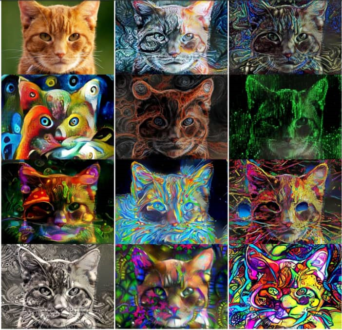

[TOC]

# 任务2：学习计算机视觉相关概论

## 1.任务目标

<!-- 1. 
2. 
3. 
4.  -->

- 学习了解计算机视觉的多项任务
- 在综述介绍中理解该任务，并为后续课程打下基础

## 2.任务描述

- 计算机视觉是关于研究机器视觉能力的学科，或者说是使机器能对环境和其中的刺激进行可视化分析的学科。机器视觉通常涉及对图像或视频的评估，英国机器视觉协会（BMVA）将机器视觉定义为「对单张图像或一系列图像的有用信息进行自动提取、分析和理解」。

- 对我们环境的真正理解不是仅通过视觉表征就可以达成的。更准确地说，是视觉线索通过视觉神经传输到主视觉皮层，然后由大脑以高度特征化的形式进行分析的过程。从这种感觉信息中提取解释几乎包含了我们所有的自然演化和主体经验，即进化如何令我们生存下来，以及我们如何在一生中对世界进行学习和理解。
- 从这方面来说，视觉过程仅仅是传输图像并进行解释的过程，然而从计算的角度看，图像其实更接近思想或认知，涉及大脑的大量功能。因此，由于跨领域特性很显著，很多人认为计算机视觉是对视觉环境和其中语境的真实理解，并将引领我们实现强人工智能。

## 3.知识准备

### 3.1 基础的计算机视觉任务

#### 分类/定位

- 图像分类任务通常是指为整张图像分配特定的标签，如下左图整张图像的标签为 CAT。而定位是指找到识别目标在图像中出现的位置，通常这种位置信息将由对象周围的一些边界框表示出来。目前 ImageNet上的分类/定位的准确度已经超过了一组训练有素的人类。因此相对于前一部分的基础，我们会着重介绍后面如语义分割、3D 重建等内容。

    <!--  -->
    

- 然而随着目标类别的增加，引入大型数据集将为近期的研究进展提供新的度量标准。在这一方面，Keras创始人 Francois Chollet 将包括 Xception 等架构和新技术应用到谷歌内部的大型数据集中，该数据集包含 1.7 万个目标类别，共计 350M（Million）的多类别图像。

    <!--  -->
    

图 2：ILSVRC 竞赛中，分类/定位的逐年错误率，来源 Jia Deng (2016)，ILSVRC2016。
- ImageNet LSVRC（2016）亮点：

- 场景分类是指用「温室」、「体育场」和「大教堂」等特定场景对图像进行分类。ImageNet 去年举办了基于 Places2子数据的场景分类挑战赛，该数据集有 365 个场景共计 8 百万 训练图像。海康威视选择了深度类 Inception 的网络和并不太深的 ResNet，并利用它们的集成实现 9% 的 Top-5 误差率以赢得竞赛。。

- Trimps-Soushen 以 2.99% 的 Top-5 分类误差率和 7.71% 的定位误差率赢得了 ImageNet 分类任务的胜利。该团队使用了分类模型的集成（即 Inception、Inception-ResNet、ResNet 和宽度残差网络模块的平均结果）和基于标注的定位模型 Faster R-CNN来完成任务。训练数据集有 1000 个类别共计 120 万的图像数据，分割的测试集还包括训练未见过的 10 万张测试图像。。

- 机器视觉就是用机器代替人眼来做测量和判断。机器视觉系统是通过图像摄取装置将被摄取目标转换成图像信号，传送给专用的图像处理系统，得到被摄目标的形态信息，根据像素分布和亮度、颜色等信息，转变成数字化信号；图像系统对这些信号进行各种运算来抽取目标的特征，进而根据判别的结果来控制现场的设备动作。

- Facebook 的 ResNeXt 通过使用从原始 ResNet扩展出来的新架构而实现了 3.03% 的 Top-5 分类误差率。 

#### 目标检测

- 目标检测（Object Detection）即如字面所说的检测图像中包含的物体或目标。ILSVRC 2016对目标检测的定义为输出单个物体或对象的边界框与标签。这与分类/定位任务不同，目标检测将分类和定位技术应用到一张图像的多个目标而不是一个主要的目标。

    <!--  -->
    

- 图 3：仅有人脸一个类别的目标检测。图为人脸检测的一个示例，作者表示目标识别的一个问题是小物体检测，检测图中较小的人脸有助于挖掘模型的尺度不变性、图像分辨率和情景推理的能力，来源 Hu and Ramanan (2016, p. 1)。

- 目标识别领域在 2016 年主要的趋势之一是转向更快、更高效的检测系统。这一特性在 YOLO、SSD 和 R-FCN 方法上非常显著，它们都倾向于在整张图像上共享计算。因此可以将它们与 Fast/Faster R-CNN 等成本较高的子网络技术区分开开来，这些更快和高效的检测系统通常可以指代「端到端的训练或学习」。

- 这种共享计算的基本原理通常是避免将独立的算法聚焦在各自的子问题上，因为这样可以避免训练时长的增加和网络准确度的降低。也就是说这种端到端的适应性网络通常发生在子网络解决方案的初始之后，因此是一种可回溯的优化（retrospective optimisation）。然而，Fast/Faster R-CNN 技术仍然非常有效，仍然广泛用于目标检测任务。

- SSD：Single Shot MultiBox Detector利用封装了所有必要计算并消除了高成本通信的单一神经网络，以实现了 75.1% mAP 和超过 Faster R-CNN 模型的性能（Liu et al. 2016）。

- 我们在 2016 年看到最引人注目的系统是「YOLO9000: Better, Faster, Stronger」，它引入了 YOLOv2 和 YOLO9000 检测系统。YOLOv2 很大程度上提升了 2015 年提出的 YOLO 模型性能，它能以非常高的 FPS（使用原版 GTX Titan X 在低分辨率图像上达到 90FPS）实现更好的结果。除了完成的速度外，系统在特定目标检测数据集上准确度要优于带有 ReNet 和 SSD 的 Faster RCNN。

- YOLO9000 实现了检测和分类的联合训练，并将其预测泛化能力扩展到未知的检测数据上，即它能检测从未见过的目标或物体。YOLO9000 模型提供了 9000 多个类别的实时目标检测，缩小了分类和检测数据集间的鸿沟。该模型其它详细的信息和预训练模型请查看：http://pjreddie.com/darknet/yolo/。

- Feature Pyramid Networks for Object Detection是 FAIR实验室提出的，它能利用「深度卷积网络的内部多尺度、金字塔型的层级结构构建具有边际额外成本的特征金字塔」，这意味着表征能更强大和快速。Lin et al. (2016) 在 COCO 数据集上实现了顶尖的单模型结果。若与基础的 Faster R-CNN 相结合，将超过 2016 年最好的结果。

- R-FCN：Object Detection via Region-based Fully Convolutional Networks，这是另一种在图像上避免应用数百次高成本的各区域子网络方法，它通过使基于区域的检测器在整张图像上进行全卷积和共享计算。「我们每张图像的测试时间只需要 170ms，要比 Faster R-CNN 快 2.5 到 20 倍」(Dai et al., 2016)。

    <!--  -->
    

图 4：目标检测中的准确率权衡，来源 Huang et al. (2016, p. 9)。

- 注意：Y 轴表示的是平均准确率（mAP），X 轴表示不同元架构（meta-architecture）的各种特征提取器（VGG、MobileNet...Inception ResNet V2）。此外，mAP small、medium 和 large 分别表示对小型、中型和大型目标的检测平均准确率。即准确率是按「目标尺寸、元架构和特征提取器」进行分层的，并且图像的分辨率固定为 300。虽然 Faster R-CNN 在上述样本中表现得更好，但是这并没有什么价值，因为该元架构相比 R-FCN 来说慢得多。
- Huang et al. (2016) 的论文提供了 R-FCN、SSD 和 Faster R-CNN 的深度性能对比。由于机器学习准确率对比中存在的问题，这里使用的是一种标准化的方法。这些架构被视为元架构，因为它们可以组合不同的特征提取器，比如 ResNet 或 Inception。
- 论文的作者通过改变元架构、特征提取器和图像分辨率研究准确率和速度之间的权衡。例如，对不同特征提取器的选择可以造成元架构对比的非常大的变化。
- 实时商业应用中需要低功耗和高效同时能保持准确率的目标检测方法，尤其是自动驾驶应用，SqueezeDet[33] 和 PVANet 在论文中描述了这种发展趋势。
- COCO是另一个常用的图像数据集。然而，它相对于 ImageNet 来说更小，更常被用作备选数据集。ImageNet 聚焦于目标识别，拥有情景理解的更广泛的语境。组织者主办了一场包括目标检测、分割和关键点标注的年度挑战赛。在 ILSVRC[37] 和 COCO上进行的目标检测挑战赛的结果如下：

- ImageNet LSVRC 图像目标检测（DET）：CUImage 66% 平均准确率，在 200 个类别中有 109 个胜出。
- ImageNet LSVRC 视频目标检测（VID）：NUIST 80.8% 平均准确率。
- ImageNet LSVRC 视频追踪目标检测：CUvideo 55.8% 平均准确率。
- COCO 2016 目标检测挑战赛（边界框）：G-RMI（谷歌）41.5% 平均准确率（比 2015 的胜者 MSRAVC 高出 4.2% 绝对百分点）。

- 从以上结果可以看出，在 ImageNet 上的结果表明「MSRAVC 2015 的结果为『引入 ResNet』设置了很高的标准。在整个项目中对所有的类别的目标检测性能都有所提升。在两个挑战赛中，定位任务的性能都得到较大的提升。关于小型目标实例的大幅性能提升结果详见参考文献」（ImageNet,2016）。

    <!--  -->
    

图 5.ILSVRC 的图像目标检测结果（2013-2016），来源 ImageNet. 2016.Workshop

#### 目标跟踪

- 目标追踪即在给定的场景中追踪感兴趣的一个或多个特定目标的过程，在视频和现实世界的交互中（通常是从追踪初始的目标检测开始的）有很多应用，且对于自动驾驶而言非常重要。
- Fully-Convolutional Siamese Networks for Object Tracking，将一个连体网络（Siamese network）结合一个基础的追踪算法，使用端到端的训练方法，达到了当前最佳，图框显示率超过了实时应用的需求。这篇论文利用传统在线学习方法构建追踪模型。
- Learning to Track at 100 FPS with Deep Regression Networks，该论文试图改善在线训练方法中存在的缺陷。他们构建了一个使用前馈网络学习目标运动、外观和方向中的普遍关系的追踪器，从而可以在没有在线训练的情况下有效地追踪到新的目标。该算法在一个标准的追踪基准测试中达到了当前最佳，同时可以 100FPS 的帧数追踪所有的目标（Held et al.,2016）。
- Deep Motion Features for Visual Tracking 结合了手工设计的特征、深度外观特征（利用 CNN）和深度运动特征（在光流图像上训练），并取得了当前最佳的结果。虽然深度运动特征在动作识别和视频分类中很常见，但作者声称这是其首次被应用于视觉追踪上。该论文获得了 ICPR2016 的「计算机视觉和机器人视觉」的最佳论文。
- 「本论文展示了深度运动特征（motion features）对检测和追踪框架的影响。我们还进一步说明了手工制作的特征、深度 RGB 和深度运用特征包含互补信息。据我们所知，这是第一个提出融合外表信息和深度运动特征，并用于视觉追踪的研究。我们全面的实验表明融合方法具有深度运动特征，并超过了单纯依赖外表信息的方法。」
- Virtual Worlds as Proxy for Multi-Object Tracking Analysis  方法解决了现有虚拟世界中缺乏真实可变性视频追踪基准和数据集。该论文提出了一种新的真实世界复制方法，该方法从头开始生成丰富、虚拟、合成和照片逼真的环境。此外，该方法还能克服现有数据集中存在的一些内容匮乏问题。生成的图像能自动通过正确的真值进行标注，并允许应用于除目标检测/追踪外其它如光流等任务。
- Globally Optimal Object Tracking with Fully Convolutional Networks 专注处理目标变化和遮挡，并将它们作为目标追踪的两个根本限制。「我们提出的方法通过使用全卷积网络解决物体或目标外表的变化，还通过动态规划的方法解决遮挡情况」(Lee et al., 2016)。

### 3.2 进阶的计算机视觉任务

#### 图像分割

- 分割的过程是计算机视觉的核心，它将整个图像分为像素组，然后可以对其进行标记和分类。此外，语义分割通过尝试在语义上理解图像中每个像素的作用而进一步发展，例如图像。是猫，汽车还是其他类型的课程？实例细分通过细分不同的类实例（例如，用三种不同的颜色标记三只不同的狗。它是目前在自动驾驶技术套件中使用的计算机视觉应用程序的一大群。
- 分割领域中一些最好的改进也许要归功于FAIR，他们从2015年开始继续在DeepMask的工作基础上发展。DeepMask在物体上生成粗糙的“蒙版”，作为分割的初始形式。2016年，Fair推出了SharpMask ，它完善了DeepMask提供的“蒙版”，纠正了细节损失并改善了语义分割。除此之外，MultiPathNet 标识每个掩码所描绘的对象。
- “要捕获一般的对象形状，您必须对要查看的内容（DeepMask）有一个高层次的了解，但是要准确地放置边界，您需要一路回顾一下较低层的特征，直到像素为止（SharpMask）。”-Piotr Dollar，2016年。

    <!--  -->
    

FAIR实验室的实际应用。
注意：上面的图片演示了FAIR使用的分割技术。这些包括按顺序应用的DeepMask，SharpMask和MultiPathNet技术的应用。该过程允许在各种场景中进行准确的分割和分类。

#### 超分辨率，风格迁移与着色

- 并非所有的计算机视觉研究都旨在扩展机器的伪认知能力，并且神经网络以及其他机器学习技术的寓言般的可延展性常常使它们适用于大量涌入公共空间的其他新颖应用。去年在超分辨率，样式转换和色彩化方面的进步为我们占据了这个空间。
- 超分辨率是指从低分辨率对应对象估计高分辨率图像的过程，还指在不同放大倍数下预测图像特征的过程，这是人脑几乎可以毫不费力地完成的工作。
- 最初，超分辨率是通过简单的技术（如双三次插值法和最近邻法）执行的。在商业应用方面，克服源质量和实现“ CSI Miami”样式图像增强带来的低分辨率限制的愿望推动了该领域的研究。以下是今年的一些进步及其潜在影响：神经增强是Alex J. Champandard的创意，结合了四篇不同研究论文的方法来实现其超分辨率方法。
- 2016年，在两个显着实例中还尝试了实时视频超分辨率。
- RAISR：Google提供的快速准确的图像超分辨率，通过训练具有低分辨率和高分辨率图像对的滤波器，避免了神经网络方法对内存和速度的昂贵要求。与基于神经网络的方法相比，RAISR作为一种基于学习的框架，比竞争算法快两个数量级，并且对内存的要求最小。因此，超分辨率可扩展到个人设备。这里有一个研究博客。

    <!--  -->
    

注意：从左至右：双三次插值（客观上表现最差的目标），针对MSE优化的深层残差网络，针对对人类感知更敏感的损失而优化的深层残差生成对抗网络，原始高分辨率（HR）图像。相应的峰值信噪比（PSNR）和结构相似度（SSIM）显示在两个括号中。[4 x放大]读者可能希望放大中间的两个图像（SRResNet和SRGAN），以查看图像平滑度与更逼真的细节之间的差异。

- 生成对抗网络（GAN）的使用代表了当前的超分辨率SOTA：
- SRGAN使用经过甄别以区分超分辨率和原始照片级逼真的图像的鉴别器网络，在公共基准上从大量降采样的图像中提供照片级逼真的纹理。在质量上，SRGAN表现最好，尽管SRResNet在峰值信噪比（PSNR）指标上表现最好，但是SRGAN获得了更好的纹理细节，并获得了最佳的平均意见评分（MOS）。
- “据我们所知，它是第一个能够针对4倍放大因子推断出逼真的自然图像的框架。” 所有先前的方法都无法在较大的放大因子下恢复出更精细的纹理细节。
- 图像超分辨率的摊销MAP推论提出了一种使用卷积神经网络计算最大后验（MAP）推论的方法。但是，他们的研究提出了三种优化方法，目前，所有GAN在实际图像数据上的表现都明显更好。

    <!--  -->
    

- 毫无疑问，Style Transfer对神经网络的一种新颖用法进行了深入研究，这种用法已逐渐进入公共领域，特别是通过去年的Facebook整合以及Prisma和Artomatix等公司。风格转移是一种较旧的技术，但随着“艺术风格的神经算法”的发布，在2015年转换为神经网络。从那时起，样式转换的概念就由Nikulin和Novak进行了扩展，并且也应用于视频，这是Computer Vision的共同进步。

    <!--  -->
    

注意：第一行（从左到右）代表艺术风格，该艺术风格被移到第一列（女人，金门大桥和草地环境）中显示的原始图像上。使用条件实例规范化，单个样式传输网络可以同时捕获32个样式，此处显示五个。原始图片的附录中提供了全套图片。这项工作将在2017年国际学习代表大会（ICLR）中进行介绍。

- 一旦可视化，样式转换作为一个主题就相当直观。拍摄一张图片，并想象一下另一张图片的风格特征。例如，以著名绘画或艺术家的风格。今年，Facebook发布了Caffe2Go，他们的深度学习系统已集成到移动设备中。谷歌还发布了一些有趣的工作，试图融合多种样式以生成完全独特的图像样式：研究博客和全文。
- 除了移动集成外，样式转移还可以用于创建游戏资产。我们团队的成员最近看到了Artomatix的创始人兼首席技术官Eric Risser的演讲，他讨论了该技术在游戏中生成内容（纹理变异等）的新颖应用，因此极大地减少了传统纹理艺术家的工作。
- 彩色化是将单色图像更改为新的全彩色版本的过程。最初，这是由精心选择颜色以表示每个图像中特定像素的人手动完成的。在2016年，实现这一过程的自动化，同时又保持了以人为本的着色过程的真实感。尽管人类可能无法准确地表示给定场景的真实色彩，但他们的现实世界知识允许以与图像一致的方式应用颜色，而另一个人则可以查看该图像。
- 着色的过程很有趣，因为网络会根据对对象位置，纹理和环境（例如颜色）的理解为图像分配最可能的颜色。它了解到皮肤是粉红色的，而天空是蓝色的。

- 年度最具影响力的三部作品如下：
- 张等。产生了一种方法，能够在32％的试验中成功地欺骗人类。他们的方法与“着色图灵测试”相当。
- Larsson等人使用深度学习直方图估算功能完全实现其图像着色系统的自动化。
- 最后，Lizuka，Simo-Serra和Ishikawa 展示了一种基于CNN的着色模型。这项工作的表现胜过现有的SOTA，我们（团队）认为这项工作在质量上似乎也是最好的，似乎是最现实的。图10提供了比较，但是图像取自Lizuka等人。

    <!--  -->
    

“此外，与大多数基于CNN的现有方法不同，我们的体系结构可以处理任何分辨率的图像。”在一项测试中，他们的色彩自然程度如何，向用户提供了来自其模型的随机图像，并被询问：“该图像对您来说看起来自然吗？”他们的方法达到了92.6％，基线达到了大约70％，并且地面真相（实际彩色照片）被认为是97.7％的时间是自然的。

#### 动作识别
- 动作识别的任务既指给定视频帧中动作的分类，又指的是在动作发生前仅给出几个帧就可以预测交互作用可能结果的算法。在这方面，我们看到最近的研究尝试将上下文嵌入算法决策中，类似于“计算机视觉”的其他领域。该领域的一些关键论文是：
- 动作识别的长期时间卷积利用人类动作的时空结构（即特定的动作和持续时间）来使用CNN变体正确地识别动作。为了克服CNN进行的长期动作的次优时间建模，作者提出了一种具有长期时空卷积（LTC-CNN）的神经网络，以提高动作识别的准确性。简而言之，LTC可以查看视频的较大部分以识别动作。他们的方法使用并扩展了3D CNN，“从而可以在更大的时间尺度上进行动作表示”。
- “我们在两个具有挑战性的基准上报告了有关人类行为识别的最新结果：UCF101（92.7％）和HMDB51（67.2％）。”
- 用于视频动作识别的时空残留网络将两种流CNN的变体应用于动作识别任务，该方法结合了来自传统CNN方法和最近流行的残留网络（ResNets）的技术。两流方法的灵感来自对视觉皮层功能的神经科学假设，即独立的路径识别物体的形状/颜色和运动。作者通过在两个CNN流之间注入残留连接来结合ResNets的分类优势。
- “每个流最初都会自行执行视频识别，对于最终分类，softmax分数将通过后期融合进行组合。迄今为止，这种方法是将深度学习应用于动作识别的最有效方法，尤其是在培训数据有限的情况下。在我们的工作中，我们将图像ConvNets直接转换为3D架构，并在两流基线上显示出大大提高的性能。”-UCF101为94％，HMDB51为70.6％。Feichtenhofer等。相对于传统的改进的密集轨迹（iDT）方法进行了改进，并通过使用这两种技术产生了更好的结果。尽管没有严格的动作分类，但从无标签视频中预测视觉表现是一件有趣的论文。该程序会预测一个动作，如果在动作之前一秒钟内出现一系列视频帧，则该动作很可能会发生。该方法使用视觉表示，而不是逐像素分类，这意味着程序可以利用深层神经网络的特征学习特性来在没有标记数据的情况下运行。
- “我们方法背后的关键思想是，我们可以训练深度网络来预测未来的图像视觉表示。视觉表示是一种很有前途的预测目标，因为它们以比像素更高的语义级别对图像进行编码，并且可以自动计算。我们然后将识别算法应用到我们的预测表示中，以预测对象和动作”。
- Thumos行动识别挑战赛的组织者发表了一篇论文，描述了最近几年来行动识别的一般方法。本文还提供了2013-2015年挑战的摘要，挑战的未来方向以及如何通过动作识别使计算机更全面地了解视频的想法。

### 3.3 从三维角度对世界理解

- “计算机视觉的主要目标是从世界的2D观测中恢复底层3D结构。”-Rezende等。
- 如我们所见，在《计算机视觉》中，场景，对象和活动的分类以及边界框的输出和图像分割是许多新研究的重点。本质上，这些方法应用计算来获得图像的2D空间的“理解”。但是，批评者指出3D理解对于系统成功地解释和导航现实世界至关重要。
- 例如，网络可以在图像中定位一只猫，为其所有像素着色，然后将其分类为猫。但是，在猫的环境范围内，网络能否完全理解图中猫的位置？
- 有人可能会说计算机从上述任务中对3D世界的了解很少。与此相反，即使检查2D图片（例如视角，遮挡，深度，场景中的对象之间的关系等），人类也可以理解3D世界。将这些3D表示及其相关知识赋予人造系统代表着下一个伟大的成就之一计算机视觉前沿。普遍认为这是一个主要原因。
- “场景的2D投影是构成场景的摄像机，灯光和对象的属性和位置的复杂功能。如果具备3D理解能力，特工可以从这种复杂性中抽象出来，以形成稳定的，无纠结的表示形式，例如，认识到椅子是从上方或侧面，在不同光照条件下或在部分遮挡下看成是椅子。” 
- 但是，传统上3D理解面临许多障碍。第一个问题涉及``自身和正常遮挡''的问题以及适合给定2D表示的众多3D形状。由于无法将相同结构的不同图像映射到同一3D空间，并且无法处理这些表示形式的多模态，因此进一步加深了理解问题。最后，真实的3D数据集传统上非常昂贵且难以获得，当与代表3D结构的不同方法结合使用时，可能会导致训练受限。
- 我们认为在此空间中进行的工作很重要，请谨记。从初期的，尽管令人激动的早期理论应用到未来的AGI系统和机器人技术，到沉浸式的，引人入胜的，在增强，虚拟和混合现实中令人着迷的应用，它们将在不久的将来影响我们的社会。由于获利丰厚的商业应用，我们谨慎地预测Computer Vision这一领域的指数增长，这意味着很快计算机可能会开始推理世界，而不仅仅是像素。

#### 三维物体
- 第一部分是散布的tad，用作应用于以3D数据表示的对象的计算，从2D图像推断3D对象形状和姿势估计的全部内容；从2D图像确定对象的3D姿势的变换。重建的过程也紧接在接下来的章节的前面。但是，考虑到这些要点，我们提出了在这个一般领域最令我们的团队兴奋的工作：
- OctNet：以高分辨率学习深度3D表示，延续了使用3D卷积对3D数据或Voxel（类似于3D像素）进行操作的卷积网络的最新发展。OctNet是“一种新颖的3D表示形式，可利用高分辨率输入使深度学习变得容易”。作者通过“分析分辨率对几个3D任务的影响（包括3D对象分类，方向估计和点云标记）来测试OctNet表示形式。本文的主要贡献是它利用了3D输入数据的稀疏性，从而可以更有效地利用内存和计算。
- ObjectNet3D：用于3D对象识别的大型数据库-为3D对象识别提供数据库，可显示100种对象类别的2D图像和3D形状。“我们数据库中的图像中的对象（取自ImageNet）与3D形状（取自ShapeNet存储库）对齐，并且对齐方式为每个2D对象提供了精确的3D姿态标注和最接近的3D形状标注。”基线实验提供以下内容：区域提议生成，2D对象检测，联合2D检测和3D对象姿态估计以及基于图像的3D形状检索。
- 3D-R2N2：一种用于单视图和多视图3D对象重建的统一方法-创建对象的重建“以3D占用网格的形式，使用任意角度的对象实例的单个或多个图像。”物体到3D形状的图像主要是使用合成数据学习的，并且网络可以进行训练和测试，而无需“任何图像注释或物体类别标签”。该网络包括一个2D-CNN，一个3D卷积LSTM（专门为特定目的而创建的体系结构）和一个3D反卷积神经网络。这些不同的组件如何交互以及端到端一起进行培训是神经网络功能分层的完美例证。

    <!--  -->
    

- 3D-R2N2使用ShapeNet模型生成“渲染的图像和体素化的模型”，并促进3D对象重建，其中运动（SfM）结构和同时定位和映射（SLAM）方法通常会失败：
- “我们广泛的实验分析表明，我们的重建框架i）优于单视图重建的最新方法，并且ii）在传统SFM / SLAM方法失败的情况下实现对象的3D重建。”
- 从多个对象的2D视图中进行3D形状归纳使用“投射生成对抗网络”（PrGAN），该网络训练了一个深度生成模型，可以准确表示3D形状，而鉴别器仅显示2D图像。投影模块捕获3D表示并将其转换为2D图像，然后再传递给鉴别器。通过迭代训练周期，生成器通过改进生成的3D体素形状来改善投影。

    <!--  -->
    

- 在这种方式下，可以通过无人监督的环境来学习推理能力：
- “增加了投影模块，使我们可以推断基本的3D形状分布，而在学习阶段无需使用任何3D，视点信息或注释。”
- 另外，可以对形状的内部表示进行插值，这意味着体素形状中的离散共性允许从一个对象到另一个对象的变换，例如从汽车到飞机。
- 从图像对3D结构进行无监督学习提出了一种完全无监督的生成模型，该模型首次证明了“学习推断世界3D表示的可行性”。简而言之，DeepMind团队提出了一个模型，该模型“学习3D结构的强大的深度生成模型，并通过概率推断从3D和2D图像中恢复这些结构”，这意味着输入可以是3D和2D。DeepMind强大的生成模型可在基于体积和基于网格的表示形式上运行。在OpenGL中使用基于网格的表示形式可以内置更多知识，例如光线如何影响场景和使用的材料。“在循环中使用基于3D网格的表示法和完整的黑匣子渲染器进行训练，可以了解对象的颜色，材质和纹理，灯光的位置以及其他对象之间的相互作用。” 
- 这些模型具有高质量，捕获不确定性并且可以进行概率推断，从而可以在3D生成和仿真中应用。该团队在3D MNIST和ShapeNet上实现了3D密度建模的第一个定量基准。这种方法表明，可以在2D图像上无监督地对模型进行端到端训练，不需要真实的3D标签。

#### 人体姿态估计

- 人体姿态估计是计算机视觉中一个很基础的问题。从名字的角度来看，可以理解为对“人体”的姿态（关键点，比如头，左手，右脚等）的位置估计。一般我们可以这个问题再具体细分成4个任务：

- 单人姿态估计 (Single-Person Skeleton Estimation)
- 多人姿态估计 (Multi-person Pose Estimation)
- 人体姿态跟踪 （Video Pose Tracking)
- 3D人体姿态估计 （3D Skeleton Estimation)

##### 单人姿态估计
-  输入是一个crop出来的行人，然后在行人区域位置内找出需要的关键点，比如头部，左手，右膝等。常见的数据集有MPII, LSP, FLIC, LIP。其中MPII是2014年引进的，目前可以认为是单人姿态估计中最常用的benchmark， 使用的是PCKh的指标（可以认为预测的关键点与GT标注的关键点经过head size normalize后的距离）。但是经过这几年的算法提升，整体结果目前已经非常高了（最高的已经有93.9%了）。下面是单人姿态估计的结果图（图片来源于CPM的paper)

    <!--  -->
    

##### 多人姿态估计
-  单人姿态估计算法往往会被用来做多人姿态估计。多人姿态估计的输入是一张整图，可能包含多个行人，目的是需要把图片中所有行人的关键点都能正确的做出估计。针对这个问题，一般有两种做法，分别是top-down以及bottom-up的方法。对于top-down的方法，往往先找到图片中所有行人，然后对每个行人做姿态估计，寻找每个人的关键点。单人姿态估计往往可以被直接用于这个场景。对于bottom-up，思路正好相反，先是找图片中所有parts （关键点），比如所有头部，左手，膝盖等。然后把这些parts（关键点）组装成一个个行人。

    <!--  -->
    

- 对于测试集来讲，主要有COCO, 最近有新出一个数据集CrowdPose。下面是CPN算法在COCO上面的结果：

    <!--  -->
    

##### 人体姿态跟踪
-  如果把姿态估计往视频中扩展的话，就有了人体姿态跟踪的任务。主要是针对视频场景中的每一个行人，进行人体以及每个关键点的跟踪。这个问题本身其实难度是很大的。相比行人跟踪来讲，人体关键点在视频中的temporal motion可能比较大，比如一个行走的行人，手跟脚会不停的摆动，所以跟踪难度会比跟踪人体框大。目前主要有的数据集是PoseTrack。

##### 3D 人体姿态估计
-  同时，如果把人体姿态往3D方面进行扩展，输入RGB图像，输出3D的人体关键点的话，就是3D 人体姿态估计。这个有一个经典的数据集Human3.6M。最近，除了输出3D的关键点外，有一些工作开始研究3D的shape，比如数据集DensePose。长线来讲，这个是非常有价值的研究方向。3D人体姿态估计的结果图（来自算法a simple baseline)如下：

    <!--  -->
    

- Densepose算法的结果输出：

    <!--  -->
    

