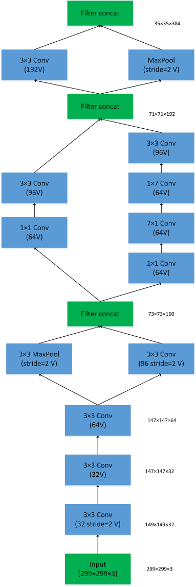

[TOC]

# 任务3：数据驱动应用

## 1.任务目标


<!-- 1. 了解经典的神经网络
2. 使用经典的神经网络完成计算机视觉四大任务之一-分类 -->
1. 认识数据在深度学习的视觉任务中不可忽视的地位。
2. 了解经典的深度神经网络
3. 在数据驱动的前提下，完成计算机视觉四大任务之分类


## 2.任务描述
图像分类旨在从图像、视频或者类似高维数据中识别物体的类别，原始的图像、视频或类似数据经过数据预处理后，进入图像分类模型进行前向预测，最终得到数据中每个实例的对应类别。


## 3.知识准备

### 3.1 知识概念

#### 图像分类
核心是从给定的分类集合中给图像分配一个标签的任务。实际上，这意味着我们的任务是分析一个输入图像并返回一个将图像分类的标签。标签总是来自预定义的可能类别集。

<div align="center">
    
</div>
　　示例：我们假定一个可能的类别集categories = {dog, cat, panda}，之后我们提供一张图片给分类系统：

图像分类目标是根据输入图片且根据预定义类别分配标签。这里的目标是根据输入图像，从类别集中分配一个类别，这里为dog。我们的分类系统也可以根据概率给图像分配多个标签，如dog:95%，cat:4%，panda:1%。更一般的，给定三个通道的W * H像素，我们的目标是取W* H *3=N个像素且找出正确分类图像内容的方法。

接下来将介绍相关经典模型。

### 3.2 LeNet-5
#### 模型介绍

​	LeNet-5是由$LeCun$ 提出的一种用于识别手写数字和机器印刷字符的卷积神经网络（Convolutional Neural Network，CNN）$^{[1]}$，其命名来源于作者$LeCun$的名字，5则是其研究成果的代号，在LeNet-5之前还有LeNet-4和LeNet-1鲜为人知。LeNet-5阐述了图像中像素特征之间的相关性能够由参数共享的卷积操作所提取，同时使用卷积、下采样（池化）和非线性映射这样的组合结构，是当前流行的大多数深度图像识别网络的基础。


#### 模型结构


​                                                                 LeNet-5网络结构图

​	如图所示，LeNet-5一共包含7层（输入层不作为网络结构），分别由2个卷积层、2个下采样层和3个连接层组成，网络的参数配置如表4.1所示，其中下采样层和全连接层的核尺寸分别代表采样范围和连接矩阵的尺寸（如卷积核尺寸中的$“5\times5\times1/1,6”$表示核大小为$5\times5\times1$、步长为$1​$且核个数为6的卷积核）。

​                                                                  LeNet-5网络参数配置

|     网络层      |       输入尺寸       |          核尺寸          |       输出尺寸       |          可训练参数量           |
| :-------------: | :------------------: | :----------------------: | :------------------: | :-----------------------------: |
|   卷积层$C_1$   | $32\times32\times1$  |  $5\times5\times1/1,6$   | $28\times28\times6$  |  $(5\times5\times1+1)\times6$   |
|  下采样层$S_2$  | $28\times28\times6$  |       $2\times2/2$       | $14\times14\times6$  |       $(1+1)\times6$ $^*$       |
|   卷积层$C_3$   | $14\times14\times6$  |  $5\times5\times6/1,16$  | $10\times10\times16$ |            $1516^*$             |
|  下采样层$S_4$  | $10\times10\times16$ |       $2\times2/2$       |  $5\times5\times16$  |         $(1+1)\times16$         |
| 卷积层$C_5$$^*$ |  $5\times5\times16$  | $5\times5\times16/1,120$ | $1\times1\times120$  | $(5\times5\times16+1)\times120$ |
|  全连接层$F_6$  | $1\times1\times120$  |      $120\times84$       |  $1\times1\times84$  |        $(120+1)\times84$        |
|     输出层      |  $1\times1\times84$  |       $84\times10$       |  $1\times1\times10$  |        $(84+1)\times10$         |

<!-- > ​	$^*$ 在LeNet中，下采样操作和池化操作类似，但是在得到采样结果后会乘以一个系数和加上一个偏置项，所以下采样的参数个数是$(1+1)\times6​$而不是零。
>
> ​	$^*$ $C_3$卷积层可训练参数并未直接连接$S_2$中所有的特征图（Feature Map），而是采用如图4.2所示的采样特征方式进行连接（稀疏连接），生成的16个通道特征图中分别按照相邻3个特征图、相邻4个特征图、非相邻4个特征图和全部6个特征图进行映射，得到的参数个数计算公式为$6\times(25\times3+1)+6\times(25\times4+1)+3\times(25\times4+1)+1\times(25\times6+1)=1516$，在原论文中解释了使用这种采样方式原因包含两点：限制了连接数不至于过大（当年的计算能力比较弱）;强制限定不同特征图的组合可以使映射得到的特征图学习到不同的特征模式。


​                                                                图4.2 $S_2$与$C_3$之间的特征图稀疏连接

> ​	$^*$ $C_5$卷积层在图4.1中显示为全连接层，原论文中解释这里实际采用的是卷积操作，只是刚好在$5\times5$卷积后尺寸被压缩为$1\times1​$，输出结果看起来和全连接很相似。 -->


#### 模型特性
- 卷积网络使用一个3层的序列组合：卷积、下采样（池化）、非线性映射（LeNet-5最重要的特性，奠定了目前深层卷积网络的基础）
- 使用卷积提取空间特征
- 使用映射的空间均值进行下采样
- 使用$tanh$或$sigmoid$进行非线性映射
- 多层神经网络（MLP）作为最终的分类器
- 层间的稀疏连接矩阵以避免巨大的计算开销


### 3.3 AlexNet

#### 模型介绍

​	AlexNet是由$Alex$ $Krizhevsky$提出的首个应用于图像分类的深层卷积神经网络，该网络在2012年ILSVRC（ImageNet Large Scale Visual Recognition Competition）图像分类竞赛中以15.3%的top-5测试错误率赢得第一名。AlexNet使用GPU代替CPU进行运算，使得在可接受的时间范围内模型结构能够更加复杂，它的出现证明了深层卷积神经网络在复杂模型下的有效性，使CNN在计算机视觉中流行开来，直接或间接地引发了深度学习的热潮。

#### 模型结构


​                                                                          AlexNet网络结构图

​	如图所示，除去下采样（池化层）和局部响应规范化操作（Local Responsible Normalization, LRN），AlexNet一共包含8层，前5层由卷积层组成，而剩下的3层为全连接层。网络结构分为上下两层，分别对应两个GPU的操作过程，除了中间某些层（$C_3$卷积层和$F_{6-8}$全连接层会有GPU间的交互），其他层两个GPU分别计算结 果。最后一层全连接层的输出作为$softmax$的输入，得到1000个图像分类标签对应的概率值。除去GPU并行结构的设计，AlexNet网络结构与LeNet十分相似，其网络的参数配置如表4.2所示。

​									 AlexNet网络参数配置

|        网络层         |               输入尺寸               |                  核尺寸                  |               输出尺寸               |              可训练参数量               |
| :-------------------: | :----------------------------------: | :--------------------------------------: | :----------------------------------: | :-------------------------------------: |
|   卷积层$C_1$ $^*$    |        $224\times224\times3$         | $11\times11\times3/4,48(\times2_{GPU})$  | $55\times55\times48(\times2_{GPU})$  | $(11\times11\times3+1)\times48\times2$  |
| 下采样层$S_{max}$$^*$ | $55\times55\times48(\times2_{GPU})$  |       $3\times3/2(\times2_{GPU})$        | $27\times27\times48(\times2_{GPU})$  |                    0                    |
|      卷积层$C_2$      | $27\times27\times48(\times2_{GPU})$  | $5\times5\times48/1,128(\times2_{GPU})$  | $27\times27\times128(\times2_{GPU})$ | $(5\times5\times48+1)\times128\times2$  |
|   下采样层$S_{max}$   | $27\times27\times128(\times2_{GPU})$ |       $3\times3/2(\times2_{GPU})$        | $13\times13\times128(\times2_{GPU})$ |                    0                    |
|   卷积层$C_3$ $^*$    |  $13\times13\times128\times2_{GPU}$  | $3\times3\times256/1,192(\times2_{GPU})$ | $13\times13\times192(\times2_{GPU})$ | $(3\times3\times256+1)\times192\times2$ |
|      卷积层$C_4$      | $13\times13\times192(\times2_{GPU})$ | $3\times3\times192/1,192(\times2_{GPU})$ | $13\times13\times192(\times2_{GPU})$ | $(3\times3\times192+1)\times192\times2$ |
|      卷积层$C_5$      | $13\times13\times192(\times2_{GPU})$ | $3\times3\times192/1,128(\times2_{GPU})$ | $13\times13\times128(\times2_{GPU})$ | $(3\times3\times192+1)\times128\times2$ |
|   下采样层$S_{max}$   | $13\times13\times128(\times2_{GPU})$ |       $3\times3/2(\times2_{GPU})$        |  $6\times6\times128(\times2_{GPU})$  |                    0                    |
|  全连接层$F_6$  $^*$  |   $6\times6\times128\times2_{GPU}$   |     $9216\times2048(\times2_{GPU})$      | $1\times1\times2048(\times2_{GPU})$  |       $(9216+1)\times2048\times2$       |
|     全连接层$F_7$     |  $1\times1\times2048\times2_{GPU}$   |     $4096\times2048(\times2_{GPU})$      | $1\times1\times2048(\times2_{GPU})$  |       $(4096+1)\times2048\times2$       |
|     全连接层$F_8$     |  $1\times1\times2048\times2_{GPU}$   |             $4096\times1000$             |         $1\times1\times1000$         |       $(4096+1)\times1000\times2$       |

<!-- >卷积层$C_1$输入为$224\times224\times3$的图片数据，分别在两个GPU中经过核为$11\times11\times3$、步长（stride）为4的卷积卷积后，分别得到两条独立的$55\times55\times48$的输出数据。
>
>下采样层$S_{max}$实际上是嵌套在卷积中的最大池化操作，但是为了区分没有采用最大池化的卷积层单独列出来。在$C_{1-2}$卷积层中的池化操作之后（ReLU激活操作之前），还有一个LRN操作，用作对相邻特征点的归一化处理。
>
>卷积层$C_3$ 的输入与其他卷积层不同，$13\times13\times192\times2_{GPU}$表示汇聚了上一层网络在两个GPU上的输出结果作为输入，所以在进行卷积操作时通道上的卷积核维度为384。
>
>全连接层$F_{6-8}$中输入数据尺寸也和$C_3$类似，都是融合了两个GPU流向的输出结果作为输入。 -->


#### 模型特性
- 所有卷积层都使用ReLU作为非线性映射函数，使模型收敛速度更快
- 在多个GPU上进行模型的训练，不但可以提高模型的训练速度，还能提升数据的使用规模
- 使用LRN对局部的特征进行归一化，结果作为ReLU激活函数的输入能有效降低错误率
- 重叠最大池化（overlapping max pooling），即池化范围z与步长s存在关系$z>s$（如$S_{max}$中核尺度为$3\times3/2$），避免平均池化（average pooling）的平均效应
- 使用随机丢弃技术（dropout）选择性地忽略训练中的单个神经元，避免模型的过拟合


### 3.4 VGG系列
#### 模型介绍

​	VGGNet是由牛津大学视觉几何小组（Visual Geometry Group, VGG）提出的一种深层卷积网络结构，他们以7.32%的错误率赢得了2014年ILSVRC分类任务的亚军（冠军由GoogLeNet以6.65%的错误率夺得）和25.32%的错误率夺得定位任务（Localization）的第一名（GoogLeNet错误率为26.44%），网络名称VGGNet取自该小组名缩写。VGGNet是首批把图像分类的错误率降低到10%以内模型，同时该网络所采用的$3\times3$卷积核的思想是后来许多模型的基础，该模型发表在2015年国际学习表征会议（International Conference On Learning Representations, ICLR）后至今被引用的次数已经超过1万4千余次。

#### 模型结构


​								VGG16网络结构图

​	在原论文中的VGGNet包含了6个版本的演进，分别对应VGG11、VGG11-LRN、VGG13、VGG16-1、VGG16-3和VGG19，不同的后缀数值表示不同的网络层数（VGG11-LRN表示在第一层中采用了LRN的VGG11，VGG16-1表示后三组卷积块中最后一层卷积采用卷积核尺寸为$1\times1$，相应的VGG16-3表示卷积核尺寸为$3\times3$），本节介绍的VGG16为VGG16-3。图中的VGG16体现了VGGNet的核心思路，使用$3\times3$的卷积组合代替大尺寸的卷积（2个$3\times3卷积即可与$$5\times5$卷积拥有相同的感受视野），网络参数设置如表4.5所示。

​								表4.5 VGG16网络参数配置

|         网络层         |       输入尺寸        |         核尺寸          |        输出尺寸        |            参数个数             |
| :--------------------: | :-------------------: | :---------------------: | :--------------------: | :-----------------------------: |
|  卷积层$C_{11}$  | $224\times224\times3$ |  $3\times3\times64/1$   | $224\times224\times64$ | $(3\times3\times3+1)\times64$  |
|  卷积层$C_{12}$  | $224\times224\times64$ | $3\times3\times64/1$   | $224\times224\times64$ | $(3\times3\times64+1)\times64$ |
| 下采样层$S_{max1}$ | $224\times224\times64$ |  $2\times2/2$         | $112\times112\times64$ | $0$ |
|  卷积层$C_{21}$  | $112\times112\times64$  | $3\times3\times128/1$ | $112\times112\times128$ | $(3\times3\times64+1)\times128$  |
|  卷积层$C_{22}$  | $112\times112\times128$ | $3\times3\times128/1$  | $112\times112\times128$ | $(3\times3\times128+1)\times128$ |
| 下采样层$S_{max2}$ | $112\times112\times128$ |  $2\times2/2$         | $56\times56\times128$ | $0$ |
|  卷积层$C_{31}$  | $56\times56\times128$  | $3\times3\times256/1$ | $56\times56\times256$  | $(3\times3\times128+1)\times256$ |
|  卷积层$C_{32}$  | $56\times56\times256$ | $3\times3\times256/1$  | $56\times56\times256$  | $(3\times3\times256+1)\times256$ |
|  卷积层$C_{33}$  | $56\times56\times256$ | $3\times3\times256/1$  | $56\times56\times256$  | $(3\times3\times256+1)\times256$ |
| 下采样层$S_{max3}$ | $56\times56\times256$ |  $2\times2/2$         | $28\times28\times256$ | $0$ |
|  卷积层$C_{41}$  | $28\times28\times256$ | $3\times3\times512/1$  | $28\times28\times512$  | $(3\times3\times256+1)\times512$ |
|  卷积层$C_{42}$  | $28\times28\times512$ | $3\times3\times512/1$  | $28\times28\times512$  | $(3\times3\times512+1)\times512$ |
|  卷积层$C_{43}$  | $28\times28\times512$ | $3\times3\times512/1$  | $28\times28\times512$  | $(3\times3\times512+1)\times512$ |
| 下采样层$S_{max4}$ | $28\times28\times512$ |  $2\times2/2$         | $14\times14\times512$ | $0$ |
|  卷积层$C_{51}$  | $14\times14\times512$ | $3\times3\times512/1$  | $14\times14\times512$  | $(3\times3\times512+1)\times512$ |
|  卷积层$C_{52}$  | $14\times14\times512$ | $3\times3\times512/1$  | $14\times14\times512$  | $(3\times3\times512+1)\times512$ |
|  卷积层$C_{53}$  | $14\times14\times512$ | $3\times3\times512/1$  | $14\times14\times512$  | $(3\times3\times512+1)\times512$ |
| 下采样层$S_{max5}$ | $14\times14\times512$ |  $2\times2/2$         | $7\times7\times512$ | $0$ |
| 全连接层$FC_{1}$ |  $7\times7\times512$  |  $(7\times7\times512)\times4096$ | $1\times4096$ | $(7\times7\times512+1)\times4096$ |
| 全连接层$FC_{2}$ | $1\times4096$ |  $4096\times4096$   | $1\times4096$ | $(4096+1)\times4096$ |
| 全连接层$FC_{3}$ | $1\times4096$ |  $4096\times1000$   | $1\times1000$ | $(4096+1)\times1000$ |

#### 模型特性

- 整个网络都使用了同样大小的卷积核尺寸$3\times3$和最大池化尺寸$2\times2$。
- $1\times1$卷积的意义主要在于线性变换，而输入通道数和输出通道数不变，没有发生降维。
- 两个$3\times3$的卷积层串联相当于1个$5\times5$的卷积层，感受野大小为$5\times5$。同样地，3个$3\times3$的卷积层串联的效果则相当于1个$7\times7$的卷积层。这样的连接方式使得网络参数量更小，而且多层的激活函数令网络对特征的学习能力更强。
- VGGNet在训练时有一个小技巧，先训练浅层的的简单网络VGG11，再复用VGG11的权重来初始化VGG13，如此反复训练并初始化VGG19，能够使训练时收敛的速度更快。
- 在训练过程中使用多尺度的变换对原始数据做数据增强，使得模型不易过拟合。

### 3.5 Inception系列

#### 模型介绍

​	GoogLeNet作为2014年ILSVRC在分类任务上的冠军，以6.65%的错误率力压VGGNet等模型，在分类的准确率上面相比过去两届冠军ZFNet和AlexNet都有很大的提升。从名字**GoogLe**Net可以知道这是来自谷歌工程师所设计的网络结构，而名字中Goog**LeNet**更是致敬了LeNet$^{[0]}$。GoogLeNet中最核心的部分是其内部子网络结构Inception，该结构灵感来源于NIN，至今已经经历了四次版本迭代（Inception$_{v1-4}$）。


​					Inception性能比较图

#### 模型结构


​					 GoogLeNet网络结构图
​	如图中所示，GoogLeNet相比于以前的卷积神经网络结构，除了在深度上进行了延伸，还对网络的宽度进行了扩展，整个网络由许多块状子网络的堆叠而成，这个子网络构成了Inception结构。图4.9为Inception的四个版本：$Inception_{v1}​$在同一层中采用不同的卷积核，并对卷积结果进行合并;$Inception_{v2}​$组合不同卷积核的堆叠形式，并对卷积结果进行合并;$Inception_{v3}​$则在$v_2​$基础上进行深度组合的尝试;$Inception_{v4}​$结构相比于前面的版本更加复杂，子网络中嵌套着子网络。

$Inception_{v1}$


$Inception_{v2}$


$Inception_{v3}$


$Inception_{v4}$




​					Inception$_{v1-4}$结构图

​					GoogLeNet中Inception$_{v1}$网络参数配置

|         网络层         |       输入尺寸        |         核尺寸          |        输出尺寸        |            参数个数             |
| :--------------------: | :-------------------: | :---------------------: | :--------------------: | :-----------------------------: |
|  卷积层$C_{11}$  | $H\times{W}\times{C_1}$  |  $1\times1\times{C_2}/2$   | $\frac{H}{2}\times\frac{W}{2}\times{C_2}$ | $(1\times1\times{C_1}+1)\times{C_2}$  |
|  卷积层$C_{21}$  | $H\times{W}\times{C_2}$ |  $1\times1\times{C_2}/2$   | $\frac{H}{2}\times\frac{W}{2}\times{C_2}$ | $(1\times1\times{C_2}+1)\times{C_2}$  |
|  卷积层$C_{22}$  | $H\times{W}\times{C_2}$ |  $3\times3\times{C_2}/1$   | $H\times{W}\times{C_2}/1$ | $(3\times3\times{C_2}+1)\times{C_2}$  |
|  卷积层$C_{31}$  | $H\times{W}\times{C_1}$ |  $1\times1\times{C_2}/2$   | $\frac{H}{2}\times\frac{W}{2}\times{C_2}$ | $(1\times1\times{C_1}+1)\times{C_2}$  |
|  卷积层$C_{32}$  | $H\times{W}\times{C_2}$ |  $5\times5\times{C_2}/1$   | $H\times{W}\times{C_2}/1$ | $(5\times5\times{C_2}+1)\times{C_2}$  |
|  下采样层$S_{41}$ | $H\times{W}\times{C_1}$ |  $3\times3/2$   | $\frac{H}{2}\times\frac{W}{2}\times{C_2}$ | $0$  |
|  卷积层$C_{42}$  | $\frac{H}{2}\times\frac{W}{2}\times{C_2}$ |  $1\times1\times{C_2}/1$   | $\frac{H}{2}\times\frac{W}{2}\times{C_2}$ | $(3\times3\times{C_2}+1)\times{C_2}$  |
|  合并层$M$ | $\frac{H}{2}\times\frac{W}{2}\times{C_2}(\times4)$ | 拼接 | $\frac{H}{2}\times\frac{W}{2}\times({C_2}\times4)$ | $0$ |

#### 模型特性

- 采用不同大小的卷积核意味着不同大小的感受野，最后拼接意味着不同尺度特征的融合； 

- 之所以卷积核大小采用1、3和5，主要是为了方便对齐。设定卷积步长stride=1之后，只要分别设定pad=0、1、2，那么卷积之后便可以得到相同维度的特征，然后这些特征就可以直接拼接在一起了；

- 网络越到后面，特征越抽象，而且每个特征所涉及的感受野也更大了，因此随着层数的增加，3x3和5x5卷积的比例也要增加。但是，使用5x5的卷积核仍然会带来巨大的计算量。 为此，文章借鉴NIN2，采用1x1卷积核来进行降维。


## 4. 任务实施

主要采用cifar10数据集完成此次的教学分类任务。

首先将数据划分为训练集和验证集，并对进行数据增强以增加训练样本。可以将样本可视化检视训练数据。之后设计卷积神经网络对图像进行特征的提取并进行分类：对于输入格式为$H*W*3$的图片，使用卷积层提取图像特征，使用池化层压缩参数和计算量，最后使用全连接层根据提取得到的特征进行分类。训练完成后，使用模型在验证集上进行预测，可将结果可视化以检查预测情况。将模型的分类结果和数据原本的标签做比较，可以得到模型预测的准确率。除了从头开始训练一个模型外，也可以选择预训练的模型在数据集上进行微调。


### 4.1 实施思路

<div align="center">
    
</div>

### 4.2 实施步骤


```
import tensorflow as tf
from utils import cifar10_input
```


```
# 我们定义一个批次有64个样本
batch_size = 64

# 获取训练集
# 在使用随机梯度下降法的时候, 训练集要求打乱样本
train_imgs, train_labels = cifar10_input.inputs(eval_data=False,data_dir='cifar10_data/cifar-10-batches-bin/',batch_size=batch_size, shuffle=True)

# 获取测试集
# 测试集不需要打乱样本
val_imgs, val_labels = cifar10_input.inputs(eval_data=True,data_dir='cifar10_data/cifar-10-batches-bin/', batch_size=batch_size, shuffle=False)

train_examples = cifar10_input.NUM_EXAMPLES_PER_EPOCH_FOR_TRAIN    # 训练样本的个数
val_examples = cifar10_input.NUM_EXAMPLES_PER_EPOCH_FOR_EVAL       # 测试样本的个数
```


```
# 像之前一样, 我们构造几个生成变量的函数
def variable_weight(shape, stddev=5e-2):
    init = tf.truncated_normal_initializer(stddev=stddev)
    return tf.get_variable(shape=shape, initializer=init, name='weight')

def variable_bias(shape):
    init = tf.constant_initializer(0.1)
    return tf.get_variable(shape=shape, initializer=init, name='bias')
```

前面的课程大家已经见过如何使用卷积和池化了, 但是由于tensorflow提供的接口是底层的, 为了方便, 我们写一个上层的接口来调用。


```
def conv(x, ksize, out_depth, strides, padding='SAME', act=tf.nn.relu, scope='conv_layer', reuse=None):
    """构造一个卷积层
    Args:
        x: 输入
        ksize: 卷积核的大小, 一个长度为2的`list`, 例如[3, 3]
        output_depth: 卷积核的个数
        strides: 卷积核移动的步长, 一个长度为2的`list`, 例如[2, 2]
        padding: 卷积核的补0策略
        act: 完成卷积后的激活函数, 默认是`tf.nn.relu`
        scope: 这一层的名称(可选)
        reuse: 是否复用
    
    Return:
        out: 卷积层的结果
    """
    # 这里默认数据是NHWC输入的
    in_depth = x.get_shape().as_list()[-1]
    
    with tf.variable_scope(scope, reuse=reuse):
        # 先构造卷积核
        shape = ksize + [in_depth, out_depth]
        with tf.variable_scope('kernel'):
            kernel = variable_weight(shape)
            
        strides = [1, strides[0], strides[1], 1]
        # 生成卷积
        conv = tf.nn.conv2d(x, kernel, strides, padding, name='conv')
        
        # 构造偏置
        with tf.variable_scope('bias'):
            bias = variable_bias([out_depth])
            
        # 和偏置相加
        preact = tf.nn.bias_add(conv, bias)
        
        # 添加激活层
        out = act(preact)
        
        return out
```


```
def max_pool(x, ksize, strides, padding='SAME', name='pool_layer'):
    """构造一个最大值池化层
    Args:
        x: 输入
        ksize: pooling核的大小, 一个长度为2的`list`, 例如[3, 3]
        strides: pooling核移动的步长, 一个长度为2的`list`, 例如[2, 2]
        padding: pooling的补0策略
        name: 这一层的名称(可选)
    
    Return:
        pooling层的结果
    """
    return tf.nn.max_pool(x, [1, ksize[0], ksize[1], 1], [1, strides[0], strides[1], 1], padding, name=name)
```


```
def fc(x, out_depth, act=tf.nn.relu, scope='fully_connect', reuse=None):
    """构造一个全连接层
    Args:
        x: 输入
        out_depth: 输出向量的维数
        act: 激活函数, 默认是`tf.nn.relu`
        scope: 名称域, 默认是`fully_connect`
        reuse: 是否需要重用
    """
    in_depth = x.get_shape().as_list()[-1]
    
    # 构造全连接层的参数
    with tf.variable_scope(scope, reuse=reuse):
        # 构造权重
        with tf.variable_scope('weight'):
            weight = variable_weight([in_depth, out_depth])
            
        # 构造偏置项
        with tf.variable_scope('bias'):
            bias = variable_bias([out_depth])
        
        # 一个线性函数
        fc = tf.nn.bias_add(tf.matmul(x, weight), bias, name='fc')
        
        # 激活函数作用
        out = act(fc)
        
        return out
```


有了上面这些上层函数之后, 我们就可以轻松构建我们所需的网络了。


```
def alexnet(inputs, reuse=None):
    """构建 Alexnet 的前向传播
    Args:
        inpus: 输入
        reuse: 是否需要重用
        
    Return:
        net: alexnet的结果
    """
    # 首先我们声明一个变量域`AlexNet`
    with tf.variable_scope('AlexNet', reuse=reuse):
        # 第一层是 5x5 的卷积, 卷积核的个数是64, 步长是 1x1, padding是`VALID`
        net = conv(inputs, [5, 5], 64, [1, 1], padding='VALID', scope='conv1')
        
        # 第二层是 3x3 的池化, 步长是 2x2, padding是`VALID`
        net = max_pool(net, [3, 3], [2, 2], padding='VALID', name='pool1')
        
        # 第三层是 5x5 的卷积, 卷积核的个数是64, 步长是 1x1, padding是`VALID`
        net = conv(net, [5, 5], 64, [1, 1], scope='conv2')
        
        # 第四层是 3x3 的池化, 步长是 2x2, padding是`VALID`
        net = max_pool(net, [3, 3], [2, 2], padding='VALID', name='pool2')
        
        # 将矩阵拉长成向量
        net = tf.reshape(net, [-1, 6*6*64])
        
        # 第五层是全连接层, 输出个数为384
        net = fc(net, 384, scope='fc3')
        
        # 第六层是全连接层, 输出个数为192
        net = fc(net, 192, scope='fc4')
        
        # 第七层是全连接层, 输出个数为10, 注意这里不要使用激活函数
        net = fc(net, 10, scope='fc5', act=tf.identity)
        
        return net
```
通过 alexnet 构建训练和测试的输出


```
train_out = alexnet(train_imgs)
```

注意当再次调用 alexnet 函数时, 如果要使用之前调用时产生的变量值, 必须要重用变量域


```
val_out = alexnet(val_imgs, reuse=True)
```

- 定义损失函数

这里真实的 labels 不是一个 one_hot 型的向量, 而是一个数值, 因此我们使用 


```
with tf.variable_scope('loss'):
    train_loss = tf.losses.sparse_softmax_cross_entropy(labels=train_labels, logits=train_out, scope='train')
    val_loss = tf.losses.sparse_softmax_cross_entropy(labels=val_labels, logits=val_out, scope='val')
```

- 定义正确率
```
with tf.name_scope('accuracy'):
    with tf.name_scope('train'):
        train_acc = tf.reduce_mean(tf.cast(tf.equal(tf.argmax(train_out, axis=-1, output_type=tf.int32), train_labels), tf.float32))
    with tf.name_scope('train'):
        val_acc = tf.reduce_mean(tf.cast(tf.equal(tf.argmax(val_out, axis=-1, output_type=tf.int32), val_labels), tf.float32))
```
- 构造训练

```
#学习率0.01
lr = 0.01

opt = tf.train.MomentumOptimizer(lr, momentum=0.9)
train_op = opt.minimize(train_loss)
```
在这里我们已经将训练过程封装好了, 感兴趣的同学可以进入 train.py 查看

```,
#这里为了控制时间，预设的迭代次数为4000，如有条件可设为20000次，准备率会有显著提升。
from utils.learning import train
train(train_op, train_loss, train_acc, val_loss, val_acc, 4000, batch_size)
```


## 5.任务拓展

### 5.1 为什么现在的CNN模型都是在GoogleNet、VGGNet或者AlexNet上调整的？

- 评测对比：为了让自己的结果更有说服力，在发表自己成果的时候会同一个标准的baseline及在baseline上改进而进行比较，常见的比如各种检测分割的问题都会基于VGG或者Resnet101这样的基础网络。
- 时间和精力有限：在科研压力和工作压力中，时间和精力只允许大家在有限的范围探索。
- 模型创新难度大：进行基本模型的改进需要大量的实验和尝试，并且需要大量的实验积累和强大灵感，很有可能投入产出比比较小。
- 资源限制：创造一个新的模型需要大量的时间和计算资源，往往在学校和小型商业团队不可行。
- 在实际的应用场景中，其实是有大量的非标准模型的配置。

### 5.2 优化思路
- 数据

    归一化：除了预处理阶段的归一化，可以尝试加入卷积层间的归一化


- 模型
  
    深度：可以尝试加深网络层数（如使用 resnet-34）


## 6 拓展实训

<!-- ### 7.1 实训目的

1. 熟悉经典网络的网络结构
2. 掌握复现网络的代码能力


### 7.2 实训内容

1. 根据AlexNet的启发，尝试利用先进的训练方式改进LeNet。
2. 根据提供的LeNet代码完成实训内容，保存模型并可视化预测结果。 -->

1. 在神经网络中进行特征提取的主要操作是（） 【分值：20】
   
   A.数据预处理 B.池化层 C.卷积层 D.全连接层
2. 以下哪些数据操作可以提高模型的预测能力？ 【分值：20】
   
   A.数据增强 B.数据归一化 C.激活层 D.划分数据集 E.数据复制
3. 模型预训练阶段和实际模型训练阶段使用的数据集必须相同 【分值：20】
4. 微调（fine-tune）阶段卷积层的参数保持不变，只更新全连接层的参数 【分值：20】
5. 案例中使用了哪种损失函数？ 【分值：20】
6. 请简述案例中模型各个操作层的作用 【分值：0】