[TOC]

# 任务5：图像增强

## 1.任务目标

<!-- 1. 
2. 
3. 
4.  -->

- 了解图像增强的方法
- 能够通过传统的算法增强图像
- 学习利用深度学习的方法增强图像


## 2.任务描述


- 在过去的几年中，紧凑型相机传感器的质量有了显着提高，这使移动摄影达到了新的水平。由于采用了先进的后处理软件和硬件工具，即使是低端设备也能在适当的照明条件下拍摄出相当不错的照片。但是，就艺术质量而言，移动设备仍落后于其数码单反相机。较大的传感器和高光圈光学元件可提供更好的照片分辨率，色彩再现和更低的噪点，而它们的附加传感器有助于微调拍摄参数。这些物理差异会导致严重的障碍，使得紧凑型移动设备无法达到DSLR相机的质量。
- 尽管存在许多用于自动图像增强的摄影师工具，但它们通常只专注于调整全局参数（例如对比度或亮度），而不会提高纹理质量或不考虑图像语义。除此之外，它们通常基于一组预定义的规则，这些规则并不总是考虑特定设备的细节。因此，照片后期处理的主要方法仍然基于使用专用润饰软件的手动图像校正。


## 3.知识准备


### 3.1图像模糊产生的原因
1. 相机抖动，拍摄时相机不稳，全部画面被模糊。
2. 物体的运动，部分物体运动，不同区域模糊不同。
3. 镜头失焦，大光圈小景深时的效果，等等。


### 3.2基于直方图均衡化的图像增强


直方图均衡化是通过调整图像的灰阶分布，使得在0~255灰阶上的分布更加均衡，提高了图像的对比度，达到改善图像主观视觉效果的目的。对比度较低的图像适合使用直方图均衡化方法来增强图像细节。


### 3.3基于拉普拉斯算子的图像增强


使用中心为5的8邻域拉普拉斯算子与图像卷积可以达到锐化增强图像的目的，拉普拉斯算子如下图所示：

$$
 \begin{matrix}
   0 & -1& 0 \\
   -0 & 5& -1 \\
   0 & -1& 0 
  \end{matrix} 
$$
拉普拉斯算子可以增强局部的图像对比度。

### 3.4基于对数Log变换的图像增强


对数变换可以将图像的低灰度值部分扩展，显示出低灰度部分更多的细节，将其高灰度值部分压缩，减少高灰度值部分的细节，从而达到强调图像低灰度部分的目的。变换方法：

<!-- <div align=center>
    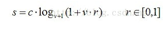
</div> -->

$$s=c\cdot log_{v+1}{(1+v\cdot r)} \qquad r\in [0,1]$$


对数变换对图像低灰度部分细节增强的功能过可以从对数图上直观理解：
<div align=center>
    <!--  -->
    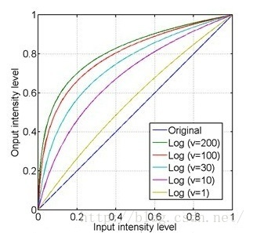
</div>


- x轴的0.4大约对应了y轴的0.8，即原图上0~0.4的低灰度部分经过对数运算后扩展到0~0.8的部分，而整个0.4~1的高灰度部分被投影到只有0.8~1的区间，这样就达到了扩展和增强低灰度部分，压缩高灰度部分的值的功能。
- 从上图还可以看到，对于不同的底数，底数越大，对低灰度部分的扩展就越强，对高灰度部分的压缩也就越强。


### 3.5基于伽马变换的图像增强

伽马变换主要用于图像的校正，将灰度过高或者灰度过低的图片进行修正，增强对比度。变换公式就是对原图像上每一个像素值做乘积运算：

<!-- <div align=center>
    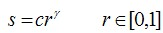
</div> -->

$$s=cr^\gamma \qquad \gamma \in [0,1]$$

伽马变换对图像的修正作用其实就是通过增强低灰度或高灰度的细节实现的，从伽马曲线可以直观理解：

<div align=center>
    <!--  -->
    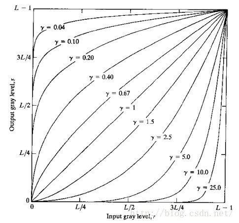
</div>

- γ值以1为分界，值越小，对图像低灰度部分的扩展作用就越强，值越大，对图像高灰度部分的扩展作用就越强，通过不同的γ值，就可以达到增强低灰度或高灰度部分细节的作用。
- 伽马变换对于图像对比度偏低，并且整体亮度值偏高（对于于相机过曝）情况下的图像增强效果明显。


### 3.6 基于卷积神经网络的图像增强

基于深度学习的方法和传统的优化的方法都提出了对于图像的非均匀模糊问题进行了解决，但对于动态场景的模糊问题，也就是图像中只有局部区域存在模糊的问题难以解决。2017年，Seungjun等人总结现有的图像去模糊算法中存在的问题为：

1. 难以获得实测清晰图像和模糊图像对用于训练图像去模糊网络；
2. 对于动态场景的图像去模糊问题，难以获得局部图像的模糊核；
3. 去模糊问题需要较大的感受野。
- 针对上述提出的问题，作者提出了一种实测动态场景图像合成的方式，并公开了用于动态场景的图像去模糊数据集gopro_large， gopro数据集已经成为目前基于深度学习的去模糊算法最常用的数据集之一 。而针对难以获得动态场景的局部区域的模糊核问题，作者选择一种基于深度学习的端到端的图像去模糊的算法，抛弃了传统的方法先估计模糊核在估计清晰图像的策略，使用卷积神经网络从退化图像中直接复原清晰图像。并且仿照 传统的图像去模糊问题中多尺度的复原策略融入到网络中，网络设计如下图所示。

<div align=center>
    <!--  -->
    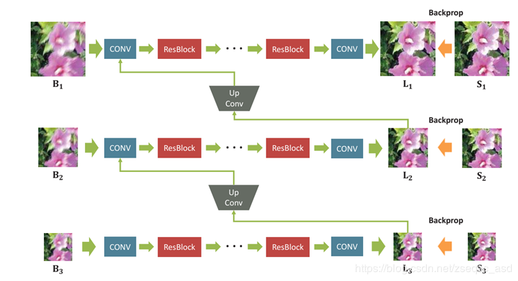
</div>

- 作者通过三个多尺度的卷积神经网络，其中B1为待复原图像，分别降采样两次为B2 B3，将降采样的结果分别输入到网络中得到相应分辨率尺寸下复原结果，并将复原结果作为下一阶段的输入，从而知道后续的复原。这种多尺度的策略，类似于传统的模糊核估计中的由粗到细的策略，将复杂的问题进行分解，逐步复原，先在低分辨率下复原大尺度的信息，然后再高分辨率下复原细节信息。简化问题的同时增大了图像的感受野。
- 与文献Learning a Convolutional Neural Network for Non-uniform Motion Blur Removal对比的实验结果如图2所示。在视觉上提出的方法取得更好的视觉效果。在数据集GOPRO上的测试指标如表1所示，并对比了方法间，在不同的网络尺度数下的实验结果。

<div align=center>
    <!--  -->
    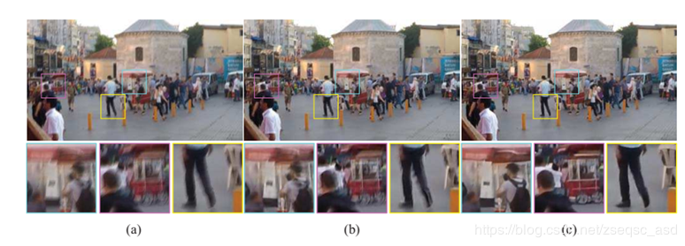
</div>

### 3.7 基于Gan的图像去模糊算法

- Gan为对抗生成网络，首次在文献Generative Adversarial Nets中被提出，应用于图像生成。随着Gan的发展逐步应用于图像复原领域。该文献提出将Gan应用于图像去模糊问题上。实现了一种基于深度学习的端到端的图像去模糊。提出的Gan的生成器网络模型如图3所示。生成器由两个步长为1/2的卷积网络、9个ResBlock和两个反卷积网络组成。每个ResBlock包括卷积层、instance normalization层和ReLU激活层。


<div align=center>
    <!--  -->
    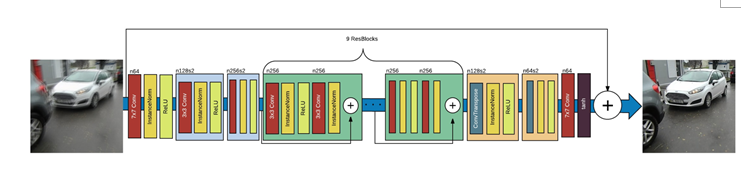
</div>

<div align=center>
    <!--  -->
    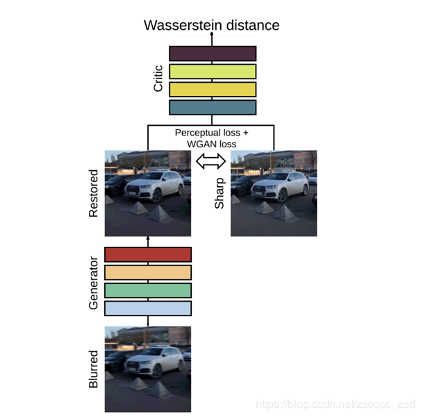
</div>

上图为 生成器网络结构图和DeblurGan网络结构示意图


## 4. 任务实施
- 通过python实现上述算法，体会算法，反思改进的思路，然后通过利用深度学习的算法来尝试增强图像。
### 4.1 实施思路

- 根据知识点中提及到的数学公式，将图像增强算法的函数复现，然后利用已有图片，进行图像增强。

### 4.2 实施步骤
#### 步骤1：
- 导入用到的相关模块:
```
%matplotlib inline

import cv2
import numpy as np
from matplotlib import pyplot as plt
```


#### 步骤2：
- 显示原图:
```
#  opencv 的接口使用BGR模式，而 matplotlib.pyplot 接口使用的是RGB模式
img = cv2.imread("img1.jpg", 1)

b, g, r = cv2.split(img)
srcImage_new = cv2.merge([r, g, b])
plt.imshow(srcImage_new)
```


#### 步骤3：
```
# 彩色图像均衡化,需要分解通道 对每一个通道均衡化
(b, g, r) = cv2.split(img)
bH = cv2.equalizeHist(b)
gH = cv2.equalizeHist(g)
rH = cv2.equalizeHist(r)
# 合并每一个通道
result = cv2.merge((rH, gH, bH))
# cv2.imshow("dst", result)

plt.imshow(result)

```

#### 步骤4：
```
# Gamma图像增强
def adjust_gamma(src,gamma=2.0):
    scale = float(np.iinfo(src.dtype).max - np.iinfo(src.dtype).min)
    dst = ((src.astype(np.float32) / scale) ** gamma) * scale
    dst = np.clip(dst,0,255).astype(np.uint8)
    return dst
g_result = adjust_gamma(srcImage_new)
plt.imshow(g_result)
```

#### 步骤5：
```
# log对数图像增强
def log_enhance(src):
   
    scale = float(np.iinfo(src.dtype).max - np.iinfo(src.dtype).min)
    dst = np.log2(src.astype(np.float32) / scale + 1) * scale
    dst = np.clip(dst,0,255).astype(np.uint8)
    return dst
l_result = log_enhance(srcImage_new)
plt.imshow(l_result)
```

#### 步骤6 使用深度模型进行增强：
1. 环境和参数配置

接下来我们介绍如何利用pytorch深度学习工具实现一个端到端的图像去模糊模型，通过参数设置、加载数据、构建模型、训练模型和测试用例依次实现一个图像去模糊工具，在训练和预处理过程中通过可视化监督训练过程。 

模型采用了残差形式的CNN，输入和输出都采用高斯金字塔（Gaussian pyramid）的形式。整个网络结构由三个相似的CNN构成，分别对应输入金字塔中的每一层。网络最前面是分辨率最低的子网络（coarest level network），在这个子网络最后，是“upconvolution layer”，将重建的低分辨率图像放大为高分辨率图像，然后和高一层的子网络的输入连接在一起，作为上层网络的输入。

<div align=center>
    <!--  -->
    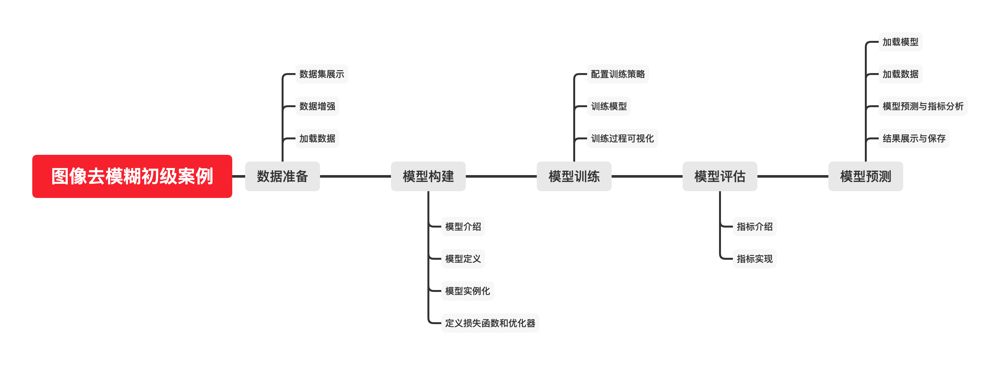
</div>

📦root<br>
┣ 📂datasets   # 实验所用数据集下载并解压到当前目录<br>
┃ ┣ 📂train  # 训练集<br>
┃ ┗ 📂test  # 测试集<br>
┣ 📂pictures   # 存放 notebook 中所需图片<br>
┣ 📂result   # 存放输出的结果<br>
┣ 📂models   # 存放训练过程中的断点和训练好的模型<br>
┣ 📜图像去模糊初级案例.ipynb  # 当前 notebook<br>
┗ 📜图像去模糊初级案例-标准提交件清单.xlsx  # 案例配套材料说明文档<br>

```
# 网络原因可能安装失败，请多试几次~
# !pip install pytorch-msssim tensorboardX torchsummary tqdm 
# !pip install ipywidgets # 用于显示 notebook 进度条
# !jupyter nbextension enable --py widgetsnbextension
```

```
import os
import random

import matplotlib.pyplot as plt
import numpy as np
import pytorch_msssim # 用于计算指标 ssim 和 mssim
import torch
import torch.nn as nn
import torch.optim as optim
from PIL import Image
from tensorboardX import SummaryWriter
from torchsummary import summary
from torch.optim import lr_scheduler
from torch.utils import data
from torchvision import transforms
from tqdm.notebook import tqdm

%matplotlib inline
```

由于数据集较大，模型较为复杂，虽然已经经过简化，但训练时仍然有很多参数，为了便于管理和修改，本教程将整个过程中的所有参数整理如下，具体的使用将在下文中依次介绍。

```
class Config():
    def __init__(self, name="Configs"):

        # train set
        self.data_dir = 'datasets/train' # 训练集目录
        self.patch_size = 256  # 输入模型的 patch 的尺寸
        self.batch_size = 2 #16   # 训练时每个 batch 中的样本个数
        self.n_threads = 1 #8     # 用于加载数据的线程数
        # test set
        self.test_data_dir = 'datasets/test' # 测试集目录
        self.test_batch_size = 1 # 测试时的 batch_size
        # model
        self.multi = True # 模型采用多尺度方法（True）
        self.skip = True  # 模型采用滑动连接方法
        self.n_resblocks = 3 #9 # resblock 的个数
        self.n_feats = 8 #64 # feature map 的个数
        # optimization
        self.lr = 1e-4    # 初始学习率
        self.epochs = 1 #800 # 训练的 epoch 的数目
        self.lr_step_size = 600 # 采用步进学习率策略所用的 step_size
        self.lr_gamma = 0.1 # 每 lr_step_size 后，学习率变为 lr*lr_gamma
        # global
        self.name = name # 配置的名称
        self.save_dir = 'temp/result' # 保存训练过程中所产生数据得目录
        self.save_cp_dir = 'temp/models' # 保存 checkpoint 的目录
        self.imgs_dir = 'datasets/pictures' # 此 notebook 所需的图片目录

        if not os.path.exists(self.save_dir):
            os.mkdir(self.save_dir)
        if not os.path.exists(self.save_cp_dir):
            os.mkdir(self.save_cp_dir)


args = Config(name="image-deblurring")
```

#### 步骤7 数据准备：
因为本教程所使用的的模型包含有多尺度因素，所以需要对数据进行下采样，并且考虑到数据集图片较大，为了减小开销，采用 patch-based 的方法，并用数据增强来防止过拟合。这里的 patch-based 指对每一个输入图像进行随机裁剪，得到 path_size 大小的图片，然后再输入模型进行训练，详细解释见此文。
- 该小节整个数据准备的流程可以分为：
1. 数据集展示
2. 数据增强
3. 构造 dataset 类
4. 数据加载 dataloader 

##### 数据展示

通过 0.1 小节中给的链接，将数据集 GOPRO 下载并解压到 dataset 根目录下，最终数据集目录如 0.2 小节所示。
读取数据集中的某个样本，如下图所示。为了方便自由修改查看，将路径拆分为多个部分。

```
sample_idx = 1 # 样本编号
blur_path = os.path.join(args.imgs_dir, f"blur/test{sample_idx}.png") # 模糊图片
sharp_path = os.path.join(args.imgs_dir, f"sharp/test{sample_idx}.png") # 去模糊图片
blur_img = plt.imread(blur_path)
sharp_img = plt.imread(sharp_path)
```

```
# 可视化图片如下图所示
plt.figure(figsize=(10,4))
plt.subplot(121);plt.imshow(blur_img);
plt.subplot(122);plt.imshow(sharp_img);
plt.show()
```
左边为模糊的图片，其具体产生方法为：使用了一个高速摄像头快速记录下一连串清晰图像，然后将这些间隔时间非常短的清晰图像求平均来获得模糊图像。右边为清晰的图像。

##### 数据增强

为了防止过拟合，需要对数据集进行数据增强，增强方式如下所示，对每一个输入图像，都将其进行随机角度旋转，旋转的角度在 [0, 90, 180, 270] 中随机选取。除此之外，考虑到图像质量下降，对 HSV 颜色空间的饱和度乘以 0.8 到 1.2 内的随机数。

```
def augment(img_input, img_target):
    degree = random.choice([0, 90, 180, 270])
    img_input = transforms.functional.rotate(img_input, degree)
    img_target = transforms.functional.rotate(img_target, degree)

    # color augmentation
    img_input = transforms.functional.adjust_gamma(img_input, 1)
    img_target = transforms.functional.adjust_gamma(img_target, 1)
    sat_factor = 1 + (0.2 - 0.4 * np.random.rand())
    img_input = transforms.functional.adjust_saturation(img_input, sat_factor)
    img_target = transforms.functional.adjust_saturation(img_target, sat_factor)

    return img_input, img_target
```
用 Image 模块的 open 读取图片，并展示增强后的结果。

```
img_input = Image.open(blur_path)
img_target = Image.open(sharp_path)
img_aug_input,img_aug_target = augment(img_input,img_target)

plt.figure(figsize=(10,5))
plt.subplot(121);plt.imshow(img_aug_input)
plt.subplot(122);plt.imshow(img_aug_target)
plt.show()
```

##### 构造dataset类

如之前所说，对于每一个输入图像，对齐进行随机裁剪，得到 path_size 大小的输入，具体代码如下所示。

```
def getPatch(img_input, img_target, path_size):
    w, h = img_input.size
    p = path_size
    x = random.randrange(0, w - p + 1)
    y = random.randrange(0, h - p + 1)
    img_input = img_input.crop((x, y, x + p, y + p))
    img_target = img_target.crop((x, y, x + p, y + p))
    return img_input, img_target
```

构造一个 dataset 类，继承于 torch.utils.data.Dataset，我们只需要重写他的初始化函数 __init__，返回数据集长度的函数 __len__，以及如何读取每一个样本的 __getitem__。

- __len__ ：较为简单，只需调用 len() 来获取数据集长度即可
- __init__ : 定义一些基本参数，如图片的根目录等，需要与 __getitem__ 一起配合完成数据的读取
- __getitem__ : 接受 int 类型的参数 index，即想要读取的样本的索引，根据索引返回该样本。- 

```
class Gopro(data.Dataset):
    def __init__(self, data_dir, patch_size=256, is_train=False, multi=True):
        super(Gopro, self).__init__()
        self.is_train = is_train # 是否是训练集
        self.patch_size = patch_size # 训练时 patch 的尺寸
        self.multi = multi # 是否采用多尺度因子，默认采用

        self.sharp_file_paths = []
        sub_folders = os.listdir(data_dir)

        for folder_name in sub_folders:
            sharp_sub_folder = os.path.join(data_dir, folder_name, 'sharp')
            sharp_file_names = os.listdir(sharp_sub_folder)

            for file_name in sharp_file_names:
                sharp_file_path = os.path.join(sharp_sub_folder, file_name)
                self.sharp_file_paths.append(sharp_file_path)

        self.n_samples = len(self.sharp_file_paths)

    def get_img_pair(self, idx):
        sharp_file_path = self.sharp_file_paths[idx]
        blur_file_path = sharp_file_path.replace("sharp", "blur")

        img_input = Image.open(blur_file_path).convert('RGB')
        img_target = Image.open(sharp_file_path).convert('RGB')

        return img_input, img_target

    def __getitem__(self, idx):
        img_input, img_target = self.get_img_pair(idx)

        if self.is_train:
            img_input, img_target = getPatch(img_input, img_target,
                                             self.patch_size)
            img_input, img_target = augment(img_input, img_target)
        # 转化为 tensor 类型
        input_b1 = transforms.ToTensor()(img_input)
        target_s1 = transforms.ToTensor()(img_target)

        H = input_b1.size()[1]
        W = input_b1.size()[2]

        if self.multi:
            input_b1 = transforms.ToPILImage()(input_b1)
            target_s1 = transforms.ToPILImage()(target_s1)

            input_b2 = transforms.ToTensor()(transforms.Resize([int(H / 2), int(W / 2)])(input_b1))
            input_b3 = transforms.ToTensor()(transforms.Resize([int(H / 4), int(W / 4)])(input_b1))
            # 只对训练集进行数据增强
            if self.is_train:
                target_s2 = transforms.ToTensor()(transforms.Resize([int(H / 2), int(W / 2)])(target_s1))
                target_s3 = transforms.ToTensor()(transforms.Resize([int(H / 4), int(W / 4)])(target_s1))
            else:
                target_s2 = []
                target_s3 = []

            input_b1 = transforms.ToTensor()(input_b1)
            target_s1 = transforms.ToTensor()(target_s1)
            return {
                'input_b1': input_b1, # 参照下文的网络结构，输入图像的尺度 1
                'input_b2': input_b2, # 输入图像的尺度 2
                'input_b3': input_b3, # 输入图像的尺度 3
                'target_s1': target_s1, # 目标图像的尺度 1
                'target_s2': target_s2, # 目标图像的尺度 2
                'target_s3': target_s3 # 目标图像的尺度 3
            }
        else:
            return {'input_b1': input_b1, 'target_s1': target_s1}

    def __len__(self):
        return self.n_samples
```

##### 数据加载 dataloader
根据前面定义好的类 Gopro 来构造一个 dataloader，训练时通过迭代 dataloader 来获取数据。我们可以通过dataloader 来实现一些基础功能，如将数据集打乱（shuffle=True），设置batch_size，多线程加载数据（num_workers）等。

```
def get_dataset(data_dir, patch_size=None, batch_size=1, 
                n_threads=1, is_train=False, multi=False):
    # Dataset 实例化
    dataset = Gopro(data_dir, patch_size=patch_size, 
                    is_train=is_train, multi=multi)
    # 利用封装好的 dataloader 接口定义训练过程中的迭代器
    dataloader = torch.utils.data.DataLoader(dataset, batch_size=batch_size,
                                             drop_last=True, shuffle=is_train,
                                             num_workers=int(n_threads))
    return dataloader
```

将训练时的 dataloader 实例化

```
data_loader = get_dataset(args.data_dir,
                          patch_size=args.patch_size,
                          batch_size=args.batch_size,
                          n_threads=args.n_threads,
                          is_train=True,
                          multi=args.multi)
```

#### 步骤8 模型构建：
本小节通过 pytorch 的一些内置函数，搭建了论文中的模型，具体分为以下几个部分：
1. 模型介绍
2. 模型定义
3. 实例化模型
4. 损失函数和优化器

##### 模型介绍
我们将采用3.6中提到的模型架构
图中 CONV 表示卷积层，ResBlock 表示残差模块，Upconv 表示上采样（也可以用反卷积代替）。从图中可以看出，该模型使用了 “multi-scale” 的结构，在输入和输出部分都都采用了高斯金字塔（Gaussian pyramid）的形式（即对原图像进行不同尺度的下采样，从而获得处于不同分辨率的图像）。

<div align=center>
    <!--  -->
    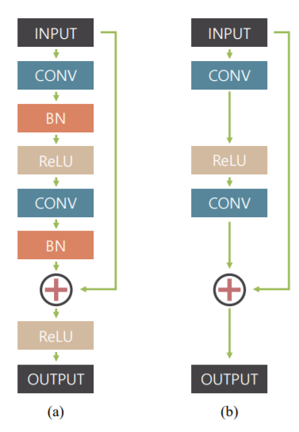
</div>

需要注意的是，如上图所示，(a) 是常见的残差模块，（b）是本文所采用的残差模块。
本文中的残差模块去除了 Batch Normalization（BN） 层，这是因为训练时batch size较小，去除BN层可以加速训练速度。同时为了加快训练时的收敛速度，最后一层的非线性单元 ReLU 也被去除。
用这种残差形式的 CNN 的来搭建模型，具体原因是：<br>
（1）能构建更深的网络，增大感受野。<br>
（2）模糊图像和清晰图像在数值上本身就比较相近，因此残差更有利于模型学习。<br>

##### 模型定义
通过 pytorch 的内置接口，搭建模型结构如下所示。
其中 default_conv 是模型采用的默认卷积层，UpConv 用于上采样卷积，ResidualBlock 是模型使用的残差模块，SingleScaleNet 是单个尺度网络，MultiScaleNet 将几个 SingleScaleNet 整合成了最终的多尺度网络模型。
具体的各个函数的作用如下：

- default_conv : 网络中默认采用的卷积层，定义之后，避免重复代码
- UpConv : 上卷积，对应上图中的 Up Conv，将图像的尺度扩大，输入到另一个单尺度网络
- ResidualBlock : 残差模块，网络模型中采用的残差模块，之所以采用残差模块，是因为网络“只需要需要模糊图像与去模糊图像之间的差异即可”
- SingleScaleNet : 单尺度模型，一个尺度对应一个单尺度模型实例
- MultiScaleNet : 多尺度模型，将多个单尺度模型实例组合即可得到上图所示的多尺度去模糊网络

```
def default_conv(in_channels, out_channels, kernel_size, bias):
    return nn.Conv2d(in_channels,
                     out_channels,
                     kernel_size,
                     padding=(kernel_size // 2),
                     bias=bias)
                
class UpConv(nn.Module):
    def __init__(self):
        super(UpConv, self).__init__()
        self.body = nn.Sequential(default_conv(3, 12, 3, True),
                                  nn.PixelShuffle(2), nn.ReLU(inplace=True))

    def forward(self, x):
        return self.body(x)

class ResidualBlock(nn.Module):
    def __init__(self, n_feats):
        super(ResidualBlock, self).__init__()
        modules_body = [
            default_conv(n_feats, n_feats, 3, bias=True),
            nn.ReLU(inplace=True),
            default_conv(n_feats, n_feats, 3, bias=True)
        ]
        self.body = nn.Sequential(*modules_body)

    def forward(self, x):
        res = self.body(x)
        res += x
        return res

class SingleScaleNet(nn.Module):
    def __init__(self, n_feats, n_resblocks, is_skip, n_channels=3):
        super(SingleScaleNet, self).__init__()
        self.is_skip = is_skip

        modules_head = [
            default_conv(n_channels, n_feats, 5, bias=True),
            nn.ReLU(inplace=True)
        ]

        modules_body = [ResidualBlock(n_feats) for _ in range(n_resblocks)]

        modules_tail = [default_conv(n_feats, 3, 5, bias=True)]

        self.head = nn.Sequential(*modules_head)
        self.body = nn.Sequential(*modules_body)
        self.tail = nn.Sequential(*modules_tail)

class MultiScaleNet(nn.Module):
    def __init__(self, n_feats, n_resblocks, is_skip):
        super(MultiScaleNet, self).__init__()

        self.scale3_net = SingleScaleNet(n_feats,
                                         n_resblocks,
                                         is_skip,
                                         n_channels=3)
        self.upconv3 = UpConv()

        self.scale2_net = SingleScaleNet(n_feats,
                                         n_resblocks,
                                         is_skip,
                                         n_channels=6)
        self.upconv2 = UpConv()

        self.scale1_net = SingleScaleNet(n_feats,
                                         n_resblocks,
                                         is_skip,
                                         n_channels=6)

    def forward(self, mulscale_input):
        input_b1, input_b2, input_b3 = mulscale_input

        output_l3 = self.scale3_net(input_b3)
        output_l3_up = self.upconv3(output_l3)

        output_l2 = self.scale2_net(torch.cat((input_b2, output_l3_up), 1))
        output_l2_up = self.upconv2(output_l2)

        output_l1 = self.scale2_net(torch.cat((input_b1, output_l2_up), 1))

        return output_l1, output_l2, output_l3
```

##### 模型实例化

模型选取，根据前面参数中的 n_feats、n_resblocks、skip 和 multi 来对模型进行实例化。
```
if args.multi:
    my_model = MultiScaleNet(n_feats=args.n_feats,
                             n_resblocks=args.n_resblocks,
                             is_skip=args.skip)
else:
    my_model = SingleScaleNet(n_feats=args.n_feats,
                              n_resblocks=args.n_resblocks,
                              is_skip=args.skip)
# my_model = my_model.cuda()
```
对实例化后的模型的结构进行分析，结果如下所示:
```
print (my_model)
```

##### 损失函数和优化器
在这里我们使用 Adam 优化器，初始学习率为 lr，其相对于 SGD，更自动化，实际中需要调整的参数较少，但需要注意的是，其使用内存也比 SGD 要高。
损失函数使用最常见的均方损失函数（MSELoss）:
$$
M S E=\frac{1}{M \times N \sum_{i=1}^{M} \sum_{j=1}^{N}\left(f^{\prime}(i, j)-f(i, j)\right)^{2}}
​$$


其中 $f^{\prime}(i,j)$ 和 $f(i,j)$ 分别为模型输出结果图和非模糊图上坐标为 (i,j)(i,j)(i,j) 的像素，M,N分别表示图片的长与宽。
具体的，本文所用的多尺度损失函数为：
$$
{L}=\frac{1}{K} \sum_{k=1}^{K} M S E (f^{\prime}_k, f_k)
$$
$f^{\prime}_k$​ 和 $f_k$​分别表示第 k 个尺度上的输出结果图和非模糊图。
在 pytorch 中，我们可以直接调用定义好的接口来实现基础的MSE。
（MSE 的官方文档 和 Adam 的官方文档）

```
# loss_function = nn.MSELoss().cuda()
loss_function = nn.MSELoss()
optimizer = optim.Adam(my_model.parameters(), lr=args.lr)
```

#### 步骤9 模型训练：

本小节为模型的训练过程介绍，具体分为以下几个部分：
1. 训练策略
2. 训练模型
3. 训练过程可视化

##### 训练策略
在模型训练过程中，随着训练的进行，更新网络参数的步进（学习率）应该越来越小，整体训练过程应该满足 “先粗调后细调”，这就是常说的学习率策略。
本次训练采用的学习率优化策略为 lr_scheduler.StepLR，步进为 lr_step_size，学习率每隔 lr_step_size 个 epoch 乘以 lr_gamma。
同样可以直接调用 pytorch 的接口来实现。

##### 训练模型
在训练开始之前，要先创建一个 SummaryWriter，用来记录和可视化训练过程。

```
writer = SummaryWriter(os.path.join(args.save_dir, "temp/logs/"))
```

在命令行运行 tensorboard --logdir=experiment/logs 来启动tensorboard。
在训练模型时，每训练完一个 epoch 将模型的参数保存下来，防止训练被意外中断以及方便测试，如果需要不断更新最新的一次训练的参数，可以取消最后一行的注释。训练过程中，使用 tqdm 的进度条来观察训练过程，如果进度条无法正常显示，可以参考这里或者这里解决。

```
bar_format = '{desc}{percentage:3.0f}% | [{elapsed}<{remaining},{rate_fmt}]' # 进度条格式

for epoch in range(args.epochs):
    total_loss = 0
    batch_bar = tqdm(data_loader, bar_format=bar_format) # 利用tqdm动态显示训练过程
    for batch, images in enumerate(batch_bar):
        my_model.train()
        curr_batch = epoch * data_loader.__len__() + batch # 当前batch在整个训练过程中的索引

        input_b1 = images['input_b1'] # 原始输入图像
        target_s1 = images['target_s1'] # 目标非模糊图片
        if args.multi:
            input_b2 = images['input_b2'] # level-2 尺度
            target_s2 = images['target_s2']
            input_b3 = images['input_b3'] # level-3 尺度
            target_s3 = images['target_s3']
            output_l1, output_l2, output_l3 = my_model(
                (input_b1, input_b2, input_b3))
            # 损失函数
            loss = (loss_function(output_l1, target_s1) +
                    loss_function(output_l2, target_s2) +
                    loss_function(output_l3, target_s3)) / 3
        else:
            output_l1 = my_model(input_b1)
            loss = loss_function(output_l1, target_s1)

        my_model.zero_grad()
        loss.backward() # 反向传播
        optimizer.step() # 更新权值
        total_loss += loss.item()

        print_str = " | ".join([
            "epoch:%3d/%3d" % (epoch + 1, args.epochs),
            "batch:%3d/%3d" % (batch + 1, data_loader.__len__()),
            "loss:%.5f" % (loss.item()),
        ])
        batch_bar.set_description(print_str, refresh=True) # 更新进度条

        writer.add_scalar('train/batch_loss', loss.item(), curr_batch)

    batch_bar.close()
    scheduler.step() # 调整学习率
    loss = total_loss / (batch + 1)
    writer.add_scalar('train/epoch_loss', loss, epoch)
    torch.save(my_model.state_dict(),os.path.join(args.save_cp_dir, f'Epoch_{epoch}.pt')) # 保存每个 epoch 的参数
#     torch.save(my_model.state_dict(),os.path.join(args.save_cp_dir, f'Epoch_lastest.pt')) # 保存最新的参数
```

##### 训练可视化
在tensorboard中可以观察训练过程的loss变化过程。


### 步骤10 模型评估：
为了对模型进行有效的评估，给出了图像去模糊常用的三个指标，并对其进行了介绍与实现：
1. 指标介绍
2. 指标实现

##### 指标介绍
为了评估模型的效果如何，我们通过计算峰值信噪比（Peak Signal-to-Noise Ratio, PSNR），结构相似性（Structural Similarity, SSIM）和多尺度的 SSIM（Multi-Scale SSIM，MSSIM）三个指标来对结果进行分析。：
- PSNR

PSNR 的定义如下：
$$
PSNR=10 \cdot \log _{10}\left(\frac{M A X_{I}^{2}}{M S E}\right)=20 \cdot \log _{20}\left(\frac{M A X_{I}}{\sqrt{M S E}}\right)
$$
其中，$M A X_{I}$​表示图像点颜色的最大数值，如果每个采样点用 8 位表示，则最大数值为 255，MSE是两个图像之间的均方误差。
PSNR值越大代表模糊图像与参考图像越接近，即去模糊效果越好。

- SSIM

SSIM也是衡量两幅图片相似性的指标，其定义如下：
$$
{SSIM}(\mathbf{x}, \mathbf{y})=[l(\mathbf{x}, \mathbf{y})]^{\alpha}[c(\mathbf{x}, \mathbf{y})]^{\beta}[s(\mathbf{x}, \mathbf{y})]^{\gamma}
$$

SSIM由模型输出图像 x 和参考图像 y 之间的亮度对比（$l(\mathbf{x}, \mathbf{y})$）、对比度对比（$c(\mathbf{x}, \mathbf{y})
$）和结构对比（$s(\mathbf{x}, \mathbf{y})$）三部分组成，$\alpha$，$\beta$ 和 $\gamma$是各自的权重因子，一般都取为 1：
$$
\begin{aligned} l(\mathbf{x}, \mathbf{y})=& \frac{2 \mu_{x} \mu_{y}+C_{1}}{\mu_{x}^{2}+\mu_{y}^{2}+C_{1}} \\ c(\mathbf{x}, \mathbf{y})=& \frac{2 \sigma_{x} \sigma_{y}+C_{2}}{\sigma_{x}^{2}+\sigma_{y}^{2}+C_{2}} \\ s(\mathbf{x}, \mathbf{y}) &=\frac{\sigma_{x y}+C_{3}}{\sigma_{x} \sigma_{y}+C_{3}} \end{aligned}
$$

其中，$C_{1}​$，$C_{2}$和$C_{3}​$为常数，是为了避免分母接近于0时造成的不稳定性。$\mu_{x}$​ 和 $\mu_{y}$​ 分别为模型输出图像和参考图像的均值。$\sigma_{x}$​ 和 $\sigma_{y}$ 分别为模型输出图像和参考图像的标准差。通常取 $C1=(K1*L)^2，C2=(K2*L)^2，C3=C2/2$，一般地K1=0.01， K2=0.03, L=255（ L是像素值的动态范围，一般都取为255）。
输出图片和目标图片的结构相似值越大，则表示相似性越高，图像去模糊效果越好。
SSIM是一种符合人类直觉的图像质量评价标准。从名字上我们不难发现，这种指标是在致力于向人类的真实感知看齐，详细细节可以参考原论文。

- MSSIM
MSSIM相当于是在多个尺度上来进行SSIM指标的测试，相对于SSIM，其能更好的衡量图像到观看者的距离、像素信息密集程度等因素对观看者给出的主观评价所产生的影响。
论文中给出的一个例子是，观看者给一个分辨率为1080p的较为模糊的画面的评分可能会比分辨率为720p的较为锐利的画面的评分高。因此在评价图像质量的时候不考虑尺度因素可能会导致得出片面的结果。
MSSIM提出在不同分辨率（尺度）下多次计算结构相似度后综合结果得到最终的评价数值。其计算过程框图如下所示：

<div align=center>
    <!--  -->
    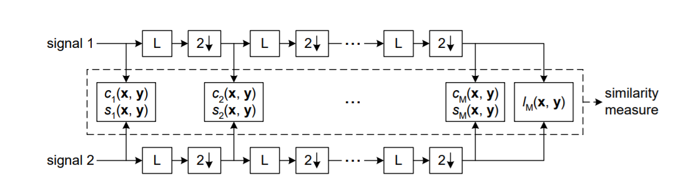
</div>


##### 指标实现
PSNR 的计算方式定义如下
```
class PSNR(nn.Module):
    def forward(self,img1,img2):
        mse = ((img1 - img2) ** 2).mean() # 输出图像和参考图像的 MSE
        psnr = 10 * torch.log10(1.0 * 1.0 / (mse + 10 ** (-10)))
        return psnr
```

SSIM 和 MSSIM 的计算较为复杂，在这里，我们直接调用 pytorch-msssim 的接口来进行计算。

```
ssim = pytorch_msssim.SSIM(data_range=1.0, size_average=True, channel=3)
mssim = pytorch_msssim.MS_SSIM(data_range=1.0, size_average=True, channel=3)
```

实例化之后为

```
ssim = pytorch_msssim.SSIM(data_range=1.0, size_average=True, channel=3)
mssim = pytorch_msssim.MS_SSIM(data_range=1.0, size_average=True, channel=3)
psnr = PSNR()
```

### 步骤11 模型预测:
本小节为模型预测部分，具体分为以下几个部分
1. 绘图函数定义
2. 模型加载
3. 数据加载
4. 模型预测与指标分析
5. 结果展示与保存
   
##### 绘图函数定义
了方便绘制结果，定义绘图函数为
```
def plot_tensor(tensor):
    if tensor.dim() == 4:
        tensor = tensor.squeeze(0)
    ret = transforms.ToPILImage()(tensor.squeeze(0))
    plt.imshow(ret) 
    return
```

##### 模型加载
在 3.3 节的训练过程中我们保存了多个 checkpoint ，现在对其进行加载和测试。这里我们提供了两种选择 checkpoint 的方式，一种是选择指定 checkpoint，一种是选择最新的 checkpoint。在这里我们以最新的 checkpoint 为例进行测试
```
# option-A ：测试指定epoch
# best_epoch = 100 
# best_cp = f"{args.save_cp_dir}/Epoch_{best_epoch}.pt"

# option-B ：测试最终epoch
# best_cp = f"{args.save_cp_dir}/Epoch_lastest.pt"
best_cp = f"{args.save_cp_dir}/Epoch_0.pt"

my_model.to("cpu").load_state_dict(torch.load(best_cp))
my_model = my_model.eval()
```

##### 数据加载
由于此模型采用的是多尺度训练，因此对于单张输入图像，需要对其进行处理，定义加载图像的函数 load_images 为
```
def load_images(blur_img_path, multi):
    target_s1 = None
    sharp_img_path = blur_img_path.replace('blur', 'sharp')
    if os.path.exists(sharp_img_path):
        img_target = Image.open(sharp_img_path).convert('RGB')
        target_s1 = transforms.ToTensor()(img_target).unsqueeze(0)

    img_input = Image.open(blur_img_path).convert('RGB') # 转化为 Image 类型方便进行 resize
    input_b1 = transforms.ToTensor()(img_input)

    if multi:
        H = input_b1.size()[1] # 获取高度
        W = input_b1.size()[2] # 获取宽度

        input_b1 = transforms.ToPILImage()(input_b1)
        input_b2 = transforms.ToTensor()(transforms.Resize([int(H / 2), int(W / 2)])(input_b1)).unsqueeze(0)
        input_b3 = transforms.ToTensor()(transforms.Resize([int(H / 4), int(W / 4)])(input_b1)).unsqueeze(0)

        input_b1 = transforms.ToTensor()(input_b1).unsqueeze(0)
        
        return {'input_b1': input_b1, 'input_b2': input_b2, 'input_b3': input_b3,
                'target_s1': target_s1}
    else:
        return {'input_b1': input_b1.unsqueeze(0), 'target_s1': target_s1}
```

##### 模型预测与指标分析
1. 模型预测
加载图片并测试，这里使用的是测试集里的图片（放在了 pictures/ 下）
```
idx = 1 # option：[1, 2, 3, 4]
blur_img_path = f"datasets/pictures/blur/test{idx}.png"
item = load_images(blur_img_path,args.multi)
input_b1 = item['input_b1']
input_b2 = item['input_b2']
input_b3 = item['input_b3']
target_s1 = item['target_s1']
output_l1, _, _ = my_model((input_b1, input_b2, input_b3))
```


2. 指标分析
原始模糊图片与不模糊的图片之间的指标计算
```
blur_psnr = psnr(input_b1,target_s1)
blur_ssim = ssim(input_b1,target_s1)
blur_mssim = mssim(input_b1,target_s1)
print(f"原始模糊图片：PSNR={blur_psnr.float()}，SSIM={blur_ssim.float()}，MSSIM={blur_mssim.float()}")
```
网络输出去模糊图片与不模糊的图片之间的指标计算

```
output_psnr = psnr(output_l1,target_s1)
output_ssim = ssim(output_l1,target_s1)
output_mssim = mssim(output_l1,target_s1)
print(f"网络输出图片：PSNR={output_psnr.float()}，SSIM={output_ssim.float()}，MSSIM={output_mssim.float()}")
```

##### 结果展示与保存
从上往下，依次是原始图片，输出图片，标签图片（未模糊图片）
```
plt.figure(figsize=(6,10))
plt.subplot(311);plot_tensor(input_b1)
plt.subplot(312);plot_tensor(output_l1)
plt.subplot(313);plot_tensor(target_s1)
```

将结果保存在 result 文件夹下
```
save_name = blur_img_path.split("/")[-1]
save_path = os.path.join(args.save_dir,save_name)
save_img = transforms.ToPILImage()(output_l1.squeeze(0))
save_img.save(save_path)
```


## 5.任务拓展
### 5.1 对彩色图像进行图像增强和对灰度图像进行图像增强的区别？

- 相信同学们都有留意到，我们课程中提供的图片处理都是采用对彩色图片进行处理，也是更加具有现实意义。
- 那么，因为通常我们的彩色图片是有R，G，B三个通道，就是之前课程中提及的，有三原色组成我们每个像素的真实色彩。如果要处理全彩色图像，则需要对彩色的每个通道分别处理，然后叠加在一起。下面以中值滤波为例，对彩色图像进行处理。

### 5.2 伪彩色？

- 将彩色图像转换为灰度图像是一个不可逆的过程，灰度图像也不可能变换为原来的彩色图像。而某些场合需要将灰度图像转变为彩色图像；伪彩色处理主要是把黑白的灰度图像或者多波段图像转换为彩色图像的技术过程。其目的是提高图像内容的可辨识度。

- 伪彩色图像的含义是，每个像素的颜色不是由每个基色分量的数值直接决定，而是把像素值当作彩色查找表(事先做好的)的表项入口地址，去查找一个显示图像时使用的R，G，B强度值，用查找出的R，G，B强度值产生的彩色称为伪彩色。


### 5.3 深度学习模型优化思路和方法
- 使用L1损失函数。
- 在残差结构中加入Batch Normalization和ReLU。


## 6. 任务实训
### 6.1 实训目的
- 掌握调用百度 api
- 加深对图像增强的理解
- 拓展图像增强的应用知识

### 6.2 实训内容

- 我们已经成功一些传统的图像处理方法对图片进行增强，而百度 AI 开放平台还提供的基于深度学习的图像增强算法提供我们调用。

### 6.3 示例代码

```
%matplotlib inline
import cv2
import numpy as np

from matplotlib import pyplot as plt

import sys
import json
import base64

import ssl
## make it work in both python2 both python3
IS_PY3 = sys.version_info.major == 3
if IS_PY3:
    from urllib.request import urlopen
    from urllib.request import Request
    from urllib.error import URLError
    from urllib.parse import urlencode
    from urllib.parse import quote_plus
else:
    import urllib2
    from urllib import quote_plus
    from urllib2 import urlopen
    from urllib2 import Request
    from urllib2 import URLError
    from urllib import urlencode


## 跳过 HTTPS 身份验证
ssl._create_default_https_context = ssl._create_unverified_context
API_KEY = '你的API_KEY'
SECRET_KEY = '你的SECRET_KEY'
IMG_ENHANCE = "https://aip.baidubce.com/rest/2.0/image-process/v1/contrast_enhance"
""" 开始 TOKEN """
TOKEN_URL = 'https://aip.baidubce.com/oauth/2.0/token'


""" 请求认证 token
"""
def fetch_token():
    params = {'grant_type': 'client_credentials',
        'client_id': API_KEY,
        'client_secret': SECRET_KEY}
    post_data = urlencode(params)
    if (IS_PY3):
        post_data = post_data.encode('utf-8')
    req = Request(TOKEN_URL, post_data)
    try:
        f = urlopen(req, timeout=5)
        result_str = f.read()
    except URLError as err:
        print(err)
    if (IS_PY3):
        result_str = result_str.decode()
    result = json.loads(result_str)
    if ('access_token' in result.keys() and 'scope' in result.keys()):
        if not 'brain_all_scope' in result['scope'].split(' '):
            print ('please ensure has check the ability')
            exit()
        return result['access_token']
    else:
        print ('please overwrite the correct API_KEY and SECRET_KEY')
        exit()


""" 读取图片函数
"""

def read_file(image_path):
    f = None
    try:
        f = open(image_path, 'rb') #用二进制打开图片
        return f.read()
    except:
        print('read image file fail')
        return None
    finally:
        if f:
            f.close()


"""
call remote http server
"""
def request(url, data):
    req = Request(url, data.encode('utf-8'))
    has_error = False
    try:
        f = urlopen(req)
        result_str = f.read()
        if (IS_PY3):
            result_str = result_str.decode()
        return result_str
    except URLError as err:
        print(err)


if __name__ == '__main__':
    ## get access token
    token = fetch_token()
    ## concat url
    url = IMG_ENHANCE + "?access_token=" + token
    
    file_content = read_file('./img2.jpg')
    response = request(url, urlencode(
    {
        'image': base64.b64encode(file_content),
        'image_type': 'BASE64',
    }))
    data = json.loads(response)
#     print(data)
    sourceImg = cv2.imread('img2.jpg')
    srcImage_new = cv2.cvtColor(sourceImg, cv2.COLOR_BGR2RGB)
    plt.imshow(srcImage_new)
    plt.show()


image_data = base64.b64decode(data['image'])
with open('2.jpg', 'wb') as f:
    f.write(image_data)
sourceImg = cv2.imread('2.jpg')
srcImage_new = cv2.cvtColor(sourceImg, cv2.COLOR_BGR2RGB)
plt.imshow(srcImage_new)
plt.show()


```

### 6.4 学后小测试:（必做题）
1. 案例中模型使用的损失函数是？ 【分值：20】
A. 交叉熵函数 B.MSE C.MAE D.Log-Cosh
2. 与传统的残差结构相比，案例中的残差结构少了哪些操作？ 【分值：20】
A. Batch Normalization B.卷积 C.shortcut D.ReLU E.池化层
1. 模型中的上采样操作可以用反卷积操作代替 【分值：20】
2. 损失函数中每一层的损失函数都用通道数，宽度和高度进行了归一化 【分值：20】
3. 为了捕捉不同尺度的图像信息，模型采用了什么结构？ 【分值：20】
4. 案例中模型采用残差形式的CNN有什么好处？ 【分值：0】