[TOC]

<!-- ref: https://lab.datafountain.cn/forum?id=90 -->

# 任务7：目标检测与边界框

## 1.任务目标

<!-- 1. 
2. 
3. 
4.  -->

- 学习目标检测的相关概念
- 了解如何进行边界框框选


## 2.任务描述


在前⾯的⼀些章节中，我们介绍了诸多⽤于图像分类的模型。在图像分类任务⾥，我们假设图像 ⾥只有⼀个主体⽬标，并关注如何识别该⽬标的类别。然而，很多时候图像⾥有多个我们感兴趣 的⽬标，我们不仅想知道它们的类别，还想得到它们在图像中的具体位置。在计算机视觉⾥，我 们将这类任务称为⽬标检测（objectdetection）或物体检测。

⽬标检测在多个领域中被⼴泛使⽤。例如，在⽆⼈驾驶⾥，我们需要通过识别拍摄到的视频图像 ⾥的⻋辆、⾏⼈、道路和障碍的位置来规划⾏进线路。机器⼈也常通过该任务来检测感兴趣的⽬ 标。安防领域则需要检测异常⽬标，如⽍徒或者炸弹。

我们花了大约很多篇的内容来讲 CNN 卷积神经网络和相关的图像分类经典网络等。但图像分类仅仅是我们入门计算机视觉的第一个任务。作为计算机视觉的三大核心任务——图像分类、目标检测和图像分割，后面两大任务还有着更多的内容等待我们探索和学习。以下图为例：


<div align=center>
    <!--  -->
    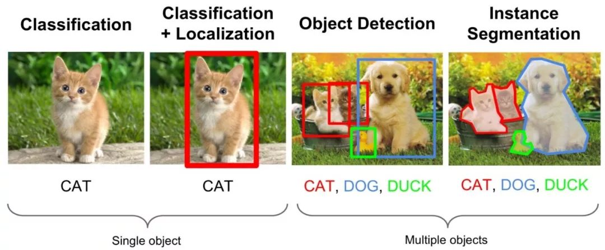
</div>


<!-- - 从图中我们可以简单描述下计算机视觉三大任务的要义：图像分类就是要回答这张图像是一只猫的问题，目标检测则不仅需要回答图像中有什么，而且还得给出这些物体在图像中位置问题，以图中为例就是不仅要识别图中的阿猫阿狗，还得给出阿猫阿狗的具体定位。而图像分割则是需要实现像素级的图像分割，以图中为例就是要把每个物体以像素级的标准分割开来，这对算法要求则更高。 -->

目标检测是一种典型的计算机视觉问题，其关注的是图像中特定的物体目标，要求同时获得这一目标的类别信息和位置信息，即目标检测需要从背景中分离出感兴趣的目标，并确定这一目标的描述（类别和位置），因此检测模型的输出是一个列表，列表的每一项使用一个数组给出检出目标的类别和位置（常用矩形检测框的坐标表示）。上图展示了物体检测任务，获取了图像中前景物体的位置坐标和类别信息。

## 3.知识准备


### 3.1背景

- 从本节开始，笔者将花费数讲的时间对计算机视觉的第二大任务——目标检测进行一个全面细致的学习和讲解。既是对前面的 CNN 图像分类的内容延伸，也是继续深入研究图像算法的必走之路。在正式的学习各类目标检测算法之前，本节将首先对影响目标检测算法发展历史的主要算法进行一个综述，以期对后面的内容起到一个提纲挈领的作用。

- 在 2012 年深度学习正式介入计算机视觉目标检测任务之前，传统的目标检测算法一直是以滑动窗口卷积等较为传统的方式进行区域选择、特征提取和分类回归等步骤，例如在深度学习兴起之前目标检测领域较为优秀的可变形的组件模型（DPM）方法等。

- 在深度学习兴起并逐渐成为计算机视觉的核心方法之后，基于深度学习算法的一系列目标检测算法大致可以分为两大流派：
- 两步走（two-stage）算法：先产生候选区域然后再进行CNN分类(RCNN系列)
- 一步走（one-stage）算法：直接对输入图像应用算法并输出类别和相应的定位(yolo系列)
- 无论是两步走还是一步走算法，它们都是在识别的快和准两点上寻找一个平衡点和或者极端点。要么准要么快，但随着深度学习和计算机视觉的向前发展，既快有准的算法也在逐渐的实现当中。

- 本节就以目标检测这两大流派的目标检测算法进行简单的介绍。


### 3.2两步走（two stage）算法系列


#### 3.2.1 R-CNN

- R-CNN 作为将深度学习引入目标检测算法的开山之作，在目标检测算法发展历史上具有重大意义。
R-CNN 算法是两步走方法的代表，即先生成候选区域（region proposal），然后再利用 CNN 进行识别分类。由于候选框对于算法的成败起着关键作用，所以该方法就以 Region 开头首字母 R 加 CNN 进行命名。
- 相较于传统的滑动卷积窗口来判断目标的可能区域，R-CNN 采用 selective search 的方法来预先提取一些较可能是目标物体的候选区域，速度大大提升，计算成本也显著缩小。总体而言，R-CNN 方法分为四个步骤：

- 生成候选区域
- 对候选区域使用CNN进行特征提取
- 将提取的特征送入SVM分类器
- 最后使用回归器对目标位置进行修正

- 虽然 R-CNN 在 2013年的当时可谓横空出世，但也存在许多缺陷：训练网络的正负样本候选区域在速度上非常慢，影响了算法的整体速度；CNN 需要分别对每一个生成的候选区域进行一次特征提取，存在着大量的重复运算，制约了算法性能。


- R-CNN--SSP-NET--FAST R-CNN--FASTER R-CNN--MASK R-CNN

#### 3.2.2 Faster RCNN
本案例实现的是物体检测模型-Faster RCNN，论文文地址: https://arxiv.org/pdf/1506.01497.pdf 。 Faster RCNN已经将特征抽取(feature extraction)，proposal提取，bounding box 回归，分类都整合在了一个网络中，使得综合性能有较大提高，在检测速度方面尤为明显。 Faster RCNN基本结构如下图所示。Faster RCNN可以分为4个主要内容：

<div align=center>
    <!--  -->
    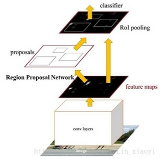
</div>

1. Conv layers。作为一种CNN网络目标检测方法，Faster RCNN首先使用一组基础的conv+relu+pooling层提取image的feature maps，本案例采用了VGG16的卷积网络结构，图片大小会缩小16倍。提取的feature maps被共享用于后续RPN层和全连接层。

2. Region Proposal Networks（RPN）。RPN网络主要用于生成region proposals。首先RPN网络会先生成anchors，anchor生成规则是特征图上的每个像素均生成9个Anchor box，其中长宽比ratios设置为 [0.5,1,2] ,面积比scales设置为 [8,16,32] 。然后对anchors进行过滤后通过softmax判断anchors属于前景(foreground)或者后景(background)，即是物体或不是物体。同时利用bounding box regression修正anchors获得精确的预测框，进一步对其进行越界剔除和非极大值抑制剔除重叠框，最后留下大约2000个anchor，然后再提取前300个框，将其送入到Roi Pooling层中，此300个框即为region proposals。

3. Roi Pooling。该层收集输入的feature maps和 region proposals，遍历每个region proposal，将其坐标值缩小16倍，即可在feture maps上确定一个区域，然后将此区域划分为7x7，即49个相同大小的小区域，对于每个小区域，使用max pooling方式从中选取最大的像素点作为输出，这样，就形成了一个7x7的feature map，从而得到300个固定大小的proposal feature maps，送入后续全连接层判定目标类别。

4. Classification。利用proposal feature maps计算proposal的类别，同时再次bounding box regression获得检测框最终的精确位置。

下图为VGG16模型中Fater_RCNN测试时的网络结构。 对于一副任意大小PxQ的图像会进行以下几个操作：

<div align=center>
    <!--  -->
    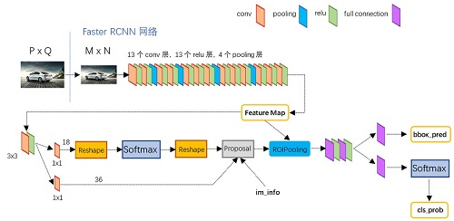
</div>

1. 首先缩放至固定大小MxN，然后将MxN图像送入网络；

2. Conv layers为VGG16模型，包含13个conv层+13个relu层+4个pooling层，得到图像的feature map；

3. RPN网络首先经过3x3卷积，再分别生成positive anchors和对应bounding box regression偏移量，然后计算出proposals；

4. 而Roi Pooling层则利用proposals从feature maps中提取proposal feature送入后续全连接和softmax网络作classification。


### 3.3一步走（one stage）算法系列

- 纵然两步走的目标检测算法在不断进化，检测准确率也越来越高，但两步走始终存在的速度的瓶颈。在一些实时的目标检测需求的场景中，R-CNN 系列算法终归是有所欠缺。因而一步走（one-stage）算法便应运而生了，其中以 yolo 算法系列为代表，演绎了一种端到端的深度学习系统的实时目标检测效果。yolo 算法系列的主要思想就是直接从输入图像得到目标物体的类别和具体位置，不再像 R-CNN 系列那样产生候选区域。这样做的直接效果便是快。
#### 3.3.1yolo v1

- yolo v1 算法的核心思想就是将整张图像作为网络的输入，直接在网络的输出层输出目标物体的类别和边界框的具体位置坐标。yolo v1 将输入图像划分为 S*S 的网格（grid），每个网格预测两个边界框，如果目标物体落入相应的网格中，该网格就负责检测出该目标物体。

<div align=center>
    <!--  -->
    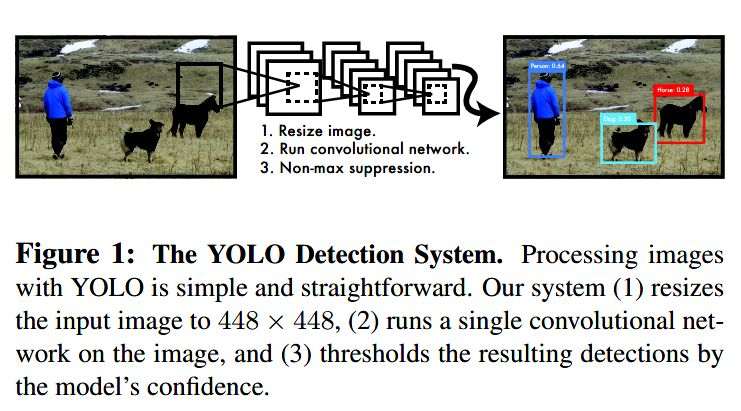
</div>

- 由论文可知 yolo v1 算法的三个步骤：缩放图像-运行卷积网络-非极大值抑制。

<div align=center>
    <!--  -->
    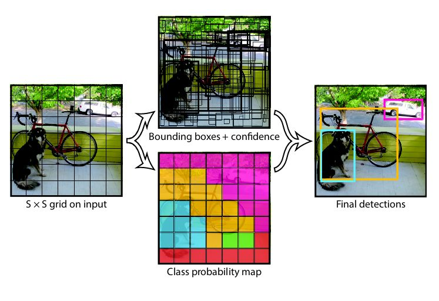
</div>


- yolo v1 虽然快，但缺点也明显：由于一个网格只能预测两个边界框，这使得yolo v1 对于密集很小的物体检测效果并不好，时常在定位上出现较大的偏差，此外 yolo v1 也存在着泛化性能较弱等问题。


### 3.4边界框

- 在⽬标检测⾥，我们通常使⽤边界框（boundingbox）来描述⽬标位置。边界框是⼀个矩形框， 可以由矩形左上⻆的x和y轴坐标与右下⻆的x和y轴坐标确定。我们根据上⾯的图的坐标信息来 定义图中狗和猫的边界框。图中的坐标原点在图像的左上⻆，原点往右和往下分别为x轴和y轴的 正⽅向。 

<!-- ### 3.5 数据集和初始模型 -->
### 3.5 数据集
#### 数据集：
使用图像物体检测任务中常用的PASCAL VOC2007数据集，PASCAL VOC2007训练数据集可以从 http://host.robots.ox.ac.uk/pascal/VOC/voc2007/VOCtrainval_06-Nov-2007.tar 下载，测试数据集可以从 http://host.robots.ox.ac.uk/pascal/VOC/voc2007/VOCtest_06-Nov-2007.tar 下载，VOCcode可以从 http://host.robots.ox.ac.uk/pascal/VOC/voc2007/VOCdevkit_08-Jun-2007.tar 下载。此数据集可检测物体总共有20类，分别为人、鸟、猫、牛、狗、马、羊、飞机、自行车、船、公共汽车、汽车、摩托车、火车、瓶子、椅子、餐桌、盆栽、沙发、电视。

<!-- #### 初始化模型:
本教程使用的基础网络为VGG16。为加快模型训练和加速模型收敛，本文使用在ImageNet数据集上预训练的模型作为本文网络的初始化模型。初始化模型可以在 https://github.com/tensorflow/models/tree/master/research/slim#pre-trained-models 下载。本案例初始化模型存放在./datasets/pretrained_model文件中。 -->

### 3.6 目标检测算法的常用评估指标

#### mean Average Precision(mAP)
mAP定义及相关概念:
  
- mAP指的是各类别AP的平均值. AP指的是PR曲线下面积，下面会详细讲解
  
- PR曲线Precision-Recall曲线
  
- Precision: TP / (TP + FP)
  
- Recall: TP / (TP + FN)
  
- IoU （交并比 - Intersection Over Union (IOU)）：
   交并比（IOU）是度量两个检测框（对于目标检测来说）的交叠程度，使用两个框相交的面- 积除上并集的面积公式如下：
  $$IoU= \frac{aera(B_{p}\bigcap B_{gt})}{aera(B_{p}\bigcup B_{gt})}$$

- TP: IoU>指定阈值的检测框数量（同一Ground Truth只计算一次）

- FP: IoU<=指定阈值的检测框，或者是检测到同一个GT的多余检测框的数量

- FN: 没有检测到的GT的数量


mAP的具体计算
计算mAP必须先绘出各个类别的PR曲线，计算出AP。一般有两种方式来采样PR曲线：(i)在VOC2010以前，只需要选取当Recall >= 0, 0.1, 0.2, ..., 1共11个点时的Precision最大值，然后AP就是这11个Precision的平均值；(ii)在VOC2010及以后，需要针对每一个不同的Recall值（包括0和1），选取其大于等于这些Recall值时的Precision最大值，然后计算PR曲线下面积作为AP值. 来看一个简单的例子：

假设我们有 7 张图片（Images1-Image7），这些图片有 15 个目标（绿色的框，GT 的数量）以及 24 个预测边框（红色的框，A-Y 编号表示，并且有一个置信度值）

<div align=center>
    <!--  -->
    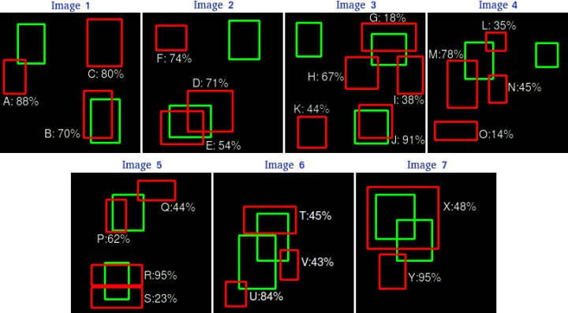
</div>

根据上图以及说明，我们可以列出以下表格，其中 Images 代表图片的编号，Detections 代表预测边框的编号，Confidences 代表预测边框的置信度，TP or FP 代表预测的边框是标记为 TP 还是 FP（认为预测边框与 GT 的 IOU 值大于等于 0.3 就标记为 TP；若一个 GT 有多个预测边框，则认为 IOU 最大且大于等于 0.3 的预测框标记为 TP，其他的标记为 FP，即一个 GT 只能有一个预测框标记为 TP），这里的 0.3 是按照实际评估需求取的阈值，实际应用中要结合业务需求来合理设置。

<div align=center>
    <!--  -->
    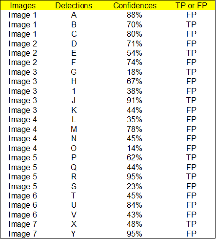
</div>

通过上表，我们可以绘制出 P-R 曲线（因为 AP 就是 P-R 曲线下面的面积。我们需要根据置信度从大到小排序所有的预测框计算出 P-R 曲线上各个点的坐标，然后就可以计算 Precision 和 Recall，见下表：

<div align=center>
    <!--  -->
    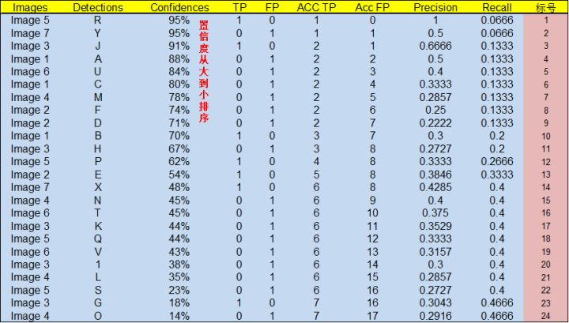
</div>


上图的计算方式可以这么理解：

- 标号为 1 的 Precision 和 Recall 的计算方式：
  
  Precision=TP/(TP+FP)=1/(1+0)=1
  Recall=TP/(TP+FN)=TP/(all ground truths)=1/15=0.0666

- 标号 2：

  Precision=TP/(TP+FP)=1/(1+1)=0.5
  Recall=TP/(TP+FN)=TP/(all ground truths)=1/15=0.0666 

- 标号 3：
  
  Precision=TP/(TP+FP)=2/(2+1)=0.6666
  Recall=TP/(TP+FN)=TP/(all ground truths)=2/15=0.1333


其他的依此类推。有了上面所有的成对的Precision和Recall的值，就可以用这些P-R成对值来绘制PR曲线：

<div align=center>
    <!--  -->
    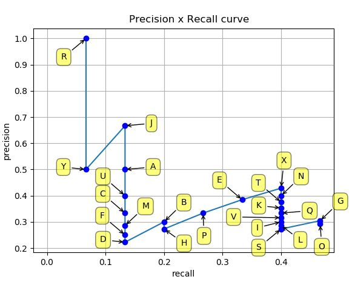
</div>

得到 PR 曲线就可以使用计算 AP（PR 曲线下的面积），这里介绍11点插值法：

- 11点插值法：令recall的值分别为 [0, 0.1, 0.2, 0.3, 0.4, 0.5, 0.6, 0.7, 0.8, 0.9, 1] 的插值所得

<div align=center>
    <!--  -->
    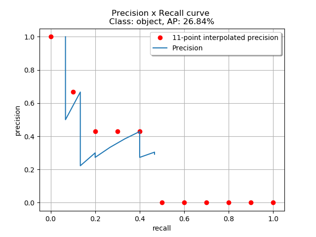
</div>

计算AP值如下：

那么最终 mAP的计算就是把把所有类别的 AP 计算出来，然后求取平均即可。


## 4. 任务实施

<!-- - 本课程旨在介绍如何利用tensorflow深度学习工具实现一个图像物体检测模型，通过加载数据、构建模型、训练模型、测试模型、模型预测依次实现一个图像目标检测工具，在训练和预处理过程中通过可视化监督训练过程。说明：本案例使用GPU版的tensorflow加速模型训练测试，故需提前安装显卡驱动、CUDA和cudnn。若机器无显卡也可使用cpu版的tensorflow。本文档仅作为示例，为了加快训练速度模型的网络结构较为简单，因此模型准确率较低，可以自行将网络模型修改为ResNet101。 -->
- 本课程包括以下内容：对目标检测概念和通用流程进行介绍与一个简单的飞机目标检测模型的实现。模型实现具体的流程有：从原始的数据文件中提取 mini-plane 数据集，对数据集进行划分，加载数据。加载预训练模型，在训练集上进行 fine-tune。训练并保存模型，在验证集上进行预测。

- 同时通过调用百度api的图像检测接口，实现对目标的检测以及边界框的绘制。

### 4.1 实施思路

<div align=center>
    <!--  -->
    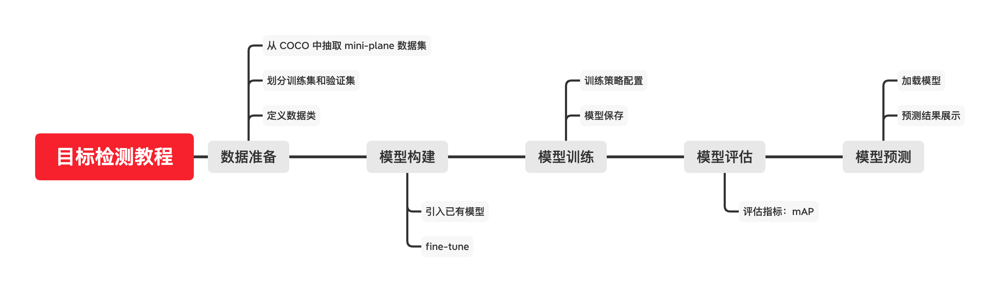
</div>


### 4.2 实施步骤


#### 步骤1：导入相关库

```
# ! pip install numpy
# ! pip install tqdm
# ! pip install matplotlib
# ! pip install cython
# ! pip install opencv-python
# ! pip install Pillow
# ! pip install terminaltables


# ! pip install "git+https://github.com/open-mmlab/cocoapi.git#subdirectory=pycocotools"

# ! pip install torch==1.4.0
# ! pip install torchvision==0.5.0 

```


#### 步骤2：mini-airplane数据集
1. 从COCO数据集中抽取生成mini-airplane数据集从COCO2017 val的图片中随机抽取99张包含飞机类别目标的图片来构成mini-airplane数据集，抽取的代码位于 datasets/src/generate_mini_airplane.py

下载COCO2017数据集解压在datasets/coco 目录中
运行 datasets/src/generate_mini_airplane.py抽取数据

```
import os
import json
import shutil

data_root = 'datasets/coco/'

with open(data_root+"annotations/instances_val2014.json", 'r') as f:
    annos = json.load(f)

images = annos["images"]
imageid2image = {}

for image in images:
    imageid2image[image['id']]=image

categories = annos['categories']
cateid2name={}
for cate in categories:
    cateid2name[cate['id']] = cate['name']

image_final=[]
annos_final=[]
categories_final=[{
"id":1,
"name": "airplane"}]
image_id=1
anno_id=1
imgid2airplane={}
for anno in annos['annotations']:
    if cateid2name[anno['category_id']] == 'airplane':
        image_id_t = anno['image_id']
        if image_id_t not in imgid2airplane:
            imgid2airplane[image_id_t] = []
        imgid2airplane[image_id_t].append(anno)

for imgid, annos in imgid2airplane.items():
    #print(image_id)
    imagename = imageid2image[imgid]['file_name']
    shutil.copy(data_root + 'val2014/' + imagename, 'mini_airplane/' + imagename)
    image =  imageid2image[imgid]
    image['id'] = image_id
    image_final.append(image)
    for anno in annos:
        anno["id"] = anno_id
        anno["image_id"] = image_id
        anno["category_id"] = 1
        anno_id+=1
        annos_final.append(anno)
    image_id+=1
    if image_id >=100:
        break

instance = {"images": image_final,
            "annotations":annos_final,
            "categories": categories_final}

with open('mini_airplane_train.json', 'w') as f:
    json.dump(instance, f, indent=1)

```

由于COCO数据集体积较大，教程中不实际操作抽取过程，直接给出抽取后的数据集位于dataset目录下的mini_airplane内。

2. mini-airplane数据集的具体内容

数据位于dataset目录下的mini_airplane文件夹，首先来看一下这个数据的构成
文件夹的格式如下

```
mini_airplane/
  images/
    COCO_val2014_000000001342.jpg
    COCO_val2014_000000005477.jpg
    ...
  annotations/
    mini_airplane_train.json
```
其中images目录中包含全部的图片数据，annotations目录下的mini_airplane_train.json文件为COCO标准格式的标签文件
然后我们查看一下COCO格式的标注
可以发现，label为json格式，其中共有三个字段：

images  代表图片信息，包括图片id，图片名file_name, 图片的宽高

annotations 代表bbox的坐标信息，包括bbox id，所属图片的image_id， bbox格式为:[[x,y,w,h]]， 以及类别id

categories 代表类别信息，包括类别id，类别名称

```
import json
with open("datasets/mini_airplane/annotations/mini_airplane_train.json", "r") as f:
    labels = json.load(f)
print("images:")
print(labels["images"][0])
print()
print("annotations:")
print(labels["annotations"][0])
print()
print("categories:")
print(labels["categories"])
```


```
imagename2id = {}
imageid2bbox = {}
imageid2anno = {}
imagename2imageinfo = {}
for image in labels["images"]:
    imagename2id[image["file_name"]] = image["id"]
    imagename2imageinfo[image["file_name"]] = image
for anno in labels["annotations"]:
    if anno["image_id"] not in imageid2bbox:
        imageid2bbox[anno["image_id"]] = []
    imageid2bbox[anno["image_id"]].append(anno["bbox"])
    if anno["image_id"] not in imageid2anno:
        imageid2anno[anno["image_id"]] = []
    imageid2anno[anno["image_id"]].append(anno)
```

可视化一张图片及label看看
```
import matplotlib.pyplot as plt
%matplotlib inline
plt.rcParams['figure.figsize'] = (12.0, 12.0) 
import cv2
import numpy as np
img = cv2.imread('datasets/mini_airplane/images/COCO_val2014_000000253223.jpg')
bboxes = imageid2bbox[imagename2id['COCO_val2014_000000253223.jpg']]
for det in bboxes:
    bbox = np.array(det[:4]).astype(int)
    cv2.rectangle(img, (bbox[0],bbox[1]), (bbox[0]+bbox[2], bbox[1]+bbox[3]), (0,0,255), 1)
    label_text = str("airplane")
    cv2.putText(img, label_text, (bbox[0], bbox[1] - 2),
            cv2.FONT_HERSHEY_COMPLEX, 0.5, (0,0,255))
im2 = img[:,:,::-1] 
plt.imshow(im2)
plt.show()
```

#### 步骤3：划分训练集和验证集
这里我们随机抽取20%的数据作为验证集，所以需要从原始的label中划分出训练集label和验证集label。

```
import numpy as np
np.random.seed(123)
train_image_names = np.random.choice(list(imagename2id.keys()), int(len(imagename2id.keys())*0.8), False)
val_image_names = list(set(imagename2id.keys()) - set(train_image_names))
print("train_image_names lenght: ", len(train_image_names))
print("val_image_names lenght: ", len(val_image_names))
```

使用刚刚划分出来的训练集和验证集的图片划分原始的label

```
import os
train_images = []
train_annotations = []
for imgname in train_image_names:
    train_images.append(imagename2imageinfo[imgname])
    image_id = imagename2id[imgname]
    train_annotations.extend(imageid2anno[image_id])
train_instance = {
    "images": train_images,
    "annotations": train_annotations,
    "categories": labels["categories"]
}

dirs = r'temp/mini_airplane/annotations'
if not os.path.exists(dirs):
    os.makedirs(dirs)
with open("temp/mini_airplane/annotations/train.json", "w") as f:
    json.dump(train_instance, f, indent=2)
val_images = []
val_annotations = []
for imgname in val_image_names:
    val_images.append(imagename2imageinfo[imgname])
    image_id = imagename2id[imgname]
    val_annotations.extend(imageid2anno[image_id])
val_instance = {
    "images": val_images,
    "annotations": val_annotations,
    "categories": labels["categories"]
}
with open("temp/mini_airplane/annotations/val.json", "w") as f:
    json.dump(val_instance, f, indent=2)
```


#### 步骤4：定义数据类
接下来通过继承torch的Dataset类来定义我们的数据类，从而用于训练。
```
import os
import numpy as np
import torch
import torch.utils.data
from PIL import Image
from skimage import io

class AirplaneDetDataset(torch.utils.data.Dataset):
    def __init__(self, root, anno_file, transforms=None):
        self.root = root
        self.transforms = transforms
        self.imgs = []
        # 从label文件中载入所有的图片，并且预先生成图片名称和图片label的对应，便于__getitem__使用
        with open(os.path.join(root, "annotations", anno_file), "r") as f:
            labels = json.load(f)
        self.imagename2id = {}
        self.imageid2anno = {}
        for image in labels["images"]:
            self.imgs.append(image["file_name"])
            self.imagename2id[image["file_name"]] = image["id"]
        for anno in labels["annotations"]:
            if anno["image_id"] not in self.imageid2anno:
                self.imageid2anno[anno["image_id"]] = []
            self.imageid2anno[anno["image_id"]].append(anno["bbox"])

    def __getitem__(self, idx):
        img_path = os.path.join(self.root, "images", self.imgs[idx])
        img_path = os.path.abspath(img_path)
        # 载入图片并转换为pytorch所需格式
        img = cv2.imread(img_path, cv2.IMREAD_COLOR)
#         img = io.imread(img_path)
        img = cv2.cvtColor(img, cv2.COLOR_BGR2RGB).astype(np.float32)
        img = img / 255.0
        img = img.transpose(2, 0, 1)
        img = torch.tensor(img)
        img_id = self.imagename2id[self.imgs[idx]]
        boxes = []
        # 读取该图片对应的bbox label
        for bbox in self.imageid2anno[img_id]:
            xmin = bbox[0]
            ymin = bbox[1]
            xmax = bbox[0] + bbox[2]
            ymax = bbox[1] + bbox[3]
            boxes.append([xmin, ymin, xmax, ymax])
        num_objs = len(self.imageid2anno[img_id])
        boxes = torch.as_tensor(boxes, dtype=torch.float32)
        # 只有飞机这一类，所以所有类别label都给1
        labels = torch.ones((num_objs,), dtype=torch.int64)

        image_id = torch.tensor([idx])
        area = (boxes[:, 3] - boxes[:, 1]) * (boxes[:, 2] - boxes[:, 0])
        # 这里我们假设所有的目标label都是不互相严重遮挡的
        iscrowd = torch.zeros((num_objs,), dtype=torch.int64)
        # 最终我们输出的label是一个dict的格式，里面包括以下的字段用于训练
        target = {}
        target["boxes"] = boxes
        target["labels"] = labels
        target["image_id"] = image_id
        target["area"] = area
        target["iscrowd"] = iscrowd

        if self.transforms is not None:
            img, target = self.transforms(img, target)
        # 最终返回图片矩阵，label以及图片名
        return img, target, self.imgs[idx]

    def __len__(self):
        return len(self.imgs)
```

查看一下这个dataset的输出格式，可以看到主要包括：图像本身，boxes坐标，labels等。
```
import shutil
if not os.path.exists('./temp/mini_airplane/images'):
    shutil.copytree('./datasets/mini_airplane/images','./temp/mini_airplane/images')
dataset = AirplaneDetDataset('./temp/mini_airplane', 'train.json')
dataset[0]
```


#### 步骤5：模型构建
我们这里使用Faster R-CNN作为基本算法来实现飞机检测模型，为了减少编译等环节，直接使用torchvision中的目标检测工具。

<div align=center>
    <!--  -->
    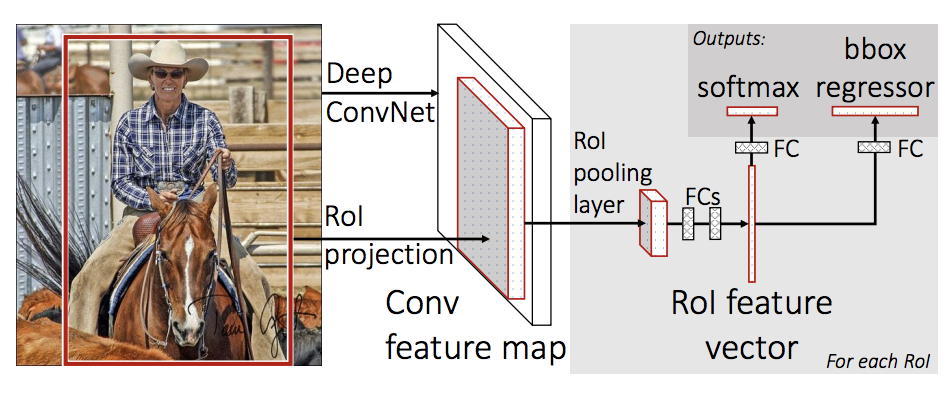
</div>


一般情况下，我们都会从一个已经训练好的模型进行finetune。

从一个预训练模型进行finetune

可以使用一下方式载入模型：
```
import torchvision
from torchvision.models.detection.faster_rcnn import FastRCNNPredictor

# load a model pre-trained pre-trained on COCO
model = torchvision.models.detection.fasterrcnn_resnet50_fpn(pretrained=True)

# replace the classifier with a new one, that has
# num_classes which is user-defined
num_classes = 2  # 1 class (person) + background
# get number of input features for the classifier
in_features = model.roi_heads.box_predictor.cls_score.in_features
# replace the pre-trained head with a new one
model.roi_heads.box_predictor = FastRCNNPredictor(in_features, num_classes) 
```
回到我们的飞机检测模型

由于我们的飞机检测数据非常少，所以必须要在预训练模型基础上进行finetine，所以我们首先按照上面讲述的方法来操作。

```
import torch
import torchvision
from torchvision.models.detection.faster_rcnn import FastRCNNPredictor
from torchvision.models.detection import FasterRCNN
from torchvision.models.detection.rpn import AnchorGenerator

from torch.utils.data import DataLoader, Dataset
from torch.utils.data.sampler import SequentialSampler

      
def get_object_detection_model(num_classes):
    # 载入一个在COCO数据集上预训练好的faster rcnn 模型，backbone为resnet50，neck网络使用fpn
    model = torchvision.models.detection.fasterrcnn_resnet50_fpn(pretrained=True)

    # 获取最后分类的head的输入特征维度
    in_features = model.roi_heads.box_predictor.cls_score.in_features
    # 将最后分类的head从原始的COCO输出81类替换为我们现在输入的num_classes类，注意这里的num_classes=实际的类别数量+1，1代表背景
    model.roi_heads.box_predictor = FastRCNNPredictor(in_features, num_classes)

    return model
```

定义我们的模型，这里我们的类别是飞机一类，再加上背景类就是2，使用上面的函数来定义我们的检测模型。

```
device = torch.device('cuda') if torch.cuda.is_available() else torch.device('cpu')
# 构建我们的基于faster rcnn的飞机检测模型，类别数量如上所讲述=1+1=2
model = get_object_detection_model(2).to(device)
```

可以将模型结构打印出来看一下，整个模型包括：

backbone
fpn
rpn
roi_heads

这几个主要组成部分
```
model
```


#### 步骤6：训练和验证
```
# 这个Averager用于统计训练过程中的loss，便于打印
class Averager:
    def __init__(self):
        self.current_total = 0.0
        self.iterations = 0.0

    def send(self, value):
        self.current_total += value
        self.iterations += 1

    @property
    def value(self):
        if self.iterations == 0:
            return 0
        else:
            return 1.0 * self.current_total / self.iterations

    def reset(self):
        self.current_total = 0.0
        self.iterations = 0.0
```

```
# collate_fn函数用于将一个batch的数据转换为tuple格式
def collate_fn(batch):
    return tuple(zip(*batch))
# 使用上面的AirplaneDetDataset来定义训练和验证的数据类
train_dataset = AirplaneDetDataset('temp/mini_airplane', 'train.json')
valid_dataset = AirplaneDetDataset('temp/mini_airplane', 'val.json')
# 定义训练data_loader
train_data_loader = DataLoader(
    train_dataset,
    batch_size=1,
    shuffle=False,
    num_workers=0,
    collate_fn=collate_fn
)
# 定义验证data_loader
valid_data_loader = DataLoader(
    valid_dataset,
    batch_size=1,
    shuffle=False,
    num_workers=0,
    collate_fn=collate_fn
)
```

优化器我们采用SGD。考虑到我们是从一个COCO预训练模型来finetune，学习率给一个较小的值0.0025。

```
params = [p for p in model.parameters() if p.requires_grad]
# 建立sgd 优化器
optimizer = torch.optim.SGD(params, lr=0.0025, momentum=0.9, weight_decay=0.0005)
lr_scheduler = None
# 一共训练8个epoch
num_epochs = 1 #8
```

进行训练，我们这里训练8个epoch，训练过程中的loss会被实时打印。

```
# resnet50模型过大，内存不足
loss_hist = Averager()
itr = 1

# 按照每一个epoch循环训练
for epoch in range(num_epochs):
    loss_hist.reset()
    # 从data loader 中采样每个batch数据用于训练
    for images, targets, _ in train_data_loader:
        
        # 将image 和 label 挪到GPU中
        images = list(image.to(device) for image in images)
        targets = [{k: v.to(device) for k, v in t.items()} for t in targets]
        
        # 数据进入模型并反向传播得到loss
        loss_dict = model(images, targets)

        losses = sum(loss for loss in loss_dict.values())
        loss_value = losses.item()

        loss_hist.send(loss_value)
        
        # 更新模型参数
        optimizer.zero_grad()
        losses.backward()
        optimizer.step()

        if itr % 10 == 0:
            print(f"Iteration #{itr} loss: {loss_value}")

        itr += 1
        if itr>10:break;
    
    # update the learning rate
    if lr_scheduler is not None:
        lr_scheduler.step()

    print(f"Epoch #{epoch} loss: {loss_hist.value}")  

```

训练完成，我们首先在训练集上看一下到底模型有没有训练成功，这里会可视化输出所有训练集结果。
首先将模型设置为eval模式，同时可以再来看一下模型的具体结构。


```
model.eval()
```

可视化我们模型在训练集上的预测结果，先判断下在训练集上是否收敛，从而确定模型设计和label是否正确。

```
# 循环load训练集的数据
itr = 1
for images, _, imgname in iter(train_data_loader):
    images = list(img.to(device) for img in images)
    sample = images[0].permute(1,2,0).cpu().numpy()
    model.eval()
    cpu_device = torch.device("cpu")
    # 将图片送入网络infer得到预测结果
    with torch.no_grad():
        outputs = model(images)
        outputs = [{k: v.to(cpu_device) for k, v in t.items()} for t in outputs]

    # 从预测结果中解析出需要的bbox 和score内容
    boxes = outputs[0]['boxes'].data.cpu().numpy()
    scores = outputs[0]['scores'].data.cpu().numpy()
    # 保留score大于0.5的预测框
    boxes = boxes[scores >= 0.5].astype(np.int32)
    # 在图上绘制所有预测框
    for box in boxes:
        cv2.rectangle(np.ascontiguousarray(sample),
                      (int(box[0]), int(box[1])),
                      (int(box[2]), int(box[3])),
                      (220, 0, 0), 3)
    # 保存结果图片
#     plt.savefig('./results/train_vis/'+str(imgname))
    plt.imshow(sample)
    plt.show()
    itr+=1
    if itr>3:
        break;
```

可以看到在训练集上效果不错，说明我们的模型设置是正确的，接下来在验证集上看一下到底模型泛化能力，这里会可视化输出所有验证集结果,并且将结果保存在results/val_vis/ 目录下。
```
itr = 1
for images, _, imgname in iter(valid_data_loader):
    images = list(img.to(device) for img in images)
    sample = images[0].permute(1,2,0).cpu().numpy()
    cpu_device = torch.device("cpu")
    with torch.no_grad():
        outputs = model(images)
        outputs = [{k: v.to(cpu_device) for k, v in t.items()} for t in outputs]
#     fig, ax = plt.subplots(1, 1, figsize=(16, 8))
    boxes = outputs[0]['boxes'].data.cpu().numpy()
    scores = outputs[0]['scores'].data.cpu().numpy()

    boxes = boxes[scores >= 0.5].astype(np.int32)
    for box in boxes:
        cv2.rectangle(np.ascontiguousarray(sample),
                      (int(box[0]), int(box[1])),
                      (int(box[2]), int(box[3])),
                      (220, 0, 0), 3)
    
    plt.imshow(sample)
    plt.savefig('./temp/'+str(imgname[0]))
    plt.show()
    itr += 1
    if itr>3:
        break;
```

#### 步骤7：飞机检测结果的mAP计算
一般计算mAP采用COCO的官方工具，所以我们需要做的是将我们的预测结果保存为COCO标准格式，然后和COCO格式的label文件一起来求出mAP值。

1. 将检测结果保存为COCO格式

```
# 首先预测每张验证集的图片，将每张图片的结果保存在字典imgname2bboxes中
imgname2bboxes = dict()
for images, _, imgname in iter(valid_data_loader):
    imgname = imgname[0]
    imgname2bboxes[imgname] = []
    images = list(img.to(device) for img in images)
    sample = images[0].permute(1,2,0).cpu().numpy()
    cpu_device = torch.device("cpu")
    with torch.no_grad():
        outputs = model(images)
        outputs = [{k: v.to(cpu_device) for k, v in t.items()} for t in outputs]
    boxes = outputs[0]['boxes'].data.cpu().numpy()
    scores = outputs[0]['scores'].data.cpu().numpy()

    boxes = boxes[scores >= 0.05].astype(np.int32)
    scores = scores[scores >= 0.05]
    for box, score in zip(boxes, scores):
        imgname2bboxes[imgname].append([box[0], box[1], box[2], box[3], score])

# 将imgname2bboxes字典的内容转换为COCO标准格式并保存下来，用于之后的计算mAP

with open("temp/mini_airplane/annotations/val.json", "r") as f:
    val_labels = json.load(f)
val_images = val_labels["images"]
imagename2id = dict()
for img in val_images:
    imagename2id[img["file_name"]] = img["id"]
val_annotations = []
anno_id = 1
for imgname, bboxes in imgname2bboxes.items():
    for bbox in bboxes:
        box = list([int(bbox[0]), int(bbox[1]), int(bbox[2]) - int(bbox[0]) + 1, int(bbox[3]) - int(bbox[1]) + 1])
        score = float(bbox[-1])
        imgid = imagename2id[imgname]
        val_annotations.append({
            "id": anno_id,
            "bbox": box,
            "score": score,
            "image_id": imagename2id[imgname],
            "category_id": 1
        })
        anno_id += 1

with open("results/val_results.json", "w") as f:
    json.dump(val_annotations, f, indent=2)
```

2. 求mAP
```
! python datasets/src/coco_eval.py results/val_results.json --ann datasets/mini_airplane/annotations/val.json
```


#### 步骤8：模型保存
```
torch.save(model.state_dict(), 'datasets/models/fasterrcnn_resnet50_fpn.pth')
```


#### 步骤9：使用百度API完成目标检测
导入 urllib 库
```
%matplotlib inline
import cv2
import numpy as np

from matplotlib import pyplot as plt

import sys
import json
import base64

import ssl
## make it work in both python2 both python3
IS_PY3 = sys.version_info.major == 3
if IS_PY3:
    from urllib.request import urlopen
    from urllib.request import Request
    from urllib.error import URLError
    from urllib.parse import urlencode
    from urllib.parse import quote_plus
else:
    import urllib2
    from urllib import quote_plus
    from urllib2 import urlopen
    from urllib2 import Request
    from urllib2 import URLError
    from urllib import urlencode


```


#### 步骤10：请求认证 token

```
## 跳过 HTTPS 身份验证
ssl._create_default_https_context = ssl._create_unverified_context
API_KEY = '你的API_KEY'
SECRET_KEY = '你的SECRET_KEY'
POSE_DETECT = "https://aip.baidubce.com/rest/2.0/image-classify/v1/object_detect"
""" 开始 TOKEN """
TOKEN_URL = 'https://aip.baidubce.com/oauth/2.0/token'

""" 请求认证 token
"""
def fetch_token():
    params = {'grant_type': 'client_credentials',
        'client_id': API_KEY,
        'client_secret': SECRET_KEY}
    post_data = urlencode(params)
    if (IS_PY3):
        post_data = post_data.encode('utf-8')
    req = Request(TOKEN_URL, post_data)
    try:
        f = urlopen(req, timeout=5)
        result_str = f.read()
    except URLError as err:
        print(err)
    if (IS_PY3):
        result_str = result_str.decode()
    result = json.loads(result_str)
    if ('access_token' in result.keys() and 'scope' in result.keys()):
        if not 'brain_all_scope' in result['scope'].split(' '):
            print ('please ensure has check the ability')
            exit()
        return result['access_token']
    else:
        print ('please overwrite the correct API_KEY and SECRET_KEY')
        exit()


```


#### 步骤11：定义读取图片函数

```
""" 读取图片函数
"""

def read_file(image_path):
    f = None
    try:
        f = open(image_path, 'rb') #用二进制打开图片
        return f.read()
    except:
        print('read image file fail')
        return None
    finally:
        if f:
            f.close()

```


#### 步骤12：调用远程 HTTP 服务器


```
"""
call remote http server
"""
def request(url, data):
    req = Request(url, data.encode('utf-8'))
    has_error = False
    try:
        f = urlopen(req)
        result_str = f.read()
        if (IS_PY3):
            result_str = result_str.decode()
        return result_str
    except URLError as err:
        print(err)

```


#### 步骤13：程序入口

```
if __name__ == '__main__':
    ## get access token
    token = fetch_token()
    ## concat url
    url = POSE_DETECT + "?access_token=" + token
    
    file_content = read_file('./img1.jpg')
    response = request(url, urlencode(
    {
        'image': base64.b64encode(file_content),
        'image_type': 'BASE64',
    }))
    data = json.loads(response)
```


#### 步骤14：绘制边界框

```
sourceImg = cv2.imread('img1.jpg')
srcImage_new = cv2.cvtColor(sourceImg, cv2.COLOR_BGR2RGB)
plt.imshow(srcImage_new)

plt.gca().add_patch(
    plt.Rectangle((data['result']['left'], data['result']['top']), data['result']['width'],
        data['result']['height'], fill=False,
        edgecolor='r', linewidth=3)
    )

plt.show()
```


## 5.任务拓展
<!-- ### 5.1 我们导入包的cv2是什么？
- CV2指的是OpenCV2，OpenCV是一个基于BSD许可（开源）发行的跨平台计算机视觉库，可以运行在Linux、Windows、Android和Mac OS操作系统上。它轻量级而且高效——由一系列 C 函数和少量 C++ 类构成，同时提供了Python、Ruby、MATLAB等语言的接口，实现了图像处理和计算机视觉方面的很多通用算法。

- OpenCV 拥有包括 500 多个C函数的跨平台的中、高层 API。它不依赖于其它的外部库——尽管也可以使用某些外部库。


- OpenCV用C++语言编写，它的主要接口也是C++语言，但是依然保留了大量的C语言接口。该库也有大量的Python、Java and MATLAB/OCTAVE（版本2.5）的接口。这些语言的API接口函数可以通过在线文档获得。如今也提供对于C#、Ch、Ruby的支持。

- OpenCV提供的视觉处理算法非常丰富，并且它部分以C语言编写，加上其开源的特性，处理得当，不需要添加新的外部支持也可以完整的编译链接生成执行程序。 -->

### 5.1 优化思路和方法
1. 数据   
- 数据增强：左右翻转、上下翻转、对比度变换等


2. 模型
- 调整候选框的产生数量
- 调整正负样本比例
- 根据飞机外形特征，调整生成 anchor 的长宽比


## 6. 任务实训
1. 下列哪个不是常用于目标检测算法中的backbone 【分值：20】
   A.ResNet B.FPN C.SENet D.HRNet
2. 以下哪些模型常用于目标检测任务？ 【分值：20】
   A.Faster-R-CNN B.YOLO-V3 C.RetinaNet D.LSTM E.BERT
3. Faster-R-CNN 中生成的 positive anchors 即为后续的 proposals 【分值：20】
4. 目标检测算法都需由 anchor 得到候选框 【分值：20】
5. 目标检测算法常根据什么分为one stage、two stage 和 multi stage？ 【分值：20】
6. Faster-R-CNN 中进行了几次Bbox refine？ 【分值：0】. 