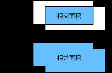

[TOC]

# 任务7：目标检测与边界框

## 1.任务目标

<!-- 1. 
2. 
3. 
4.  -->

- 学习锚框机制的相关概念

## 2.任务描述

- ⽬标检测算法通常会在输⼊图像中采样⼤量的区域，然后判断这些区域中是否包含我们感兴趣的 ⽬标，并调整区域边缘从而更准确地预测⽬标的真实边界框（ground-truthboundingbox）。不 同的模型使⽤的区域采样⽅法可能不同。
- 这⾥我们介绍其中的⼀种⽅法：它以每个像素为中⼼⽣ 成多个⼤小和宽⾼⽐（aspectratio）不同的边界框。这些边界框被称为锚框（anchorbox）。我 们将在后⾯基于锚框实践⽬标检测。

## 3.知识准备

### 3.1 ⽣成多个锚框

- 假设输⼊图像⾼为h，宽为w。我们分别以图像的每个像素为中⼼⽣成不同形状的锚框。设⼤小为s ∈ (0, 1]且宽⾼⽐为r > 0，那么锚框的宽和⾼将分别为ws√r和hs/√r。当中⼼位置给定时，已知宽和⾼的锚框是确定的。当中⼼位置给定时，已
知宽和⾼的锚框是确定的。

- 下⾯我们分别设定好⼀组⼤小s1, . . . , sn和⼀组宽⾼⽐r1, . . . , rm。如果以每个像素为中⼼时使⽤所有的⼤小与宽⾼⽐的组合，输⼊图像将⼀共得到whnm个锚框。虽然这些锚框可能覆盖了所有的真实边界框，但计算复杂度容易过⾼。因此，我们通常只对包含s1或r1的⼤小与宽⾼⽐的组合感兴趣，即

(s1, r1),(s1, r2), . . . ,(s1, rm),(s2, r1),(s3, r1), . . . ,(sn, r1).

- 也就是说，以相同像素为中⼼的锚框的数量为n + m − 1。对于整个输⼊图像，我们将⼀共⽣成wh(n + m − 1)个锚框。

### 3.2 交并比

- 我们刚刚提到某个锚框较好地覆盖了图像中的狗。如果该⽬标的真实边界框已知，这⾥的“较好”该如何量化呢？⼀种直观的⽅法是衡量锚框和真实边界框之间的相似度。我们知道，Jaccard系数（Jaccard index）可以衡量两个集合的相似度。给定集合A和B，它们的Jaccard系数即⼆者交集⼤小除以⼆者并集⼤小：

$$J(A,B)=\frac{|A\cap B|}{|A\cup B|}$$

- 实际上，我们可以把边界框内的像素区域看成是像素的集合。如此⼀来，我们可以⽤两个边界框的像素集合的Jaccard系数衡量这两个边界框的相似度。当衡量两个边界框的相似度时，我们通常将Jaccard系数称为交并⽐（intersection over union，IoU），即两个边界框相交⾯积与相并⾯积之⽐，如图9.2所⽰。交并⽐的取值范围在0和1之间：0表⽰两个边界框⽆重合像素，1表⽰两个边界框相等。

    

交并⽐是两个边界框相交⾯积与相并⾯积之⽐

- 我们将使⽤交并⽐来衡量锚框与真实边界框以及锚框与锚框之间的相似度。

### 3.3 输出预测边界框

- 在模型预测阶段，我们先为图像⽣成多个锚框，并为这些锚框⼀⼀预测类别和偏移量。随后，我们根据锚框及其预测偏移量得到预测边界框。当锚框数量较多时，同⼀个⽬标上可能会输出较多相似的预测边界框。为了使结果更加简洁，我们可以移除相似的预测边界框。常⽤的⽅法叫作⾮极⼤值抑制（non-maximum suppression，NMS）。

- 我们来描述⼀下⾮极⼤值抑制的⼯作原理。对于⼀个预测边界框B，模型会计算各个类别的预测概率。设其中最⼤的预测概率为p，该概率所对应的类别即B的预测类别。我们也将p称为预测边界框B的置信度。在同⼀图像上，我们将预测类别⾮背景的预测边界框按置信度从⾼到低排序，得到列表L。从L中选取置信度最⾼的预测边界框B1作为基准，将所有与B1的交并⽐⼤于某阈值的⾮基准预测边界框从L中移除。这⾥的阈值是预先设定的超参数。此时，L保留了置信度最⾼的预测边界框并移除了与其相似的其他预测边界框。接下来，从L中选取置信度第⼆⾼的预测边界框B2作为基准，将所有与B2的交并⽐⼤于某阈值的⾮基准预测边界框从L中移除。重复这⼀过程，直到L中所有的预测边界框都曾作为基准。此时L中任意⼀对预测边界框的交并⽐都小于阈值。最终，输出列表L中的所有预测边界框。

### 3.4边界框

## 4. 任务实施
- 通过python实现上述算法，体会算法，反思改进的思路，然后通过利用深度学习的算法来尝试增强图像。
### 4.1 实施思路

- 根据知识点中提及到的数学公式，将图像增强算法的函数复现，然后利用已有图片，进行图像增强。

### 4.2 实施步骤
#### 步骤1：

#### 步骤2：

#### 步骤3：

#### 步骤4：

#### 步骤5：

#### 步骤6：

## 5.任务拓展
### 5.1 

## 6. 任务实训
### 6.1 实训目的

### 6.2 实训内容

### 6.3 示例代码

