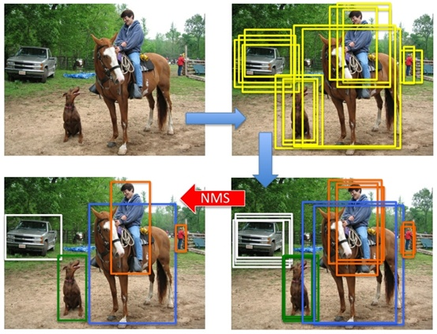
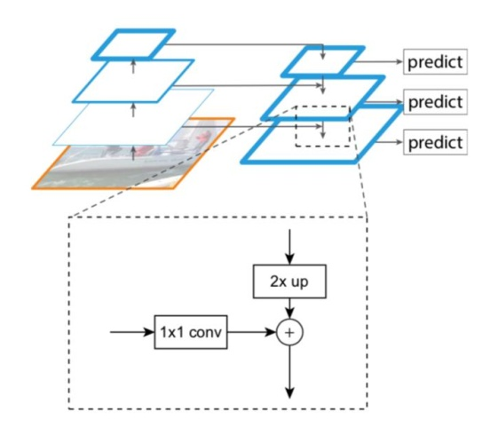
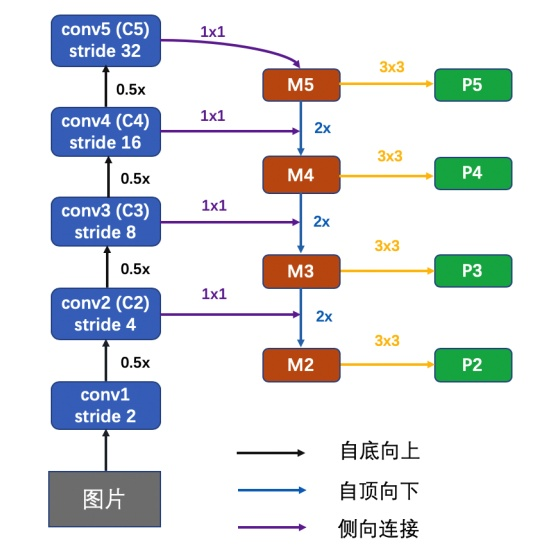
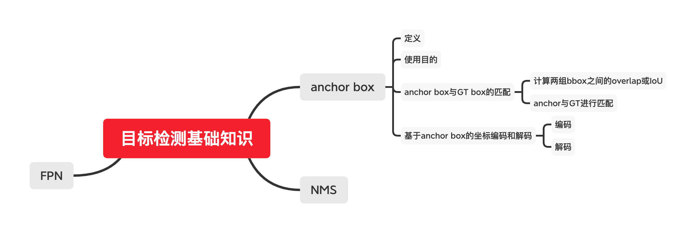
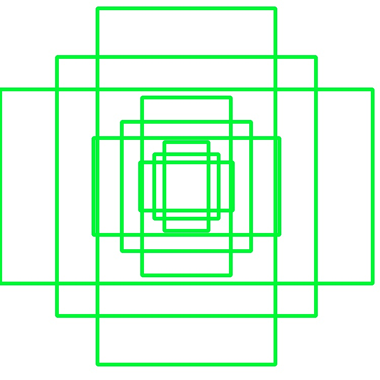
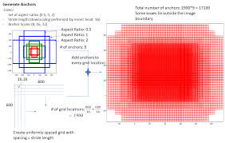

[TOC]
<!-- ref: https://lab.datafountain.cn/forum?id=82 -->

# 任务8：锚框

## 1.任务目标

<!-- 1. 
2. 
3. 
4.  -->

- 学习锚框机制的相关概念
- 跟着本教程动手实现锚框的生成和应用


## 2.任务描述

- ⽬标检测算法通常会在输⼊图像中采样⼤量的区域，然后判断这些区域中是否包含我们感兴趣的 ⽬标，并调整区域边缘从而更准确地预测⽬标的真实边界框（ground-truthboundingbox）。不 同的模型使⽤的区域采样⽅法可能不同。
- 这⾥我们介绍其中的⼀种⽅法：它以每个像素为中⼼⽣ 成多个⼤小和宽⾼⽐（aspectratio）不同的边界框。这些边界框被称为锚框（anchorbox）。我 们将在后⾯基于锚框实践⽬标检测。


## 3.知识准备

### 3.1 定义
anchor字面意思是锚，指固定船的装置，anchor在计算机视觉中一般指锚点或锚框，目标检测中常出现的anchor box是锚框，表示一系列固定的参考框。

近期基于深度学习的的目标检测方法有一大部分采用了anchor技术，可以归类为anchor based算法。

anchor box 是一组按照固定比例（长宽、大小）预定义的矩形框。

#### 目的
对于一个目标检测任务， anchor box的作用是提供一个检测的基准目标框。具体来讲，在anchor based的目标检测算法中：
1. 首先我们会给定一组预设的anchor box，这些anchor box有不同的大小和长宽比例。大小和长宽比例的设定原则为使得anchor box尽量和真实的gt box接近，例如yolo系列算法中使用kmeans等聚类方式来从gt box中聚类得到anchor box的大小和尺寸设置。
2. 由于目标可能出现在图片上的任何位置，具有很强的随机性，原始的目标检测算法往往使用滑动窗口的形式来检测目标，因此，在选定好anchor的大小和比例之后，通过滑动窗口的方式将这些anchor铺满整个图片，来实现图片所有位置都可以进行目标的检测。
3. 设定好anchor box后，模型不是直接去回归坐标框位置，而是以anchor box作为基准，回归GT框和anchor box之间的平移和缩放值。这意味着在每次图像推理过程中都将始终使用相同的预设anchor，并且将使用网络预测的相对anchor的偏移来更正该anchor。
综上，anchor box根本的目的是作为检测目标框的一个参考位置，目标检测模型不再去直接输出检测框的位置，而是输出该位置上的目标框和anchor框之间的相对关系

### 3.2 ⽣成多个锚框

假设输⼊图像⾼为h，宽为w。我们分别以图像的每个像素为中⼼⽣成不同形状的锚框。设⼤小为s ∈ (0, 1]且宽⾼⽐为r > 0，那么锚框的宽和⾼将分别为ws√r和hs/√r。当中⼼位置给定时，已知宽和⾼的锚框是确定的。当中⼼位置给定时，已
知宽和⾼的锚框是确定的。

下⾯我们分别设定好⼀组⼤小s1, . . . , sn和⼀组宽⾼⽐r1, . . . , rm。如果以每个像素为中⼼时使⽤所有的⼤小与宽⾼⽐的组合，输⼊图像将⼀共得到whnm个锚框。虽然这些锚框可能覆盖了所有的真实边界框，但计算复杂度容易过⾼。因此，我们通常只对包含s1或r1的⼤小与宽⾼⽐的组合感兴趣，即

(s1, r1),(s1, r2), . . . ,(s1, rm),(s2, r1),(s3, r1), . . . ,(sn, r1).

也就是说，以相同像素为中⼼的锚框的数量为n + m − 1。对于整个输⼊图像，我们将⼀共⽣成wh(n + m − 1)个锚框。


### 3.3 交并比

- 我们刚刚提到某个锚框较好地覆盖了图像中的狗。如果该⽬标的真实边界框已知，这⾥的“较好”该如何量化呢？⼀种直观的⽅法是衡量锚框和真实边界框之间的相似度。我们知道，Jaccard系数（Jaccard index）可以衡量两个集合的相似度。给定集合A和B，它们的Jaccard系数即⼆者交集⼤小除以⼆者并集⼤小：

$$J(A,B)=\frac{|A\cap B|}{|A\cup B|}$$

- 实际上，我们可以把边界框内的像素区域看成是像素的集合。如此⼀来，我们可以⽤两个边界框的像素集合的Jaccard系数衡量这两个边界框的相似度。当衡量两个边界框的相似度时，我们通常将Jaccard系数称为交并⽐（intersection over union，IoU），即两个边界框相交⾯积与相并⾯积之⽐，如图9.2所⽰。交并⽐的取值范围在0和1之间：0表⽰两个边界框⽆重合像素，1表⽰两个边界框相等。


<div align=center>
    
</div>
交并⽐是两个边界框相交⾯积与相并⾯积之⽐

- 我们将使⽤交并⽐来衡量锚框与真实边界框以及锚框与锚框之间的相似度。


### 3.4 输出预测边界框（非极大值抑制 Non-Maximum Suppression（NMS)）

<!-- - 在模型预测阶段，我们先为图像⽣成多个锚框，并为这些锚框⼀⼀预测类别和偏移量。随后，我们根据锚框及其预测偏移量得到预测边界框。当锚框数量较多时，同⼀个⽬标上可能会输出较多相似的预测边界框。为了使结果更加简洁，我们可以移除相似的预测边界框。常⽤的⽅法叫作⾮极⼤值抑制（non-maximum suppression，NMS）。

- 我们来描述⼀下⾮极⼤值抑制的⼯作原理。对于⼀个预测边界框B，模型会计算各个类别的预测概率。设其中最⼤的预测概率为p，该概率所对应的类别即B的预测类别。我们也将p称为预测边界框B的置信度。在同⼀图像上，我们将预测类别⾮背景的预测边界框按置信度从⾼到低排序，得到列表L。从L中选取置信度最⾼的预测边界框B1作为基准，将所有与B1的交并⽐⼤于某阈值的⾮基准预测边界框从L中移除。这⾥的阈值是预先设定的超参数。此时，L保留了置信度最⾼的预测边界框并移除了与其相似的其他预测边界框。接下来，从L中选取置信度第⼆⾼的预测边界框B2作为基准，将所有与B2的交并⽐⼤于某阈值的⾮基准预测边界框从L中移除。重复这⼀过程，直到L中所有的预测边界框都曾作为基准。此时L中任意⼀对预测边界框的交并⽐都小于阈值。最终，输出列表L中的所有预测边界框。 -->


由于目标检测算法往往会在一个目标的周围产生大量的目标检测框，而我们最终只需要其检测的最合适的一个，所以需要使用NMS算法来对结果进行后处理。 NMS算法的基本思想为：对于一个目标周围的若干大量检测框，找出其中置信度最高的一个保留，然后将其余的框去除 具体步骤为：

- 对所有的检测框按照置信度从高到低的顺序排序。
- 求出其他检测框与置信度最高的框的iou值，如果大于一定阈值则说明这些框与置信度最高的框重复性高，将这些框移除（抑制），小于阈值的框保留等待进一步处理，置信度最高的框保存到结果中。
- 将上一步剩余的框再一次按照1和2步骤操作，反复循环到没有框在需要处理。

全部过程如下图所示：

<div align=center>
    
</div>

### 3.5 FPN

<div align=center>
    
</div>

<div align=center>
    
</div>

特征金字塔思路主要是利用bakcbone多个stage对应多个分辨率特征图的特点，采用小尺寸特征图用于检测大尺寸物体，而大尺寸特征图检测小尺寸物体的思路。

如上图所示，backbone的多个stage每个stage都会输出一个特征图，通过融合浅层和深层的特征来动态分配大目标和小目标。

上图中的C2，C3, C4, C5代表了backbone的4个stage对应的输出，然后通过如图所示的自上向下，也就是从深层特征到浅层特征的方式融合后，再经过一个卷积层，生成最终的P2,P3,P4，P5特征图用于后续的分类和回归。

## 4. 任务实施

本次教程目的是让大家对常用的anchor based的目标检测中的anchor，坐标框在训练和预测过程中的编码解码，NMS（非极大值抑制）以及FPN网络等具体的部分进行里理解，从而为之后学习和掌握目标检测算法打下基础。


### 4.1 实施思路

<div align=center>
    
</div>

### 4.2 实施步骤
#### 步骤1：

一般采用预先定义的大小scale和高宽比例ratio来生成一组anchor box，然后将它们用滑动窗口的形式铺满整个图片。

- anchor scale:
  
  指的是anchor的大小，例如我们设置anchor的大小为[9, 18, 36], 也就是说anchor的基准大小是以上三个值为边长的正方形通过这个设定我们有一个一组正方形的anchor
- anchor ratio：
  
  为了生成各种长宽比例的长方形anchor，需要使用anchor ratio来调制
  anchor ratio指的是anchor的高度与宽度相对原始正方形anchor边长的比例的平方，例如我们给定ratio为：[0.5]，并且基础anchor大小为9，那么生成的anchor高度为 $\sqrt[2]{0.5} * 9 = 6.36$ ,宽度为$1/\sqrt[2]{0.5} * 9 = 12.72$

其中anchor的大小和比例设定的目的是使得anchor能够覆盖足够多的GT box，这里的覆盖指的是anchor box和GT box的IoU足够高。
对于单阶段的目标检测算法，例如yolo等，常使用kemeans等聚类方法，对GT box进行聚类，将聚类得到的结果作为anchor。
滑动窗口铺设anchor时,采用的具体方式为对于目标图片（一般是指其经过网络后的特征图），图中每个位置（每个点）都要有对应的一组anchor（这里的 anchor大小比例都是上面预先设定生成的），具体步骤为：

- 首先给定anchor和目标图的尺寸
- 在目标图上逐点滑窗，以这些点为中心放置anchor生成的anchor box1如下图所示：

<div align=center>
    
</div>

<div align=center>
    
</div>

接下来我们实现一个anchor的生成器，来实际操作，完整的实现逻辑参见： datasets/src/mmdet/core/anchor/anchor_generator.py

```
import torch
import numpy as np

# 定义anchor生成器类
class AnchorGenerator(object):
    def __init__(self, base_size, scales, ratios, ctr=None):
        # base_size 是anchor的基本大小
        # scales 是anchor缩放的比例，我们可以在基础大小上给定倍数来缩放anchor从而生成更多anchor
        # ratios 指的是anchor的高宽变化比例
        # ctr 为anchor中心点坐标，默认为None，通过anchor大小来自动计算中心点
        self.base_size = base_size
        self.scales = torch.Tensor(scales)
        self.ratios = torch.Tensor(ratios)
        self.ctr = ctr
        self.base_anchors = self.gen_base_anchors()
    
    @property
    def num_base_anchors(self):
        return self.base_anchors.size(0)

    def gen_base_anchors(self):
        # 用于生成基础anchor，这些基础anchor将会滑动窗口形式铺满图片
        # 基础anchor的宽和高
        w = self.base_size
        h = self.base_size
        # 计算基础anchor的中心坐标（左上角为0，0点）
        if self.ctr is None:
            x_ctr = 0.5 * (w - 1)
            y_ctr = 0.5 * (h - 1)
        else:
            x_ctr, y_ctr = self.ctr
        # 计算高宽比例并将基础anchor乘上这一比例
        h_ratios = torch.sqrt(self.ratios)
        w_ratios = 1 / h_ratios

        ws = (w * w_ratios[:, None] * self.scales[None, :]).view(-1)
        hs = (h * h_ratios[:, None] * self.scales[None, :]).view(-1)

        # 使用之前计算的anchor中心坐标和最终的高度和宽度计算得到最终的base anchor, 为了保证坐标是整数，最后使用round取整
        base_anchors = torch.stack(
            [
                x_ctr - 0.5 * (ws - 1), y_ctr - 0.5 * (hs - 1),
                x_ctr + 0.5 * (ws - 1), y_ctr + 0.5 * (hs - 1)
            ],
            dim=-1).round()

        return base_anchors

    def _meshgrid(self, x, y, row_major=True):
        xx = x.repeat(len(y))
        yy = y.view(-1, 1).repeat(1, len(x)).view(-1)
        if row_major:
            return xx, yy
        else:
            return yy, xx

    def grid_anchors(self, featmap_size, device='cpu'):
        '''device: cuda or cpu'''
        # 首先生成base anchor 
        base_anchors = self.base_anchors.to(device)
        # 然后使用当前anchor要覆盖图片的大小来给定所有需要滑窗铺设anchor的点的位置（其实就是这个图的所有点）
        feat_h, feat_w = featmap_size
        shift_x = torch.arange(0, feat_w, device=device)
        shift_y = torch.arange(0, feat_h, device=device)
        # 生成滑动窗口的x和y坐标
        shift_xx, shift_yy = self._meshgrid(shift_x, shift_y)
        shifts = torch.stack([shift_xx, shift_yy, shift_xx, shift_yy], dim=-1)
        shifts = shifts.type_as(base_anchors)
        # 将based anchor 沿着x，y坐标平移滑窗，将anchor铺满图片
        all_anchors = base_anchors[None, :, :] + shifts[:, None, :]
        all_anchors = all_anchors.view(-1, 4)
        return all_anchors
```

例如我们生成大小为9， 缩放倍数1，ratio 为 [1.] 的最简单的anchor，那么结果应该就是一个边长为9*9的正方形框

可以看到下面的结果，是一个二维的数组，每个元素是一个数组，含义为 [xmin, ymin, xmax, ymax] 代表了anchor的左上角和右上角坐标，例如下面的[0, 0, 8, 8]，代表了anchor是以[0, 0]点为左上角点，[8,8] 点为右下角点，那么边长就是8-0+1=9

```
ag = AnchorGenerator(9, [1.], [1.])
all_anchors = ag.grid_anchors((1, 1))
print(all_anchors)
```


或者生成base 大小为9， 缩放倍数1，ratio 为 [0.5, 1., 2.0] 的anchor，

可以看到结果为3个anchor box，基础大小为9，然后使用ratio做了高宽的变化， 由于求中心点的误差和最后的取整操作，有时候最终结果的比例会有偏差


```
ag = AnchorGenerator(9, [1.], [0.5, 1., 2.0])
all_anchors = ag.grid_anchors((1, 1))
print(all_anchors)
```

或者生成base 大小为9， 缩放倍数[0.5, 1.0, 2.0]，高宽比ratio 为 [1.] 的anchor，

可以看到结果为3个anchor box，由于高宽比例为1，所以均为正方形框，它们的边长分别为按照倍数的缩放，由于求中心点的误差和最后的取整操作，有时候长度可能差一个像素

```
ag = AnchorGenerator(9, [0.5, 1., 2.0], [1.])
all_anchors = ag.grid_anchors((1, 1))
print(all_anchors)
```

#### 步骤2 Anchor bbox 与GT bbox 的匹配：
上一步生成了非常多的预设anchor，接下来需要给每个label 框，也就是GT bbox 匹配一个对应的anchor，这样这个GT 框就是以这个anchor为基准来检测。
常用的匹配策略叫做max iou assign，也就是依据anchor box和gt box之间的IoU值来匹配，每个GT 选择与其IoU值大于一定阈值中最大的那个anchor来匹配，
一般分为以下几个步骤：

- 计算所有anchor和gt框的iou值
- 如果一个anchor和所有gt的iou值都小于阈值neg_iou_thr，也就是说这个anchor没有覆盖到任何的gt框，那么就将这个anchor标记为负样本（neg_iou_thr一般取0.3）
- 对于每一个anchor，先找到与它iou最大的gt框，如果他们的iou大于pos_iou_thr阈值（一般取0.7或者0.5），那么就将这个gt和这个anchor匹配
- 对于所有的gt框，将它与和它iou值最大的anchor匹配（这一步是为了解决上一步中可能存在部分gt框没有anchor匹配的问题）

这样每个gt框都匹配上了一个或者多个anchor

##### 计算两组bbox之间的overlap值或者iou值

为下一步anchor和gt的匹配做准备，实现如下, 可参考： datasets/src/mmdet/core/bbox/iou_calculators/iou2d_calculator.py

```
def bbox_overlaps(bboxes1, bboxes2, mode='iou'):
    """计算输入的两组bboxes之间的overlap值.

    """

    rows = bboxes1.size(0)
    cols = bboxes2.size(0)

    if rows * cols == 0:
        return bboxes1.new(rows, cols)


    lt = torch.max(bboxes1[:, None, :2], bboxes2[:, :2])  # [rows, cols, 2]
    rb = torch.min(bboxes1[:, None, 2:], bboxes2[:, 2:])  # [rows, cols, 2]

    wh = (rb - lt + 1).clamp(min=0)  # [rows, cols, 2]
    overlap = wh[:, :, 0] * wh[:, :, 1]
    area1 = (bboxes1[:, 2] - bboxes1[:, 0] + 1) * (bboxes1[:, 3] - bboxes1[:, 1] + 1)

    if mode == 'iou':
        area2 = (bboxes2[:, 2] - bboxes2[:, 0] + 1) * (bboxes2[:, 3] - bboxes2[:, 1] + 1)
        ious = overlap / (area1[:, None] + area2 - overlap)
    else:
        ious = overlap / (area1[:, None])

    return ious
```

例如我们求bboxes1和bboxes2之间各个框的iou值
```
# bbox的顺序为[xmin,ymin,xmax,ymax]
bboxes1 = torch.FloatTensor([
            [0, 0, 10, 10],
            [10, 10, 20, 20],
            [32, 32, 38, 42],
            ])
bboxes2 = torch.FloatTensor([
            [0, 0, 10, 20],
            [0, 10, 10, 19],
            [10, 10, 20, 20],
            ])
ious = bbox_overlaps(bboxes1, bboxes2)
print(ious)
```

#####  anchor和gt进行匹配
具体实现如下, 参考datasets/src/mmdet/core/bbox/assigners/max_iou_assigner.py ：

```
# anchor与GT匹配的类
class MaxIoUAssigner(object):
    """
    每个候选框会被打上一个标签：`-1`, `0`, `1`

    - -1: 忽略
    - 0: 负样本，表示这个anchor没有和任何gt box匹配成功，代表背景
    - index: 正样本，值为所匹配的gt的label，从1开始

    Args:
        pos_iou_thr (float): 正样本iou阈值.
        neg_iou_thr (float or tuple): 负样本iou阈值.
        min_pos_iou (float): 最小正样本iou阈值，用于当GT没有anchor匹配时二次降低标准寻找合适的anchor，保证每个GT都有anchor匹配上
        gt_max_assign_all (bool): 如果出现一个GT与多个anchor的iou相同且均为最大值，是否将这些anchor都和该GT匹配
    """

    def __init__(self,
                 pos_iou_thr,
                 neg_iou_thr,
                 min_pos_iou=.0,
                 gt_max_assign_all=True):
        self.pos_iou_thr = pos_iou_thr
        self.neg_iou_thr = neg_iou_thr
        self.min_pos_iou = min_pos_iou
        self.gt_max_assign_all = gt_max_assign_all

    def assign(self, bboxes, gt_bboxes, gt_labels=None):
        """匹配gt框和anchor.

        匹配步骤按照如下进行：

        1. 将所有的anchor都初始化为 -1
        2. 如果anchor与所有GT的iou值 all gts < neg_iou_thr， 就说明这个anchor不能喝任何GT匹配，标记为 0，负样本
        3. 对每个anchor，如果与它与对应最大iou值的gt框的iou值大于pos_iou_thr,就把这个anchor匹配到这个框上，标记为对应的gt的lable，
           属于正样本
        4. 对于每个gt，将与其iou最大的所有anchor均与它匹配

        """

        bboxes = bboxes[:, :4]
        overlaps = bbox_overlaps(gt_bboxes, bboxes)

        assign_result = self.assign_wrt_overlaps(overlaps, gt_labels)
        
        return assign_result     

    def assign_wrt_overlaps(self, overlaps, gt_labels=None):
        """Assign w.r.t. the overlaps of bboxes with gts.

        Args:
            overlaps (Tensor): gt和anchor之间的overlaps
            gt_labels (Tensor, optional): gtbox的类别label.

        Returns:
            :obj:`AssignResult`: The assign result.
        """
        num_gts, num_bboxes = overlaps.size(0), overlaps.size(1)

        # 1. 将所有的anchor都初始化为 -1
        assigned_gt_inds = overlaps.new_full((num_bboxes, ),
                                             -1,
                                             dtype=torch.long)

        # 对于每个anchor，找到与其iou最大的gt
        max_overlaps, argmax_overlaps = overlaps.max(dim=0)
        # 对于每个gt，找到与其iou最大的anchor
        gt_max_overlaps, gt_argmax_overlaps = overlaps.max(dim=1)

    # 2. 如果anchor与所有GT的iou值 all gts < neg_iou_thr， 就说明这个anchor不能喝任何GT匹配，标记为 0，负样本
        if isinstance(self.neg_iou_thr, float):
            assigned_gt_inds[(max_overlaps >= 0)
                             & (max_overlaps < self.neg_iou_thr)] = 0
        elif isinstance(self.neg_iou_thr, tuple):
            assert len(self.neg_iou_thr) == 2
            assigned_gt_inds[(max_overlaps >= self.neg_iou_thr[0])
                             & (max_overlaps < self.neg_iou_thr[1])] = 0

    # 3. 对每个anchor，如果与它与对应最大iou值的gt框的iou值大于pos_iou_thr,就把这个anchor匹配到这个框上，标记为对应的gt的lable，
#            属于正样本
        pos_inds = max_overlaps >= self.pos_iou_thr
        assigned_gt_inds[pos_inds] = argmax_overlaps[pos_inds] + 1

        # 4. 对于每个gt，将与其iou最大的所有anchor均与它匹配
        for i in range(num_gts):
            if gt_max_overlaps[i] >= self.min_pos_iou:
                if self.gt_max_assign_all:
                    max_iou_inds = overlaps[i, :] == gt_max_overlaps[i]
                    assigned_gt_inds[max_iou_inds] = i + 1
                else:
                    assigned_gt_inds[gt_argmax_overlaps[i]] = i + 1

        if gt_labels is not None:
            assigned_labels = assigned_gt_inds.new_zeros((num_bboxes, ))
            pos_inds = torch.nonzero(assigned_gt_inds > 0).squeeze()
            if pos_inds.numel() > 0:
                assigned_labels[pos_inds] = gt_labels[
                    assigned_gt_inds[pos_inds] - 1]
        else:
            assigned_labels = None
        # 返回值分别为： gt的数量，anchor匹配到gt的序号， anchor和所匹配gt的iou， anchor匹配到的label值
        return num_gts, assigned_gt_inds, max_overlaps, assigned_labels
```

下面举一个anchor和gt匹配的例子：

```
assigner = MaxIoUAssigner(
        pos_iou_thr=0.5,
        neg_iou_thr=0.5,
    )
anchors = torch.FloatTensor([
        [0, 0, 10, 10],
        [10, 10, 20, 20],
        [5, 5, 15, 15],
        [32, 32, 38, 42],
    ])
gt_bboxes = torch.FloatTensor([
        [0, 0, 10, 9],
        [0, 10, 10, 19],
    ])
gt_labels = torch.LongTensor([2, 3])
assign_result = assigner.assign(anchors, gt_bboxes, gt_labels=gt_labels)
num_gts, assigned_gt_inds, max_overlaps, assigned_labels = assign_result
print("gt的数量： ", num_gts)
print("anchor匹配到第几个gt： ", assigned_gt_inds)
print("anchor匹配到gt的序号： ", max_overlaps)
print("anchor匹配到的label值： ", assigned_labels)
```


#### 步骤3 基于Anchor box的坐标编码和解码：

##### 编码
有了预设的anchor和用来训练的GT框的匹配关系后，就可以以anchor为基准，将GT从原来的坐标编码为相对anchor的偏移量，这里的偏移主要包括平移和缩放两个方面。
我们这里定义：
$p_x$​ 为achor的x轴中心点，$p_y$​ 为anchor的y轴中心点, $p_w$​ 为anchor的宽度，$p_h$​ 为anchor的高
$g_x$ 为gt box的x轴中心点，$g_y$​ 为gt box的y轴中心点, $g_w$​ 为gt box的宽度，$g_h$​ 为gt box的高
编码过程：
$$
d_x = (g_x - p_x) / p_w
$$
$$
d_y = (g_y - p_y) / p_h
$$
$$
d_w = log(g_w / p_w)
$$
$$
d_h = log(g_h / p_h)
$$
其中$d_x$​和$d_y​$表示平移，$d_w$​和$d_h$​表示缩放
具体的实现如下，参考datasets/src/mmdet/core/bbox/coder/delta_xywh_bbox_coder.py：

```
def bbox2delta(proposals, gt, means=[0, 0, 0, 0], stds=[1, 1, 1, 1]):
    assert proposals.size() == gt.size()

    proposals = proposals.float()
    gt = gt.float()
    # 求出 anchor的中心点和高宽
    px = (proposals[..., 0] + proposals[..., 2]) * 0.5
    py = (proposals[..., 1] + proposals[..., 3]) * 0.5
    pw = proposals[..., 2] - proposals[..., 0] + 1.0
    ph = proposals[..., 3] - proposals[..., 1] + 1.0
    # 求出gt的中心点和高宽
    gx = (gt[..., 0] + gt[..., 2]) * 0.5
    gy = (gt[..., 1] + gt[..., 3]) * 0.5
    gw = gt[..., 2] - gt[..., 0] + 1.0
    gh = gt[..., 3] - gt[..., 1] + 1.0
    # 编码
    dx = (gx - px) / pw
    dy = (gy - py) / ph
    dw = torch.log(gw / pw)
    dh = torch.log(gh / ph)
    deltas = torch.stack([dx, dy, dw, dh], dim=-1)
    # 用均值标准差来归一化
    means = deltas.new_tensor(means).unsqueeze(0)
    stds = deltas.new_tensor(stds).unsqueeze(0)
    deltas = deltas.sub_(means).div_(stds)

    return deltas
```


```
anchors = torch.Tensor([[ 0.,  0.,  1.,  1.],
                      [ 0.,  0.,  1.,  1.],
                      [ 0.,  0.,  1.,  1.],
                      [ 5.,  5.,  5.,  5.]])
gt_bbox = torch.Tensor([[ 0.0000,  0.0000,  1.0000,  1.0000],
                        [ 0.2817,  0.2817,  4.7183,  4.7183],
                        [-6.3891,  0.6321,  7.3891,  0.3679],
                        [ 5.8967,  2.9251,  5.5033,  3.2749]])
deltas = bbox2delta(anchors, gt_bbox)
print(deltas)
```

##### 解码
经过上述编码，模型在预测时候的直接结果就是编码的值，要想得到最终实际的坐标框，需要将上述$d_x$​，$d_y$​，$d_w$​和$d_h$​进行解码
解码过程就是上面编码的逆过程：
$$g_w = p_w * exp(d_w)$$
$$g_h = p_h * exp(d_h)$$

$$g_x = p_x + pw * d_x$$
$$g_y = p_y + ph * d_y$$

$$x1 = g_x - g_w * 0.5 + 0.5$$
$$y1 = g_y - g_h * 0.5 + 0.5$$
$$x2 = g_x + g_w * 0.5 - 0.5$$
$$y2 = g_y + g_h * 0.5 - 0.5$$
最终（x1，y1）为预测框左上角坐标，（x2，y2）为预测框右下角坐标
具体的实现如下，参考datasets/src/mmdet/core/bbox/coder/delta_xywh_bbox_coder.py：

```
def delta2bbox(rois,
               deltas,
               means=[0, 0, 0, 0],
               stds=[1, 1, 1, 1],
               max_shape=None,
               wh_ratio_clip=16 / 1000):
    """
    对bbox进行解码，使用delta 从rois解码回bbox

    Args:
        rois (Tensor): anchor box或者proposal坐标
        deltas (Tensor): 编码后的结果，即相对每个roi的平移和缩放量
        means (list): delta 的均值，用于反标准化
        stds (list): delta 的标准差，用于反标准化
        max_shape (tuple[int, int]): 解码后bbox 的最大尺度
        wh_ratio_clip (float): 解码后bbbox的最大高宽比

    Returns:
        Tensor: 返回值为bbox的坐标，每一行是一个框，格式为 [tl_x, tl_y, br_x, br_y],即左上角点坐标和右下角点坐标

    References:
        .. [1] https://arxiv.org/abs/1311.2524

    """
    means = deltas.new_tensor(means).repeat(1, deltas.size(1) // 4)
    stds = deltas.new_tensor(stds).repeat(1, deltas.size(1) // 4)
    denorm_deltas = deltas * stds + means
    dx = denorm_deltas[:, 0::4]
    dy = denorm_deltas[:, 1::4]
    dw = denorm_deltas[:, 2::4]
    dh = denorm_deltas[:, 3::4]
    max_ratio = np.abs(np.log(wh_ratio_clip))
    dw = dw.clamp(min=-max_ratio, max=max_ratio)
    dh = dh.clamp(min=-max_ratio, max=max_ratio)
    # 计算每个 roi 的中心
    px = ((rois[:, 0] + rois[:, 2]) * 0.5).unsqueeze(1).expand_as(dx)
    py = ((rois[:, 1] + rois[:, 3]) * 0.5).unsqueeze(1).expand_as(dy)
    # 计算高度和宽度
    pw = (rois[:, 2] - rois[:, 0] + 1.0).unsqueeze(1).expand_as(dw)
    ph = (rois[:, 3] - rois[:, 1] + 1.0).unsqueeze(1).expand_as(dh)
    # 使用 exp 函数来缩放
    gw = pw * dw.exp()
    gh = ph * dh.exp()
    # 使用 dx和 dy平移
    gx = torch.addcmul(px, 1, pw, dx)  # gx = px + pw * dx
    gy = torch.addcmul(py, 1, ph, dy)  # gy = py + ph * dy
    # 转换为左上角和右下角坐标形式
    x1 = gx - gw * 0.5 + 0.5
    y1 = gy - gh * 0.5 + 0.5
    x2 = gx + gw * 0.5 - 0.5
    y2 = gy + gh * 0.5 - 0.5
    if max_shape is not None:
        x1 = x1.clamp(min=0, max=max_shape[1] - 1)
        y1 = y1.clamp(min=0, max=max_shape[0] - 1)
        x2 = x2.clamp(min=0, max=max_shape[1] - 1)
        y2 = y2.clamp(min=0, max=max_shape[0] - 1)
    bboxes = torch.stack([x1, y1, x2, y2], dim=-1).view_as(deltas)
    return bboxes
```

例如我们将模型预测出来的deltas基于roi（anchor）解码成正常的bbox

```
rois = torch.Tensor([[ 0.,  0.,  1.,  1.],
                      [ 0.,  0.,  1.,  1.],
                      [ 0.,  0.,  1.,  1.],
                      [ 5.,  5.,  5.,  5.]])
deltas = torch.Tensor([[  0.,   0.,   0.,   0.],
                        [  1.,   1.,   1.,   1.],
                        [  0.,   0.,   2.,  -1.],
                        [ 0.7, -1.9, -0.5,  0.3]])
bbox = delta2bbox(rois, deltas)
print(bbox)
```


## 5.任务拓展
### 5.1 优化思路和方法

- 若目标检测的对象类别比较单一，可以在选取 anchor 的尺寸和高宽比时对 GT box 的这两个参数进行聚类，得到一个比较合适的数值。
- 可以尝试在每张图的不同位置设置不同尺寸和大小的 adaptive anchor
- 针对检测目标的特性选择anchor的形状，如使用平行四边形


## 6. 任务实训
1. FPN结构不包含下列哪个计算过程？ 【分值：20】
   A.自底向上 B.自顶向下 C.反向连接 D.侧向连接
2. anchor的哪些参数是预先设定的？ 【分值：20】
   A.尺寸 B.中心偏移量 C.长宽比 D.放缩值 E.倾斜角度
3. anchor的大小和长宽比例原则上应尽量和真实的gt box接近 【分值：20】
4. anchor-base 的模型回归的目标是坐标框位置 【分值：20】
5. FPN中大尺寸物体用什么尺寸的特征图来检测 【分值：20】
6. 请简述 NMS 算法的大致流程 【分值：0】


