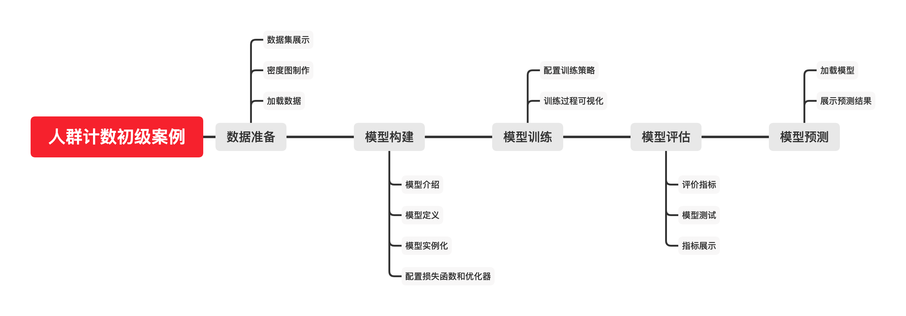
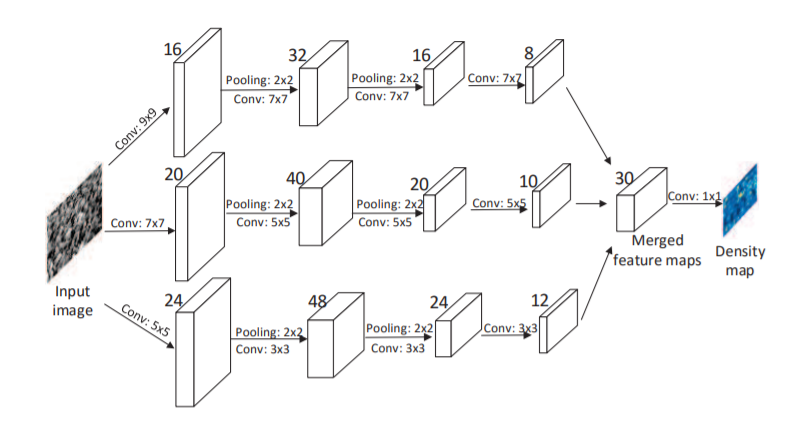
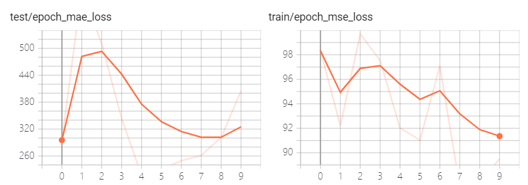
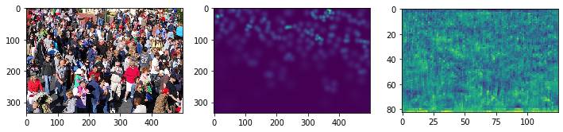

[TOC]

<!-- ref: https://lab.datafountain.cn/forum?id=113 -->

# 任务9：多尺度目标检测

## 1.任务目标

<!-- 1. 
2. 
3. 
4.  -->

- 回顾先前目标检测课程的基础
- 运用目标检测的思想进行多尺度目标检测
- 动手实现一个多尺度的人脸目标检测器


## 2.任务描述

本课程旨在介绍如何利用pytorch深度学习工具实现一个人群计数模型（MCNN）。通过加载数据、生成密度图、构建模型、训练模型和测试用例依次实现一个人群计数工具，在训练和预处理过程中通过可视化监督训练过程。 


## 3.知识准备


### 3.1 背景

近年来，随着踩踏事件的不断发生，人群计数的问题受到了越来越多研究人员的关注。人群计数的方法大致可以分为三种：

以检测为基础，即通过对图像中每一个人进行检测从而得到人群数目。
以回归为基础，即通过建立图像特征和图像人数的回归模型，通过测量图像特征从而估计场景中的人数。

以密度图为基础，这类方法是目前人群统计的主流方法。与基于检测的方法和基于回归的方法相比，密度图既能给出行人数量信息，又能反映行人的分布情况，使模型能更好地拟合相应的原始图像。


### 3.2 数据集

此次课程采用的数据集为 ShanghaiTech_Crowd_Counting_Dataset，点击这里进行下载。因为生成密度图需要一定时间，所以提供了包含 partA 部分密度图的数据集。

## 4. 任务实施


### 4.1 实施思路

<div align=center>
    <!--  -->
    
</div>


### 4.2 实施步骤

📦root
<br>┣ 📂datasets   # 实验所用数据集下载并解压到当前目录
<br>┃ ┣ 📂part_A_final  # A 部分数据集
<br>┃ ┃ ┣ 📂test_data 
<br>┃ ┃ ┗ 📂train_data 
<br>┃ ┗ 📂part_B_final  # B 部分数据集
<br>┃   ┣ 📂test_data 
<br>┃   ┗ 📂train_data 
<br>┣ 📂pictures   # 存放 notebook 中所需图片
<br>┣ 📂result   # 存放输出的结果
<br>┣ 📂models   # 存放训练过程中的断点和训练好的模型
<br>┣ 📜人群计数初级案例.ipynb  # 当前 notebook
<br>┗ 📜人群计数初级案例-标准提交件清单.xlsx  # 案例配套材料说明文档

#### 步骤1：导入相关库

```
# !pip install torchsummary tensorboardX

# 统一导入packages

import glob
import os
import re

import cv2
import h5py
import matplotlib.pyplot as plt
import numpy as np
import PIL.Image as Image
import scipy
import scipy.ndimage
import scipy.io as io
import scipy.spatial as spatial
import torch
import torch.nn as nn
from torch.utils.data import Dataset
from torchsummary import summary
from tensorboardX import SummaryWriter

%matplotlib inline

```

```
torch.backends.cudnn.benchmark = False # 因为输入图片大小不确定，所以设置其为 False，下文有详细介绍
device = torch.device('cuda' if torch.cuda.is_available() else 'cpu') # 使用 gpu 进行训练
```

#### 步骤2：数据准备

因为 MCNN 方法是基于密度图的，所以我们需要先将 ShanghaiTech 数据中的 Ground-Truth 制作成密度图形式。该小节整个数据准备的流程可以分为：

1. 数据集展示
2. 密度图制作
3. 构造 dataset 类
4. 数据加载 dataloader 

##### 数据集展示
通过 0.1 小节中给的链接，将数据集 ShanghaiTech_Crowd_Counting_Dataset 下载并解压到 dataset 根目录下，最终数据集目录如 0.2 小节所示。

读取数据集中的某个样本，如下图所示。为了方便自由修改查看，将路径拆分为多个部分。
```
sample_idx = 6 # 样本编号
sample_root = "datasets/part_A_final/train_data/" # 样本根目录
img_path = os.path.join(sample_root, f"images/IMG_{sample_idx}.jpg") # 图片
gt_mat_path = os.path.join(sample_root, f"ground_truth/GT_IMG_{sample_idx}.mat") # 标签

img = plt.imread(img_path)
gt = io.loadmat(gt_mat_path)
```

可视化图片如下图所示:
```
plt.imshow(img);plt.show()
```

```
print(gt)
```
gt 中包含该图片的所有需要的信息，image_info 包含有图片的每个人头的二维坐标，以及图片中人头的数目，将其在图中标注出来，结果如下图所示。

```
xys = gt["image_info"][0][0][0][0][0] # 获取图像中所有的人头位置
xs = [i[0] for i in xys]; ys = [i[1] for i in xys] # 分别获取横坐标和纵坐标，方便展示
plt.imshow(img); plt.plot(xs,ys,'rx'); plt.show()
```

##### 密度图制作
前文提到，MCNN 是基于密度图来进行人群计数的，所以我们需要根据 .mat 文件制作训练所需的密度图。

定义密度图转换的函数 make_density 如下所示，采用 k-nearest neighbors 和高斯滤波，当图像中人数较多时，对应花费时间也较久。

k-nearest neighbors (KNN)和代码中所使用的的KDTree的详细说明可以参考此文

高斯滤波以及其具体使用可以参考此文

为了节省时间成本，已将 part_A 部分制作完毕并包含在压缩包中。

```
def make_density(img, points):
    img_shape = [img.shape[0],img.shape[1]] # 获取图像形状
    print(f"shape of imgs: {img_shape} , number of gaussian kernels: {len(points)}",end="\t")
    density = np.zeros(img_shape, dtype=np.float32) # 初始化一个全 0 矩阵
    gt_count = len(points)
    if gt_count == 0: # 如果图像中没有人，则返回全 0 矩阵
        return density

    leafsize = 2048
    # 构建 kdtree
    tree = spatial.KDTree(points.copy(), leafsize=leafsize)
    distances, locations = tree.query(points, k=4) # 在这里选取 k 为4

    print('processing...', end='\t')
    for i, pt in enumerate(points):
        pt2d = np.zeros(img_shape, dtype=np.float32)
        if int(pt[1]) < img_shape[0] and int(pt[0]) < img_shape[1]:
            pt2d[int(pt[1]), int(pt[0])] = 1.
        else:
            continue
        if gt_count > 1:
            sigma = (distances[i][1]+distances[i][2]+distances[i][3])*0.1
        else:
            sigma = np.average(np.array(gt.shape))/2./2.
        density += scipy.ndimage.filters.gaussian_filter(
            pt2d, sigma, mode='constant')
    print('done.')
    return density
```

调用函数来制作密度图（part_A），注意这里输出只保留了前十项。

```
# 根目录
root = 'datasets/'

# 总的路径列表
path_sets = []
# 添加路径列表（part_A）
path_sets.append(os.path.join(root, 'part_A_final/train_data', 'images'))
path_sets.append(os.path.join(root, 'part_A_final/test_data', 'images'))
# 添加路径列表（part_B）
# path_sets.append(os.path.join(root,'part_B_final/train_data','images'))
# path_sets.append(os.path.join(root,'part_B_final/test_data','images'))

# 保存路径
for save_root in path_sets:
    save_root = save_root.replace('datasets','temp').replace('images', 'ground_truth')
    if not os.path.exists(save_root):
        os.makedirs(save_root)

img_paths = []
for path in path_sets:
    for img_path in glob.glob(os.path.join(path, '*.jpg')): # 返回所有匹配的文件路径列表
        img_paths.append(img_path)

for idx,img_path in enumerate(img_paths):
    save_path = img_path.replace('.jpg', '.npy').replace('images', 'ground_truth').replace('datasets','temp')
    if os.path.exists(save_path):
        continue
    print(img_path, end='\t')
    mat = io.loadmat(img_path.replace('.jpg', '.mat').replace(
        'images', 'ground_truth').replace('IMG_', 'GT_IMG_'))
    img = plt.imread(img_path) 
    k = np.zeros((img.shape[0], img.shape[1]))
    points = mat["image_info"][0, 0][0, 0][0]
    k = make_density(img, points)
    np.save(save_path, k)
#     if idx>2:break #控制时间，可放开
```


转化后的密度图如下所示，为了方便自由修改查看，将路径拆分为多个部分。

```
density_idx = 138 # 样本编号
density_root = "./temp/part_A_final/train_data/" # 样本根目录
density_path = os.path.join(density_root, f"ground_truth/IMG_{density_idx}.npy") # 图片
density = np.load(density_path)
plt.imshow(density); plt.show()
```


##### 构造dataset类
构造一个 dataset 类，继承于 torch.utils.data.Dataset，我们只需要重写他的初始化函数 __init__，返回数据集长度的函数 __len__，以及如何读取每一个样本的 __getitem__。

- __len__ ：较为简单，只需调用 len() 来获取数据集长度即可
- __init__ : 定义一些基本参数，如图片的根目录等，需要与 __getitem__ 一起配合完成数据的读取
- __getitem__ : 接受 int 类型的参数 index，即想要读取的样本的索引，根据索引返回该样本。

```
class CrowdDataset(Dataset):
    def __init__(self, img_root, gt_dmap_root, gt_downsample=1):
        '''
        img_root: 图片的根目录.
        gt_dmap_root: 真实密度图的根目录.
        gt_downsample: 默认为0，表示模型的输出与输入图像大小相同.
        '''
        self.img_root = img_root
        self.gt_dmap_root = gt_dmap_root
        self.gt_downsample = gt_downsample

        self.img_names = [filename for filename in os.listdir(img_root)
                          if os.path.isfile(os.path.join(img_root, filename))] # 获取所有图片的文件名
        self.n_samples = len(self.img_names) # 数据集的长度

    def __len__(self):
        return self.n_samples

    def __getitem__(self, index):
        assert index <= len(self), 'index range error'
        img_name = self.img_names[index]
        img = plt.imread(os.path.join(self.img_root, img_name))
        if len(img.shape) == 2:  # 将单通道灰度图扩展为三通道
            img = img[:, :, np.newaxis]
            img = np.concatenate((img, img, img), 2)

        gt_dmap = np.load(os.path.join(self.gt_dmap_root, img_name.replace('.jpg', '.npy')))
        # 对图像和密度图进行下采样
        if self.gt_downsample > 1:
            ds_rows = int(img.shape[0]//self.gt_downsample)
            ds_cols = int(img.shape[1]//self.gt_downsample)
            img = cv2.resize(img, (ds_cols*self.gt_downsample,
                                   ds_rows*self.gt_downsample))
            # 顺序转换为 (channel,rows,cols)
            img = img.transpose((2, 0, 1))
            gt_dmap = cv2.resize(gt_dmap, (ds_cols, ds_rows))
            gt_dmap = gt_dmap[np.newaxis, :, :] * \
                self.gt_downsample*self.gt_downsample

            img_tensor = torch.tensor(img, dtype=torch.float)
            gt_dmap_tensor = torch.tensor(gt_dmap, dtype=torch.float)

        return img_tensor, gt_dmap_tensor
```

数据加载 dataloader
根据前面定义好的类 CrowdDataset 来构造一个 dataloader，训练时通过迭代 dataloader 来获取数据。我们可以通过dataloader 来实现一些基础功能，如将数据集打乱（shuffle=True），设置batch_size，多线程加载数据（num_workers）等。

需要注意的是，由于数据集中图片大小不一样，所以设置 batch_size=1，同样的原因，在上文中，我们需要设置 torch.backends.cudnn.benchmark=False。

```
# 训练集
img_root = './datasets/part_A_final/train_data/images'
gt_dmap_root = './temp/part_A_final/train_data/ground_truth'
dataset = CrowdDataset(img_root, gt_dmap_root, 4)
dataloader = torch.utils.data.DataLoader(dataset, batch_size=1, shuffle=True)
# 测试集
test_img_root = './datasets/part_A_final/test_data/images'
test_gt_dmap_root = './temp/part_A_final/test_data/ground_truth'
test_dataset = CrowdDataset(test_img_root, test_gt_dmap_root, 4)
test_dataloader = torch.utils.data.DataLoader(test_dataset, batch_size=1, shuffle=False)
```


#### 步骤3：模型构建
本小节通过 pytorch 的一些内置函数，搭建了论文中的 MCNN 模型，具体分为以下几个部分：

1. 模型介绍
2. 模型定义
3. 实例化模型
4. 损失函数和优化器

##### 模型介绍
本教程采用的的模型 MCNN 的结构如下图所示：

<div align=center>
    <!--  -->
    
</div>

MCNN 包含了三列具有不同滤波器大小的卷积神经网络。网络的每一列并行的子网络深度相同，但是滤波器的大小不同（大，中，小），因此每一列子网络的感受野不同，能够抓住不同大小人头的特征，最后将三列子网络的特征图做线性加权（由 1x1 的卷积完成）得到该图像的人群密度图，类似模型融合的思想。采用了 2x2 的 max-pooling 和 ReLU 激活函数。

##### 模型定义
通过 pytorch 的内置接口，搭建模型结构如下所示。 其中 self.branch1，self.branch2 和 self.branch3 为上图中的三个分支，self.fuse 为上图中最后的融合模块。_initialize_weights 用于对模型进行初始化。

搭建模型所用接口官方文档
```
class MCNN(nn.Module):

    def __init__(self, load_weights=False):
        super(MCNN, self).__init__()

        self.branch1 = nn.Sequential(
            nn.Conv2d(3, 16, 9, padding=4),
            nn.ReLU(inplace=True),
            nn.MaxPool2d(2),
            nn.Conv2d(16, 32, 7, padding=3),
            nn.ReLU(inplace=True),
            nn.MaxPool2d(2),
            nn.Conv2d(32, 16, 7, padding=3),
            nn.ReLU(inplace=True),
            nn.Conv2d(16, 8, 7, padding=3),
            nn.ReLU(inplace=True)
        )

        self.branch2 = nn.Sequential(
            nn.Conv2d(3, 20, 7, padding=3),
            nn.ReLU(inplace=True),
            nn.MaxPool2d(2),
            nn.Conv2d(20, 40, 5, padding=2),
            nn.ReLU(inplace=True),
            nn.MaxPool2d(2),
            nn.Conv2d(40, 20, 5, padding=2),
            nn.ReLU(inplace=True),
            nn.Conv2d(20, 10, 5, padding=2),
            nn.ReLU(inplace=True)
        )

        self.branch3 = nn.Sequential(
            nn.Conv2d(3, 24, 5, padding=2),
            nn.ReLU(inplace=True),
            nn.MaxPool2d(2),
            nn.Conv2d(24, 48, 3, padding=1),
            nn.ReLU(inplace=True),
            nn.MaxPool2d(2),
            nn.Conv2d(48, 24, 3, padding=1),
            nn.ReLU(inplace=True),
            nn.Conv2d(24, 12, 3, padding=1),
            nn.ReLU(inplace=True)
        )

        self.fuse = nn.Sequential(nn.Conv2d(30, 1, 1, padding=0))

        if not load_weights:
            self._initialize_weights()

    def forward(self, img_tensor):
        x1 = self.branch1(img_tensor)
        x2 = self.branch2(img_tensor)
        x3 = self.branch3(img_tensor)
        x = torch.cat((x1, x2, x3), 1)
        x = self.fuse(x)
        return x

    def _initialize_weights(self):
        for m in self.modules():
            if isinstance(m, nn.Conv2d):
                nn.init.normal_(m.weight, std=0.01)
                if m.bias is not None:
                    nn.init.constant_(m.bias, 0)
            elif isinstance(m, nn.BatchNorm2d):
                nn.init.constant_(m.weight, 1)
                nn.init.constant_(m.bias, 0)
```

##### 实例化模型
```
print(device)
mcnn = MCNN().to(device) # 模型实例化
```

```
summary(mcnn, (3, 1000, 500)) # 以输入图片大小为 3x1000x500 为例来展示网络结构

[out]:
----------------------------------------------------------------
        Layer (type)               Output Shape         Param #
================================================================
            Conv2d-1        [-1, 16, 1000, 500]           3,904
              ReLU-2        [-1, 16, 1000, 500]               0
         MaxPool2d-3         [-1, 16, 500, 250]               0
            Conv2d-4         [-1, 32, 500, 250]          25,120
              ReLU-5         [-1, 32, 500, 250]               0
         MaxPool2d-6         [-1, 32, 250, 125]               0
            Conv2d-7         [-1, 16, 250, 125]          25,104
              ReLU-8         [-1, 16, 250, 125]               0
            Conv2d-9          [-1, 8, 250, 125]           6,280
             ReLU-10          [-1, 8, 250, 125]               0
           Conv2d-11        [-1, 20, 1000, 500]           2,960
             ReLU-12        [-1, 20, 1000, 500]               0
        MaxPool2d-13         [-1, 20, 500, 250]               0
           Conv2d-14         [-1, 40, 500, 250]          20,040
             ReLU-15         [-1, 40, 500, 250]               0
        MaxPool2d-16         [-1, 40, 250, 125]               0
           Conv2d-17         [-1, 20, 250, 125]          20,020
             ReLU-18         [-1, 20, 250, 125]               0
           Conv2d-19         [-1, 10, 250, 125]           5,010
             ReLU-20         [-1, 10, 250, 125]               0
           Conv2d-21        [-1, 24, 1000, 500]           1,824
             ReLU-22        [-1, 24, 1000, 500]               0
        MaxPool2d-23         [-1, 24, 500, 250]               0
           Conv2d-24         [-1, 48, 500, 250]          10,416
             ReLU-25         [-1, 48, 500, 250]               0
        MaxPool2d-26         [-1, 48, 250, 125]               0
           Conv2d-27         [-1, 24, 250, 125]          10,392
             ReLU-28         [-1, 24, 250, 125]               0
           Conv2d-29         [-1, 12, 250, 125]           2,604
             ReLU-30         [-1, 12, 250, 125]               0
           Conv2d-31          [-1, 1, 250, 125]              31
================================================================
Total params: 133,705
Trainable params: 133,705
Non-trainable params: 0
----------------------------------------------------------------
Input size (MB): 5.72
Forward/backward pass size (MB): 815.63
Params size (MB): 0.51
Estimated Total Size (MB): 821.86
----------------------------------------------------------------
```

##### 损失函数和优化器
其中，使用带动量的 SGD 作为优化器，初始学习率为 1e-6，momentum 设置为 0.95，损失函数使用最常见的均方损失函数（MSELoss）。
在 pytorch 中，我们可以直接调用定义好的接口（MSE和SGD）来实现。

需要注意的是，在使用损失函数训练模型时，计算的是模型输出密度图和ground-truth的密度图之间的差异，而不是输出人群数目和实际人群数目之间的差异。

MSE 计算方法为：
$$M S E=\frac{1}{M \times N \sum_{i=1}^{M} \sum_{j=1}^{N}\left(f^{\prime}(i, j)-f(i, j)\right)^{2}}$$

其中 $f^{\prime}(i,j)$ 和 $f(i,j)$ 分别为模型输出密度图和ground-truth的密度图上坐标为$(i,j)$的像素，M,N分别表示密度图的长与宽。

```
criterion = nn.MSELoss(reduction='sum').to(device) # 损失函数
optimizer = torch.optim.SGD(mcnn.parameters(), lr=1e-6, momentum=0.95) # 优化器
```


#### 步骤4：模型训练

本小节对上一小节定义好的模型进行了训练，具体分为以下几个部分：

1. 训练模型
2. 训练过程可视化

##### 训练模型
在训练开始之前，如 0.2 小节所示，要先创建一个文件夹，用来保存断点和训练好的模型。
```
if not os.path.exists('./temp/models'):
    os.makedirs('./temp/models')
```

在训练模型时，每训练完一个 epoch 测试一下模型效果如何，并将模型的参数保存下来，防止训练被意外中断以及方便测试。整个训练过程中，不断对比每个 epoch 的结果，将最好的结果记录下来。

与训练集不同，测试集部分，为了与论文保持一致，我们测试的是指标 MAE。

具体的训练过程如下所示：

初始化各个参数

```
min_mae, min_epoc = 10000, 0 # 最小的 MAE 和其对应的 epoch
train_loss_list, epoch_list, test_error_list = [], [], [] # 方便可视化
```
开始训练，并测试每一个 epoch 的结果。

在训练的时候，如果已经达到了预期结果或者观察指标 MAE 长时间没有变化，可以及时停止，即 early stopping。

在这里，只保留了该 cell 的前十项输出。

```
writer = SummaryWriter('./temp/logs/') # 可视化训练过程
```

在命令行中运行

tensorboard --logdir=result/logs/

开启 tensorboard，并在显示的指定地址查看训练过程


```
num_epochs = 1 #1000
mcnn.to(device)
for epoch in range(0,num_epochs):
    mcnn.train()
    epoch_loss=0
    for i,(img,gt_dmap) in enumerate(dataloader):
        current_batch = epoch * len(dataloader) + i
        img=img.to(device)
        gt_dmap=gt_dmap.to(device)
        # 前向传播
        et_dmap=mcnn(img)
        # 计算损失函数
        loss=criterion(et_dmap,gt_dmap)
        epoch_loss+=loss.item()
        optimizer.zero_grad()
        loss.backward()
        optimizer.step()
        writer.add_scalar('train/batch_mse_loss', loss.item(), current_batch)
        print(i)
        if i>1:break
    epoch_list.append(epoch)
    train_loss_list.append(epoch_loss/len(dataloader))
    torch.save(mcnn.state_dict(),'./temp/models/epoch_'+str(epoch)+".param")
    writer.add_scalar('train/epoch_mse_loss', epoch_loss/len(dataloader), epoch)

    mcnn.eval()
    mae=0
    for i,(img,gt_dmap) in enumerate(test_dataloader):
        img=img.to(device)
        gt_dmap=gt_dmap.to(device)
        # 前向传播
        et_dmap=mcnn(img)
        # 计算 MAE
        mae+=abs(et_dmap.data.sum()-gt_dmap.data.sum()).item()
        del img,gt_dmap,et_dmap
        print(i)
        if i>1:break
    if mae/len(test_dataloader)<min_mae:
        min_mae=mae/len(test_dataloader)
        min_epoch=epoch
    test_error_list.append(mae/len(test_dataloader))   
    writer.add_scalar('test/epoch_mae_loss', mae/len(test_dataloader), epoch)
    print(f"epoch:{epoch} | loss:{epoch_loss/len(dataloader)} | error:{mae/len(test_dataloader)} | min_mae:{min_mae} | min_epoch:{min_epoch}")
```


##### 训练过程可视化
通过训练过程中保存的数据，我们可以将训练过程可视化, 通过tensorboard我们可以观察到训练过程如图所示：
<div align=center>
    <!--  -->
    
</div>

除此之外，我们还可以利用训练过程中所保留的一些变量来进行可视化，如下所示：

```
plt.plot(epoch_list,train_loss_list); plt.title("MSE during the training process")
```

#### 步骤5：模型评估

在本小节中，将对训练好的模型进行测试与分析，观察其效果如何。具体分为以下几个部分：

1. 评价指标
2. 模型测试
3. 指标展示

##### 评价指标
在这里同论文中一致，采用的评价指标是平均绝对误差（Mean Absolute Error, MAE），其计算方法如下所示：
$$M A E=\frac{1}{n} \sum_{i=1}^{n}\left|f_{i}-y_{i}\right|=\frac{1}{n} \sum_{i=1}^{n}\left|e_{i}\right|$$
其中$f_{i}$​为预测值，$y_{i}$​ 为输出值。

##### 模型测试
在训练过程中可以看到最好的 checkpoint 的编号，我们可以对其进行加载和测试。

在这里，提供了两个选项，一个是测试所有断点（optionA），一个是测试部分断点（optionB），具体见代码注释。

考虑到 notebook 训练时间较长，可能会发生中断，数据丢失，因此利用下面的代码对 models/ 下面所有的断点进行测试。来获得最好的 checkpoint 的编号。

```
mae_list, epoch_list = [], []
# cp_list = glob.glob("models/*.param") # optionA: 所有 checkpoints
# cp_list = [f"temp/models/epoch_{idx}.param" for idx in [50, 100, 150, 200, 250, 300, 400, 500, 600]] # optionB: 部分 checkpoints
cp_list = [f"temp/models/epoch_0.param"]
for cp in cp_list:
    epoch = int(re.findall(r"\d+", cp)[0])
    mcnn.load_state_dict(torch.load(cp))
    mcnn.eval()
    mae=0
    for i,(img,gt_dmap) in enumerate(test_dataloader):
        img=img.to(device)
        gt_dmap=gt_dmap.to(device)
        # forward propagation
        et_dmap=mcnn(img)
        mae+=abs(et_dmap.data.sum()-gt_dmap.data.sum()).item()
        print(i)
        if i>1:break
    mean_mae=mae/len(test_dataloader)
    mae_list.append(mean_mae)
    epoch_list.append(epoch)
    print(f"current epoch: {epoch} | mae: {mean_mae}")
```

##### 指标展示
```
plt.plot(epoch_list,mae_list)
plt.scatter(epoch_list,mae_list)
best_mae = min(mae_list)
best_epoch = epoch_list[mae_list.index(best_mae)]
print(f"best epoch in the selected epochs: {best_epoch} | best mae: {best_mae}")
```


#### 步骤6：模型预测
本小节为模型预测部分，具体分为以下几个部分

1. 绘图函数定义
2. 模型加载
3. 预测结果展示

##### 绘图函数定义
定义一个绘制 tensor 的函数，方便调用:
```
def plot_tensor(tensor, show=True):
    ret = tensor.squeeze(0).squeeze(0).cpu().detach().numpy() # 去除两个维度，转化为 numpy 类型
    if show:
        plt.imshow(ret) 
    return ret
```


##### 模型加载

根据训练过程选择并加载效果最好的 checkpoint，并对其进行测试.

在真实场景中我们一般使用的是 cpu 进行预测，所以这里将模型数据放到 cpu 上（to("cpu)）。

```
best_epoch = 0 #560 # 由训练过程得到
best_cp = f"temp/models/epoch_{best_epoch}.param"
mcnn.to("cpu").load_state_dict(torch.load(best_cp))
mcnn = mcnn.eval()
```

##### 预测结果展示

###### 测试集

选取指定图片进行测试（来自测试集），并将输出的的结果保存在 result/ 下
```
# 读取指定图片（原图片，密度图和 ground-truth）
idx = 4
img_path = f"datasets/part_A_final/test_data/images/IMG_{idx}.jpg"
gt_path = f"temp/part_A_final/test_data/ground_truth/IMG_{idx}.npy"
gtmat_path = f"datasets/part_A_final/test_data/ground_truth/GT_IMG_{idx}.mat"
img = plt.imread(img_path)
img_tensor = torch.tensor(img.transpose((2, 0, 1)),dtype=torch.float).unsqueeze(0).to("cpu") # 转化为tensor类型
gt = np.load(gt_path)
output = mcnn(img_tensor)
output_number = output.sum() # 求和以获得模型检测得到的人群总数
gt_number = io.loadmat(gtmat_path)["image_info"][0][0][0][0][1][0][0] # 读取ground-truth中的人群数目

plt.figure(figsize=(12,4))
plt.subplot(131);plt.imshow(img)
plt.subplot(132);plt.imshow(gt)
plt.subplot(133);plot_tensor(output)

print(f"输出结果：{output_number.int()}，真实结果：{gt_number}")

```

<div align=center>
    <!--  -->
    
</div>


保存图片，一个图片对应一个 .txt 结果文件。
```
save_root = "temp/results"
if not os.path.exists(save_root):
    os.makedirs(save_root)
save_name = img_path.split("/")[-1]
save_path = os.path.join(save_root,save_name)
plt.imsave(save_path, plot_tensor(output, show=False)) # 保存输出图片

with open(save_path.replace(".jpg",".txt"),"w") as f: # 保存txt结果文件
    f.write(f"img:{save_path}, people:{output_number.int()}")
```

###### 网络图片
选取指定图片进行测试（来自网络图片）

这里一共提供了网络上下载的四张人群照片，保存在 pictures/ 目录下，克通过改变代码中的 idx 来测试不同图片

```
idx = 3 # 1,2,3,4
img_path = f"pictures/test{idx}.jpg"
img = plt.imread(img_path)
img_tensor = torch.tensor(img.transpose((2, 0, 1)),dtype=torch.float).unsqueeze(0).to("cpu")
output = mcnn(img_tensor) # 模型测试输出
output_number = output.sum() # 人群数目检测结果

plt.figure(figsize=(8,4))
plt.subplot(121);plt.imshow(img)
plt.subplot(122);plot_tensor(output)
plt.show()

print(f"输出结果：{output_number.int()}")
```

保存结果
```
save_root = "result/"
save_name = img_path.split("/")[-1]
save_path = os.path.join(save_root,save_name)
plt.imsave(save_path, plot_tensor(output, show=False)) # 保存图片

with open(save_path.replace(".jpg",".txt"),"w") as f:
    f.write(f"img:{save_path}, people:{output_number.int()}") #保存结果为txt文件
```


## 5.任务拓展

### 5.1 优化思路和方法
- 使用 FPN 捕捉图像中不同尺度的人头信息
- 使用空洞卷积操作扩大感受野


## 6. 任务实训
1. 制作密度图时用到的核心算法是 【分值：20】
   A.决策树 B.高斯滤波 C.NMS D.双线性插值
2. 下列哪些是人群计数常用的方法？ 【分值：20】
   A.以检测为基础 B.以分割为基础 C.以回归为基础 D.以密度图为基础 E.以分类为基础
3. MCNN中使用了3列不同尺寸的卷积核是为了捕捉不同尺度的人头信息 【分值：20】
4. MCNN中计算loss时比较的预测人数和Ground Truth人数的差别 【分值：20】
5. MCNN的测试指标是什么？ 【分值：20】
6. 相比检测和回归，基于密度图预测人数的优势是什么？ 【分值：0】