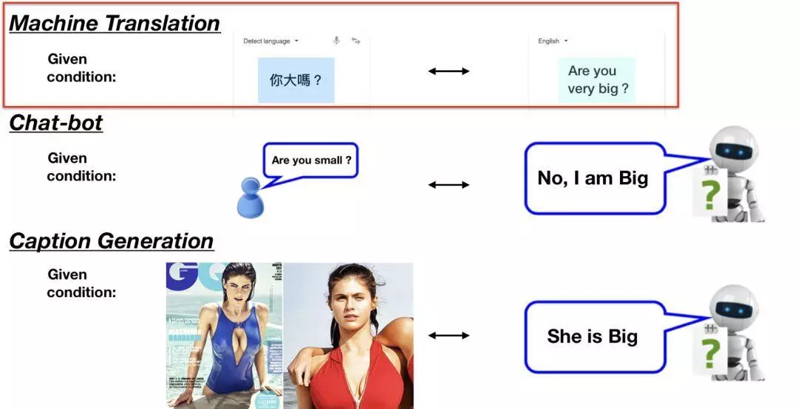
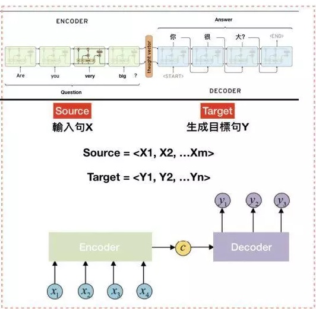
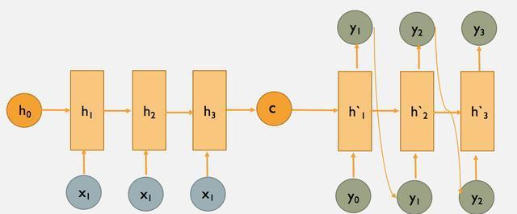
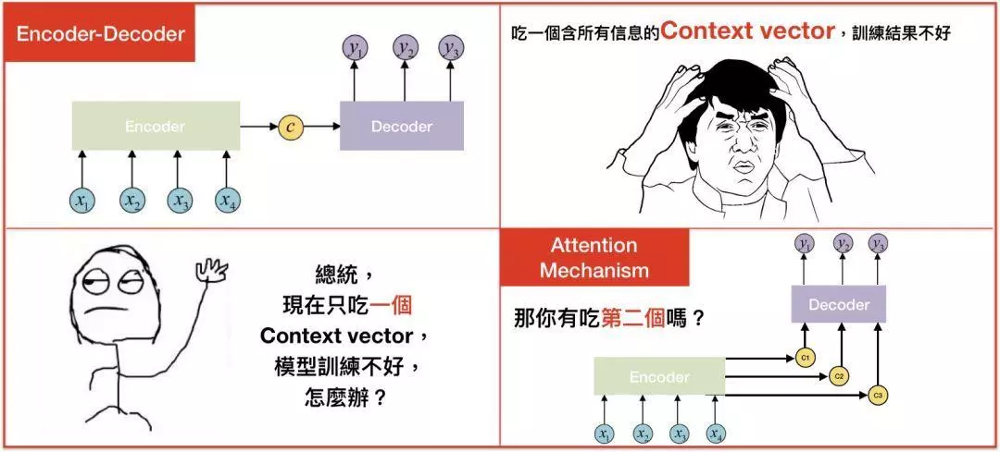

[TOC]
# 任务：Seq2Seq模型

## 1 任务目标

- 了解Seq2Seq模型

- 理解Seq2Seq模型的网络结构

- 学习搭建一个简单的Seq2Seq模型

  


## 2 任务描述

- 在TensorFlow深度学习框架下，搭建一个简单的Seq2Seq模型

- 使用Seq2Seq模型训练一个英语-法语翻译器

  


## 3 知识准备

### 3.1 Seq2Seq模型

- Seq2Seq全名是Sequence-to-Sequence，也就是从序列到序列的过程，是近年当红的模型之一。Seq2Seq模型被广泛应用在机器翻译、聊天机器人甚至是图像生成文字等情境。如下图：

  

  举例来说，如果我们将“Are you very big”作为输入句，即可得到目标句“你很大？”。这就是机器翻译，而Seq2Seq模型就是由前面的RNN/LSTM模型组成的。

  

### 3.2 Seq2Seq模型结构

- Seq2Seq模型结构也叫做Encoder-Decoder模型。如下图：

  

- 我们可以看到Seq2seq包含两部分：Encoder和Decoder。一旦将句子输入至Encoder，即可从Decoder获得目标句。从图中的示例来看，就是把“Are you very big?”当作$X_1 , X_2,X_3,X_4$然后编码成一个向量$C$,再将$C$输入到一个解码器Decoder中生成我们的目标句$Y$。

- 如果还记得我们上一个任务中的LSTM模型结构，那么可以很容易发现图示中Encoder的模型结构正是一个标准的LSTM模型。由于LSTM模型对序列化数据具有很好的处理能力，能够将相关信息抽取出来。因此对于序列化数据，LSTM模型通常都是很好的选择。Seq2Seq模型也是基于LSTM模型做出的改进，总的来说，就是利用LSTM模型对输入序列数据进行信息提取，然后将结果编码成向量$C$。

- 事实上，Decoder部分也同样是一个LSTM模型，这个Decoder把$C$当作LSTM模型中的初始状态$h_0$，同时将$t-1$时刻生成的$y_{t-1}$当作$t$时刻的输入，然后由LSTM模型按时间步一直计算下去，得到我们想要生成的序列$Y$

  


## 4 任务实施

### 4.1 实施思路

- 这一节中我们将在TensorFlow框架下搭建一个Seq2Seq模型训练一个英语-西班牙语翻译器。实施思路如下。

  1. 准备数据集，包括对数据进行预处理，添加句子开头和结尾标志符，以及转换成tensorflow合适的数据格式。
  2. 搭建Seq2Seq模型，分为Encoder和Decoder两个部分。
  3. 利用数据集对模型进行训练。
  4. 使用训练完成后的模型进行翻译，查看翻译效果。


### 4.2 实施步骤

#### 步骤1：准备数据集

```python
# 定义个函数将字符编码转换成ascii
def unicode_to_ascii(s):
    return ''.join(c for c in unicodedata.normalize('NFD', s)
        if unicodedata.category(c) != 'Mn')

#对句子做预处理
def preprocess_sentence(w):
    w = unicode_to_ascii(w.lower().strip())

    # 在标点符号与单词之间添加空格
    # eg: "he is a boy." => "he is a boy ."
    # Reference:- https://stackoverflow.com/questions/3645931/python-padding-punctuation-with-white-spaces-keeping-punctuation
    w = re.sub(r"([?.!,¿])", r" \1 ", w)
    w = re.sub(r'[" "]+', " ", w)

    # 除了 (a-z, A-Z, ".", "?", "!", ",")都用空格替换
    w = re.sub(r"[^a-zA-Z?.!,¿]+", " ", w)

    w = w.rstrip().strip()

    # 给句子添加句头和句尾的标识符，模型才能找到句子的开始和结束。
    w = '<start> ' + w + ' <end>'
    return w
#读取path路径下的文件，然后按[英语，西班牙语]的格式返回单词对
def create_dataset(path, num_examples):
    lines = io.open(path, encoding='UTF-8').read().strip().split('\n')

    word_pairs = [[preprocess_sentence(w) for w in l.split('\t')]  for l in lines[:num_examples]]

    return zip(*word_pairs)
    

def max_length(tensor):
    return max(len(t) for t in tensor)
#将文本转换成整数序列
def tokenize(lang):
  lang_tokenizer = tf.keras.preprocessing.text.Tokenizer(
      filters='')
  lang_tokenizer.fit_on_texts(lang)

  tensor = lang_tokenizer.texts_to_sequences(lang)

  tensor = tf.keras.preprocessing.sequence.pad_sequences(tensor,
                                                         padding='post')

  return tensor, lang_tokenizer
  
#将path路径下的文件，生成我们模型要的【输入，输出】对。
def load_dataset(path, num_examples=None):
    targ_lang, inp_lang = create_dataset(path, num_examples)

    input_tensor, inp_lang_tokenizer = tokenize(inp_lang)
    target_tensor, targ_lang_tokenizer = tokenize(targ_lang)

    return input_tensor, target_tensor, inp_lang_tokenizer, targ_lang_tokenizer
```


#### 步骤2：搭建Seq2Seq模型

```python
#定义一个Encoder类
class Encoder(tf.keras.Model):
  def __init__(self, vocab_size, embedding_dim, enc_units, batch_sz):
    super(Encoder, self).__init__()
    self.batch_sz = batch_sz
    self.enc_units = enc_units
    self.embedding = tf.keras.layers.Embedding(vocab_size, embedding_dim)
    self.gru = tf.keras.layers.GRU(self.enc_units,
                                   return_sequences=True,
                                   return_state=True,
                                   recurrent_initializer='glorot_uniform') #这里使用GRU模块，是LSTM的一种变种

  def call(self, x, hidden):
    x = self.embedding(x)
    output, state = self.gru(x, initial_state = hidden)
    return output, state

  def initialize_hidden_state(self):
    return tf.zeros((self.batch_sz, self.enc_units))

encoder = Encoder(vocab_inp_size, embedding_dim, units, BATCH_SIZE)

# 拿个例子查看一下encoder的输出
sample_hidden = encoder.initialize_hidden_state()
sample_output, sample_hidden = encoder(example_input_batch, sample_hidden)
print ('Encoder output shape: (batch size, sequence length, units) {}'.format(sample_output.shape))
print ('Encoder Hidden state shape: (batch size, units) {}'.format(sample_hidden.shape))

#定义一个Decoder类
class Decoder(tf.keras.Model):
  def __init__(self, vocab_size, embedding_dim, dec_units, batch_sz):
    super(Decoder, self).__init__()
    self.batch_sz = batch_sz
    self.dec_units = dec_units
    self.embedding = tf.keras.layers.Embedding(vocab_size, embedding_dim)
    self.gru = tf.keras.layers.GRU(self.dec_units,
                                   return_sequences=True,
                                   return_state=True,
                                   recurrent_initializer='glorot_uniform')
    self.fc = tf.keras.layers.Dense(vocab_size)


  def call(self, x, hidden, enc_output):
    context_vector =  tf.reduce_sum(enc_output, axis=1)

    x = self.embedding(x)

    x = tf.concat([tf.expand_dims(context_vector, 1), x], axis=-1)

    output, state = self.gru(x)

    output = tf.reshape(output, (-1, output.shape[2]))

    x = self.fc(output)

    return x, state

decoder = Decoder(vocab_tar_size, embedding_dim, units, BATCH_SIZE)

sample_decoder_output, _  = decoder(tf.random.uniform((64, 1)),
                                      sample_hidden, sample_output)

print ('Decoder output shape: (batch_size, vocab size) {}'.format(sample_decoder_output.shape))
```


#### 步骤3：训练Seq2Seq模型

```python
@tf.function
def train_step(inp, targ, enc_hidden):
  loss = 0

  with tf.GradientTape() as tape:
    enc_output, enc_hidden = encoder(inp, enc_hidden)

    dec_hidden = enc_hidden

    dec_input = tf.expand_dims([targ_lang.word_index['<start>']] * BATCH_SIZE, 1)

    #将这个时刻的目标输出当作下时刻的输入
    for t in range(1, targ.shape[1]):
   
      predictions, dec_hidden = decoder(dec_input, dec_hidden, enc_output)

      loss += loss_function(targ[:, t], predictions)

      dec_input = tf.expand_dims(targ[:, t], 1)

  batch_loss = (loss / int(targ.shape[1]))

  variables = encoder.trainable_variables + decoder.trainable_variables

  gradients = tape.gradient(loss, variables)

  optimizer.apply_gradients(zip(gradients, variables))

  return batch_loss


#利用数据集循环训练10次
EPOCHS = 10

for epoch in range(EPOCHS):
  start = time.time()

  enc_hidden = encoder.initialize_hidden_state()
  total_loss = 0

  for (batch, (inp, targ)) in enumerate(dataset.take(steps_per_epoch)):
    batch_loss = train_step(inp, targ, enc_hidden)
    total_loss += batch_loss

    if batch % 100 == 0:
        print('Epoch {} Batch {} Loss {:.4f}'.format(epoch + 1,
                                                     batch,
                                                     batch_loss.numpy()))
  # 每2个epoch，保存一次前面定义的(checkpoint)
  if (epoch + 1) % 2 == 0:
    checkpoint.save(file_prefix = checkpoint_prefix)

  print('Epoch {} Loss {:.4f}'.format(epoch + 1,
                                      total_loss / steps_per_epoch))
  print('Time taken for 1 epoch {} sec\n'.format(time.time() - start))
```


#### 步骤4：使用Seq2Seq模型进行翻译

```python
def evaluate(sentence):
    sentence = preprocess_sentence(sentence)

    inputs = [inp_lang.word_index[i] for i in sentence.split(' ')]
    inputs = tf.keras.preprocessing.sequence.pad_sequences([inputs],
                                                           maxlen=max_length_inp,
                                                           padding='post')
    inputs = tf.convert_to_tensor(inputs)

    result = ''

    hidden = [tf.zeros((1, units))]
    enc_out, enc_hidden = encoder(inputs, hidden)

    dec_hidden = enc_hidden
    dec_input = tf.expand_dims([targ_lang.word_index['<start>']], 0)

    for t in range(max_length_targ):
        predictions, dec_hidden = decoder(dec_input, dec_hidden, enc_out)

        predicted_id = tf.argmax(predictions[0]).numpy()

        result += targ_lang.index_word[predicted_id] + ' '

        if targ_lang.index_word[predicted_id] == '<end>':
            return result, sentence

        dec_input = tf.expand_dims([predicted_id], 0)

    return result, sentence


def translate(sentence):
    result, sentence = evaluate(sentence)

    print('Input: %s' % (sentence))
    print('Predicted translation: {}'.format(result))

#翻译括号中的句子
translate(u'esta es mi vida.')
```


## 5 任务拓展

- Seq2Seq模型其实可以用在很多地方，比如机器翻译，自动对话机器人，文档摘要自动生成，图片描述自动生成。比如Google就基于Seq2Seq模型开发了一个对话模型，基本思路是一致的，使用两个LSTM的结构，LSTM1将输入的对话编码成一个固定长度的实数向量，LSTM2根据这个向量不停地预测后面的输出（解码）。只是在对话模型中，使用的语料是（你说的话-我答的话）这种类型的X-Y序列对。而在机器翻译中使用的语料是（hello-你好）这样的序列对。

- 此外，如果我们的输入是图片，输出是对图片的描述，用这样的方式来训练的话就能够完成图片描述的任务，等等。可以看出来，Seq2Seq模型具有非常广泛的应用场景，而且效果也是非常强大。同时，因为Seq2Seq模型是端到端的模型（大部分的深度模型都是端到端的），它减少了很多人工处理和规则制定的步骤。

- 相信现在大家对Seq2Seq模型已经有一个直观上的认识了，但是有没有觉得Seq2Seq模型好像还有可以改进的地方呢？比如在Seq2seq模型中，Encoder将输入句压缩成固定长度的向量$C$真的好吗？如果句子太长，一个向量$C$真的可以表示所有的信息吗？

  

​        对于这个问题有个解决方案是注意力(Attention)机制，我们将在下一节介绍它。


## 6 任务实训

### 6.1 实训目的

- 了解Seq2Seq模型的应用场景，学习如何根据实际需求将通用模型改成解决自己实际问题的模型。

### 6.2 实训内容

- 查找相关资料，将上面的Seq2Seq模型训练成一个唐诗生成器。

