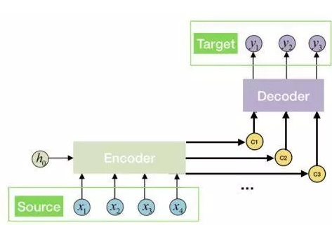
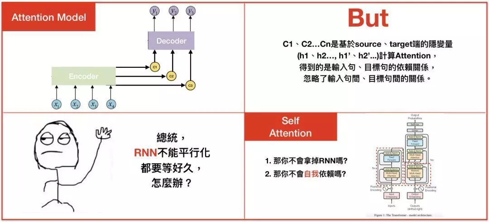

[TOC]
# 任务：注意力机制

## 1 任务目标

- 了解注意力机制

- 理解注意力机制如何改进Seq2Seq模型

- 学习搭建一个简单带有注意力机制的Seq2Seq模型

  


## 2 任务描述

- 在TensorFlow深度学习框架下，搭建一个带有注意力机制的Seq2Seq模型

- 使用带有注意力机制的Seq2Seq模型训练一个英语-西班牙语翻译器并将注意力结果可视化。

  


## 3 知识准备

### 3.1 注意力机制

- 注意力机制，也叫注意力模型（attention model）。上节我们提到，如果句子过长，Seq2Seq模型的Encoder编码出来的状态向量$C$可能无法保留句子中的全部信息，导致效果不好。因此$C$的长度就成为了限制模型性能的瓶颈。对于这个问题，有个很经典的改进工作就是注意力机制。

- 这种新的构架替输入句的每个文字都创造一个状态向量$C$，而非仅仅替输入句创造一个从最终的hidden state得来的状态向量$C$，举例来说，如果一个输入句有N个文字，就会产生N个状态向量$C$可，好处是，每个状态向量$C$可能够被更有效的译码。

  


### 3.2 注意力机制的Seq2Seq模型结构

- 注意力机制的过程如上图。我们来仔细解读一下注意力机制的过程，可以看到最关键的区别就是在与$c$原来不同的，这里的每个$c$会自动去选取与当前要输出的$y$相关的上下文信息。具体来说，我们用$a_{ij}$衡量Encoder中第$j$阶段的$h_j$和解码时第$i$阶段的相关性，最终第$i$阶段的输入的上下文信息$c_i$就来自所有$h_j$对$a_{ij}$的加权求和。

- 以机器翻译为例（将中文翻译成英文）：输入序列是“我爱中国”，因此Encoder中的$h_1,h_2,h_3,h_4$可以分别看成“我“，”爱“，“中”，“国”所代表的信息。在翻译时，第一个上下文信息$c_1$应该和”我“字最相关。因此对应的$a_{11}$应该比较大，而$a_{12},a_{13},a_{14}$就比较小；同样地，$c_2$应该和”爱“字最相关，$c_3$和”中“”国“两个字最相关，所对应的$a_{ij}$值就比较大。

  

- 那关于注意力机制就剩最后一个问题了，那就是：这些决定信息相关的权重$a_{ij}$怎么求？
- 实际上，$a_{ij}$同样是模型训练学出来的，它的取值与Decoder第$i-1$阶段和Encoder第$j$阶段的隐状态有关。拿上面的机器翻译举例， $a_{1j}$的计算图（具体计算过程可以查阅相关资料）如下图：

## 4 任务实施

### 4.1 实施思路

- 这一节中我们将在TensorFlow框架下搭建一个带有注意力机制的Seq2Seq模型训练一个英语-西班牙语翻译器，然后将注意力机制的结果可视化。实施思路如下。
  1. 准备数据集，包括下载数据，对句子进行字符编码，并对数据做预处理。
  2. 构建模型，分别构建Encoder,Attention,Decoder三个类，然后定义相应的损失函数和优化方法
  3. 训练模型，利用前面准备的数据对模型进行训练
  4. 计算模型对输入句子的注意力权重，然后把权重结果可视化，观察模型进行翻译时注意的单词是否对应。


### 4.2 实施步骤

#### 步骤1：准备数据集

```python
# 定义个函数将字符编码转换成ascii
def unicode_to_ascii(s):
    return ''.join(c for c in unicodedata.normalize('NFD', s)
        if unicodedata.category(c) != 'Mn')

#对句子做预处理
def preprocess_sentence(w):
    w = unicode_to_ascii(w.lower().strip())

    # 在标点符号与单词之间添加空格
    # eg: "he is a boy." => "he is a boy ."
    # Reference:- https://stackoverflow.com/questions/3645931/python-padding-punctuation-with-white-spaces-keeping-punctuation
    w = re.sub(r"([?.!,¿])", r" \1 ", w)
    w = re.sub(r'[" "]+', " ", w)

    # 除了 (a-z, A-Z, ".", "?", "!", ",")都用空格替换
    w = re.sub(r"[^a-zA-Z?.!,¿]+", " ", w)

    w = w.rstrip().strip()

    # 给句子添加句头和句尾的标识符，模型才能找到句子的开始和结束。
    w = '<start> ' + w + ' <end>'
    return w

#读取path路径下的文件，然后按[英语，西班牙语]的格式返回单词对
def create_dataset(path, num_examples):
    lines = io.open(path, encoding='UTF-8').read().strip().split('\n')

    word_pairs = [[preprocess_sentence(w) for w in l.split('\t')]  for l in lines[:num_examples]]

    return zip(*word_pairs)

#将path路径下的文件，生成我们模型要的【输入，输出】对。
def load_dataset(path, num_examples=None):
    # creating cleaned input, output pairs
    targ_lang, inp_lang = create_dataset(path, num_examples)

    input_tensor, inp_lang_tokenizer = tokenize(inp_lang)
    target_tensor, targ_lang_tokenizer = tokenize(targ_lang)

    return input_tensor, target_tensor, inp_lang_tokenizer, targ_lang_tokenizer
```


#### 步骤2：搭建模型

```python
#定义一个Encoder类
class Encoder(tf.keras.Model):
  def __init__(self, vocab_size, embedding_dim, enc_units, batch_sz):
    super(Encoder, self).__init__()
    self.batch_sz = batch_sz
    self.enc_units = enc_units
    self.embedding = tf.keras.layers.Embedding(vocab_size, embedding_dim)
    self.gru = tf.keras.layers.GRU(self.enc_units,
                                   return_sequences=True,
                                   return_state=True,
                                   recurrent_initializer='glorot_uniform') #这里使用GRU模块，是LSTM的一种变种

  def call(self, x, hidden):
    x = self.embedding(x)
    output, state = self.gru(x, initial_state = hidden)
    return output, state

  def initialize_hidden_state(self):
    return tf.zeros((self.batch_sz, self.enc_units))

#定义一个Attention类
class BahdanauAttention(tf.keras.layers.Layer):
  def __init__(self, units):
    super(BahdanauAttention, self).__init__()
    self.W1 = tf.keras.layers.Dense(units)
    self.W2 = tf.keras.layers.Dense(units)
    self.V = tf.keras.layers.Dense(1)

  def call(self, query, values):
    hidden_with_time_axis = tf.expand_dims(query, 1)

    score = self.V(tf.nn.tanh(
        self.W1(values) + self.W2(hidden_with_time_axis)))

    attention_weights = tf.nn.softmax(score, axis=1)

    context_vector = attention_weights * values
    context_vector = tf.reduce_sum(context_vector, axis=1)

    return context_vector, attention_weights

#定义一个Decoder类
class Decoder(tf.keras.Model):
  def __init__(self, vocab_size, embedding_dim, dec_units, batch_sz):
    super(Decoder, self).__init__()
    self.batch_sz = batch_sz
    self.dec_units = dec_units
    self.embedding = tf.keras.layers.Embedding(vocab_size, embedding_dim)
    self.gru = tf.keras.layers.GRU(self.dec_units,
                                   return_sequences=True,
                                   return_state=True,
                                   recurrent_initializer='glorot_uniform')
    self.fc = tf.keras.layers.Dense(vocab_size)

    # used for attention
    self.attention = BahdanauAttention(self.dec_units)

  def call(self, x, hidden, enc_output):
    # enc_output shape == (batch_size, max_length, hidden_size)
    context_vector, attention_weights = self.attention(hidden, enc_output)

    # x shape after passing through embedding == (batch_size, 1, embedding_dim)
    x = self.embedding(x)

    # x shape after concatenation == (batch_size, 1, embedding_dim + hidden_size)
    x = tf.concat([tf.expand_dims(context_vector, 1), x], axis=-1)

    # passing the concatenated vector to the GRU
    output, state = self.gru(x)

    # output shape == (batch_size * 1, hidden_size)
    output = tf.reshape(output, (-1, output.shape[2]))

    # output shape == (batch_size, vocab)
    x = self.fc(output)

    return x, state, attention_weights

#设置一下优化方法和损失函数
optimizer = tf.keras.optimizers.Adam()
loss_object = tf.keras.losses.SparseCategoricalCrossentropy(
    from_logits=True, reduction='none')

def loss_function(real, pred):
  mask = tf.math.logical_not(tf.math.equal(real, 0))
  loss_ = loss_object(real, pred)

  mask = tf.cast(mask, dtype=loss_.dtype)
  loss_ *= mask

  return tf.reduce_mean(loss_)
```


#### 步骤3：训练模型

```python
@tf.function
def train_step(inp, targ, enc_hidden):
  loss = 0

  with tf.GradientTape() as tape:
    enc_output, enc_hidden = encoder(inp, enc_hidden)

    dec_hidden = enc_hidden

    dec_input = tf.expand_dims([targ_lang.word_index['<start>']] * BATCH_SIZE, 1)

    #将这个时刻的目标输出当作下时刻的输入
    for t in range(1, targ.shape[1]):
   
      predictions, dec_hidden, _ = decoder(dec_input, dec_hidden, enc_output)

      loss += loss_function(targ[:, t], predictions)

      dec_input = tf.expand_dims(targ[:, t], 1)

  batch_loss = (loss / int(targ.shape[1]))

  variables = encoder.trainable_variables + decoder.trainable_variables

  gradients = tape.gradient(loss, variables)

  optimizer.apply_gradients(zip(gradients, variables))

  return batch_loss


#利用数据集循环训练10次
EPOCHS = 10

for epoch in range(EPOCHS):
  start = time.time()

  enc_hidden = encoder.initialize_hidden_state()
  total_loss = 0

  for (batch, (inp, targ)) in enumerate(dataset.take(steps_per_epoch)):
    batch_loss = train_step(inp, targ, enc_hidden)
    total_loss += batch_loss

    if batch % 100 == 0:
        print('Epoch {} Batch {} Loss {:.4f}'.format(epoch + 1,
                                                     batch,
                                                     batch_loss.numpy()))
  # 每2个epoch，保存一次前面定义的(checkpoint)
  if (epoch + 1) % 2 == 0:
    checkpoint.save(file_prefix = checkpoint_prefix)

  print('Epoch {} Loss {:.4f}'.format(epoch + 1,
                                      total_loss / steps_per_epoch))
  print('Time taken for 1 epoch {} sec\n'.format(time.time() - start))
```


#### 步骤4：注意力机制可视化

```python
# 为注意力权重定义画图函数
def plot_attention(attention, sentence, predicted_sentence):
    fig = plt.figure(figsize=(10,10))
    ax = fig.add_subplot(1, 1, 1)
    ax.matshow(attention, cmap='viridis')

    fontdict = {'fontsize': 14}

    ax.set_xticklabels([''] + sentence, fontdict=fontdict, rotation=90)
    ax.set_yticklabels([''] + predicted_sentence, fontdict=fontdict)

    ax.xaxis.set_major_locator(ticker.MultipleLocator(1))
    ax.yaxis.set_major_locator(ticker.MultipleLocator(1))

    plt.show()

def translate(sentence):
    result, sentence, attention_plot = evaluate(sentence)

    print('Input: %s' % (sentence))
    print('Predicted translation: {}'.format(result))

    attention_plot = attention_plot[:len(result.split(' ')), :len(sentence.split(' '))]
    plot_attention(attention_plot, sentence.split(' '), result.split(' '))

#翻译括号中的句子，然后把模型注意的地方高亮出来
translate(u'hace mucho frio aqui.')
```


从可视化的结果可以看到，由于我们训练样本设置的比较少，所以效果比较一般，如果我们使用全部样本进行训练，可以得到下面的结果。


## 5 任务拓展

- 事实上，在the Attention Model论文中，模型的Encoder用的是改良版RNN：双向RNN（Bi-directional RNN）。以往单向RNN的问题在于$t$时刻的输出只能依靠$t$时刻之前的信息，但实际上有时候需要利用$t$时刻之后的信息才能回答$t$时刻的问题，由此有了双向RNN，两个隐状态$h，h'$，分别从左到右，从右到左，从而可以做出更好的回答。

- 虽然注意力机制解决了原来Seq2Seq模型中性能受限于一个状态向量$C$的问题，但注意力机制仍有很多值得改进的地方。比如：

  - 状态向量$c_i$计算的是输入句和输出句的关联，以前面”我爱中国“的例子来说，$c_1$计算了”我“和”I“的相关性，但却忽略了句子内部之间的关联，也就是没有考虑”我“”爱“”中”“国“这四个字之间的关系。当然，在我们这个例子里，不考虑也不会发生什么问题，但确实存在需要考虑句子内部之间关系的情况。

  - 此外呢，还有一个训练时间的问题，Seq2Seq模型或者注意力机制都是基于RNN来进行训练的，一个缺点是RNN无法并行化处理，导致训练时间很长。那在2017年的时候，Google提出了一种叫做”The transformer”的模型，利用”Self-attention“等概念解决这个问题，抛弃了RNN的架构。感兴趣的话具体可以查阅资料了解。

    


## 6 任务实训

### 6.1 实训目的

- 理解训练深度模型中训练样本数据量的重要性。
- 体会注意力机制的有效性。

### 6.2 实训内容

- 尝试将训练数据集换成一个成语接龙数据集（如果没有合适的数据可以尝试自己构建一个小样本量的数据集），训练出一个成语接龙生成器，即输入一句成语，输出一句成语。

