# 智慧医疗-疟疾辅助诊断系统搭建

## 1 任务目标

1. 应用深度学习进行医学图像分析
2. 使用Keras深度学习库来自动分析医学图像以进行疟疾检测

## 2 任务描述

- 我们将探索我们的疟疾数据库，其中包含血液涂片图像，可分为两类之一：疟疾呈阳性或疟疾呈阴性。

- 浏览完数据库后，我们将简要回顾当今项目的目录结构。

- 然后，我们将在医学图像上训练深度学习模型，以预测给定患者的血液涂片是否为疟疾阳性。

- 最后，保存我们训练好的模型，将模型部署到实际应用。


## 3 知识准备

### 3.1 知识概念

#### 3.1.1 深度学习，医学影像和疟疾流行

<div align=center>
    <!--  -->
    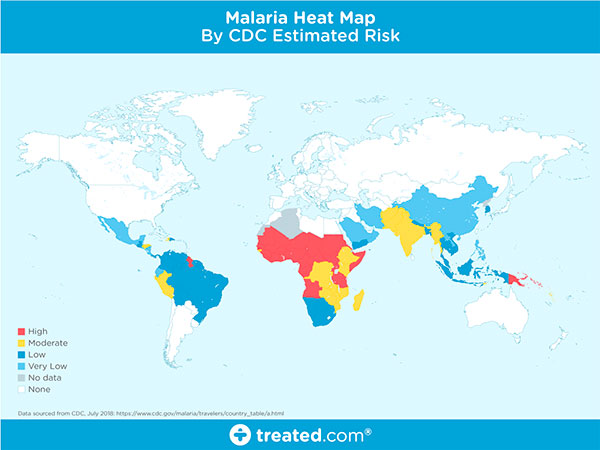
</div>
图1：目前受疟疾影响的地区的世界地图（来源）。
疟疾是一种传染病，每年导致超过40万人死亡。

疟疾在世界某些地区是真正的地方病，这意味着该地区定期发现这种疾病。

在世界其他地区，疟疾是一种流行病 -在该地区很普遍，但尚未流行。

然而，在世界其他地区，甚至很少发现疟疾。

那么，是什么使世界上某些地区更容易感染疟疾，而其他地区却完全没有疟疾？

有许多因素使一个地区容易感染传染病。我们将在下面介绍主要成分。

- 贫困水平

<div align=center>
    <!--  -->
    
</div>
图2：贫困地区和受疟疾影响的地区之间存在相关性。
在评估传染病暴发的风险时，我们通常会检查人口中或贫困线以下或贫困线以下的人口数量。

贫困程度越高，传染病的风险就越高，尽管一些研究人员会说相反的事实-疟疾导致贫困。

我们都可以同意的任何原因，两者之间都有关联。


- 获得适当的医疗保健

<div align=center>
    <!--  -->
    
</div>
图3：无法获得适当和现代医疗保健的地区可能会受到传染病的影响。
世界上低于贫困线的地区很可能无法获得适当的医疗保健。

没有良好的医疗保健，适当的治疗以及必要时检疫，传染病会迅速传播。


- 战争与政府

<div align=center>
    <!--  -->
    
</div>
图4：世界上发生战争的地区的贫困水平更高，获得适当医疗保健的机会更少；因此，传染病暴发在这些地区很普遍（来源）。
该地区饱受战争摧残吗？

政府腐败了吗？

一个国家的州或地区之间存在内斗吗？

毫不奇怪，世界上的一个区域，要么有一个腐败的政府或正在经历内战也将有较高的贫困水平和较低的适当的医疗服务。

此外，如果腐败政府在大规模疫情暴发期间可能无法提供紧急医疗服务或采取适当的隔离措施，那是不可能的。


- 疾病传播载体

<div align=center>
    <!--  -->
    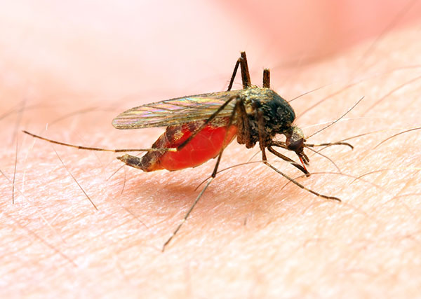
</div>
图5：诸如蚊子之类的疾病媒介可能携带诸如疟疾之类的传染性疾病。

疾病媒介是携带疾病并将其传播到其他生物的媒介。 蚊子因携带疟疾而臭名昭著。

一旦感染，人类也可以成为媒介，可以通过输血，器官移植，共用针头/注射器等传播疟疾。

此外，世界气候变暖使蚊子繁盛，疾病进一步传播。

没有适当的医疗保健，这些传染病会导致地方性流行。


### 3.2 应用场景

- NIH提出的深度学习解决方案
2018年，Rajaraman等人。发表了一篇题为预训练卷积神经网络作为特征提取器的论文，旨在改善薄血涂片图像中的寄生虫检测。

在他们的工作拉贾拉曼等。利用了六个预训练的卷积神经网络，包括：

- AlexNet
- VGG-16
- ResNet-50
- Xception
- DenseNet-121
- 定制模型
  

特征提取和后续训练花费了24小时多一点，并获得了令人印象深刻的95.9％的准确性。

这里的问题是所使用的模型数量众多- 效率低下。

想象一下，在一个偏远地区的现场工作人员，其设备预装有这些用于疟疾分类的模型。

这样的模型必须是某种组合：

1. 电池供电
2. 需要电源（即插入墙壁）
3. 连接到云（需要互联网连接）


让我们进一步分解问题：

1. 在世界上偏远的贫困地区，可能找不到可靠的电源 -电池供电会更好，只要找到电源就可以充电。
但是，如果您使用电池供电的设备，则您的计算能力将降低 –尝试运行所有这六个模型将使您的电池耗电更快。
2. 因此，如果电池寿命是一个问题，我们应该利用云 -但是如果您使用云，则取决于您可能拥有或可能没有的可靠互联网连接。
3. 我显然强调了每个项目的最坏情况。当然，您可以进行一些工程设计并创建一个智能手机应用程序，该应用程序将在互联网连接可用时将医学图像推送到云中，然后回退到使用手机本地存储的模型，但是我想我明白了。

总体而言，希望：

1. 获得与NIH相同水平的准确性
2. 使用更小，计算效率更高的模型
3. 可以轻松部署到边缘和物联网（IoT）设备

### 3.3 实现流程

<div align=center>
    <!--  -->
    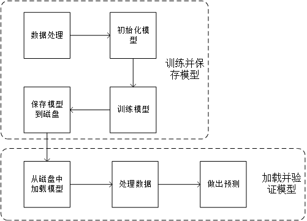
</div>

- 在此工程项目中，我们先要训练我们的Keras模型，然后保存我们训练好的Keras模型，从磁盘中加载我们的Keras模型，并进行验证。


## 4. 任务实施


### 4.1 实施思路

1. 我们的疟疾数据库
2. 安装必要的软件
3. 项目结构
4. 建立我们的深度学习+医学图像数据集
5. 训练用于医学图像分析的深度学习模型
6. 医学图像分析结果


### 4.2 实施步骤


#### 步骤1：我们的疟疾数据库

<div align=center>
    <!--  -->
    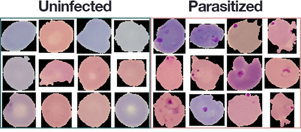
</div>
图8：国立卫生研究院（NIH）提供的疟疾数据集的子集。我们将使用此数据集通过Python，OpenCV和Keras开发深度学习医学影像分类模型。

今天的深度学习和医学图像分析教程中将使用的疟疾数据集与Rajaraman等人完全相同的数据集。在其2018年出版物中使用。

数据集本身可以在NIH官方网页上找到：

<div align=center>
    <!--  -->
    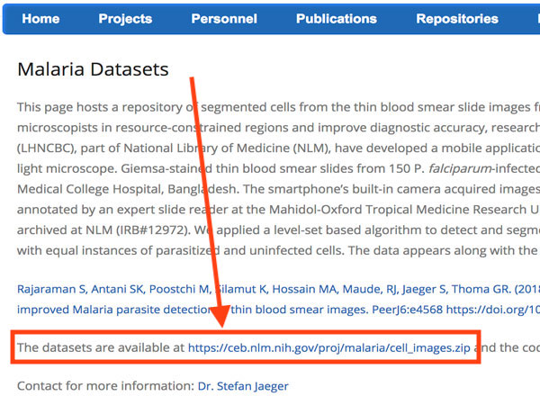
</div>

如果要继续学习本教程，则需要继续并将 cell_images .zip   文件下载到本地计算机上。

该数据集包含27,588张图像，这些图像分别属于两个类别：

1. 寄生：表示该图像包含疟疾。
2. 未感染：表示该图像没有疟疾迹象。
每个类别的图像数量平均分配给每个类别的13,794个图像。

由于课程时间以及设备关系，我们门将数据集采样到100张图像。


#### 步骤2：安装必要的软件

运行当今脚本的软件非常易于安装。要设置所有内容，您将使用 pip  ， virtualenv  和 virtualenvwrapper  。请务必遵循以下Keras子弹的联系，第一。

要运行今天的代码，您将需要：

- Keras： Keras是我最喜欢的深度学习框架。阅读并遵循我的教程，使用TensorFlow后端安装Keras。
- NumPy＆ Scikit-learn：如果您遵循上面直接链接的Keras安装说明，则会安装这些用于数值处理和机器学习的软件包。
- Matplotlib：最流行的Python绘图工具。一旦准备好并激活了Keras环境，就可以通过 pip install matplotlib进行 安装  。
- imutils：我个人包图像处理和深度学习的便利功能都可以通过安装 PIP 安装- 升级imutils  。

#### 步骤3：项目结构


​    
```
.
├── malaria
│   ├── testing
│   │   ├── Parasitized [50 entries]
│   │   └── Uninfected [50 entries]
│   ├── training
│   │   ├── Parasitized [175 entries]
│   │   └── Uninfected [185 entries]
│   └── validation
│       ├── Parasitized [18 entries]
│       └── Uninfected [22 entries]
├── pyimagesearch
│   ├── __init__.py
│   └── resnet.py
├── train.ipynb
└── val.ipynb
 
11 directories, 4 files
```


我们的项目在根目录中包含两个文件夹：

- malaria/  ：我们减少的疟疾数据集。从上周开始，通过“构建数据集”脚本将其分为训练，验证和测试集。
- pyimagesearch /  ：下载随附的软件包，其中包含我们的ResNet模型类。
今天，我们还将回顾两个iPython脚本：

- train.ipynb  ：一个演示脚本，它会在训练后将我们的Keras模型保存到磁盘。
- val.ipynb  ：我们的脚本从磁盘加载保存的模型，并对少量测试图像进​​行分类。


#### 步骤4：建立我们的深度学习+医学图像数据集


```
# set the matplotlib backend so figures can be saved in the background
import matplotlib
matplotlib.use("Agg")
 
# 导入所需包
from keras.preprocessing.image import ImageDataGenerator
from keras.optimizers import SGD
from pyimagesearch.resnet import ResNet
from sklearn.metrics import classification_report
from imutils import paths
import matplotlib.pyplot as plt
import numpy as np
import argparse
import os
```
我们导入所需的包。

在  “ Agg”   指定 matplotlib后端，因为我们将把图保存到磁盘中（除了模型外）。


```
# 初始化 training epochs 和 batch size
NUM_EPOCHS = 25
BS = 32

# 分别导出包含训练，验证和测试拆分的目录的路径
TRAIN_PATH = os.path.sep.join(["malaria", "training"])
VAL_PATH = os.path.sep.join(["malaria", "validation"])
TEST_PATH = os.path.sep.join(["malaria", "testing"])

# 确定训练，验证和测试目录中的图像路径总数
totalTrain = len(list(paths.list_images(TRAIN_PATH)))
totalVal = len(list(paths.list_images(VAL_PATH)))
totalTest = len(list(paths.list_images(TEST_PATH)))
```

我们将训练 25个epoch，batch size为32 。

上周，我们将NIH疟疾数据集分为三组，为每组创建了一个对应的目录：

- 训练
- 验证方式
- 测试

如果您好奇数据拆分过程的工作原理，查看知识智库。今天，我已经将结果数据集进行了拆分。


让我们初始化数据扩充对象：

```
# 初始化训练训练数据扩充对象
trainAug = ImageDataGenerator(
	rescale=1 / 255.0,
	rotation_range=20,
	zoom_range=0.05,
	width_shift_range=0.05,
	height_shift_range=0.05,
	shear_range=0.05,
	horizontal_flip=True,
	fill_mode="nearest")

# 初始化验证（和测试）数据扩充对象
valAug = ImageDataGenerator(rescale=1 / 255.0)
```

数据扩充是从数据集中随机修改生成新图像的过程。它产生了更好的深度学习模型，我几乎总是推荐它（对于小型数据集尤其重要）。

注： 该 valAug   对象只是执行缩放-实际上没有进行隆胸。我们将使用此对象两次：一次用于验证重新缩放，一次用于测试重新缩放。

现在已经创建了训练和验证增强对象，让我们初始化生成器：
```
# 初始化训练生成器
trainGen = trainAug.flow_from_directory(
	TRAIN_PATH,
	class_mode="categorical",
	target_size=(64, 64),
	color_mode="rgb",
	shuffle=True,
	batch_size=32)

# 初始化验证生成器
valGen = valAug.flow_from_directory(
	VAL_PATH,
	class_mode="categorical",
	target_size=(64, 64),
	color_mode="rgb",
	shuffle=False,
	batch_size=BS)

# 初始化训练生成器
testGen = valAug.flow_from_directory(
	TEST_PATH,
	class_mode="categorical",
	target_size=(64, 64),
	color_mode="rgb",
	shuffle=False,
	batch_size=BS)
```
上面的三个生成器实际上在训练/验证/测试期间根据我们的扩充对象和此处给出的参数按需生成图像。


#### 步骤5：训练用于医学图像分析的深度学习模型

现在，我们将构建，编译和训练我们的模型。我们还将评估模型并打印分类报告：

```
# 初始化ResNet模型的Keras实现并进行编译
model = ResNet.build(64, 64, 3, 2, (2, 2, 3),
	(32, 64, 128, 256), reg=0.0005)
opt = SGD(lr=1e-1, momentum=0.9, decay=1e-1 / NUM_EPOCHS)
model.compile(loss="binary_crossentropy", optimizer=opt,
	metrics=["accuracy"])

# 训练模型
H = model.fit_generator(
	trainGen,
	steps_per_epoch=totalTrain // BS,
	validation_data=valGen,
	validation_steps=totalVal // BS,
	epochs=NUM_EPOCHS)

# 重置测试生成器，然后使用我们训练有素的模型对数据进行预测
print("[INFO] evaluating network...")
testGen.reset()
predIdxs = model.predict_generator(testGen,
	steps=(totalTest // BS) + 1)

# 对于测试集中的每个图像，我们需要找到具有最大预测概率的标签索引
predIdxs = np.argmax(predIdxs, axis=1)

# 显示格式正确的分类报告
print(classification_report(testGen.classes, predIdxs,
	target_names=testGen.class_indices.keys()))

```
在上面的代码块中，我们：

- 初始化我们的ResNet的实现。注意，  由于我们的模型有两个类，因此我们指定了 “ binary_crossentropy”。  如果使用> 2个类，则应将其更改为 “ categorical_crossentropy”。
  在增强型疟疾数据集上训练ResNet 模型。
- 在测试集上进行预测（第102和103行），并为每个预测提取最高概率类别索引。
- 显示 classification_report   在我们的终端。


现在我们的模型已经训练完毕，让我们将Keras模型保存到磁盘上：

```
# 保存模型到磁盘
print("[INFO] serializing network to '{}'...".format("jupyter191119.model"))
model.save("jupyter191119.model")
```
要将Keras模型保存到磁盘，我们只需调用save()在模型上。


在下一个脚本中，我们将能够从磁盘加载模型并进行预测。

让我们绘制训练结果并保存训练图：

```
# 绘制训练损失和准确性
N = NUM_EPOCHS
plt.style.use("ggplot")
plt.figure()
plt.plot(np.arange(0, N), H.history["loss"], label="train_loss")
plt.plot(np.arange(0, N), H.history["val_loss"], label="val_loss")
plt.plot(np.arange(0, N), H.history["accuracy"], label="train_acc")
plt.plot(np.arange(0, N), H.history["val_accuracy"], label="val_acc")
plt.title("Training Loss and Accuracy on Dataset")
plt.xlabel("Epoch #")
plt.ylabel("Loss/Accuracy")
plt.legend(loc="lower left")
plt.savefig("plot.png")
# plt.imshow("plot.png")
plt.show()
```


#### 步骤6：医学图像分析结果

训练后，您可以列出目录的内容并查看保存的Keras模型：

```
total 5216
-rw-r--r--@ 1 adrian  staff     2415 Nov 28 10:09 val.ipynb
drwxr-xr-x@ 5 adrian  staff      160 Nov 28 08:12 malaria
-rw-r--r--@ 1 adrian  staff    38345 Nov 28 10:13 plot.png
drwxr-xr-x@ 6 adrian  staff      192 Nov 28 08:12 pyimagesearch
-rw-r--r--@ 1 adrian  staff     4114 Nov 28 10:09 train.ipynb
-rw-r--r--@ 1 adrian  staff  2614136 Nov 28 10:13 jupyter191119.model
```
jupyter191119.model   文件是您实际保存的 Keras模型。

现在我们已经学习了如何将Keras模型保存到磁盘，下一步是加载Keras模型，以便我们可以使用它进行分类。打开您的 val.ipynb   脚本，让我们开始吧：

```
%matplotlib inline
from matplotlib import pyplot as plt

# import the necessary packages
from keras.preprocessing.image import img_to_array
from keras.models import load_model
from imutils import build_montages
from imutils import paths
import numpy as np
import argparse
import random
import cv2
```

导入所需的包 。最值得注意的是，我们需要 load_model   以便从磁盘加载模型并使用它。

下一步是从磁盘加载Keras模型：
```
# 加载预训练模型
print("[INFO] loading pre-trained network...")
model = load_model("jupyter191119.model")
```
要加载我们的  Keras 模型  ，我们调用 load_model  ，提供模型本身的路径。


给定 模型  ，我们现在可以对其进行预测。但是首先，我们需要使用一些图像并放置一个放置结果的位置：

```

# 获取输入目录中的所有图像路径并随机采样
imagePaths = list(paths.list_images("malaria/testing"))
random.shuffle(imagePaths)
imagePaths = imagePaths[:16]
```

我们随机选择测试图像路径。

初始化一个空列表来保存 结果  。

让我们遍历每个 imagePaths  ：

```
# 初始结果列表
results = []

# 遍历我们采样的图像路径
for p in imagePaths:
	# 加载原始输入图像
	orig = cv2.imread(p)

	# 通过将图像从BGR转换为RGB通道顺序来重新处理图像（因为我们的Keras mdoel受过RGB顺序训练），将其尺寸调整为64x64像素，然后将像素强度缩放到[0，1]范围
	image = cv2.cvtColor(orig, cv2.COLOR_BGR2RGB)
	image = cv2.resize(image, (64, 64))
	image = image.astype("float") / 255.0
```
我们开始遍历 imagePaths  。

我们通过从磁盘加载映像（第34行）并对其进行预处理（第40-42行）来开始循环。这些预处理步骤应与我们的培训脚本中采取的步骤相同。如您所见，我们已经将图像从BGR转换为RGB通道顺序，将其尺寸调整为64×64像素，并缩放到[0，1]范围。

我看到新的深度学习从业人员犯的一个常见错误是无法以与训练图像相同的方式预处理新图像。

继续，让我们  在循环的每个迭代中对图像进行预测 ：
```
	# order channel dimensions (channels-first or channels-last)
	# depending on our Keras backend, then add a batch dimension to
	# the image
	image = img_to_array(image)
	image = np.expand_dims(image, axis=0)

	# 对输入图像进行预测
	pred = model.predict(image)
	pred = pred.argmax(axis=1)[0]

	# 索引为零的索引是“寄生”标签，而索引为1的索引是“未感染”标签
	label = "Parasitized" if pred == 0 else "Uninfected"
	color = (0, 0, 255) if pred == 0 else (0, 255, 0)

	# 调整原始输入的大小（以便更好地可视化），然后在图像上绘制标签
	orig = cv2.resize(orig, (128, 128))
	cv2.putText(orig, label, (3, 20), cv2.FONT_HERSHEY_SIMPLEX, 0.5,
		color, 2)

	# 将输出图像添加到我们的结果列表中
	results.append(orig)
```

在此块中，我们：

处理通道排序。TensorFlow后端默认值为 “ channels_first”  ，但请不要忘记Keras也支持其他后端。
通过向卷添加尺寸来创建要通过网络发送的批处理。我们一次只通过网络发送一个图像，但是附加尺寸至关重要。
使图像通过ResNet 模型 ，以获得预测。我们获取最大预测的索引（ “被寄生”   或 “未感染”）  。
然后，我们创建一个彩色标签并将其绘制在原始图像上。
最后，我们将带注释的原始 图像附加 到 results  。
为了可视化我们的结果，我们创建一个蒙太奇并将其显示在屏幕上：

```
# 使用具有4行4列的128x128“ tiles”创建蒙太奇
montage = build_montages(results, (128, 128), (4, 4))[0]

plt.imshow(montage)
plt.show()
```
们的 蒙太奇   是一个4×4的图像网格，可以容纳我们之前抓取的16个随机测试图像。

该 蒙太奇   直到任何键被按下。

在这里您可以看到我们有：
1. 提供的路径到我们的测试图像（ - 图像疟疾/ 测试  ），以及该模型已经驻留在磁盘（ - 模型saved_model .MODEL  经由命令行参数）
2. 从磁盘加载我们的Keras模型
3. 预处理我们的输入图像
4. 分类每个示例图像
5. 构建了我们分类的输出可视化
由于我们能够在训练脚本中从磁盘保存Keras模型，然后在单独的脚本中从磁盘加载Keras模型，因此使该过程成为可能。


## 5 任务拓展

在本次任务中我们的疟疾辅助诊断是医疗中的较简易应用，我们不妨看看中大肿瘤院的一个医疗辅助诊断系统。

#### 上消化道肿瘤内镜AI辅助诊断系统
该研究构建了基于云技术的多中心上消化道癌内镜AI诊断平台，平台可以自动捕获内镜检查图像上传至云端进行AI分析，实时向操作者反馈提示可疑病灶区域，指导操作者更有针对性的选择活检部位，提高活检阳性率。


值得一提的是，该系统还集成了培训功能，临床医生可以通过复习并重新评估已存储的图片，来进行模拟诊断积累经验，提高技术水平，减少上消化癌的漏诊率。并可通过建立的开放性百万级大规模内镜图像数据库（存储内镜图片超过100万张），对初级医生及研究者进行内镜诊断培训。临床医生和患者还可通过公共网站（http://graids.sysucc.org.cn），免费访问开放共享的GRAIDS系统，并根据提示自行上传内镜图片，重新评估已有诊断的准确性。

<div align=center>
    <!--  -->
    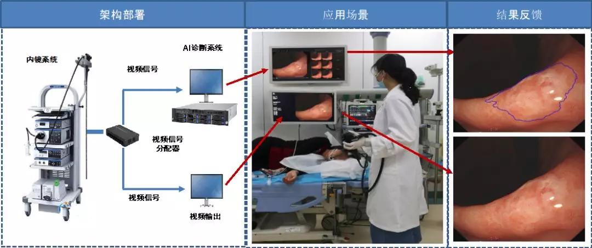
</div>
GRAIDS系统在内镜检查中实时识别上消化道癌性病变
<div align=center>
    <!--  -->
    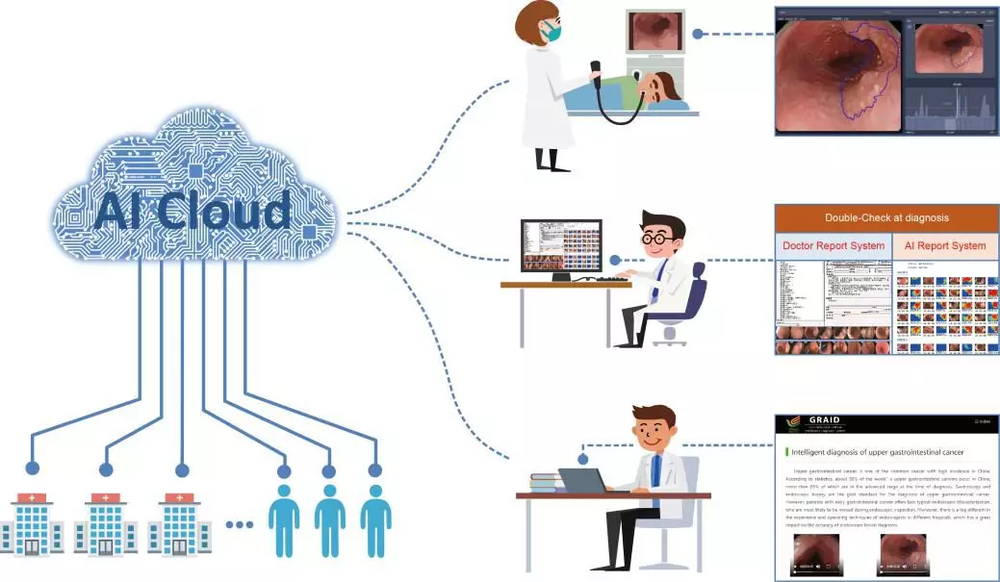
</div>
多中心人工智能内镜辅助诊断云平台的三大功能—指导诊断、专业培训和开放共享

## 6 知识智库

### 6.1 我们如何检测疟疾？

<div align=center>
    <!--  -->
    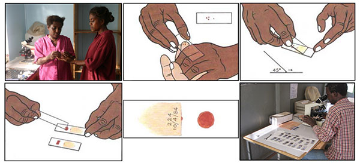
</div>
图6：两种疟疾检测方法包括（1）血液涂片检查和（2）抗原检测（即快速检测）。这是最常讨论和使用的两种测试疟疾的常用方法（来源）。

首先，我想说我既不是临床医生也不是传染病专家。

我将尽力为疟疾检测做一个非常简短的回顾。

如果您想更详细地了解如何测试和诊断疟疾，请参阅Carlos Atico Ariza的出色文章（他应为上面的图6赢得所有赞誉）。

有几种测试疟疾的方法，但是我最常阅读的两种方法包括：

1. 血涂片
2. 抗原测试（即快速测试）
血液涂片过程可以在上面的图6中看到：

1. 首先，从患者那里采集血液样本，然后将其放在载玻片上。
2. 样品用造影剂染色以帮助突出红细胞中的疟原虫
3. 然后，临床医生在显微镜下检查载玻片，并手动计算被感染的红细胞的数量。
根据WHO官方的疟疾寄生虫计数协议，临床医生可能必须手动计数多达5,000个细胞，这是一个非常繁琐且耗时的过程。

为了帮助更快地在现场进行疟疾检测，科学家和研究人员开发了用于快速诊断检测（RDT）的抗原检测。

用于疟疾测试的RDT设备的示例如下所示：

<div align=center>
    <!--  -->
    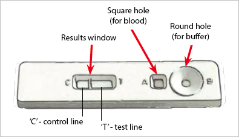
</div>
图7：分类为快速诊断测试（RDT）的抗原测试涉及一个小型设备，该设备可以添加血液样本和缓冲液。该设备执行测试并提供结果。这些设备可以快速报告结果，但准确性也大大降低（来源）。

在这里，您会看到一个小型设备，可以同时添加血液样本和缓冲液。

在内部，设备执行测试并提供结果。

尽管RDT比细胞计数要快得多，但它们的准确性也要差得多。

因此，理想的解决方案需要将RDT 的速度与显微镜的准确性结合起来。

### 6.2 ResNet

在 AlexNet取得 LSVRC 2012 分类竞赛冠军之后，深度残差网络（Residual Network, 下文简写为 ResNet）可以说是过去几年中计算机视觉和深度学习领域最具开创性的工作。ResNet 使训练数百甚至数千层成为可能，且在这种情况下仍能展现出优越的性能。

因其强大的表征能力，除图像分类以外，包括目标检测和人脸识别在内的许多计算机视觉应用都得到了性能提升。

自从 2015 年 ResNet 让人们刮目相看，研究界的许多人在深入探索所其成功的秘密，许多文献中对该模型做了一些改进。

#### 重新审视 ResNet

根据泛逼近定理（universal approximation theorem），只要给定足够的容量，单层的前馈网络也足以表示任何函数。但是，该层可能非常庞大，网络和数据易出现过拟合。因此，研究界普遍认为网络架构需要更多层。

自 AlexNet 以来，最先进的 CNN 架构已经越来越深。AlexNet 只有 5 个卷积层，而之后的 VGG 网络 和 GoogleNet（代号 Inception_v1）分别有 19 层和 22 层。

但是，网络的深度提升不能通过层与层的简单堆叠来实现。由于臭名昭著的梯度消失问题，深层网络很难训练。因为梯度反向传播到前面的层，重复相乘可能使梯度无穷小。结果就是，随着网络的层数更深，其性能趋于饱和，甚至开始迅速下降。


#### 增加网络深度导致性能下降

在 ResNet 出现之前有几种方法来应对梯度消失问题，例如 [4] 在中间层添加了一个辅助损失作为额外的监督，但其中没有一种方法真正解决了这个问题。

ResNet 的核心思想是引入一个所谓的「恒等快捷连接」（identity shortcut connection），直接跳过一个或多个层，如下图所示：

<div align=center>
    <!--  -->
    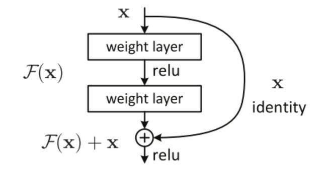
</div>

这样的话这一层的神经网络可以不用学习整个的输出，而是学习上一个网络输出的残差，因此ResNet又叫做残差网络。

提出残差学习的思想。传统的卷积网络或者全连接网络在信息传递的时候或多或少会存在信息丢失，损耗等问题，同时还有导致梯度消失或者梯度爆炸，导致很深的网络无法训练。ResNet在一定程度上解决了这个问题，通过直接将输入信息绕道传到输出，保护信息的完整性，整个网络只需要学习输入、输出差别的那一部分，简化学习目标和难度。ResNet最大的区别在于有很多的旁路将输入直接连接到后面的层，这种结构也被称为shortcut或者skip connections。

本课程所采用的ResNet是通过改进的网络结构适应于本课程的医学检测问题。详细网络结构可以查看课程源代码。

### 6.3 U-Net
U-net的产生极大的促进了医学图像分割的研究。2015年Olaf Ronneberger, Philipp Fischer和Thomas Brox提出了U-net网络结构，并用于ISBI比赛中电子显微镜下细胞图像的分割，以较大的优势取得了冠军。U-net是基于全卷积网络拓展和修改而来，网络由两部分组成：一个收缩路径(contracting path)来获取上下文信息以及一个对称的扩张路径(expanding path）用以精确定位。

U-net的主要优点为：

- 支持少量的数据训练模型
- 通过对每个像素点进行分类，获得更高的分割准确率
- 用训练好的模型分割图像，速度快

<div align=center>
    <!--  -->
    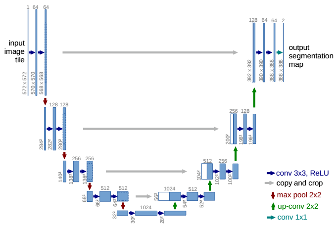
</div>

## 7 拓展实训

### 7.1 实训目标

- 掌握大规模数据集处理及数据预处理
- 掌握对大规模数据下的模型训练及应对策略

### 7.2 实训内容

现在，大家可以尝试从教程中提到的NIH官方网页上找到本课程数据集完整数据。
当然，也可以联系教师获取，同时获取我们当前目录下的build_dataset.py文件，参考该文件，对体会完整数据集下的训练复杂度，以及模型整体损失和准确率是否和课程对比有提升。


