[TOC]

# 任务n：学习计算机视觉相关概论

## 1.任务目标

<!-- 1. 
2. 
3. 
4.  -->

- 学习理解计算机视觉的概念和理论
- 了解计算机视觉的发展缘由
- 能够利用传统的机器学习方法解决图像问题并发现不足

## 2.任务描述

- 学习计算机视觉相关概念
- 掌握卷积神经网络的相关知识点
- 动手实践KNN邻近算法，调节超参数以及算法调优，让分类器能更好工作


## 3.知识准备

<!-- ### 定义 -->

- ⽆论是医疗诊断、⽆⼈⻋、摄像监控，还是智能滤镜，计算机视觉领域的诸多应⽤都与我们当下和未来的⽣活息息相关。近年来，深度学习技术深刻推动了计算机视觉系统性能的提升。可以说，当下最先进的计算机视觉应⽤⼏乎离不开深度学习。鉴于此，本章将关注计算机视觉领域，并从中介绍挑选时下在学术界和⼯业界具有影响⼒的⽅法与应⽤来展⽰深度学习的魅⼒。

<div align=center>
    <!--  -->
    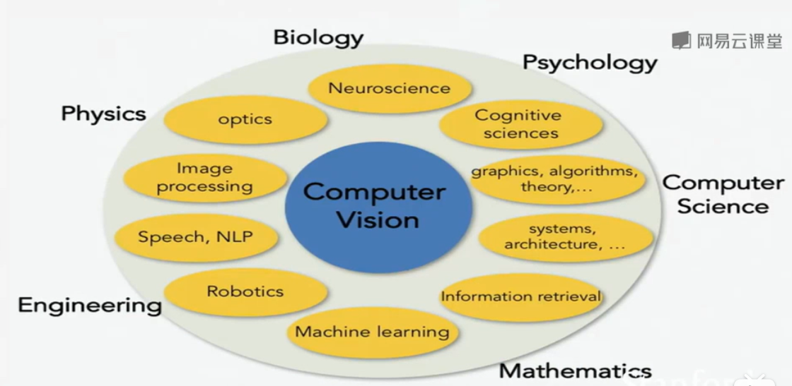
</div>

<!-- - 我们在之前的课堂中已经介绍了计算机视觉领域常使⽤的深度学习模型，并实践了简单的图像分类任务。在本章的开头，我们介绍两种有助于提升模型的泛化能⼒的⽅法，即图像增⼴和微调，并把它们应⽤于图像分类。由于深度神经⽹络能够对图像逐级有效地进⾏表征，这⼀特性被⼴泛应⽤在⽬标检测、语义分割和样式迁移这些主流计算机视觉任务中，并取得了成功。围绕这⼀核⼼思想，⾸先，我们将描述⽬标检测的⼯作流程与各类⽅法。之后，我们将探究如何使⽤全卷积⽹络对图像做语义分割。接下来，我们再解释如何使⽤样式迁移技术⽣成像本书封⾯⼀样的图像。最后，我们在两个计算机视觉的重要数据集上实践本章和前⼏章的知识。 -->
### 3.1定义

- 计算机视觉是一门研究如何使机器“看”的科学，更进一步的说，就是指用摄影机和电脑代替人眼对目标进行识别、跟踪和测量等机器视觉，并进一步做图形处理，使电脑处理成为更适合人眼观察或传送给仪器检测的图像。计算机视觉也可以看作是研究如何使人工系统从图像或多维数据中“感知”的科学。

- 人类认识了解世界的信息中91%来自视觉，同样计算机视觉成为机器认知世界的基础，终极目的是使得计算机能够像人一样“看懂世界”。目前计算机视觉主要应用在人脸识别、图像识别方面（包括静态、动态两类信息）。

- 与计算机视觉容易混淆的另一个概念是机器视觉，这两者其实有很大不同。

- 机器视觉就是用机器代替人眼来做测量和判断。机器视觉系统是通过图像摄取装置将被摄取目标转换成图像信号，传送给专用的图像处理系统，得到被摄目标的形态信息，根据像素分布和亮度、颜色等信息，转变成数字化信号；图像系统对这些信号进行各种运算来抽取目标的特征，进而根据判别的结果来控制现场的设备动作。

- 从学科分类上，二者都被认为是Artificial Intelligence下属科目，不过计算机视觉偏软件，通过算法对图像进行识别分析，而机器视觉软硬件都包括（采集设备，光源，镜头，控制，机构，算法等），指的是系统，更偏实际应用。 

### 3.2发展历程

- 从2006年开始，在将近10年的时间里，整个计算机视觉界发生了一个比较本质的变化，也是人工智能带来的核心本质的变化——深度学习的出现。深度学习的出现真正改变了计算机视觉之前的定义。那么，这种改变到底是怎样带来的，它对我们解决现在的特定问题会带来什么样的影响呢？要解决这样的问题，先要看一下整个计算机视觉的发展历程。
- 计算机视觉的发展历史可以追溯到1966年，在这一年有一个非常有名的人工智能学家，叫马文·明斯基。在1966年夏天，明斯基给他的学生布置了一道非常有趣的暑假作业，就是让学生在电脑前面连一个摄像头，然后想办法写一个程序，让计算机告诉我们摄像头看到了什么。这道题太有挑战了，其实它代表了计算机视觉的全部：通过一个摄像头让机器告诉我们它到底看到了什么。

- 所以，1966年被认为是计算机视觉的起始年。
- 70年代，研究者开始去试图解决这样一个问题，就是让计算机告知他到底看到了什么东西。当时，大家认为要让计算机认知到底看到了什么，可能首先要了解人是怎样去理解这个世界的。当时有一种普遍的认知，认为人之所以理解这个世界，是因为人是有两只眼睛，他看到的世界是立体的，他能够从这个立体的形状里面理解这个世界。在这种认知情况下，研究者希望先把三维结构从图像里面恢复出来，在此基础上再去做理解和判断。
- 80年代，是人工智能发展的一个非常重要的阶段。当时，在人工智能界的逻辑学和知识库推理大行其道，大家开始做很多类似于现在的专家系统，计算机视觉的方法论也开始在这个阶段产生一些改变。在这个阶段，人们发现要让计算机理解图像，不一定先要恢复物体的三维结构。例如：让计算机识别一个苹果，假设计算机事先知道对苹果的形状或其他特征，并且建立了这样一个先验知识库，那么计算机就可以将这样的先验知识和看到物体表征进行匹配。如果能够匹配上，计算机就算识别或者理解了看到的物体。所以，80年代出现了很多方法，包括几何以及代数的方法，将我们已知的物品转化成一些先验表征，然后和计算机看到的物品图像进行匹配。
- 90年代，人工智能界又出现了一次比较大的变革，也就是统计方法的出现。在这个阶段，经历了一些比较大的发展点，比如现在还广泛使用的局部特征。研究者找到了一种统计手段，能够刻画物品最本质的一些局部特征，比如：要识别一辆卡车，通过形状、颜色、纹理，可能并不稳定，如果通过局部特征，即使视角、灯光变化了，也会非常稳定。局部特征的发展，其实也导致了后来很多应用的出现。比如：图像搜索技术真正的实用，也是由于局部特征的出现。我们可以对物品建立一个局部特征索引，通过局部特征可以找到相似的物品。其实，通过这样一些局部点，可以让匹配更加精准。
- 　到2000年左右，机器学习开始兴起。以前需要通过一些规则、知识或者统计模型去识别图像所代表的物品是什么，但是机器学习的方法和以前完全不一样。机器学习能够从我们给定的海量数据里面去自动归纳物品的特征，然后去识别它。在这样一个时间点，计算机视觉界有几个非常有代表性的工作，比如：人脸识别。你要识别一个人脸，第一步需要从图片里面把待识别的人脸区域给提取出来，我们一般叫做人脸检测。像在大家拍照的时候，会看到相机上有个小方框在闪，那其实是人脸识别必要的第一步工作，也就是人脸框的检测。在以前，这是非常困难的工作，但是在2000年左右，出现了一种非常好的算法，它能够基于机器学习，非常快速的去检测人脸，我们称之为Viola&Jones人脸检测器，它其实奠定了当代计算机视觉的一个基础。
- 当然，机器学习的出现其实是伴随着一个必要条件出现的，就是在2000年左右，整个互联网的出现和爆发，产生了海量的数据，大规模数据集也相伴而生，这为通过机器学习的方法来做计算机视觉提供了很好的土壤。在这期间，出现了大量学术官方的，针对不同领域评测的数据集。比如像刚刚谈到的人脸检测，这里面最具有代表性是一个叫FDDB的数据集。这个数据集包含了超过5000多张人脸数据，每一张人脸，都人为的用框给框出来，机器就可以从这些框好的数据里面，通过一些机器学习的手段去学习从任何一张图片中找到人脸区域。
- 另外，大家可能耳熟能详的一个数据集叫LFW。提到人脸识别，大家可能都会听到一句话，说人脸识别比人做得都要准确。其实这句话是有一定问题的。在很多的实际场景里面，人脸识别连人的百分之六七十可能都达不到。那么，在什么情况下，它比人准呢？其实就是在LFW上。LFW数据集里面有1万多张人脸和5000多个人的数据，每个人都有在不同情况下拍摄的真实场景的多张人脸。基于这样的一个数据集，我们可以在上面评估人脸识别的精度。人脸识别领域发展非常快，尤其是最近几年深度学习的兴起后，这个数据基本上快被刷爆了。人在LFW上面的识别正确率大概是97.75%，而机器已经在LFW上可以做到99.75%甚至更要高。
- 在这期间，还出现了其他非常有影响力的数据集，其中比较有代表性的就是IMAGEMET。这是由非常著名的教授李飞飞发起的一个项目，她通过众包的方式，大概标注1400万张图片，分了大概2万多个类别，这些类别包罗万物，比如像动物，里边可能分为鸟类、鱼类等；植物，里面可能会分为树和花。她的理想很宏大，就是希望提供这样一个数据集，为计算机视觉算法提供一个数据土壤，让未来的机器能够认识世界上的一切物品。
- 到2010年代，进入了一个最激动人心的年代，它就是深度学习的年代。深度学习从本质上给整个人工智能带来了一次革命。在80年代，有人做了一个猫的实验。他们在猫脑袋上开了一个洞，然后在猫的前面放各种各样的物品，观察猫在不同物品下的反应。通过实验发现，当我们放一些形状非常类似的物品时，猫会表现出同样的刺激反应，这就表明了人的认知是分层的。在早期多层神经网络经历2000年左右的一个低谷后，2006年Hinton教授在《科学》发表了对于深层神经网络的训练方法，带来了深度学习的蓬勃发展。

### 3.3市场现状

- 学术上的突破带来了商业上的繁荣，从2010年开始，计算机视觉开始成为国内外各个公司关注的焦点，不管是初创企业还是巨头纷纷开始布局。

- 初创企业方面，国内计算机视觉创业热度递增且深入行业，但整体仍处于早期阶段。
- 巨头方面，国外巨头采用自研和收购双管齐下的方式，将视觉技术广泛应用于自身产品升级，并基于自身基因打造技术服务平台和新品类持续提升影响力。
- 国内巨头百度相对激进，阿里巴巴、腾讯基于自身产品进行功能试水

### 3.4技术应用场景

#### 安全/娱乐/营销成最抢先落地的商业化领域

- 计算机视觉技术已经步入应用早期阶段，不仅渗透到传统领域的升级过程中，还作为最重要的基础人工智能技术参与到前沿创新的研究中。其中，计算机对静态内容的识别应用主要体现在搜索变革和照片管理等基础服务层面，意在提升产品体验；伴随内容形式的变迁（文字→图片→视频），动态内容识别的需求愈加旺盛，安全、娱乐、营销成为最先落地的商业化领域。

- 这三类领域均有一定的产业痛点，且均是视频内容产出的重地，数据体量巨大，适合利用深度学习的方式予以改进。与此同时，行业潜在的商业变现空间也是吸引创业者参与的重要原因。

- 另一方面，当前计算机视觉主要应用于二维信息的识别，研究者们还在积极探索计算机对三维空间的感知能力，以提高识别深度。
<!-- <br></br> -->
<div align=center>
    <!--  -->
    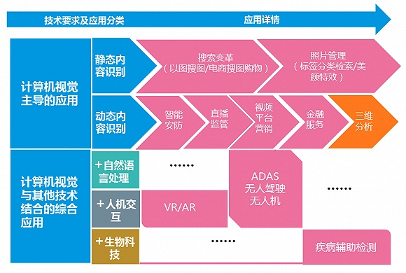
</div>

#### 从软硬件两个层面优化安防人员的作业效率和深度

- 安防是环境最为复杂的应用领域，通常的应用场景以识别犯罪嫌疑人、目标车辆（含套牌车/假牌车）以及真实环境中的异常为主。

- 传统安防产品主要功能在于录像收录，只能为安防人员在事后取证的环节提供可能的线索，且需要人工进行反复地逐帧排查，耗时耗力；智能安防则是将视频内容结构化处理，通过大数据分析平台进行智能识别搜索，大大简化了工作难度，提高工作效率。

- 计算机视觉的应用从行业痛点出发，以软硬件的方式大大优化了安防人员的作业效率与参考深度，是顺应行业升级的利好。不过，在实际应用过程中，对公安、交警、金融等常见安防需求方而言，更强的视觉识别效果往往意味着更多基础成本（存储、带宽等）的投入，安防厂商的未来将不只以技术高低作为唯一衡量标准，产品的实用性能与性价比的平衡才是进行突围、实现量产的根本，因此市场除了有巨大的应用空间外，还会引发一定的底层创新。

<div align=center>
    <!--  -->
    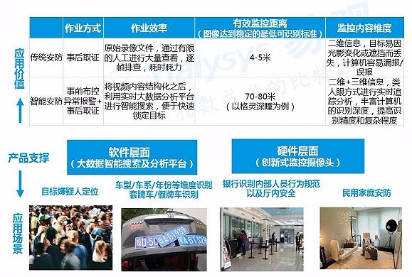
</div>

#### 有效迎合直播平台的前端用户体验和后端监管要求

- 直播平台的爆红丰富了网民的娱乐生活方式，产生的海量内容也为平台的监管造成了巨大的压力，传统人工审核效果不稳定，基于深度学习的图像识别平台可以有效缓解这一痛点，同时也可对前端的内容运营进行优化，提高用户体验和活跃度。
- 直播平台为计算机视觉创造了新的应用场景，伴随行业的发展，除刚需之外，平台定制化、差异化的需求也会为计算机视觉应用提供更多的增量空间。另外，与直播的UGC性质类似，其他的应用场景还有长短视频平台、社交平台、云存储平台、CDN以及社区平台。

<div align=center>
    <!--  -->
    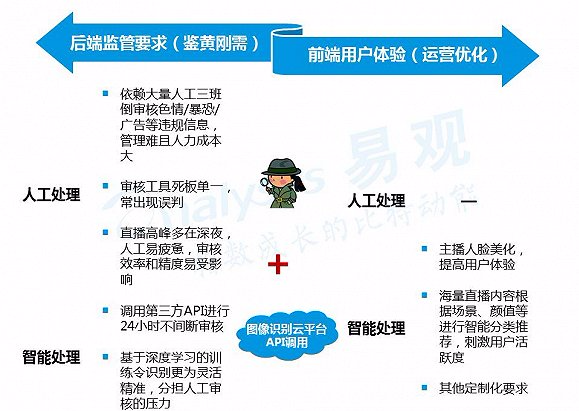
</div>

#### 促进视频环境中广告主和用户间交互闭环的落地

- 挖掘视频中广告位及视频电商购物一直是视频平台作为中间方探索营销创收的新方式，此前以人工贴标、投放的方式实现，因效率低下仅作为小范围试水。

- 计算机视觉将加速这一探索的进程，除技术成熟度之外，用户体验和用户习惯（从PC端向移动端迁移）也是对应用程度比较重要的影响因素，需要合理设计及长期培育。

<div align=center>
    <!--  -->
    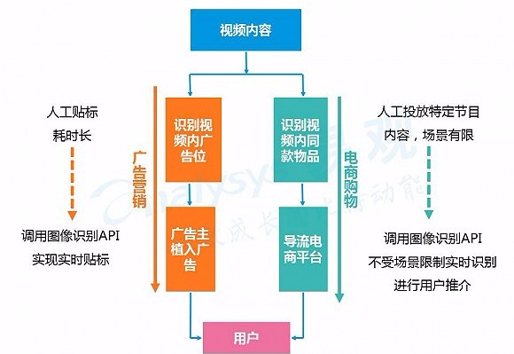
</div>

#### 逐步拓展服务和工商业等多重应用场景

<div align=center>
    <!--  -->
    
</div>


#### 与其他技术融合共同推动创新型行业应用的发展

<div align=center>
    <!--  -->
    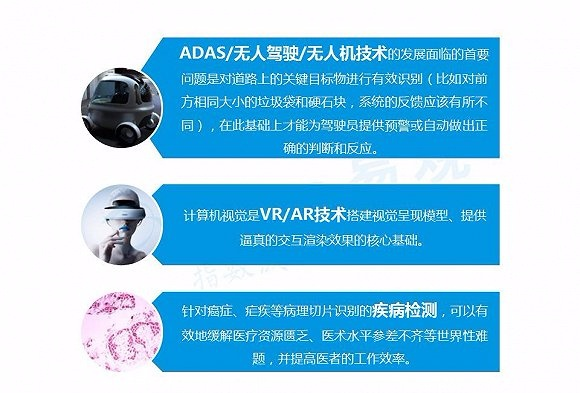
</div>

### 3.5问题引入——图像分类

- 这是计算机视觉中真正核心的任务，通常我们期望，计算机得到我们输入的一张图片后，能够给这张图片打上标签，究竟是猫狗，还是汽车，还有一些固定类别标签集合。对于人来说，这是一个很简单的问题，因为大家的视觉系统中，天生就是能够达成这些视觉任务的。但是对机器而言，是非常困难的问题，如果你深入思考，当计算机看到这些图片的时候，它看到的是什么，他肯定是没有一只猫咪的概念，而不像你们看着的时候，计算机呈现图片的方式其实就是一大堆的数字。
<div align=center>
    <!--  -->
    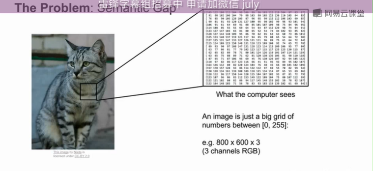
</div>

- 每个像素对应三个数字，是一个巨大的数字阵列
- 同时，面临着角度，照明，形变，姿势和位置，遮挡，复杂背景等挑战，对于人的认识是非常简单的事情，但是对于电脑一个算法去鲁棒识别这世间万物是一件比较困难的 事情，但是现在已经有比较好的算法能够帮助我们去达成这件事情了。


## 4. 任务实施

### 4.1 实施思路

- 如果你上算法课，遇到排序，凸包，最优路径，你可以用特定，简洁明了的的方法去解决这些问题，但是对于分类，并没有简洁明了的方法去直接完成这些识别。

- 我们可以写一些规则算法去识别一只猫，写一些规则，但是这种方法并不好，很容易出错，更何况我们并不单只要识别猫，如果还有其他的许许多多的类别。

- 基于此，我们可能想到采取数据驱动的方法，不写具体分类规则去识别一只猫或鱼，取而代之，在网络上收集猫鱼等物体的大量数据，譬如用搜索引擎搜索，用爬虫爬取，收集到大量的数据，形成不同类别的示例图，这种方法其实挺耗费时间的，好在现在已经有好多很高质量可用的图片数据集，一旦有了数据集，我们可以通过训练机器去帮我们完成分类的任务（机器会收集所有数据，用某种方式总结，然后生成一个模型，总结识别出这些不同的类的对象的核心知识要素），然后用模型去帮我们识别新的物体，看看分类机器能不能真实生效。

- 所以我们的接口是这样的，写一个函数，不仅仅是输入图片，然后识别它是一只猫，我们会有两个函数，一个是训练函数，这函数接受图片和标签，然后输出模型，另一种是预测函数，接收一个模型，对图片种类进行预测。

- 正是用了这种方法，在过去的十几二十年间，图像识别领域进步非常大，虽然我们主要讨论卷积神经网络和深度学习，但这种数据驱动类的算法是比深度学习更广义的一种理念。

### 4.2 实施步骤
#### 步骤1：
- 通过这个过程，对于一个简单的分类器，也许是最简单的分类器，成为我们最邻近，这种算法像诚实的默者，在训练机器过程中，我们什么也不做。
<div align=center>
    <!--  -->
    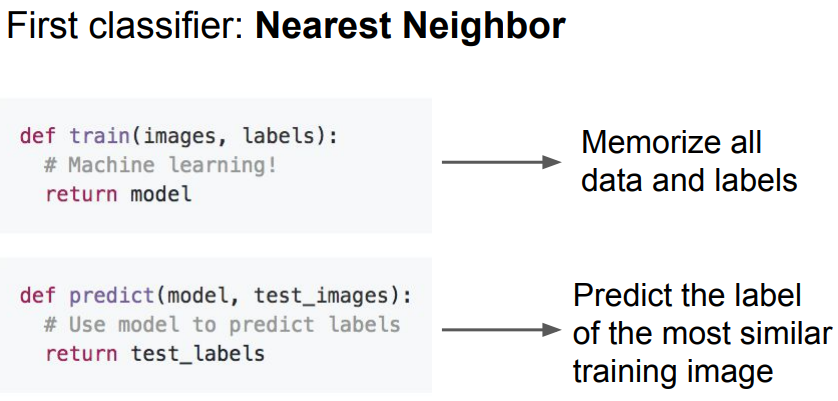
</div>

- 我们只是单纯记录所有的训练数据，this is simple!
- 预测阶段，我们会拿一些新图片去在训练数据中，寻找与新突破最相似的，然后基于此，来给出一个标签。
- 看似简单的算法，这里很多所用到的属性，都是数据驱动的。

#### 步骤2：
- 譬如一个CIFAR-10的数据集。
  
<div align=center>
    <!--  -->
    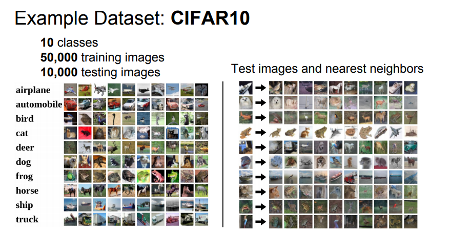
</div>

- 所以当我们将最邻近算法用于这些图片，我们就能在训练集中找到最接近的示例，因为它们来自训练集，因此我们知道这些最接近示例的标签。

#### 步骤3：
- 我们需要知道一个细节，如果给出两幅图片，我们应该怎样对他们进行比较，因为如果我们要将测试图片与所有训练图片进行比较，我们将有很多不同的选择，来确定需要什么样的比较函数，所以上一个图中，我们使用了L1距离，，有时我们也称其为曼哈顿距离。
  
<div align=center>
    <!--  -->
    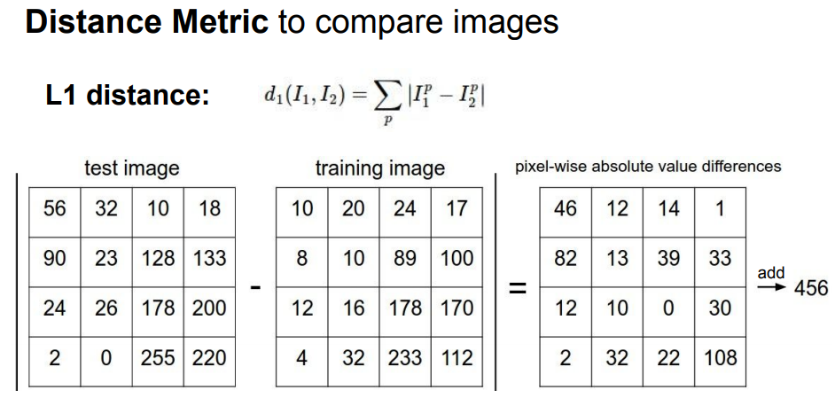
</div>

- 这是一个简单易行的方法，只对图片中的单个像素进行比较，如图，假设我们的测试图片只是4x4的小图片，我们只取图片左上角的像素减去训练图像对应像素的值，然后取绝对值，得到这两幅图像这个像素的差别，将图像中所有像素的这个差值相加，看似笨方法，但某些场景也存在其合理性，给出了我们对比两张图像的具体方法。这个例子中，两张图片有456处不同。

#### 步骤4：

<div align=center>
    <!--  -->
    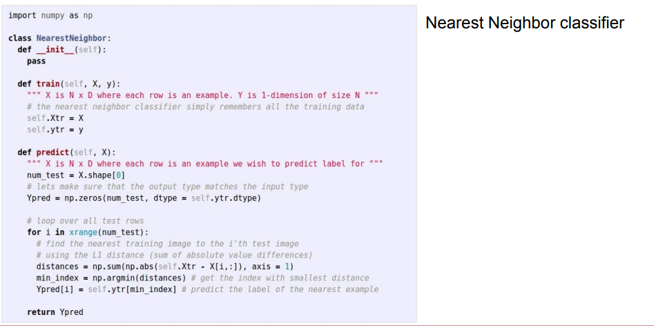
</div>

- 这是最邻近算法的全部代码，看似非常简洁，因为我们采用了numpy的向量计算，存储训练数据，然后用L1距离函数，将我们的测试图片与训练实例进行比较，然后在训练集中找的到最相似的实例，这些向量化的操作，只需要一两行的python代码就可以实现。


## 5.任务拓展
### 5.1 KNN和SVM的区别

- KNN对每个样本都要考虑。SVM是要去找一个函数把达到样本可分。
- 朴素的KNN是不会去自助学习特征权重的，SVN的本质就是在找权重。
- KNN不能处理样本维度太高的东西，SVM处理高纬度数据比较优秀。


## 6. 任务实训
### 6.1 实训目的
- 深入理解KNN算法
- 对KNN算法的超参数进行实操调整

### 6.2 实训内容
- 通过使用一个循环使用部分矢量化来加快距离矩阵的计算。 实现函数compute_distances_one_loop。
- 执行k倍交叉验证，以找到k的最佳值。 对于k的每个可能值，运行k_nearest-neighbor算法num_folds次，在每种情况下，您将除其中一个折叠以外的所有折叠用作训练数据，将最后一个折叠用作验证集。 将所有折叠和所有k值的精度存储在k_to_accuracies字典中。

### 6.3 示例代码


```
# Now lets speed up distance matrix computation by using partial vectorization
# with one loop. Implement the function compute_distances_one_loop and run the
# code below:
dists_one = classifier.compute_distances_one_loop(X_test)

# To ensure that our vectorized implementation is correct, we make sure that it
# agrees with the naive implementation. There are many ways to decide whether
# two matrices are similar; one of the simplest is the Frobenius norm. In case
# you haven't seen it before, the Frobenius norm of two matrices is the square
# root of the squared sum of differences of all elements; in other words, reshape
# the matrices into vectors and compute the Euclidean distance between them.
difference = np.linalg.norm(dists - dists_one, ord='fro')
print('Difference was: %f' % (difference, ))
if difference < 0.001:
    print('Good! The distance matrices are the same')
else:
    print('Uh-oh! The distance matrices are different')
#     robenius norm. In case
# you haven't seen it before, the Frobenius norm of two 


# Let's compare how fast the implementations are
def time_function(f, *args):
    """
    Call a function f with args and return the time (in seconds) that it took to execute.
    """
    import time
    tic = time.time()
    f(*args)
    toc = time.time()
    return toc - tic

two_loop_time = time_function(classifier.compute_distances_two_loops, X_test)
print('Two loop version took %f seconds' % two_loop_time)

one_loop_time = time_function(classifier.compute_distances_one_loop, X_test)
print('One loop version took %f seconds' % one_loop_time)

no_loop_time = time_function(classifier.compute_distances_no_loops, X_test)
print('No loop version took %f seconds' % no_loop_time)

# you should see significantly faster performance with the fully vectorized implementation


num_folds = 5
k_choices = [1, 3, 5, 8, 10, 12, 15, 20, 50, 100]

X_train_folds = []
y_train_folds = []
################################################################################
# TODO:                                                                        #
# Split up the training data into folds. After splitting, X_train_folds and    #
# y_train_folds should each be lists of length num_folds, where                #
# y_train_folds[i] is the label vector for the points in X_train_folds[i].     #
# Hint: Look up the numpy array_split function.                                #
################################################################################
X_train_folds=np.array_split(X_train,num_folds)
y_train_folds=np.array_split(y_train,num_folds)
################################################################################
#                                 END OF YOUR CODE                             #
################################################################################

# A dictionary holding the accuracies for different values of k that we find
# when running cross-validation. After running cross-validation,
# k_to_accuracies[k] should be a list of length num_folds giving the different
# accuracy values that we found when using that value of k.
k_to_accuracies = {}
for i in k_choices:
    k_to_accuracies[i]=[]
################################################################################
# TODO:                                                                        #
# Perform k-fold cross validation to find the best value of k. For each        #
# possible value of k, run the k-nearest-neighbor algorithm num_folds times,   #
# where in each case you use all but one of the folds as training data and the #
# last fold as a validation set. Store the accuracies for all fold and all     #
# values of k in the k_to_accuracies dictionary.                               #
################################################################################
for ki in k_choices:
    for fi in range(num_folds):
        #prepare the data
        valindex=fi
        X_traini = np.vstack((X_train_folds[0:fi]+X_train_folds[fi+1:num_folds]))
        y_traini = np.hstack((y_train_folds[0:fi]+ y_train_folds[fi+1:num_folds]))

        X_vali=np.array(X_train_folds[valindex])
        y_vali = np.array(y_train_folds[valindex])
        num_val=len(y_vali)

        #initialize the KNN
        classifier = KNearestNeighbor()
        classifier.train(X_traini,y_traini)

        #calculate the accuracy
        dists = classifier.compute_distances_one_loop(X_vali)
        y_val_pred = classifier.predict_labels(dists, k=ki)
        num_correct = np.sum(y_val_pred == y_vali)
        accuracy = float(num_correct) / num_val
        print('Got %d / %d correct => accuracy: %f' % (num_correct, num_test, accuracy))
        k_to_accuracies[ki].append(accuracy)
################################################################################
#                                 END OF YOUR CODE                             #
################################################################################

# Print out the computed accuracies
for k in sorted(k_to_accuracies):
    for accuracy in k_to_accuracies[k]:
        print('k = %d, accuracy = %f' % (k, accuracy))


# plot the raw observations
for k in k_choices:
    accuracies = k_to_accuracies[k]
    plt.scatter([k] * len(accuracies), accuracies)

# plot the trend line with error bars that correspond to standard deviation
accuracies_mean = np.array([np.mean(v) for k,v in sorted(k_to_accuracies.items())])
accuracies_std = np.array([np.std(v) for k,v in sorted(k_to_accuracies.items())])
plt.errorbar(k_choices, accuracies_mean, yerr=accuracies_std)
plt.title('Cross-validation on k')
plt.xlabel('k')
plt.ylabel('Cross-validation accuracy')
plt.show()


# Based on the cross-validation results above, choose the best value for k,   
# retrain the classifier using all the training data, and test it on the test
# data. You should be able to get above 28% accuracy on the test data.
best_k = 1

classifier = KNearestNeighbor()
classifier.train(X_train, y_train)
y_test_pred = classifier.predict(X_test, k=best_k)

# Compute and display the accuracy
num_correct = np.sum(y_test_pred == y_test)
accuracy = float(num_correct) / num_test
print('Got %d / %d correct => accuracy: %f' % (num_correct, num_test, accuracy))


```