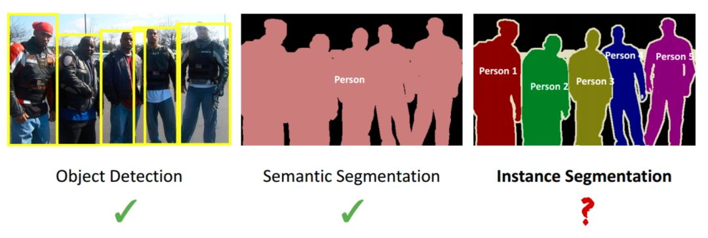
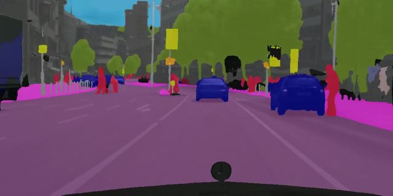
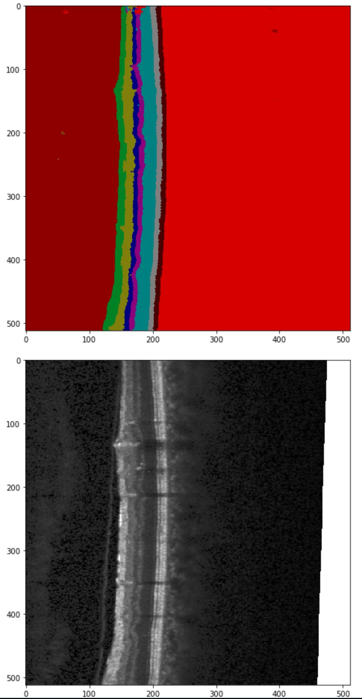
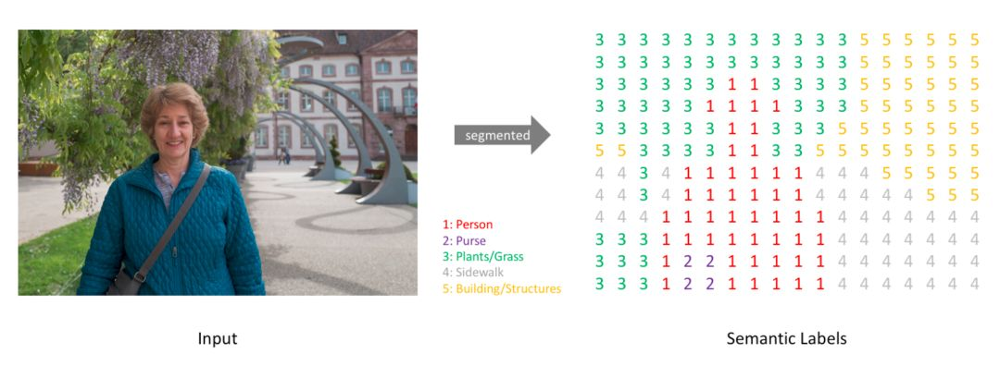
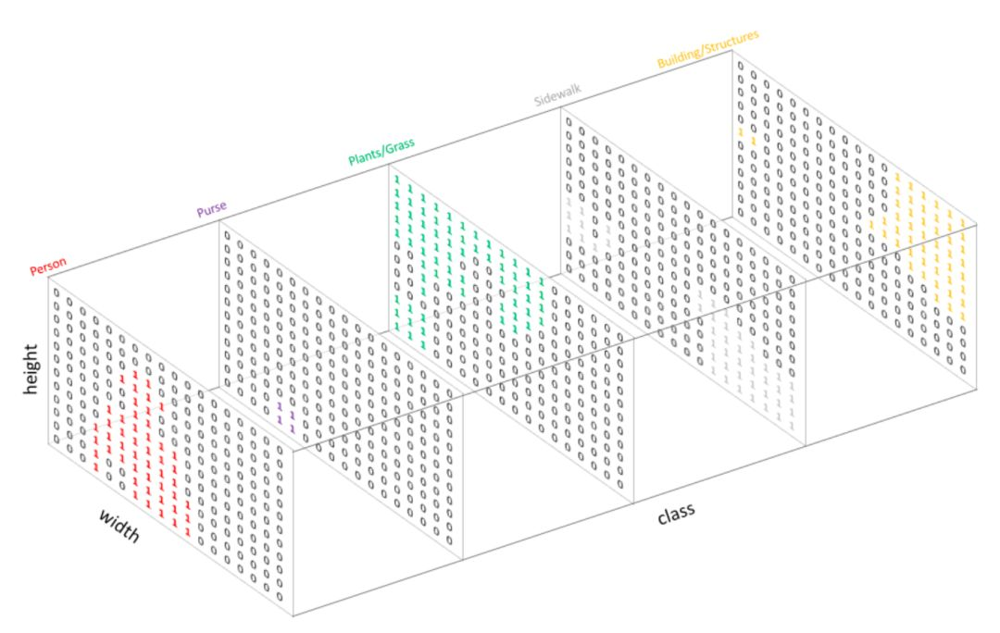
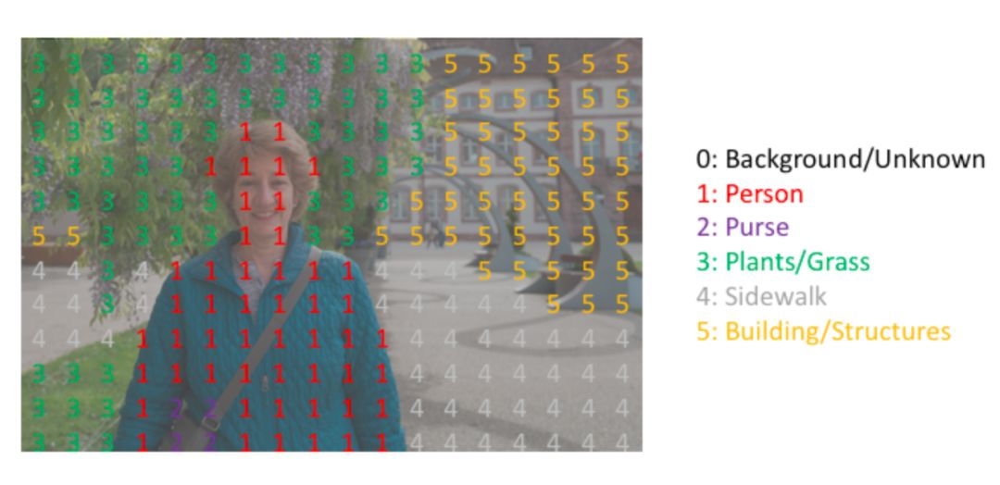

[TOC]

# 任务11：图像分割

## 1.任务目标

<!-- 1. 
2. 
3. 
4.  -->

- 学习图像分割的相关概念
- 了解如何进行图像分割

## 2.任务描述

- 总的而言，目前的分割任务主要有两种： 语义分割和实例分割。那语义分割和实例分割具体都是什么含义呢？二者又有什么区别和联系呢？语义分割是对图像中的每个像素都划分出对应的类别，即实现像素级别的分类； 而类的具体对象，即为实例，那么实例分割不但要进行像素级别的分类，还需在具体的类别基础上区别开不同的实例。比如说图像有多个人甲、乙、丙，那边他们的语义分割结果都是人，而实例分割结果却是不同的对象，具体如下图第二第三两幅小图所示： 

    <!--  -->
    

## 3.知识准备

### 3.1目标检测、语义分割和实例分割

- 以语义分割和实例分割为代表的图像分割技术在各领域都有广泛的应用，例如在无人驾驶和医学影像分割等方面。应用示例如下图所示：

    <!--  -->
    

- 语义分割在无人驾驶中的应用

    <!--  -->
    

- 语义分割在OCT眼底视网膜图像分层识别中的应用

### 3.2语义分割（Semantic Segmentation）

#### 3.2.1语义分割的任务描述

- 不同于此前的图像分类和目标检测，在开始图像分割的学习和尝试之前，我们必须明确语义分割的任务描述，即搞清楚语义分割的输入输出都是什么。我们输入当然是一张原始的RGB图像或者单通道的灰度图，但是输出不再是简单的分类类别或者目标定位，而是带有各个像素类别标签的与输入同分辨率的分割图像。简单来说，我们的输入输出都是图像，而且是同样大小的图像。如下图所示：

    <!--  -->
    

#### 3.2.2从输入到输出语义标签

- 类似于处理分类标签数据，对预测分类目标采用像素上的 one-hot 编码，即为每个分类类别创建一个输出的 channel 。如下图所示：

    <!--  -->
    

#### 3.2.3语义标签的one-hot

- 下图是将分割图添加到原始图像上的效果验证。这里有个概念需要明确一下——mask，在图像处理中我们将其译为掩膜，如 mask-rcnn 中的 mask。mask 可以理解为我们将预测结果叠加到单个 channel 时得到的该分类所在区域。

    <!--  -->
    

#### 3.2.3语义标签与输入图像的重叠

- 语义分割的任务就是输入图像经过深度学习算法处理得到带有语义标签的同样尺寸的输出图像。

## 4. 任务实施
- 通过python实现上述算法，体会算法，反思改进的思路，然后通过利用深度学习的算法来尝试增强图像。
### 4.1 实施思路

- 根据知识点中提及到的数学公式，将图像增强算法的函数复现，然后利用已有图片，进行图像增强。

### 4.2 实施步骤
#### 步骤1：

#### 步骤2：

#### 步骤3：

#### 步骤4：

#### 步骤5：

#### 步骤6：

## 5.任务拓展
### 5.1 

## 6. 任务实训
### 6.1 实训目的

### 6.2 实训内容

### 6.3 示例代码

