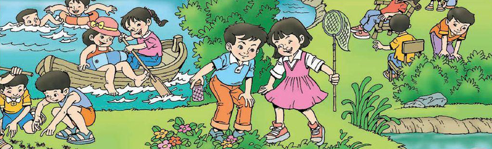
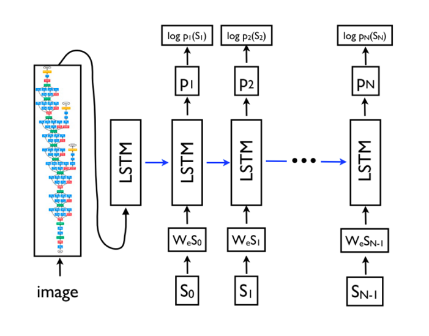
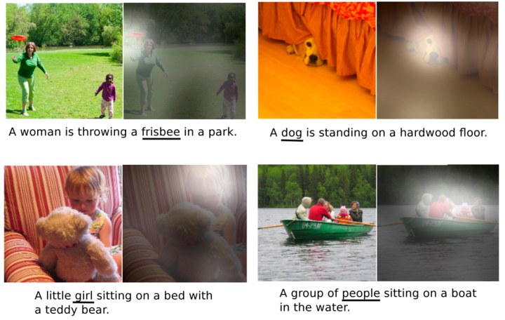
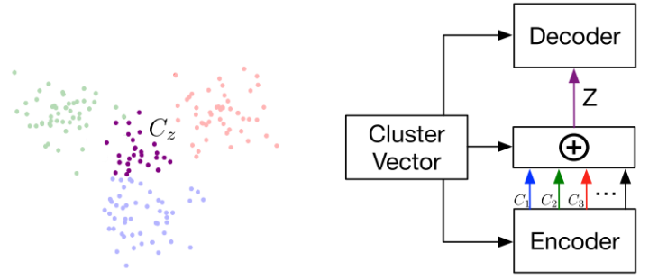
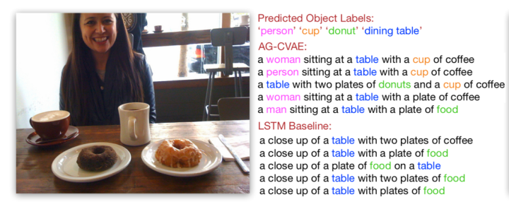
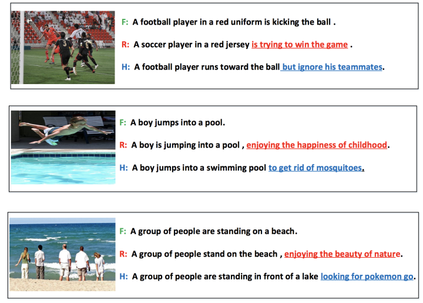

[TOC]

# 任务6：去雾算法

## 1.任务目标

<!-- 1. 
2. 
3. 
4.  -->

- 学习图像描述的相关概念
- 了解如何生成多样化的图片描述

    <!--  -->
    

## 2.任务描述

- 近年来，关于图像描述（Image Caption）的研究热度逐高，例如，2018年底，Instagram宣布推出AI图片描述功能，用户点击图片时，系统自动对该图片进行描述，用于帮助视觉障碍用户也可以轻松使用这款应用。

    <!--  -->
    

- 其实，图像描述（Image Caption）本质上是图像信息到文本信息的翻译，通俗来讲，就是“看图说话”。就像刚认字的小朋友，看到简单的图画编故事，例如：大象在喝水。现如今，人工智能技术逐渐成熟，也可以实现根据图像给出对应描述的自然语言语句。

- “看图说话”对人类而言很容易，但是对于机器却非常具有挑战性，它不仅需要利用模型去理解图片的内容并且还需要用自然语言去表达它们之间的关系。除此之外，模型还需要能够抓住图像的语义信息，并且生成人类可读的句子。

- 此外，还存在一个困扰性难题，由于模型的结构过于简单，导致机器生成的句子风格往往过于单一。所以，本文将基于传统的Image Caption实现方式，介绍如何利用深度生成模型来生成多样化图片描述。

## 3.知识准备

### 3.1传统的Image Caption实现方式

- 当前大部分图片描述生成的模型都是基于传统Encoder-Decoder架构。在最原始的RNN结构中，输入序列和输出序列必须是严格等长的。但在机器翻译等任务中，源语言句子的长度和目标语言句子的长度往往不同，因此需要将原始序列映射为一个不同长度的序列。Encoder-Decoder架构就是用于解决长度不一致的映射问题。

    <!--  -->
    

- 在Image Caption输入的图像代替了机器翻译中输入的单词序列，图像是一系列的像素值，需要从使用图像特征提取。常用的CNN从图像中提取出相应的视觉特征，然后使用Decoder将该特征解码成输出序列，如上图所示，特征提取采用的是CNN，Decoder部分，将RNN换成了性能更好的LSTM，输入还是word embedding，每步的输出是单词表中所有单词的概率。

- 将输入序列编码成语义特征再解码,会因为存在长度限制，使得对于长句的翻译精度降低，为此一种Attention机制被提出，利用CNN的空间特性，给图片的不同位置都提取一个特征，有了含位置信息的特征，Decoder解码可以在位置特征中自由选择，不再使用统一的语义特征，大大提高了Encoder-Decoder的模型性能。

- 下图展示了一些例子，每个句子都是模型自动生成的，在图片中用白色高亮标注了生成下划线单词时模型关注的区域：

    <!--  -->
    

- 基于Encoder-Decoder架构的Image Caption可以达到较高的正确率，但是描述语句的表述单调、风格单一，对图片的描述往往不够丰富形象。当然，这对我们人类而言也有一定难度，不能指望于不完美的视觉特征的机器方法能够像小说家一样“写”出精准又动人的话语。只是，如果能够让机器实现更加多样化的描述，那一定会非常的有意义。

### 3.2多样化Image Caption的尝试

- 随着近年来，无监督学习成为了研究热点，VAE（Variational Auto-Encoder，变分自编码器）和 GAN（Generative Adversarial Networks，生成性对抗网络） 等模型，受到越来越多的关注。使用生成式模型能够帮助模型更好的把握生成模型的不确定性，应用于Image Caption 可以生成更高质量的图片描述。

- 于是，开始有研究者基于对VAE和 GAN模型的研究，提出多种能够多样化Image Caption的实现方式。

#### 3.2.1CVAE

- 首先是采用CVAE条件变分自动编码器，标准CVAE具有固定的高斯先验产率描述，可变性太小，所以可以定义一个新的加性高斯（AG）先验，线性组合组件均值。

    <!--  -->
    

- 实现过程，通过cluster vector控制图片描述的生成，cluster vector与图片中的对象对应，通过目标检测得到，训练时由 ground truth直接生成。图片的隐藏空间遵循混合高斯先验，受cluster vector控制。由此给定不同的cluster vector能够得到不同的图片描述。

- 测试结果如下图所示，与LSTM基线相比，AG-CVAE模型输出的描述更加多样化，更加准确。

    <!--  -->
    

#### 3.2.2引入style

- 使用factorized LSTM，显示引入对风格的训练。数据集中对一张图片有不同风格的描述，比如浪漫、幽默的风格描述和事实描述，训练时首先训练全部参数。训练风格时，固定factorized参数以外的参数，仅训练S参数。通过替换S矩阵决定生成图片描述的风格。

    <!--  -->
    

- 测试结果如下图所示，机器在进行浪漫、幽默风格的表述时，相较事实描述，语句表达形式更加丰富，语义也更加具有吸引力。

    <!--  -->
    

- 以上两种方式让机器进行更加多样化的描述成为可能，但是目前风格化的数据相对难以获取，我们更常用的是非风格化的数据集，比如常见的Flickr30k，MSCOCO。所以，如何利用现有的图片数据资源，让Image caption更加的随机多变，或许会成为接下来的研究方向。

- 图像描述（Image Caption）作为人工智能技术边界探索的主流问题之一，通过对多样性、风格化的尝试与探索，可以帮助我们更好的展望未来。

- 比如说用户在拍了一张照片后，利用Image Caption技术系统可以为其匹配合适的文字，方便以后检索或省去用户手动配字，也可以帮助视觉障碍者去理解图像内容。此外，延伸至视频领域，Video Caption自动生成字幕，极大节省人力成本。

- 甚至或许，未来Image Caption不仅仅实现“看图说话”，而可以像诗人一样“作诗”。毕竟ACM MM 2018的最佳论文《Beyond Narrative Description: Generating Poetry from Images by Multi-Adversarial Training》，就是AI机器面向于一张图像所做的诗歌：

- The sun is shining ---------- 阳光漫步

- The wind moves ---------- 和风轻抚

- Naked trees ---------- 光裸的树

- You dance ---------- 你在跳舞

## 4. 任务实施
- 通过python实现上述算法，体会算法，反思改进的思路，然后通过利用深度学习的算法来尝试增强图像。
### 4.1 实施思路

- 根据知识点中提及到的数学公式，将图像增强算法的函数复现，然后利用已有图片，进行图像增强。

### 4.2 实施步骤
#### 步骤1：

#### 步骤2：

#### 步骤3：

#### 步骤4：

#### 步骤5：

#### 步骤6：

## 5.任务拓展
### 5.1 

## 6. 任务实训
### 6.1 实训目的

### 6.2 实训内容

### 6.3 示例代码

