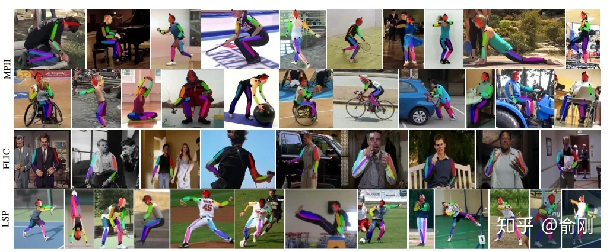
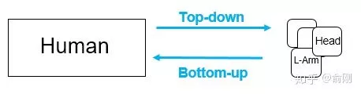
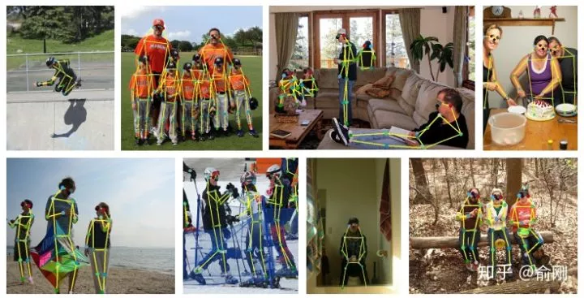
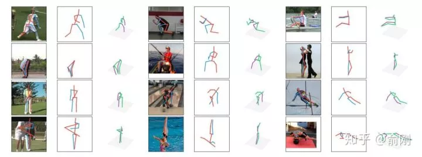
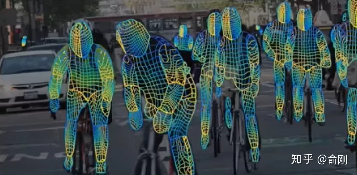

[TOC]
# 任务n：学习理解人体姿态估计相关知识
## 1.任务目标
<!-- 1. 
2. 
3. 
4.  -->
- 学习理解人体姿态估计的概念和理论
- 了解人体姿态估计领域常用数据集
- 掌握人体姿态估计领域的衡量标准以及损失函数
- 学会使用相关的人体姿态估计算法

## 2.任务描述
<!-- - 从自然实况入手，一步步从计算机视觉的角度去理解如何做人体姿态的估计
- 以二维的人体姿态估计为切入点,讲解围绕二维人体姿态估计的相关衡量标准以及损失函数
- 动手实践一个人体姿态估计算法,观察预测结果 -->


- 人体姿态估计是计算机视觉中一个很基础的问题。从名字的角度来看，可以理解为对“人体”的姿态（关键点，比如头，左手，右脚等）的位置估计。一般我们可以这个问题再具体细分成4个任务：

- 单人姿态估计 (Single-Person Skeleton Estimation)
- 多人姿态估计 (Multi-person Pose Estimation)
- 人体姿态跟踪 （Video Pose Tracking)
- 3D人体姿态估计 （3D Skeleton Estimation)


## 3.知识准备

### 单人姿态估计
-  输入是一个crop出来的行人，然后在行人区域位置内找出需要的关键点，比如头部，左手，右膝等。常见的数据集有MPII, LSP, FLIC, LIP。其中MPII是2014年引进的，目前可以认为是单人姿态估计中最常用的benchmark， 使用的是PCKh的指标（可以认为预测的关键点与GT标注的关键点经过head size normalize后的距离）。但是经过这几年的算法提升，整体结果目前已经非常高了（最高的已经有93.9%了）。下面是单人姿态估计的结果图（图片来源于CPM的paper)

<div align=center>
    <!--  -->
    
</div>

### 多人姿态估计
-  单人姿态估计算法往往会被用来做多人姿态估计。多人姿态估计的输入是一张整图，可能包含多个行人，目的是需要把图片中所有行人的关键点都能正确的做出估计。针对这个问题，一般有两种做法，分别是top-down以及bottom-up的方法。对于top-down的方法，往往先找到图片中所有行人，然后对每个行人做姿态估计，寻找每个人的关键点。单人姿态估计往往可以被直接用于这个场景。对于bottom-up，思路正好相反，先是找图片中所有parts （关键点），比如所有头部，左手，膝盖等。然后把这些parts（关键点）组装成一个个行人。

<div align=center>
    <!--  -->
    
</div>

- 对于测试集来讲，主要有COCO, 最近有新出一个数据集CrowdPose。下面是CPN算法在COCO上面的结果：
<div align=center>
    <!--  -->
    
</div>

### 人体姿态跟踪
-  如果把姿态估计往视频中扩展的话，就有了人体姿态跟踪的任务。主要是针对视频场景中的每一个行人，进行人体以及每个关键点的跟踪。这个问题本身其实难度是很大的。相比行人跟踪来讲，人体关键点在视频中的temporal motion可能比较大，比如一个行走的行人，手跟脚会不停的摆动，所以跟踪难度会比跟踪人体框大。目前主要有的数据集是PoseTrack。


### 3D 人体姿态估计
-  同时，如果把人体姿态往3D方面进行扩展，输入RGB图像，输出3D的人体关键点的话，就是3D 人体姿态估计。这个有一个经典的数据集Human3.6M。最近，除了输出3D的关键点外，有一些工作开始研究3D的shape，比如数据集DensePose。长线来讲，这个是非常有价值的研究方向。3D人体姿态估计的结果图（来自算法a simple baseline)如下：

<div align=center>
    <!--  -->
    
</div>

- Densepose算法的结果输出：

<div align=center>
    <!--  -->
    
</div>


### 相关数据集
#### Benchmark
<!-- 还可以给每个数据集加点简单的描述 -->
- 单人估计: [MPII](http://human-pose.mpi-inf.mpg.de/), [FLIC](https://bensapp.github.io/flic-dataset.html), [LSP](http://sam.johnson.io/research/lsp.html), [LIP](http://sysu-hcp.net/lip/)

- 多人关键点预测: [COCO](http://cocodataset.org/#keypoints-2019), [CrowdPose](http://cocodataset.org/#keypoints-2019)

- 视频：[PoseTrack](https://posetrack.net/)

- 三维人体：[Human3.6M](http://vision.imar.ro/human3.6m/description.php), [DensePose](http://densepose.org/)


### 评估指标
<!-- 此处考虑贴入公式或者图片 -->
- 基于对象关键点相似度（OKS）的mAP：
- $$\frac{\sum}{2}$$
- AP(average precision)
- AP Across Scales
- AR(average recall)
- AR Across Scales

### 损失函数


### 自下而上和自上而下的检测思想
<!-- 加上小段的文字介绍 -->
#### 自下而上
- Mask R-CNN, CPN, MSPN
- 高性能（良好的本地化能力），高召回率


#### 自上而下
- Openpose, Associative Embeding
- 简洁的框架，可能更快

### 挑战
- 模棱两可的外观
- 拥挤人群，遮挡现象
- 实时估计的速度

### 相关算法

#### OpenPose

- 在2016年COCO比赛中，当时的第一名就是OpenPose。CMU团队基于CPM为组件，先找到图片中的每个joint的位置，然后提出Part Affinity Field （PAF)来做人体的组装。


- PAF的基本原理是在两个相邻关键点之间，建立一个有向场，比如左手腕，左手肘。我们把CPM找到的所有的左手腕以及左手肘拿出来建立一个二分图，边权就是基于PAF的场来计算的。然后进行匹配，匹配成功就认为是同一个人的关节。依次类别，对所有相邻点做此匹配操作，最后就得到每个人的所有关键点。

- 在当时来讲，这个工作效果是非常惊艳的，特别是视频的结果图，具体可以参考Openpose的Github官网。在COCO的benchmark test-dev上面的AP结果大概是61.8。


### 应用

- 最后，讲了这么多的人体姿态估计，我们最后说一下人体姿态估计有什么用，这里的人体姿态估计是一个广义的人体姿态估计，包含2D/3D等。

- 首先的一个应用是人体的动作行为估计，要理解行人，人体的姿态估计其实是一个非常重要的中间层信息。目前有蛮多基于人体姿态估计直接做action recogntion的工作，比如把关键点当成graph的节点，然后是使用graph convolution network来整合各种信息做动作分类。我博士的研究课题是action recognition，我读完四年博士的一个总结是action这个问题，如果需要真正做到落地，人体姿态估计算法是必不可少的组成部分。

- 第二类应用是偏娱乐类的，比如人体交互，美体等。比如可以通过3d姿态估计来虚拟出一个动画人物来做交互，使用真实人体来控制虚拟人物。另外比如前一段时间比较火热的瘦腰，美腿等操作背后都可能依赖于人体姿态估计算法。

- 第三类应用是可以做为其他算法的辅助环节，比如Person ReID可以基于人体姿态估计来做alignment，姿态估计可以用来辅助行人检测，杀掉检测的FP之类的。


## 4. 任务实施
### 4.1 实施思路


### 4.2 实施步骤


## 5.任务拓展


## 6. 任务实训
### 6.1 实训目的


### 6.2 实训内容

### 6.3 示例代码


```

```