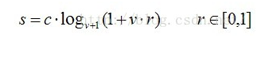
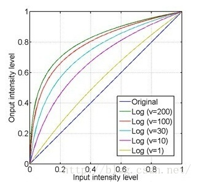
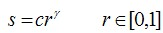
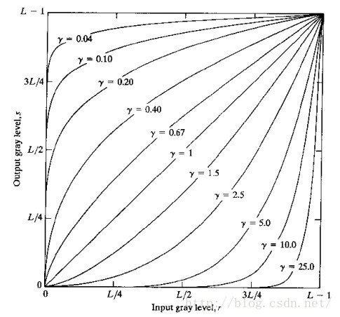

[TOC]

# 任务2：图像增广

## 1.任务目标

<!-- 1. 
2. 
3. 
4.  -->

- 了解图像增强的方法
- 能够通过传统的算法增强图像
- 学习利用深度学习的方法增强图像


## 2.任务描述


- 在过去的几年中，紧凑型相机传感器的质量有了显着提高，这使移动摄影达到了新的水平。由于采用了先进的后处理软件和硬件工具，即使是低端设备也能在适当的照明条件下拍摄出相当不错的照片。但是，就艺术质量而言，移动设备仍落后于其数码单反相机。较大的传感器和高光圈光学元件可提供更好的照片分辨率，色彩再现和更低的噪点，而它们的附加传感器有助于微调拍摄参数。这些物理差异会导致严重的障碍，使得紧凑型移动设备无法达到DSLR相机的质量。
- 尽管存在许多用于自动图像增强的摄影师工具，但它们通常只专注于调整全局参数（例如对比度或亮度），而不会提高纹理质量或不考虑图像语义。除此之外，它们通常基于一组预定义的规则，这些规则并不总是考虑特定设备的细节。因此，照片后期处理的主要方法仍然基于使用专用润饰软件的手动图像校正。


## 3.知识准备


### 3.1图像模糊产生的原因
- 

- （1）相机抖动. □ 拍摄时相机不稳. □ 全部画面被模糊. 
- （2）物体的运动. □ 部分物体运动. □ 不同区域模糊不同. 
- （3） 镜头失焦. □ 大光圈小景深时的效果. 等等。


### 3.2基于直方图均衡化的图像增强


- 直方图均衡化是通过调整图像的灰阶分布，使得在0~255灰阶上的分布更加均衡，提高了图像的对比度，达到改善图像主观视觉效果的目的。对比度较低的图像适合使用直方图均衡化方法来增强图像细节。


### 3.3基于拉普拉斯算子的图像增强


- 使用中心为5的8邻域拉普拉斯算子与图像卷积可以达到锐化增强图像的目的，拉普拉斯算子如下图所示：

$$
 \begin{matrix}
   0 & -1& 0 \\
   -0 & 5& -1 \\
   0 & -1& 0 
  \end{matrix} 
$$
- 拉普拉斯算子可以增强局部的图像对比度。

### 3.4基于对数Log变换的图像增强


- 对数变换可以将图像的低灰度值部分扩展，显示出低灰度部分更多的细节，将其高灰度值部分压缩，减少高灰度值部分的细节，从而达到强调图像低灰度部分的目的。变换方法：

<div align=center>
    <!--  -->
    
</div>


- 对数变换对图像低灰度部分细节增强的功能过可以从对数图上直观理解：
<div align=center>
    <!--  -->
    
</div>


- x轴的0.4大约对应了y轴的0.8，即原图上0~0.4的低灰度部分经过对数运算后扩展到0~0.8的部分，而整个0.4~1的高灰度部分被投影到只有0.8~1的区间，这样就达到了扩展和增强低灰度部分，压缩高灰度部分的值的功能。
- 从上图还可以看到，对于不同的底数，底数越大，对低灰度部分的扩展就越强，对高灰度部分的压缩也就越强。


### 3.5基于伽马变换的图像增强

- 伽马变换主要用于图像的校正，将灰度过高或者灰度过低的图片进行修正，增强对比度。变换公式就是对原图像上每一个像素值做乘积运算：

<div align=center>
    <!--  -->
    
</div>

- 伽马变换对图像的修正作用其实就是通过增强低灰度或高灰度的细节实现的，从伽马曲线可以直观理解：

<div align=center>
    <!--  -->
    
</div>

- γ值以1为分界，值越小，对图像低灰度部分的扩展作用就越强，值越大，对图像高灰度部分的扩展作用就越强，通过不同的γ值，就可以达到增强低灰度或高灰度部分细节的作用。
- 伽马变换对于图像对比度偏低，并且整体亮度值偏高（对于于相机过曝）情况下的图像增强效果明显。


### 3.6基于卷积神经网络的图像增强


## 4. 任务实施
- 通过python实现上述算法，体会算法，反思改进的思路，然后通过利用深度学习的算法来尝试增强图像。
### 4.1 实施思路

- 根据知识点中提及到的数学公式，将图像增强算法的函数复现，然后利用已有图片，进行图像增强。

### 4.2 实施步骤
#### 步骤1：
- 导入用到的相关模块:
```
%matplotlib inline

import cv2
import numpy as np
from matplotlib import pyplot as plt
```


#### 步骤2：
- 显示原图:
```
#  opencv 的接口使用BGR模式，而 matplotlib.pyplot 接口使用的是RGB模式
img = cv2.imread("img1.jpg", 1)

b, g, r = cv2.split(img)
srcImage_new = cv2.merge([r, g, b])
plt.imshow(srcImage_new)
```


#### 步骤3：
```
# 彩色图像均衡化,需要分解通道 对每一个通道均衡化
(b, g, r) = cv2.split(img)
bH = cv2.equalizeHist(b)
gH = cv2.equalizeHist(g)
rH = cv2.equalizeHist(r)
# 合并每一个通道
result = cv2.merge((rH, gH, bH))
# cv2.imshow("dst", result)

plt.imshow(result)

```

#### 步骤4：
```
# Gamma图像增强
def adjust_gamma(src,gamma=2.0):
    scale = float(np.iinfo(src.dtype).max - np.iinfo(src.dtype).min)
    dst = ((src.astype(np.float32) / scale) ** gamma) * scale
    dst = np.clip(dst,0,255).astype(np.uint8)
    return dst
g_result = adjust_gamma(srcImage_new)
plt.imshow(g_result)
```

#### 步骤5：
```
# log对数图像增强
def log_enhance(src):
   
    scale = float(np.iinfo(src.dtype).max - np.iinfo(src.dtype).min)
    dst = np.log2(src.astype(np.float32) / scale + 1) * scale
    dst = np.clip(dst,0,255).astype(np.uint8)
    return dst
l_result = log_enhance(srcImage_new)
plt.imshow(l_result)
```

## 5.任务拓展
### 5.1 


## 6. 任务实训
### 6.1 实训目的


### 6.2 实训内容


### 6.3 示例代码


