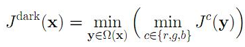
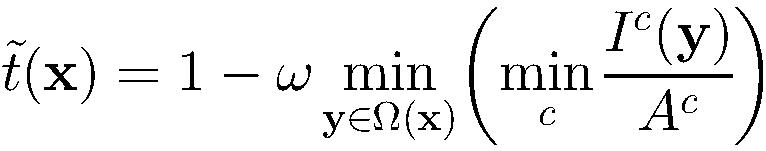
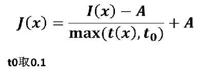

[TOC]

# 任务6：去雾算法

## 1.任务目标

<!-- 1. 
2. 
3. 
4.  -->

- 学习去雾算法的原理
- 能够利用去雾算法还原清晰真实的图像


## 2.任务描述


- 对浓雾天气下拍摄，导致细节无法辨认的图像进行去雾处理，还原更清晰真实的图像


## 3.知识准备


### 3.1去雾的重要性

- 室外场景的图像通常会被大气中的浑浊介质（例如，颗粒，水滴）降解。由于大气的吸收和散射，雾霾，雾气和烟雾都是这种现象。相机从场景点接收的辐照度沿视线衰减。此外，入射光与空气[6]混合（大气颗粒反射到视线中的环境光）。降级的图像失去了对比度和色彩保真度，如图1（a）所示。由于散射量取决于场景点到相机的距离，因此降级是空间变化的。
- 消费者/计算摄影和计算机视觉应用中都非常需要除雾1（或除雾）。首先，消除雾气可以显着增加场景的可见度并纠正由光线引起的色偏。通常，无雾图像在视觉上更令人愉悦。其次，从低级图像分析到高级对象识别，大多数计算机视觉算法通常假定输入图像（经过辐射度校准后）是场景辐射度。视觉算法（例如特征检测，滤波和光度分析）的性能将不可避免地受到偏见，低对比度场景辐射的影响。最后，除雾可以产生深度信息，并有利于许多视觉算法和高级图像编辑。雾或雾可能是了解场景的有用的深度线索。雾度不好的图像可以得到很好的利用。


本任务介绍去雾算法大致就是这个流程：

1.求图像暗通道

2.利用暗通道计算出折射率

3.利用暗通道估计大气光

4.代回雾图公式去雾

### 3.2雾图模型
- I(x) = J(x)t(x) + A(1-t(x))

- I(x) ——待去雾的图像
- J(x)——无雾图像
- A——全球大气光成分
- t——折射率（大气传递系数）

### 3.3暗通道先验

- 在无雾图像中，每一个局部区域都很有可能会有阴影，或者是纯颜色的东西，又或者是黑色的东西。因此，每一个局部区域都很有可能有至少一个颜色通道会有很低的值。把这个统计规律叫做Dark Channel Prior。


### 3.4暗通道定义

<div align=center>
    <!--  -->
    
</div>


- Jc表示彩色图像的每个通道 
- Ω(x)表示以像素X为中心的一个窗口 
- 意义:首先求出每个像素RGB分量中的最小值，存入一副和原始图像大小相同的灰度图中，然后再对这幅灰度图进行最小值滤波

### 3.5计算折射率
- 右边第二项其实就是有雾图像的暗通道。
- 由于空间透视现象/浓淡远近，部分雾的存在有助于我们感知距离和深度，加权值修正：
<div align=center>
    <!--  -->
    
</div>


### 3.6估计大气光
- 1.选取暗通道图像暗通道最亮的0.1%的像素（一般来说，这些像素表示雾浓度最大的地方）
- 2.取输入图像里面这些像素对应的像素里面最亮的作为大气光
- 注：选中的像素未必是全图最亮的，而且要比选取全图最亮的方式鲁棒性更好。
<div align=center>
    <!--  -->
    
</div>


### 3.8中值，最大及最小值滤波


- 中值滤波法是一种非线性平滑技术，它将每一像素点的灰度值设置为该点某邻域窗口内的所有像素点灰度值的中值。原理是把数字图像或数字序列中一点的值用该点的一个邻域中各点值的中值代替，让周围的像素值接近的真实值，从而消除孤立的噪声点。方法是用某种结构的二维滑动模板，将板内像素按照像素值的大小进行排序，生成单调上升（或下降）的为二维数据序列。但在条纹中心分析方法中作用不大。

#### 实现方法
- （1）通过从图像中的某个采样窗口取出奇数个数据进行排序；
- （2）用排序后的中值取代要处理的数据即可。

#### 实际应用
- 中值滤波法对消除椒盐噪声非常有效，在光学测量条纹图象的相位分析处理方法中有特殊作用，但在条纹中心分析方法中作用不大。中值滤波在图像处理中,常用于保护边缘信息,是经典的平滑噪声的方法。

#### 最大值、最小值滤波
- 最大值、最小值滤波与中值滤波相类似，先是排序像素值，而后对中心像素值和最大、最小像素值进行比较。若比最小值小，则将最小值替换成中心像素；同样若比最大值大，则将最大值替换成中心像素。
- 若设输出的图像为g（x，y）
- 最大值滤波：g（x，y）max{f（x s，y t），（s，t W）}；
- 最小值滤波：g（x，y） min{f（x s，y t），（s，t W）}。


## 4. 任务实施
- 通过python实现上述算法，体会算法，反思改进的思路，然后通过利用深度学习的算法来尝试增强图像。
### 4.1 实施思路

- 根据知识点中提及到的数学公式，将图像增强算法的函数复现，然后利用已有图片，进行图像增强。

### 4.2 实施步骤
#### 步骤1：
- 导入用到的相关模块:
```
import cv2
import numpy as np
```


#### 步骤2：
- 最小值滤波，r是滤波器半径:
```
def zmMinFilterGray(src, r=7):
    '''最小值滤波，r是滤波器半径'''
    '''if r <= 0:
        return src
    h, w = src.shape[:2]
    I = src
    res = np.minimum(I  , I[[0]+range(h-1)  , :])
    res = np.minimum(res, I[range(1,h)+[h-1], :])
    I = res
    res = np.minimum(I  , I[:, [0]+range(w-1)])
    res = np.minimum(res, I[:, range(1,w)+[w-1]])
    return zmMinFilterGray(res, r-1)'''
    return cv2.erode(src, np.ones((2*r+1, 2*r+1)))                      #使用opencv的erode函数更高效
```


#### 步骤3：
```
def guidedfilter(I, p, r, eps):
    '''引导滤波'''
    height, width = I.shape
    m_I = cv2.boxFilter(I, -1, (r,r))
    m_p = cv2.boxFilter(p, -1, (r,r))
    m_Ip = cv2.boxFilter(I*p, -1, (r,r))
    cov_Ip = m_Ip-m_I*m_p
  
    m_II = cv2.boxFilter(I*I, -1, (r,r))
    var_I = m_II-m_I*m_I
  
    a = cov_Ip/(var_I+eps)
    b = m_p-a*m_I
  
    m_a = cv2.boxFilter(a, -1, (r,r))
    m_b = cv2.boxFilter(b, -1, (r,r))
    return m_a*I+m_b

```

#### 步骤4：
```
def getV1(m, r, eps, w, maxV1):  #输入rgb图像，值范围[0,1]
    '''计算大气遮罩图像V1和光照值A, V1 = 1-t/A'''
    V1 = np.min(m,2)                                         #得到暗通道图像
    V1 = guidedfilter(V1, zmMinFilterGray(V1,7), r, eps)     #使用引导滤波优化
    bins = 2000
    ht = np.histogram(V1, bins)                              #计算大气光照A
    d = np.cumsum(ht[0])/float(V1.size)
    for lmax in range(bins-1, 0, -1):
        if d[lmax]<=0.999:
            break
    A  = np.mean(m,2)[V1>=ht[1][lmax]].max()
          
    V1 = np.minimum(V1*w, maxV1)                   #对值范围进行限制
      
    return V1,A
```

#### 步骤5：
```
def deHaze(m, r=81, eps=0.001, w=0.95, maxV1=0.80, bGamma=False):
    Y = np.zeros(m.shape)
    V1,A = getV1(m, r, eps, w, maxV1)               #得到遮罩图像和大气光照
    for k in range(3):
        Y[:,:,k] = (m[:,:,k]-V1)/(1-V1/A)           #颜色校正
    Y =  np.clip(Y, 0, 1)
    if bGamma:
        Y = Y**(np.log(0.5)/np.log(Y.mean()))       #gamma校正,默认不进行该操作
    return Y
```

#### 步骤6：
```
if __name__ == '__main__':
#     改进这处代码，让他在这个地方显示图片对比
    m = deHaze(cv2.imread('train.jpg')/255.0)*255
    cv2.imwrite('defog2.jpg', m)
```

## 5.任务拓展
### 5.1 


## 6. 任务实训
### 6.1 实训目的


### 6.2 实训内容


### 6.3 示例代码


