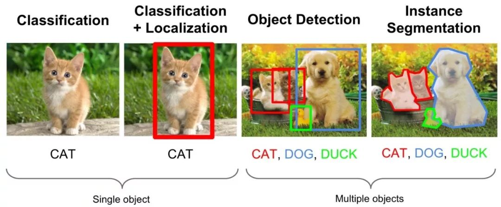
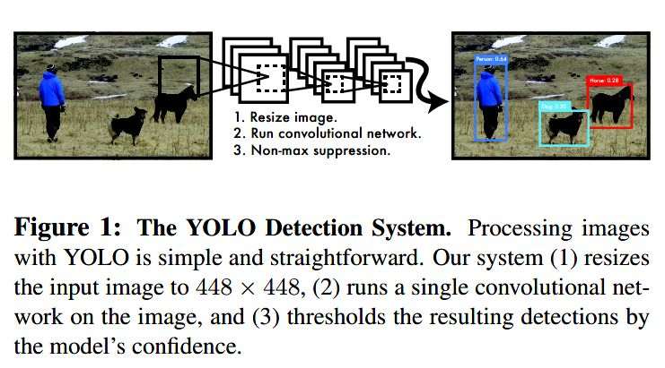
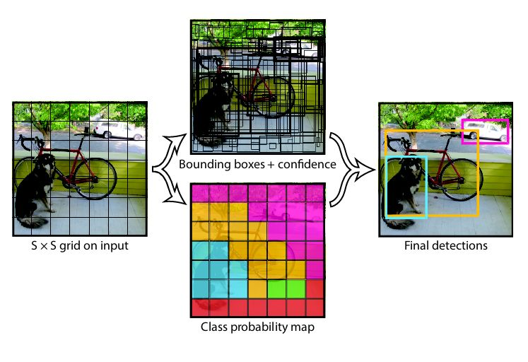

[TOC]

# 任务7：目标检测与边界框

## 1.任务目标

<!-- 1. 
2. 
3. 
4.  -->

- 学习目标检测的相关概念
- 了解如何进行边界框框选


## 2.任务描述


- 在前⾯的⼀些章节中，我们介绍了诸多⽤于图像分类的模型。在图像分类任务⾥，我们假设图像 ⾥只有⼀个主体⽬标，并关注如何识别该⽬标的类别。然而，很多时候图像⾥有多个我们感兴趣 的⽬标，我们不仅想知道它们的类别，还想得到它们在图像中的具体位置。在计算机视觉⾥，我 们将这类任务称为⽬标检测（objectdetection）或物体检测。
 ⽬标检测在多个领域中被⼴泛使⽤。例如，在⽆⼈驾驶⾥，我们需要通过识别拍摄到的视频图像 ⾥的⻋辆、⾏⼈、道路和障碍的位置来规划⾏进线路。机器⼈也常通过该任务来检测感兴趣的⽬ 标。安防领域则需要检测异常⽬标，如⽍徒或者炸弹。

- 我们花了大约很多篇的内容来讲 CNN 卷积神经网络和相关的图像分类经典网络等。但图像分类仅仅是我们入门计算机视觉的第一个任务。作为计算机视觉的三大核心任务——图像分类、目标检测和图像分割，后面两大任务还有着更多的内容等待我们探索和学习。以下图为例：


<div align=center>
    <!--  -->
    
</div>


- 从图中我们可以简单描述下计算机视觉三大任务的要义：图像分类就是要回答这张图像是一只猫的问题，目标检测则不仅需要回答图像中有什么，而且还得给出这些物体在图像中位置问题，以图中为例就是不仅要识别图中的阿猫阿狗，还得给出阿猫阿狗的具体定位。而图像分割则是需要实现像素级的图像分割，以图中为例就是要把每个物体以像素级的标准分割开来，这对算法要求则更高。

## 3.知识准备


### 3.1背景

- 从本节开始，笔者将花费数讲的时间对计算机视觉的第二大任务——目标检测进行一个全面细致的学习和讲解。既是对前面的 CNN 图像分类的内容延伸，也是继续深入研究图像算法的必走之路。在正式的学习各类目标检测算法之前，本节将首先对影响目标检测算法发展历史的主要算法进行一个综述，以期对后面的内容起到一个提纲挈领的作用。

- 在 2012 年深度学习正式介入计算机视觉目标检测任务之前，传统的目标检测算法一直是以滑动窗口卷积等较为传统的方式进行区域选择、特征提取和分类回归等步骤，例如在深度学习兴起之前目标检测领域较为优秀的可变形的组件模型（DPM）方法等。

- 在深度学习兴起并逐渐成为计算机视觉的核心方法之后，基于深度学习算法的一系列目标检测算法大致可以分为两大流派：
- 两步走（two-stage）算法：先产生候选区域然后再进行CNN分类(RCNN系列)
- 一步走（one-stage）算法：直接对输入图像应用算法并输出类别和相应的定位(yolo系列)
- 无论是两步走还是一步走算法，它们都是在识别的快和准两点上寻找一个平衡点和或者极端点。要么准要么快，但随着深度学习和计算机视觉的向前发展，既快有准的算法也在逐渐的实现当中。

- 本节就以目标检测这两大流派的目标检测算法进行简单的介绍。


### 3.2两步走（two stage）算法系列


#### 3.2.1r-cnn

- R-CNN 作为将深度学习引入目标检测算法的开山之作，在目标检测算法发展历史上具有重大意义。
R-CNN 算法是两步走方法的代表，即先生成候选区域（region proposal），然后再利用 CNN 进行识别分类。由于候选框对于算法的成败起着关键作用，所以该方法就以 Region 开头首字母 R 加 CNN 进行命名。
- 相较于传统的滑动卷积窗口来判断目标的可能区域，R-CNN 采用 selective search 的方法来预先提取一些较可能是目标物体的候选区域，速度大大提升，计算成本也显著缩小。总体而言，R-CNN 方法分为四个步骤：

- 生成候选区域
- 对候选区域使用CNN进行特征提取
- 将提取的特征送入SVM分类器
- 最后使用回归器对目标位置进行修正

- 虽然 R-CNN 在 2013年的当时可谓横空出世，但也存在许多缺陷：训练网络的正负样本候选区域在速度上非常慢，影响了算法的整体速度；CNN 需要分别对每一个生成的候选区域进行一次特征提取，存在着大量的重复运算，制约了算法性能。


- R-CNN--SSP-NET--FAST R-CNN--FASTER R-CNN--MASK R-CNN


### 3.3一步走（one stage）算法系列

- 纵然两步走的目标检测算法在不断进化，检测准确率也越来越高，但两步走始终存在的速度的瓶颈。在一些实时的目标检测需求的场景中，R-CNN 系列算法终归是有所欠缺。因而一步走（one-stage）算法便应运而生了，其中以 yolo 算法系列为代表，演绎了一种端到端的深度学习系统的实时目标检测效果。yolo 算法系列的主要思想就是直接从输入图像得到目标物体的类别和具体位置，不再像 R-CNN 系列那样产生候选区域。这样做的直接效果便是快。
#### 3.3.1yolo v1

- yolo v1 算法的核心思想就是将整张图像作为网络的输入，直接在网络的输出层输出目标物体的类别和边界框的具体位置坐标。yolo v1 将输入图像划分为 S*S 的网格（grid），每个网格预测两个边界框，如果目标物体落入相应的网格中，该网格就负责检测出该目标物体。

<div align=center>
    <!--  -->
    
</div>

- 由论文可知 yolo v1 算法的三个步骤：缩放图像-运行卷积网络-非极大值抑制。

<div align=center>
    <!--  -->
    
</div>


- yolo v1 虽然快，但缺点也明显：由于一个网格只能预测两个边界框，这使得yolo v1 对于密集很小的物体检测效果并不好，时常在定位上出现较大的偏差，此外 yolo v1 也存在着泛化性能较弱等问题。


### 3.4边界框

- 在⽬标检测⾥，我们通常使⽤边界框（boundingbox）来描述⽬标位置。边界框是⼀个矩形框， 可以由矩形左上⻆的x和y轴坐标与右下⻆的x和y轴坐标确定。我们根据上⾯的图的坐标信息来 定义图中狗和猫的边界框。图中的坐标原点在图像的左上⻆，原点往右和往下分别为x轴和y轴的 正⽅向。 


## 4. 任务实施
### 4.1 实施思路

- 通过调用百度api的图像检测接口，实现对目标的检测以及边界框的绘制。

### 4.2 实施步骤
#### 步骤1：导入 urllib 库

```
%matplotlib inline
import cv2
import numpy as np

from matplotlib import pyplot as plt

import sys
import json
import base64

import ssl
## make it work in both python2 both python3
IS_PY3 = sys.version_info.major == 3
if IS_PY3:
    from urllib.request import urlopen
    from urllib.request import Request
    from urllib.error import URLError
    from urllib.parse import urlencode
    from urllib.parse import quote_plus
else:
    import urllib2
    from urllib import quote_plus
    from urllib2 import urlopen
    from urllib2 import Request
    from urllib2 import URLError
    from urllib import urlencode


```


#### 步骤2：请求认证 token

```
## 跳过 HTTPS 身份验证
ssl._create_default_https_context = ssl._create_unverified_context
API_KEY = '你的API_KEY'
SECRET_KEY = '你的SECRET_KEY'
POSE_DETECT = "https://aip.baidubce.com/rest/2.0/image-classify/v1/object_detect"
""" 开始 TOKEN """
TOKEN_URL = 'https://aip.baidubce.com/oauth/2.0/token'

""" 请求认证 token
"""
def fetch_token():
    params = {'grant_type': 'client_credentials',
        'client_id': API_KEY,
        'client_secret': SECRET_KEY}
    post_data = urlencode(params)
    if (IS_PY3):
        post_data = post_data.encode('utf-8')
    req = Request(TOKEN_URL, post_data)
    try:
        f = urlopen(req, timeout=5)
        result_str = f.read()
    except URLError as err:
        print(err)
    if (IS_PY3):
        result_str = result_str.decode()
    result = json.loads(result_str)
    if ('access_token' in result.keys() and 'scope' in result.keys()):
        if not 'brain_all_scope' in result['scope'].split(' '):
            print ('please ensure has check the ability')
            exit()
        return result['access_token']
    else:
        print ('please overwrite the correct API_KEY and SECRET_KEY')
        exit()


```


#### 步骤3：定义读取图片函数

```
""" 读取图片函数
"""

def read_file(image_path):
    f = None
    try:
        f = open(image_path, 'rb') #用二进制打开图片
        return f.read()
    except:
        print('read image file fail')
        return None
    finally:
        if f:
            f.close()

```


#### 步骤4：调用远程 HTTP 服务器


```
"""
call remote http server
"""
def request(url, data):
    req = Request(url, data.encode('utf-8'))
    has_error = False
    try:
        f = urlopen(req)
        result_str = f.read()
        if (IS_PY3):
            result_str = result_str.decode()
        return result_str
    except URLError as err:
        print(err)

```


#### 步骤5：程序入口

```
if __name__ == '__main__':
    ## get access token
    token = fetch_token()
    ## concat url
    url = POSE_DETECT + "?access_token=" + token
    
    file_content = read_file('./img1.jpg')
    response = request(url, urlencode(
    {
        'image': base64.b64encode(file_content),
        'image_type': 'BASE64',
    }))
    data = json.loads(response)
```


#### 步骤6：绘制边界框

```
sourceImg = cv2.imread('img1.jpg')
srcImage_new = cv2.cvtColor(sourceImg, cv2.COLOR_BGR2RGB)
plt.imshow(srcImage_new)

plt.gca().add_patch(
    plt.Rectangle((data['result']['left'], data['result']['top']), data['result']['width'],
        data['result']['height'], fill=False,
        edgecolor='r', linewidth=3)
    )

plt.show()
```


## 5.任务拓展
### 5.1 我们导入包的cv2是什么？
- CV2指的是OpenCV2，OpenCV是一个基于BSD许可（开源）发行的跨平台计算机视觉库，可以运行在Linux、Windows、Android和Mac OS操作系统上。它轻量级而且高效——由一系列 C 函数和少量 C++ 类构成，同时提供了Python、Ruby、MATLAB等语言的接口，实现了图像处理和计算机视觉方面的很多通用算法。

- OpenCV 拥有包括 500 多个C函数的跨平台的中、高层 API。它不依赖于其它的外部库——尽管也可以使用某些外部库。


- OpenCV用C++语言编写，它的主要接口也是C++语言，但是依然保留了大量的C语言接口。该库也有大量的Python、Java and MATLAB/OCTAVE（版本2.5）的接口。这些语言的API接口函数可以通过在线文档获得。如今也提供对于C#、Ch、Ruby的支持。

- OpenCV提供的视觉处理算法非常丰富，并且它部分以C语言编写，加上其开源的特性，处理得当，不需要添加新的外部支持也可以完整的编译链接生成执行程序。


## 6. 任务实训
### 6.1 实训目的
- 掌握调用百度 api
- 加深对目标检测与绘制边界框的理解
- 拓展边界框绘制的应用知识


### 6.2 实训内容
- 我们已经成功进行一次目标检测，请同学们尝试采用不同的物体图片进行物体检测并绘制边界框。

### 6.3 示例代码

```
参考任务代码
```

